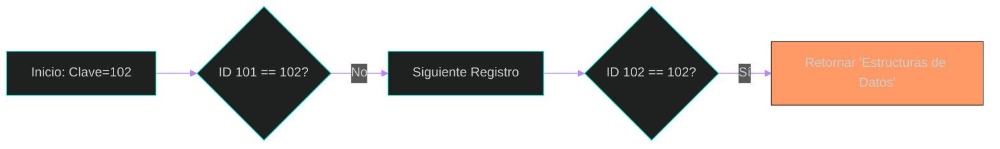
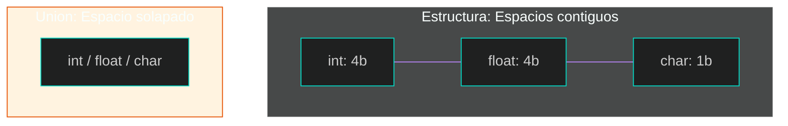

### 1. Estructuras y Uniones
En este bloque aprenderemos a crear tipos de datos personalizados para agrupar información heterogénea, permitiendo que un solo nombre de variable represente un registro completo (Capítulo 10, Sección 10.1).

#### 1. Estructuras Básicas y Acceso
Una estructura agrupa componentes llamados miembros, que pueden ser de distintos tipos (Capítulo 10, Sección 10.1). Para acceder a ellos se usa el operador punto (`.`) (Capítulo 10, Sección 10.2).

**Código ejecutable:**
```c
#include <stdio.h>
#include <string.h> // Necesario para strcpy si se usara, pero no para inicialización directa

// Definición de la estructura (Capítulo 10, Sección 10.1)
struct CD {
    char titulo[50]; // Tamaño ajustado para el ejemplo
    char artista[50]; // Tamaño ajustado para el ejemplo
    int num_canciones;
    float precio;
};

int main() {
    // Declaración e inicialización (Capítulo 10, Sección 10.1)
    struct CD cd1 = {"Bachata Rosa", "Juan Luis Guerra", 10, 18.50};

    // Acceso y modificación con el operador punto (Capítulo 10, Sección 10.2)
    printf("Disco: %s\n", cd1.titulo);
    printf("Artista: %s\n", cd1.artista);
    printf("Precio: $%.2f\n", cd1.precio);

    return 0;
}
```

#### 2. Estructuras y Funciones (Paso por Referencia)
Pasar una estructura por referencia (usando punteros) es más eficiente porque evita copiar todos los miembros en la memoria, usando el operador flecha (`->`) para el acceso (Capítulo 10, Sección 10.7; Capítulo 11, Sección 11.12).

**Código ejecutable:**
```c
#include <stdio.h>

typedef struct {
    float pr;
    float pi;
} Complejo;

// Función que recibe un puntero a la estructura (Capítulo 10, Sección 10.7)
void imprimirComplejo(Complejo *c) {
    // Uso del operador flecha -> (Capítulo 11, Sección 11.12)
    printf("Resultado: %.1f + %.1fi\n", c->pr, c->pi);
}

int main() {
    Complejo z = {4.5, 2.0};
    imprimirComplejo(&z); // Se pasa la dirección de la estructura
    return 0;
}
```

#### 3. Arreglos de Estructuras y Búsqueda
Los arreglos de estructuras permiten manejar tablas de datos. Una operación común es la búsqueda en tablas, donde se recorre el arreglo para encontrar un miembro que coincida con una clave (Capítulo 10, Sección 10.5; Capítulo 9, Sección 9.6).

**Código ejecutable:**
```c
#include <stdio.h>
#include <string.h>

struct Libro {
    int id;
    char titulo[50]; // Tamaño ajustado para el ejemplo
};

int main() {
    // Arreglo de estructuras (Capítulo 10, Sección 10.5)
    struct Libro biblioteca[3] = { // Ajustado el tamaño a 3, ya que solo se inicializan 3
        {101, "Programacion en C"},
        {102, "Estructuras de Datos"},
        {103, "Algoritmos Progresivos"}
    };

    int clave = 102;
    int encontrado = -1;

    // Búsqueda en tabla (Capítulo 9, Sección 9.6)
    for(int i = 0; i < 3; i++) {
        if(biblioteca[i].id == clave) {
            encontrado = i;
            break;
        }
    }

    if(encontrado != -1)
        printf("Libro hallado: %s\n", biblioteca[encontrado].titulo);
    else
        printf("No se encontro el libro.\n");

    return 0;
}
```

**Visualización del proceso de búsqueda:**


#### 4. Typedef y Uniones
`typedef` crea un sinónimo para un tipo (Capítulo 10, Sección 10.3). Las uniones permiten que varios miembros compartan el mismo espacio de memoria, por lo que el tamaño de la unión es el del miembro más grande (Capítulo 10, Sección 10.8).

**Código ejecutable:**
```c
#include <stdio.h>

// Typedef: Sinónimo para simplificar declaraciones (Capítulo 10, Sección 10.3)
typedef union {
    int entero;
    float decimal;
    char caracter;
} DatoCompartido;

int main() {
    DatoCompartido dato;

    // Los miembros comparten la misma posición de memoria (Capítulo 10, Sección 10.8)
    dato.entero = 65;
    printf("Como entero: %d\n", dato.entero);
    printf("Como caracter (ASCII): %c\n", dato.caracter); 

    printf("Tamaño de la union: %lu bytes\n", sizeof(DatoCompartido));
    return 0;
}
```

**Comparación de Memoria:**

(Referencia: Capítulo 10, Sección 10.8 y 10.9)

---
**Referencias bibliográficas:**
*   Joyanes Aguilar, L. & Zahonero Martínez, I. (2014). Programación en C, C++, Java y UML. Segunda Edición. McGraw-Hill.
    *   Capítulo 9: Ordenación y búsqueda (Sección 9.6).
    *   Capítulo 10: Estructuras y uniones (Secciones 10.1, 10.2, 10.3, 10.5, 10.7, 10.8).
    *   Capítulo 11: Apuntadores (Sección 11.12).

[⬅️ Volver al índice de la unidad](./index.md)
