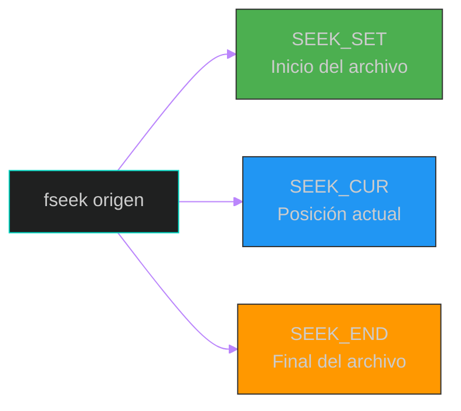
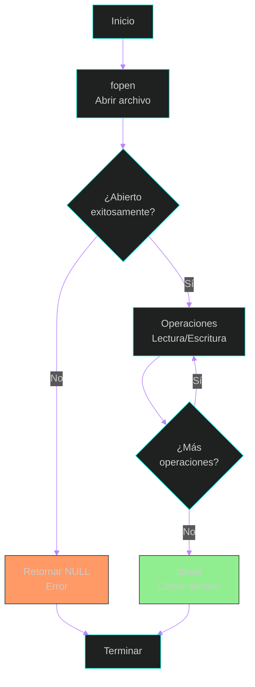

### 2. Entrada y Salida (Archivos)
En este bloque aprenderemos a trabajar con archivos, permitiendo que nuestros programas guarden y recuperen información de forma persistente. Exploraremos operaciones básicas de lectura/escritura, manejo de archivos de texto y binarios (Capítulo 12, Secciones 12.1 - 12.9).

#### 1. Apertura y Cierre de Archivos
La función `fopen()` abre un archivo en un modo específico (lectura, escritura o ambos), retornando un puntero `FILE` que será usado en operaciones posteriores. Es esencial cerrar el archivo con `fclose()` para liberar recursos (Capítulo 12, Secciones 12.1 y 12.2).

**Código ejecutable:**
```c
#include <stdio.h>

int main() {
    // Apertura de archivo en modo escritura (Capítulo 12, Sección 12.1)
    FILE *archivo = fopen("datos.txt", "w");
    
    // Verificación de que el archivo se abrió correctamente
    if (archivo == NULL) {
        printf("Error: No se pudo abrir el archivo.\n");
        return 1;
    }
    
    // Escribir en el archivo
    fprintf(archivo, "Contenido de prueba\n");
    fprintf(archivo, "Segunda línea\n");
    
    // Cierre del archivo (Capítulo 12, Sección 12.2)
    fclose(archivo);
    
    printf("Archivo creado exitosamente.\n");
    return 0;
}
```

#### 2. Lectura de Archivos de Texto
Para leer un archivo, se abre en modo lectura (`"r"`). Se puede leer línea por línea con `fgets()` o carácter por carácter con `fgetc()`. Es importante verificar el fin de archivo con `feof()` (Capítulo 12, Secciones 12.3 y 12.4).

**Código ejecutable:**
```c
#include <stdio.h>

int main() {
    FILE *archivo = fopen("datos.txt", "r");
    
    if (archivo == NULL) {
        printf("Error: No se pudo abrir el archivo.\n");
        return 1;
    }
    
    char linea[100];
    
    // Lectura línea por línea (Capítulo 12, Sección 12.3)
    while (fgets(linea, sizeof(linea), archivo) != NULL) {
        printf("Línea leída: %s", linea);
    }
    
    // Verificación del fin de archivo (Capítulo 12, Sección 12.4)
    if (feof(archivo)) {
        printf("Se alcanzó el fin del archivo.\n");
    }
    
    fclose(archivo);
    return 0;
}
```

#### 3. Lectura y Escritura Formateada
Las funciones `fprintf()` y `fscanf()` permiten trabajar con datos formateados en archivos, similar a `printf()` y `scanf()`, pero escribiendo/leyendo de un archivo en lugar de la consola (Capítulo 12, Sección 12.5).

**Código ejecutable:**
```c
#include <stdio.h>

struct Estudiante {
    int id;
    char nombre[50];
    float calificacion;
};

int main() {
    FILE *archivo = fopen("estudiantes.txt", "w");
    
    if (archivo == NULL) {
        printf("Error: No se pudo crear el archivo.\n");
        return 1;
    }
    
    // Escribir datos estructurados (Capítulo 12, Sección 12.5)
    struct Estudiante est1 = {101, "Juan Pérez", 85.5};
    struct Estudiante est2 = {102, "María García", 92.0};
    
    fprintf(archivo, "%d %s %.1f\n", est1.id, est1.nombre, est1.calificacion);
    fprintf(archivo, "%d %s %.1f\n", est2.id, est2.nombre, est2.calificacion);
    
    fclose(archivo);
    
    // Leer datos formateados
    archivo = fopen("estudiantes.txt", "r");
    struct Estudiante est;
    
    printf("Estudiantes registrados:\n");
    while (fscanf(archivo, "%d %s %f", &est.id, est.nombre, &est.calificacion) == 3) {
        printf("ID: %d, Nombre: %s, Calificación: %.1f\n", 
               est.id, est.nombre, est.calificacion);
    }
    
    fclose(archivo);
    return 0;
}
```

#### 4. Archivos Binarios
Los archivos binarios almacenan datos en formato binario, permitiendo guardar estructuras completas sin conversión de texto. Se usan `fwrite()` y `fread()` para escribir/leer datos binarios (Capítulo 12, Secciones 12.6 y 12.7).

**Código ejecutable:**
```c
#include <stdio.h>

typedef struct {
    int codigo;
    char nombre[30];
    float precio;
} Producto;

int main() {
    FILE *archivo = fopen("productos.bin", "wb");
    
    if (archivo == NULL) {
        printf("Error: No se pudo crear el archivo.\n");
        return 1;
    }
    
    Producto productos[2] = {
        {1001, "Laptop", 899.99},
        {1002, "Mouse", 25.50}
    };
    
    // Escribir en formato binario (Capítulo 12, Sección 12.6)
    fwrite(productos, sizeof(Producto), 2, archivo);
    fclose(archivo);
    
    // Leer datos binarios (Capítulo 12, Sección 12.7)
    archivo = fopen("productos.bin", "rb");
    Producto prod;
    
    printf("Productos almacenados:\n");
    while (fread(&prod, sizeof(Producto), 1, archivo) == 1) {
        printf("Código: %d, Nombre: %s, Precio: $%.2f\n", 
               prod.codigo, prod.nombre, prod.precio);
    }
    
    fclose(archivo);
    return 0;
}
```

#### 5. Posicionamiento en Archivos
Las funciones `fseek()` y `ftell()` permiten navegar dentro de un archivo. `fseek()` cambia la posición del puntero, mientras que `ftell()` retorna la posición actual (Capítulo 12, Sección 12.8).

**Código ejecutable:**
```c
#include <stdio.h>

int main() {
    FILE *archivo = fopen("posiciones.txt", "w");
    
    if (archivo == NULL) return 1;
    
    fprintf(archivo, "Línea 1\nLínea 2\nLínea 3\n");
    fclose(archivo);
    
    // Lectura con posicionamiento (Capítulo 12, Sección 12.8)
    archivo = fopen("posiciones.txt", "r");
    
    // Ir al inicio
    fseek(archivo, 0, SEEK_SET);
    long posicion = ftell(archivo);
    printf("Posición inicial: %ld\n", posicion);
    
    // Ir al final
    fseek(archivo, 0, SEEK_END);
    posicion = ftell(archivo);
    printf("Posición final (tamaño): %ld bytes\n", posicion);
    
    // Ir a una posición específica
    fseek(archivo, 7, SEEK_SET);
    char c;
    fscanf(archivo, "%c", &c);
    printf("Carácter en posición 7: %c\n", c);
    
    fclose(archivo);
    return 0;
}
```

**Modos de Posicionamiento:**


#### 6. Manejo de Errores en Archivos
Siempre se debe verificar si las operaciones de archivo fueron exitosas. Además de `fopen()`, otras funciones pueden fallar. Se recomienda usar `ferror()` y `clearerr()` para un mejor control de errores (Capítulo 12, Sección 12.9).

**Código ejecutable:**
```c
#include <stdio.h>

int main() {
    FILE *archivo = fopen("datos.txt", "r");
    
    // Verificación de apertura (Capítulo 12, Sección 12.1)
    if (archivo == NULL) {
        perror("Error al abrir el archivo");
        return 1;
    }
    
    char buffer[100];
    
    // Lectura con verificación de errores (Capítulo 12, Sección 12.9)
    while (fgets(buffer, sizeof(buffer), archivo) != NULL) {
        printf("%s", buffer);
    }
    
    // Verificar si hubo error o fin de archivo
    if (ferror(archivo)) {
        perror("Error durante la lectura");
        clearerr(archivo);
    } else if (feof(archivo)) {
        printf("Archivo leído completamente.\n");
    }
    
    fclose(archivo);
    return 0;
}
```

**Diagrama del Ciclo de Vida de un Archivo:**


---
**Referencias bibliográficas:**
*   Joyanes Aguilar, L. & Zahonero Martínez, I. (2014). Programación en C, C++, Java y UML. Segunda Edición. McGraw-Hill.
    *   Capítulo 12: Entrada y Salida (Secciones 12.1 - 12.9).

[⬅️ Volver al índice de la unidad](./index.md)