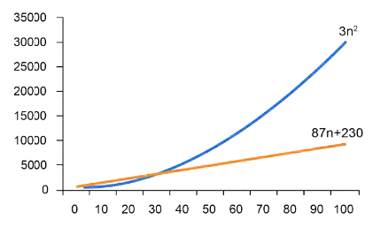

# Análisis de Algoritmos

## Notación asintótica

Para un mismo problema pueden existir varias soluciones; hay que analizar la eficiencia de cada una en tiempo de ejecución (en función del tamaño de la entrada `n`) y en uso de memoria. En un polinomio como `3n² + 87n + 230`, para entradas grandes el término `3n²` domina sobre los demás: la notación asintótica descarta los términos menos significativos y las constantes, quedándose solo con el término que crece más rápido.

### Notación Θ grande (Big-Θ)

Acota el tiempo de ejecución tanto por arriba como por abajo: existen constantes `c1` y `c2` tales que el tiempo de ejecución está entre `c1 * f(n)` y `c2 * f(n)` para `n` suficientemente grande. Ejemplo: la búsqueda secuencial en su peor caso (recorrer todo el arreglo) es `Θ(n)`.

### Notación O grande (Big-O)

Acota solo por arriba (cota superior asintótica); es la que se usa en la práctica, ya que interesa el peor caso. La búsqueda secuencial es `O(n)` aunque en el mejor caso (encontrar el dato en la primera posición) se ejecute en `O(1)`. Órdenes más comunes, de menor a mayor crecimiento:

- `O(1)`: constante
- `O(log n)`: logarítmica
- `O(n)`: lineal
- `O(n log n)`: lineal-logarítmica
- `O(n²)`: cuadrática
- `O(n³)`: cúbica
- `O(nᶜ)`: polinomial
- `O(mⁿ)`: exponencial
- `O(n!)`: factorial

### Notación Ω grande (Big-Ω)

Acota solo por abajo (cota inferior asintótica): indica que el algoritmo toma *al menos* cierto tiempo, sin ofrecer cota superior.

## Análisis de algoritmos iterativos

Se analiza de lo más interno a lo más externo, con tres reglas:

- **Secuencia**: el orden de una serie de bloques consecutivos es el del bloque de mayor orden (p. ej. tres ciclos seguidos con `O(n)`, `O(n log n)` y `O(log n)` dan `O(n log n)`).
- **Condicional**: el orden es el mayor entre la rama verdadera y la falsa (si solo hay rama verdadera, se toma esa).
- **Ciclos**: el orden es la cantidad de repeticiones por el orden de lo que hay dentro. La variable de control es **lineal** si se le suma/resta una constante en cada iteración, y **logarítmica** si se le multiplica/divide por una constante. Los ciclos anidados multiplican sus órdenes.

## Clasificación de problemas

La frontera entre "eficiente" e "ineficiente" suele trazarse entre tiempo **polinomial** (`O(nᶜ)`) y tiempo **exponencial** (`O(bⁿ)`): aunque un algoritmo `O(n¹⁰⁰)` tampoco sea práctico, esta distinción es la medida más robusta de qué tan *tratable* es un problema. La razón es el crecimiento: en el tablero de ajedrez de la leyenda (1 grano en la casilla 1, 2 en la 2, 4 en la 3...), la casilla 64 ya requiere `2⁶³ ≈ 9.2 × 10¹⁸` granos de arroz. Esta brecha entre crecimiento polinomial y exponencial es justamente la que separa la **clase P** del resto:

- **Clase P**: se resuelven en tiempo polinomial (`nᵏ`).
- **Clase NP**: se resuelven en tiempo no-determinístico (un algoritmo no-determinístico "supone y comprueba"; si la fase de comprobación es polinomial, se llama polinomial no-determinístico).
- **NP-Hard**: un problema `B` tal que cualquier problema `A` en NP se puede reducir polinomialmente a `B`.
- **NP-Complete**: un problema que es NP-Hard *y además* pertenece a la clase NP.

La **reducción polinomial** consiste en transformar, en tiempo polinomial, la entrada de un problema `A` para usarla como entrada de un problema `B`, de modo que resolver `B` ayude a resolver `A`.

[⬅️ Volver a Unidad I](./index.md)
