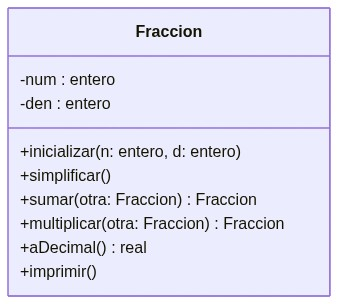

# Tipos de Datos Abstractos (ADT)

## Abstracción

La **abstracción** oculta detalles al usuario, dejando visible solo lo importante (p. ej., la palabra "perro" abstrae tamaño, color y raza). En programación existen dos tipos:

- **Abstracción de datos**: agrupa los datos de forma lógica, independiente de cómo se guardan en memoria.
- **Abstracción de control**: ve los procesos como grupos y repeticiones de instrucciones, independiente de cómo se ejecutan en el procesador.

La abstracción de datos permite definir el **dominio** y estructura de los datos, sus **atributos** y las **operaciones** válidas sobre ellos.

## Tipos definidos por el usuario

A partir de los **tipos primitivos** del lenguaje, el programador puede definir sus propios tipos (p. ej., los `record` de Pascal o los `struct` de C), agrupando distintos tipos de datos bajo un solo nombre para representar un concepto (por ejemplo, "persona": nombre, dirección, teléfono).

## Tipos de Datos Abstractos (ADT)

El problema de los tipos definidos por el usuario es que solo el programador conoce qué se puede hacer válidamente con ellos. Un **ADT** resuelve esto encapsulando en una sola entidad:

- El tipo de datos que guarda la información.
- Las operaciones válidas sobre esos datos (definidas como funciones/procedimientos).

Propuestos en 1974 por **Barbara Liskov** y Stephen Zilles (MIT, lenguaje CLU), antecedente clave de la **Programación Orientada a Objetos**. El conjunto de operaciones de un ADT se conoce como **API**, y de ella basta saber: nombre de la operación, datos de entrada y datos de salida.

## Diseño de un ADT

El diseño es independiente del lenguaje de implementación y considera tres factores:

- **Dominio**: conjunto de datos al que aplica.
- **Atributos**: características que describen cada dato (con su tipo).
- **Operaciones**: acciones válidas sobre los datos del dominio.

### Relación con la Programación Orientada a Objetos

| ADT | OOP |
|---|---|
| ADT | Clase |
| Atributos | Variables de instancia |
| Operaciones | Métodos |
| Instancia del ADT | Objeto |

Al declarar las variables de instancia como privadas, los datos solo se manipulan mediante los métodos públicos, logrando el **encapsulamiento**. La clase es la forma más simple de implementar un ADT, pero no la única (p. ej., paquetes en LISP o módulos en Haskell).

El **inicializador** (llamado **constructor** en Java/C++) reserva memoria e inicializa los datos de una instancia de forma transparente para el usuario.

## Ejemplo: ADT Fracción

ADT para representar y operar números racionales (p. ej. 3/4), un caso muy común porque encapsula una regla de negocio clara: la fracción siempre debe quedar simplificada y con denominador distinto de cero.

- **Dominio**: pares de enteros (numerador, denominador) con denominador ≠ 0.
- **Atributos**: `num` (numerador), `den` (denominador).
- **Operaciones**:
  - **inicializar(n, d)**: si `d == 0`, avisa error; si no, guarda `num = n`, `den = d` y llama a `simplificar()`.
  - **simplificar()**: calcula el máximo común divisor (MCD) de `num` y `den`, y divide ambos entre él, para mantener siempre la fracción en su forma mínima.
  - **sumar(otra)**: regresa una fracción nueva = (`num*otra.den + otra.num*den`) / (`den*otra.den`), ya simplificada.
  - **multiplicar(otra)**: regresa una fracción nueva = (`num*otra.num`) / (`den*otra.den`), ya simplificada.
  - **aDecimal()**: regresa `num / den` como número real, para mostrar o comparar.
  - **imprimir()**: muestra la fracción como `num/den`.

El usuario del ADT nunca arma la fracción a mano ni la simplifica manualmente: solo llama `inicializar`, `sumar`, `multiplicar`, etc. Esa API garantiza que `num` y `den` siempre representen una fracción válida y simplificada, sin importar cómo esté implementada por dentro (encapsulamiento).

[⬅️ Volver a Unidad I](./index.md)
