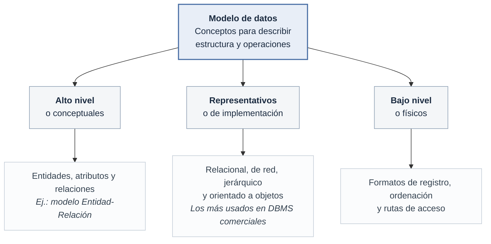
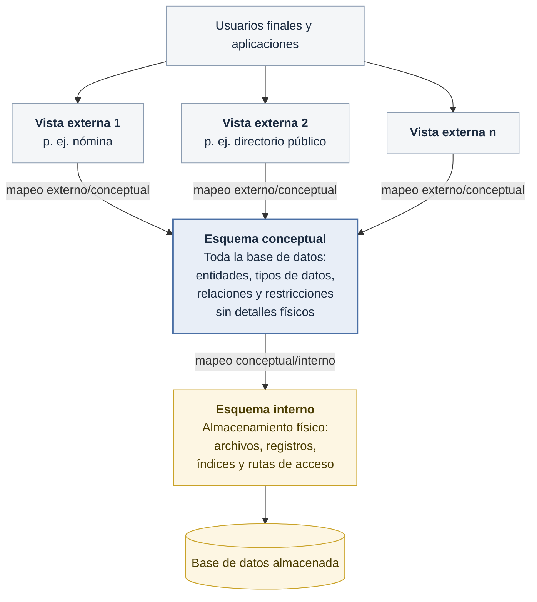
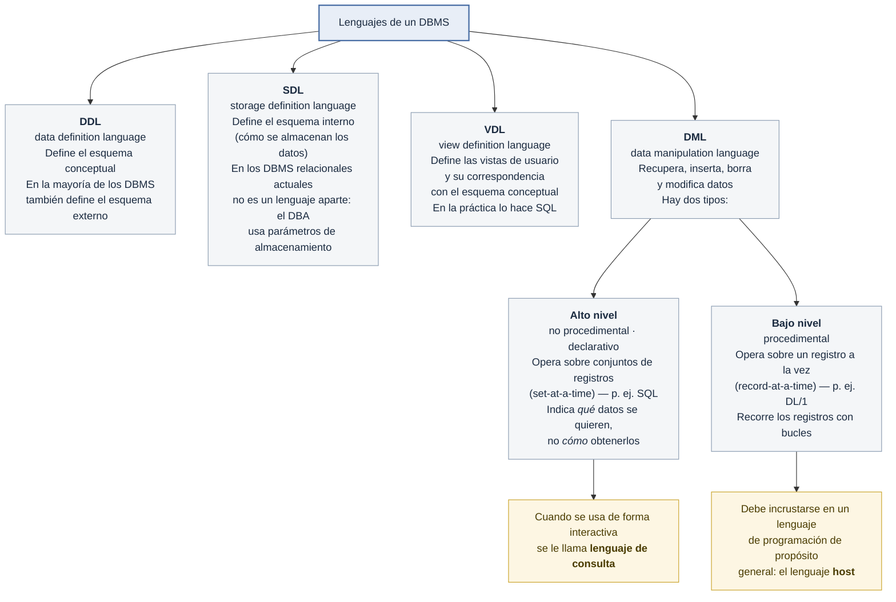
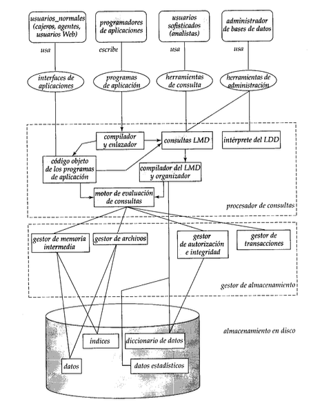
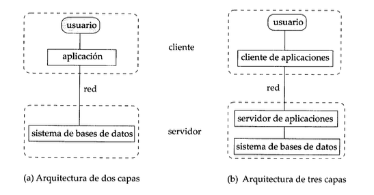
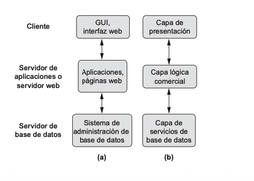
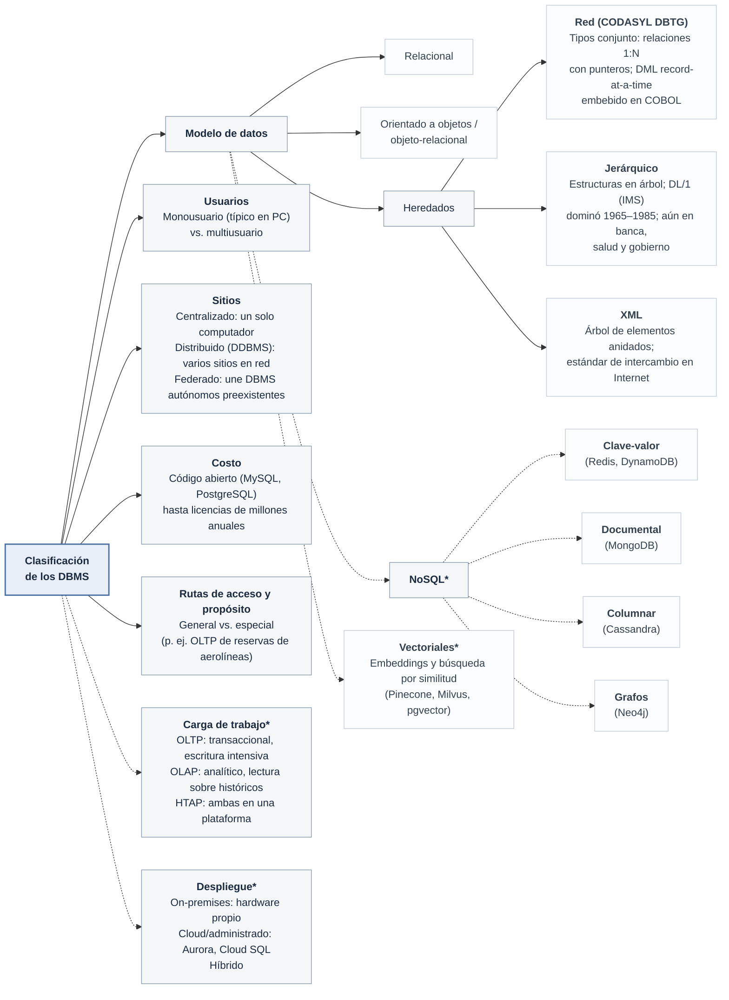
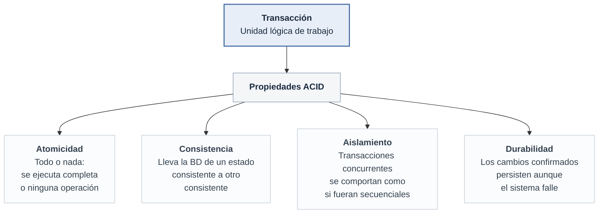

## Modelos de datos, esquemas e instancias

**Esquema vs. estado de la base de datos:**

- El **esquema** es la descripción de la base de datos (tipos de registro, restricciones); se especifica en el diseño y no cambia con frecuencia. Un esquema visualizado es un **diagrama de esquema**. El DBMS guarda esta descripción (**metadatos**) en su **catálogo**.
- El **estado** (o *snapshot*) es el conjunto de datos reales en un momento dado; cambia con cada inserción, borrado o actualización. El **estado inicial** es cuando la base de datos se carga por primera vez.
- Un cambio de esquema (p. ej., añadir un campo) es **evolución del esquema**, distinto de una actualización normal de datos.

## Arquitectura de tres esquemas e independencia de los datos

La **arquitectura de tres esquemas** (ANSI/SPARC) separa las aplicaciones de usuario de la base de datos física. Para eso describe la base de datos en tres niveles:

- El **nivel externo** tiene un **esquema externo** (o **vista de usuario**) por cada grupo de usuarios. Cada uno muestra solo la parte de la base de datos que le interesa a ese grupo y oculta el resto. Por ejemplo, nómina ve el salario de los empleados; el directorio público solo ve el nombre y el cargo.
- El **nivel conceptual** tiene un único **esquema conceptual**, que describe toda la base de datos para la comunidad de usuarios. Suele expresarse con un modelo de datos representativo (p. ej. el relacional).
- El **nivel interno** tiene el **esquema interno**, que describe cómo se almacenan los datos físicamente.

Los tres esquemas son solo **descripciones**: los datos reales existen únicamente en el nivel físico. El DBMS usa los **mapeos** entre niveles para traducir una consulta hecha sobre una vista externa a una consulta sobre el esquema conceptual y, de ahí, a operaciones sobre el almacenamiento.

**Independencia de los datos:** es la posibilidad de cambiar el esquema de un nivel sin tener que cambiar el esquema del nivel superior. Solo cambia el mapeo entre ambos.

- **Independencia lógica:** se puede cambiar el esquema conceptual (p. ej. agregar un atributo o una tabla) sin modificar los esquemas externos ni los programas que no usan lo que cambió.
- **Independencia física:** se puede cambiar el esquema interno (p. ej. crear un índice o reorganizar archivos) sin modificar el esquema conceptual. Es más fácil de lograr que la independencia lógica y la mayoría de los DBMS la ofrecen.

## Lenguajes e interfaces de bases de datos

## Arquitectura de un DBMS

**Interfaces para el usuario:** basadas en menús, en formularios, GUI, lenguaje natural, entrada/salida por voz, interfaces para usuarios paramétricos (teclas de función) y comandos privilegiados para el DBA.

Arquitectura de dos y tres capas: el DBMS puede estar en un solo computador (monolítico) o en varios (cliente/servidor). La arquitectura de tres capas añade una capa intermedia de procesamiento de aplicaciones, que puede estar en el cliente o en el servidor.

> **Nota (fuera del libro):** sobre esa base de 2/3 capas, la nube extendió el modelo de servidor de base de datos con nuevas variantes:
> - **DBaaS** (*Database as a Service*): el proveedor cloud administra el ciclo de vida completo del DBMS (aprovisionamiento, parches, backups, escalado); el "servidor" ya no lo opera el DBA local.
> - **Base de datos serverless**: separa cómputo de almacenamiento y escala automáticamente entre cero y el pico de demanda según conexiones/consultas, sin definir de antemano el tamaño del servidor.
> - **Microservicios con persistencia poliglota**: la capa intermedia de aplicación se descompone en servicios independientes, cada uno con su propia base de datos (a veces de un motor distinto — relacional, documental, clave-valor) en vez de una única base de datos compartida por toda la capa de aplicación.
>

## Clasificación de los DBMS

Se clasifican según varios criterios:

## Gestión de transacciones

Una **transacción** es un conjunto de operaciones que forma una única unidad lógica de trabajo (p. ej., una transferencia de fondos con cargo en la cuenta *A* y abono en la cuenta *B*). Debe cumplir las propiedades **ACID**:

Garantizar atomicidad y durabilidad es responsabilidad del **componente de gestión de transacciones**: si una transacción falla, el sistema debe realizar la **recuperación de fallos**, restaurando la base de datos al estado que tenía antes de que ocurriera el fallo.

[⬅️ Volver a Unidad I](./index.md)
