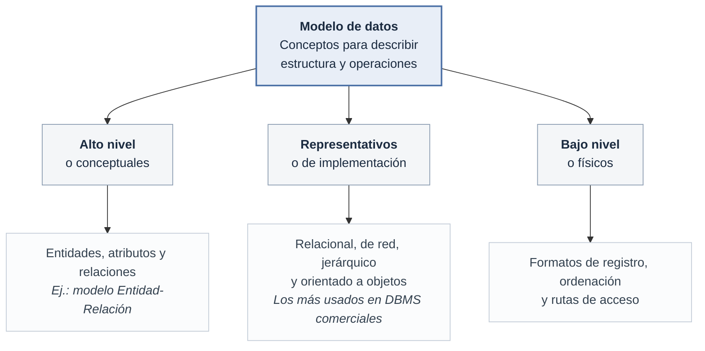
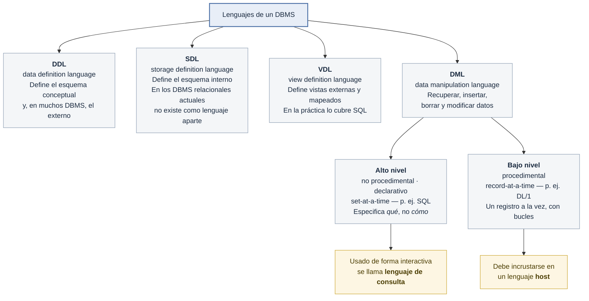

## Modelos de datos, esquemas e instancias

**Esquema vs. estado de la base de datos:**

- El **esquema** es la descripción de la base de datos (tipos de registro, restricciones); se especifica en el diseño y no cambia con frecuencia. Un esquema visualizado es un **diagrama de esquema**. El DBMS guarda esta descripción (**metadatos**) en su **catálogo**.
- El **estado** (o *snapshot*) es el conjunto de datos reales en un momento dado; cambia con cada inserción, borrado o actualización. El **estado inicial** es cuando la base de datos se carga por primera vez.
- Un cambio de esquema (p. ej., añadir un campo) es **evolución del esquema**, distinto de una actualización normal de datos.

## Lenguajes e interfaces de bases de datos

**Lenguajes:**

- **DDL** (*data definition language*): define el esquema conceptual (y, en muchos DBMS, también el externo).
- **SDL** (*storage definition language*): define el esquema interno; en los DBMS relacionales actuales no existe como lenguaje separado, se maneja con parámetros de almacenamiento controlados por el DBA.
- **VDL** (*view definition language*): define las vistas externas y sus mapeados; en la práctica, SQL cumple este rol.
- **DML** (*data manipulation language*): recuperación, inserción, borrado y modificación de datos. Puede ser:
  - **Alto nivel / no procedimental / declarativo / set-at-a-time** (p. ej., SQL): especifica *qué* se quiere, no *cómo* obtenerlo. Usado de forma interactiva se llama **lenguaje de consulta**.
  - **Bajo nivel / procedimental / record-at-a-time** (p. ej., DL/1): debe incrustarse en un lenguaje **host** y procesa un registro a la vez con construcciones tipo bucle.

## Arquitectura de un DBMS

**Interfaces para el usuario:** basadas en menús, en formularios, GUI, lenguaje natural, entrada/salida por voz, interfaces para usuarios paramétricos (teclas de función) y comandos privilegiados para el DBA.

Arquitectura de dos y tres capas: el DBMS puede estar en un solo computador (monolítico) o en varios (cliente/servidor). La arquitectura de tres capas añade una capa intermedia de procesamiento de aplicaciones, que puede estar en el cliente o en el servidor.

> **Nota (fuera del libro):** sobre esa base de 2/3 capas, la nube extendió el modelo de servidor de base de datos con nuevas variantes:
> - **DBaaS** (*Database as a Service*): el proveedor cloud administra el ciclo de vida completo del DBMS (aprovisionamiento, parches, backups, escalado); el "servidor" ya no lo opera el DBA local.
> - **Base de datos serverless**: separa cómputo de almacenamiento y escala automáticamente entre cero y el pico de demanda según conexiones/consultas, sin definir de antemano el tamaño del servidor.
> - **Microservicios con persistencia poliglota**: la capa intermedia de aplicación se descompone en servicios independientes, cada uno con su propia base de datos (a veces de un motor distinto — relacional, documental, clave-valor) en vez de una única base de datos compartida por toda la capa de aplicación.
>

## Clasificación de los DBMS

Se clasifican según varios criterios:

1. **Modelo de datos**: relacional, orientado a objetos, objeto-relacional, jerárquico, de red, y (fuera del libro) **NoSQL** — clave-valor (p. ej. Redis, Amazon DynamoDB), documental (p. ej. MongoDB), columnar (p. ej. Apache Cassandra) y de grafos (p. ej. Neo4j).
2. **Número de usuarios**: monousuario (típico en PC) vs. multiusuario.
3. **Número de sitios**: centralizado (un solo computador) vs. **distribuido (DDBMS)** (datos y software repartidos en varios sitios conectados por red); un **DBMS federado** conecta DBMS autónomos preexistentes con cierta autonomía local.
4. **Costo**: desde código abierto (MySQL, PostgreSQL) hasta licencias de varios millones anuales para sistemas empresariales modulares.
5. **Tipo de rutas de acceso** y **propósito**: general vs. propósito especial (p. ej., sistemas OLTP de alto volumen de transacciones simultáneas, como reservas de aerolíneas).

> **Nota (fuera del libro):** hoy se suelen agregar dos criterios más:
> - **Tipo de carga de trabajo**: **OLTP** (transaccional, escritura intensiva) vs. **OLAP** (analítico, lectura intensiva sobre grandes volúmenes históricos) vs. **HTAP** (*Hybrid Transactional/Analytical Processing*), que intenta soportar ambas cargas en una sola plataforma.
> - **Modelo de despliegue**: on-premises (hardware propio) vs. **cloud-native / administrado** (p. ej. Amazon Aurora, Google Cloud SQL, con escalado y mantenimiento a cargo del proveedor) vs. híbrido.
>

**Modelos de datos heredados** (contexto histórico):

- **Red (CODASYL DBTG)**: registros relacionados mediante *tipos conjunto* (relaciones 1:N con punteros); DML record-at-a-time embebido en COBOL.
- **Jerárquico**: estructuras en árbol; DL/1 (IMS de IBM) dominó el mercado entre 1965 y 1985 y aún se usa en banca, salud y gobierno.
- **XML**: estructura jerárquica (árbol de elementos anidados), estándar para intercambio de datos por Internet; conceptualmente parecido al modelo de objetos.

## Gestión de transacciones

Una **transacción** es un conjunto de operaciones que forma una única unidad lógica de trabajo (p. ej., una transferencia de fondos con cargo en la cuenta *A* y abono en la cuenta *B*). Debe cumplir las propiedades **ACID**:

Garantizar atomicidad y durabilidad es responsabilidad del **componente de gestión de transacciones**: si una transacción falla, el sistema debe realizar la **recuperación de fallos**, restaurando la base de datos al estado que tenía antes de que ocurriera el fallo.

[⬅️ Volver a Unidad I](./index.md)
