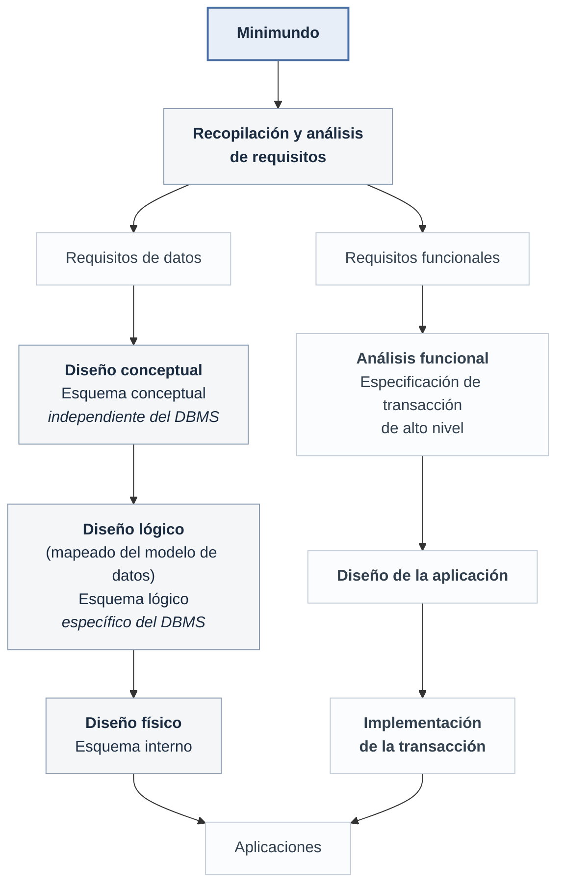
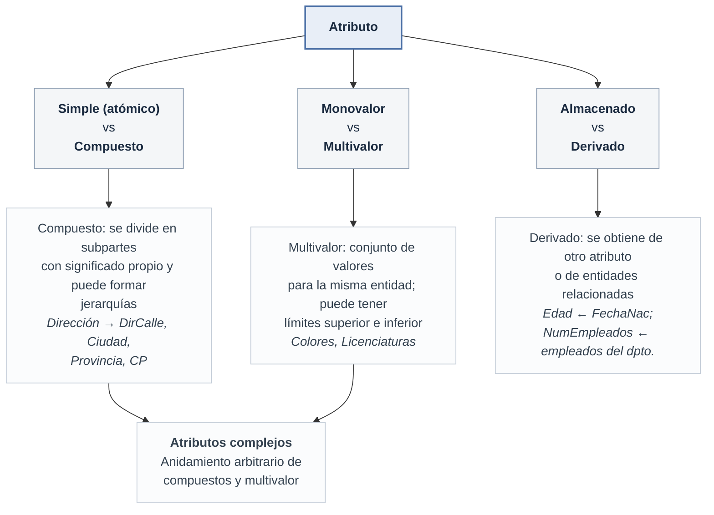
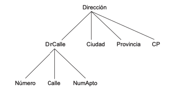
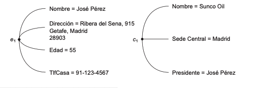
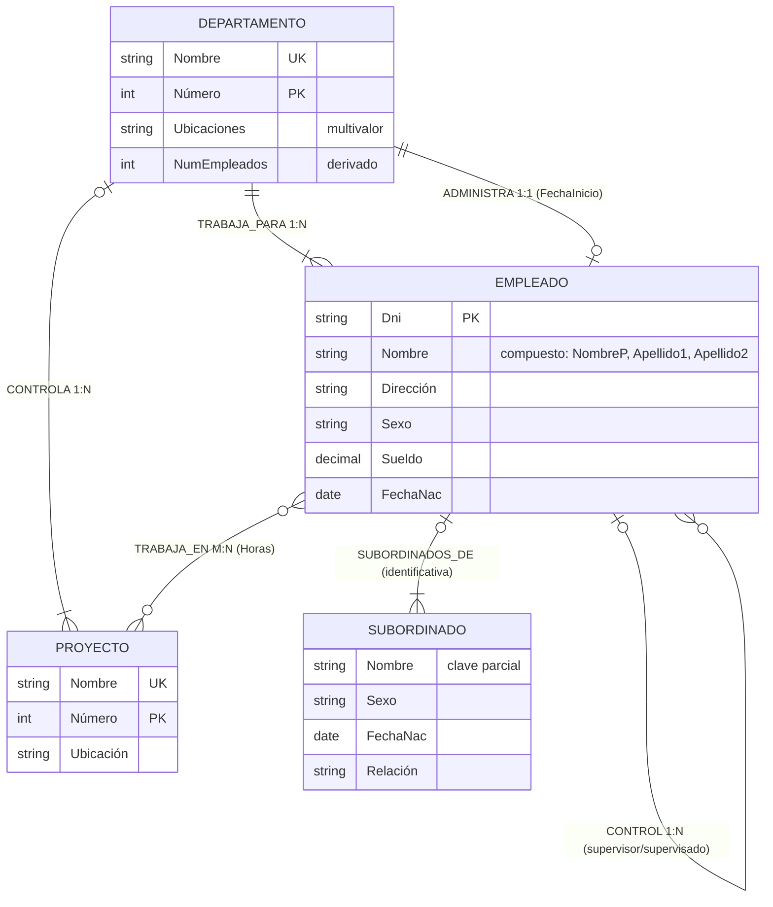

## Uso de modelos de datos conceptuales de alto nivel para el diseño

El primer paso del diseño de una base de datos es la **recopilación y análisis de requisitos**: los diseñadores entrevistan a los potenciales usuarios para documentar sus **requisitos de datos**. En paralelo se especifican los **requisitos funcionales** (las operaciones o transacciones definidas por el usuario que se aplicarán a la base de datos).

Después se crea el **esquema conceptual** mediante un modelo de datos de alto nivel: una descripción concisa de los requisitos de datos, con tipos de entidades, relaciones y restricciones. Como no incluye detalles de implementación, es **independiente del DBMS** y sirve para comunicarse con usuarios no técnicos y para comprobar que los requisitos están completos y no entran en conflicto.



El **diseño lógico** (o *asignación de modelo de datos*) transforma el esquema conceptual al modelo de datos de implementación del DBMS comercial (relacional, objeto-relación…). El último paso es el **diseño físico**: estructuras de almacenamiento interno, índices, rutas de acceso y organización de los archivos.

## Un ejemplo de aplicación de base de datos: EMPRESA

Descripción del **minimundo** proporcionada tras la fase de recopilación de requisitos:

- La empresa está organizada en **departamentos**. Cada uno tiene un nombre único, un número único y un empleado concreto que lo administra; se realizará un seguimiento de la fecha en que ese empleado empezó a administrar el departamento. Un departamento puede tener varias ubicaciones.
- Un departamento **controla** una cierta cantidad de **proyectos**, cada uno de los cuales tiene un nombre único, un número único y una sola ubicación.
- Se almacenará el nombre, el DNI, la dirección, el sueldo, el sexo y la fecha de nacimiento de cada **empleado**. Un empleado está asignado a un departamento, pero puede trabajar en varios proyectos, que no están controlados necesariamente por el mismo departamento. Se hará un seguimiento del número de horas por semana que un empleado trabaja en cada proyecto, y también de su supervisor directo.
- Se realizará un seguimiento de las personas a cargo de cada empleado (**subordinados**) por el tema de los seguros: nombre de pila, sexo, fecha de nacimiento y relación con el empleado.

## Tipos de entidad, conjuntos de entidades, atributos y claves

El modelo ER describe los datos como **entidades**, **relaciones** y **atributos**. Una entidad es una cosa del mundo real con existencia independiente, que puede ser **física** (una persona, un coche, una casa, un empleado) o **conceptual** (una empresa, un trabajo, un curso universitario). Cada entidad tiene atributos: propiedades particulares que la describen.

### Tipos de atributos



---



---



---
El anidamiento se representa agrupando los componentes de un atributo compuesto entre paréntesis `()` y los multivalor entre llaves `{}`:

```text
{TlfDir( {Tlf(CodÁrea, NumTlf)}, Dir(DirCalle(Número, Calle, NumApto), Ciudad, Provincia, CP) )}
```

**Valores NULL.** Se utilizan cuando una entidad no tiene un valor aplicable para un atributo (`NumApto` en una casa unifamiliar, `Licenciaturas` en alguien sin carrera) o cuando el valor es **desconocido**. Lo desconocido se clasifica en dos casos: se sabe que el valor existe pero no se encuentra (la `Altura` de una persona), o **no se sabe si el valor existe** (el `TlfCasa` de una persona).

### Tipos de entidad, claves y conjuntos de valores

- Un **tipo de entidad** define una colección de entidades con los mismos atributos; describe el **esquema** o **intención** del conjunto.
- El **conjunto de entidades** es la colección de todas las entidades de ese tipo en un momento dado: la **extensión**. Suele nombrarse igual que el tipo de entidad.
- Un **atributo clave** tiene valores distintos para cada entidad del conjunto. Un tipo de entidad puede tener **varias claves** (`IdVehículo` y `Matrícula` en COCHE) y una clave puede ser **compuesta** (`Matrícula` = `Número` + `Letras`), en cuyo caso debe ser **mínima**: sin atributos superfluos. La restricción de clave se aplica a **todas** las extensiones del tipo de entidad, no a una en particular. Un tipo de entidad puede carecer de clave: es un **tipo de entidad débil**.
- Cada atributo simple tiene asociado un **conjunto de valores** o **dominio** (los enteros entre 16 y 70 para `Edad`, cadenas para `Nombre`…). Los conjuntos de valores **no se muestran** en los diagramas ER; se especifican con los tipos de datos básicos. Formalmente, un atributo *A* de un tipo de entidad *E* con conjunto de valores *V* es una función `A: E → P(V)` (el conjunto potencia de *V*), lo que cubre atributos monovalor, multivalor y NULL (conjunto vacío).

### Diseño conceptual inicial de EMPRESA

De los requisitos se identifican cuatro tipos de entidad, uno por cada elemento de la especificación:

| Tipo de entidad | Atributos | Notas |
| --- | --- | --- |
| `DEPARTAMENTO` | Nombre, Número, Ubicaciones, Director, FechaIngresoDirector | `Ubicaciones` es multivalor; `Nombre` y `Número` son claves separadas |
| `PROYECTO` | Nombre, Número, Ubicación, DepartamentoControl | `Nombre` y `Número` son claves separadas |
| `EMPLEADO` | Nombre (NombreP, Apellido1, Apellido2), Dni, Sexo, Dirección, Sueldo, FechaNac, Departamento, Supervisor, TrabajaEn (Proyecto, Horas) | `TrabajaEn` es un atributo compuesto multivalor |
| `SUBORDINADO` | Empleado, NombreSubordinado, Sexo, FechaNac, Relación | |

Varios de estos atributos se redefinirán después como relaciones.

## Tipos de relaciones, conjuntos de relaciones, roles y restricciones estructurales

En cuanto un atributo de un tipo de entidad **se refiere a otro tipo de entidad**, existe una relación (`Director`, `DepartamentoControl`, `Supervisor`, `Departamento`…). En el modelo ER esas referencias no deben representarse como atributos, sino como relaciones.

Un **tipo de relación** *R* entre *n* tipos de entidades *E₁, E₂, …, Eₙ* define un conjunto de asociaciones entre entidades de esos tipos. Matemáticamente, el **conjunto de relaciones** *R* es un conjunto de **instancias de relación** *rᵢ = (e₁, e₂, …, eₙ)*; es decir, un subconjunto del producto cartesiano *E₁ × E₂ × … × Eₙ*. Cada instancia incluye **exactamente una entidad de cada tipo participante**. En los diagramas ER las relaciones se dibujan como **rombos** unidos por líneas a los rectángulos de los tipos participantes.

### Grado, nombres de rol y relaciones recursivas

- El **grado** es el número de tipos de entidades participantes: grado dos = **binaria**, grado tres = **ternaria**. Un ejemplo ternario es `SUMINISTRO`, donde cada instancia asocia un proveedor *s*, un repuesto *p* y un proyecto *j*.
- **Relaciones como atributos**: una relación binaria siempre se puede imaginar como un atributo, y hay **dos opciones**. `TRABAJA_PARA` puede verse como un atributo `Departamento` de EMPLEADO (cuyo conjunto de valores es el conjunto de entidades DEPARTAMENTO) o como un atributo multivalor `Empleado` de DEPARTAMENTO (cuyo conjunto de valores es el conjunto potencia de EMPLEADO). Si se representan ambos, quedan restringidos a ser **mutuamente inversos**.
- El **nombre de rol** indica el papel que juega cada tipo de entidad participante (en `TRABAJA_PARA`, EMPLEADO es *trabajador* y DEPARTAMENTO es *empleador*). No es técnicamente necesario cuando todos los participantes son distintos, pero sí es **esencial** en las **relaciones recursivas**, donde el mismo tipo de entidad participa más de una vez: en `CONTROL`, EMPLEADO participa en el papel de **supervisor** (líneas marcadas con `1`) y en el de **supervisado** (líneas marcadas con `2`).

### Restricciones en los tipos de relaciones

**Razón de cardinalidad** (relaciones binarias): especifica el número **máximo** de instancias de relación en las que una entidad puede participar. Los valores posibles son **1:1, 1:N, N:1 y M:N**.

| Relación | Razón | Significado |
| --- | --- | --- |
| `ADMINISTRA` (EMPLEADO–DEPARTAMENTO) | 1:1 | Un empleado dirige un solo departamento y un departamento tiene un solo director |
| `TRABAJA_PARA` (DEPARTAMENTO:EMPLEADO) | 1:N | Un departamento emplea a cualquier cantidad de empleados; un empleado trabaja para un solo departamento |
| `TRABAJA_EN` (EMPLEADO–PROYECTO) | M:N | Un empleado trabaja en varios proyectos y un proyecto tiene varios empleados |

**Restricción de participación**: especifica el número **mínimo** de instancias de relación en las que participa cada entidad (también llamada *restricción de cardinalidad mínima*). Es **total** cuando la entidad sólo puede existir si participa en al menos una instancia —también se la conoce como **dependencia de existencia**— y **parcial** cuando sólo algunas entidades del conjunto participan. En los diagramas, participación total = **línea doble**; parcial = línea sencilla.

La razón de cardinalidad y la restricción de participación se conocen en conjunto como **restricciones estructurales**.

### Atributos de los tipos de relación

Los tipos de relación también pueden tener atributos: `Horas` en `TRABAJA_EN`, `FechaInicio` en `ADMINISTRA`.

- En relaciones **1:1** el atributo puede **migrar** a cualquiera de los dos tipos de entidad participantes (`FechaInicio` podría ir en EMPLEADO o en DEPARTAMENTO).
- En relaciones **1:N** sólo puede migrar al tipo de entidad del **lado N**.
- En relaciones **M:N** el atributo queda determinado por la **combinación** de entidades participantes, no por una sola, así que **debe** especificarse como atributo de la relación (el caso de `Horas`).

En 1:1 y 1:N la decisión de dónde colocarlo la determina subjetivamente el diseñador.

## Tipos de entidades débiles

Los tipos de entidad **sin atributos clave propios** se denominan **tipos de entidad débiles**; los que sí la tienen son **tipos de entidad fuertes**. Una entidad débil se identifica al relacionarse con una entidad específica de otro tipo —el **tipo de entidad identificado o propietario**— en combinación con uno de sus valores de atributo. La relación que las une es la **relación identificativa**, y la participación del tipo débil en ella es **siempre total**.

No toda dependencia de existencia produce un tipo de entidad débil: `PERMISO_CONDUCIR` no puede existir sin una `PERSONA`, pero tiene su propia clave (`NumPermiso`) y por tanto no es débil.

La **clave parcial** (o *discriminador*) es el conjunto de atributos que identifica sin ambigüedad las entidades débiles relacionadas con la **misma entidad propietaria**. En `SUBORDINADO`, cuyo propietario es `EMPLEADO` mediante `SUBORDINADOS_DE`, la clave parcial es `Nombre`: dos subordinados de empleados distintos pueden coincidir en `Nombre`, `FechaNac`, `Sexo` y `Relación` y seguir siendo entidades diferentes. En el peor caso la clave parcial será el compuesto de todos los atributos de la entidad débil.

En el diagrama: rectángulo y rombo con **líneas dobles**, y la clave parcial subrayada con **línea discontinua**.

Alternativa de modelado: un tipo de entidad débil puede representarse como un **atributo complejo** (compuesto y multivalor) del propietario. Se prefiere el tipo de entidad débil si tiene muchos atributos; si la entidad débil participa por su cuenta en otras relaciones además de la identificativa, **no** debe modelarse como atributo complejo. Puede haber cualquier número de niveles de entidad débil, y un tipo débil puede tener varios propietarios y una relación identificativa de grado superior a dos.

## Perfeccionamiento del diseño ER de EMPRESA

Se convierten en relaciones los atributos que representaban referencias. Las restricciones se toman de los requisitos y, cuando no se deducen, **se consultan con los usuarios** (las reglas del minimundo se llaman también *reglas empresariales*):

| Relación | Tipos participantes | Razón | Participación | Atributos |
| --- | --- | --- | --- | --- |
| `ADMINISTRA` | EMPLEADO – DEPARTAMENTO | 1:1 | EMPLEADO parcial, DEPARTAMENTO total | `FechaInicio` |
| `TRABAJA_PARA` | DEPARTAMENTO – EMPLEADO | 1:N | ambas totales | |
| `CONTROLA` | DEPARTAMENTO – PROYECTO | 1:N | PROYECTO total, DEPARTAMENTO parcial | |
| `CONTROL` | EMPLEADO (supervisor) – EMPLEADO (supervisado) | 1:N | ambas parciales | |
| `TRABAJA_EN` | EMPLEADO – PROYECTO | M:N | ambas totales | `Horas` |
| `SUBORDINADOS_DE` | EMPLEADO – SUBORDINADO (identificativa) | 1:N | EMPLEADO parcial, SUBORDINADO total | |

Después se **eliminan** de los tipos de entidad los atributos convertidos en relaciones: `Director` y `FechaIngresoDirector` de DEPARTAMENTO; `DepartamentoControl` de PROYECTO; `Departamento`, `Supervisor` y `TrabajaEn` de EMPLEADO; y `Empleado` de SUBORDINADO. Es importante tener la **mínima redundancia posible** en el esquema conceptual; si conviene algo de redundancia a nivel de almacenamiento o de vista, se introduce más tarde.



## Diagramas ER, convenciones de denominación y problemas de diseño

### Resumen de la notación

| Símbolo | Significado |
| --- | --- |
| Rectángulo | Tipo de entidad |
| Rectángulo doble | Tipo de entidad débil |
| Rombo | Tipo de relación |
| Rombo doble | Relación identificativa |
| Óvalo | Atributo |
| Óvalo con nombre subrayado | Atributo clave (subrayado punteado = clave parcial) |
| Óvalo doble | Atributo multivalor |
| Óvalo de línea punteada | Atributo derivado |
| Óvalos unidos a otro óvalo | Atributo compuesto |
| Línea doble entidad–relación | Participación total (dependencia de existencia) |
| Línea sencilla entidad–relación | Participación parcial |
| 1, M, N junto a cada rama | Razón de cardinalidad |
| (mín, máx) junto a cada rama | Restricción estructural alternativa |

Los diagramas ER hacen hincapié en el **esquema**, no en las instancias, porque el esquema cambia rara vez mientras que el contenido de los conjuntos de entidades cambia con frecuencia.

### Asignación correcta de nombres

- Nombres en **singular** para los tipos de entidad, ya que se aplican a cada entidad individual.
- Convención: tipos de entidad y de relación en **MAYÚSCULAS**, atributos con la **primera letra en mayúscula**, nombres de papel en **minúsculas**.
- En una descripción narrativa de los requisitos, los **sustantivos** tienden a ser tipos de entidad y los **verbos**, tipos de relación.
- Elegir los nombres de las relaciones binarias para que el diagrama se lea **de izquierda a derecha y de arriba abajo**. `SUBORDINADOS_DE` es la excepción (se lee de abajo arriba); renombrarla como `TIENE_SUBORDINADOS` respetaría la convención.

### Opciones de diseño

El diseño del esquema es un proceso de **refinamiento iterativo**:

- Un concepto modelado como atributo puede acabar siendo una **relación** al descubrirse que es una referencia a otro tipo de entidad; a menudo dos de esos atributos son inversos entre sí.
- Un atributo presente en varios tipos de entidad puede **promocionarse** a tipo de entidad independiente (p. ej. `Departamento` en ESTUDIANTE, PROFESOR y CURSO pasa a ser el tipo `DEPARTAMENTO`).
- El refinamiento inverso también existe: un tipo de entidad con un solo atributo, relacionado con un único tipo de entidad, puede **degradarse** a atributo.

### Notación alternativa (mín, máx)

A cada participación de un tipo de entidad *E* en un tipo de relación *R* se le asocia un par `(mín, máx)` con `0 ≤ mín ≤ máx` y `máx ≥ 1`: cada entidad *e* de *E* debe participar en al menos `mín` y a lo sumo `máx` instancias de *R*. Así, `mín = 0` significa participación **parcial** y `mín > 0`, participación **total**. Es más precisa que la notación de razón de cardinalidad y sirve para relaciones de cualquier grado, aunque no basta para especificar algunas restricciones de relaciones de grado superior.

En el esquema EMPRESA con esta notación: `TRABAJA_PARA` → EMPLEADO (1,1) *empleado*, DEPARTAMENTO (4,N) *departamento*; `ADMINISTRA` → EMPLEADO (0,1) *director*, DEPARTAMENTO (1,1) *departamento administrado*; `CONTROLA` → DEPARTAMENTO (0,N), PROYECTO (1,1) *controlado*; `TRABAJA_EN` → EMPLEADO (1,N) *trabajador*, PROYECTO (1,N); `CONTROL` → supervisor (0,N), supervisado (0,1); `SUBORDINADOS_DE` → EMPLEADO (0,N), SUBORDINADO (1,1).

## Ejemplo de otra notación: diagramas de clase UML

| Modelo ER | UML (diagrama de clases) |
| --- | --- |
| Tipo de entidad | **Clase**: caja con tres secciones (nombre, atributos, **operaciones**) |
| Entidad | **Objeto** |
| Atributo | Atributo de la clase; el dominio se indica opcionalmente con `:` (`Sexo: {M,F}`) |
| Atributo compuesto | Dominio estructurado (`Nombre: Nombre_dom`) |
| Atributo multivalor | Normalmente una **clase separada** (`UBICACIÓN`) |
| Tipo de relación | **Asociación** (nombre opcional) |
| Instancia de relación | **Vínculo** |
| Atributo de relación | **Atributo de vínculo**, en un recuadro unido con línea discontinua |
| Restricciones estructurales | **Multiplicidades** `mín..máx`; `*` = sin máximo; se colocan en los **extremos opuestos** respecto a la notación (mín, máx) del ER |
| Relación recursiva | **Asociación reflexiva** |
| Entidad débil y clave parcial | **Asociación (o agregación) cualificada**; la clave parcial es el **discriminador** |

UML distingue **asociación** y **agregación** (relación entre un objeto completo y sus partes), aunque no tienen propiedades estructurales distintas y la elección es subjetiva; en el modelo ER ambas son relaciones. También distingue asociaciones **unidireccionales** (flecha) y **bidireccionales** (por defecto), y permite ordenar las instancias de relación. Las **operaciones** de cada clase se derivan de los requisitos funcionales; el modelo ER no las especifica.

## Tipos de relación con grado mayor que dos

### Relaciones binarias frente a ternarias

Un tipo de relación *R* de grado *n* tiene *n* bordes en el diagrama ER. **En general una relación ternaria representa información distinta que tres relaciones binarias.** Con `SUMINISTRO(PROVEEDOR, REPUESTO, PROYECTO)` frente a `PUEDE_SUMINISTRAR(s,p)`, `USA(j,p)` y `SUMINISTRA(s,j)`: la existencia de las tres instancias binarias **no implica** que exista la instancia ternaria *(s, j, p)*, porque el significado es diferente. La solución típica es incluir la relación ternaria **más** las binarias que aporten significados necesarios para la aplicación.

Otro ejemplo: `OFRECE(PROFESOR, SEMESTRE, CURSO)` frente a `PUEDE_IMPARTIR`, `IMPARTIÓ_DURANTE` y `OFRECIDO_DURANTE`. Debe existir la instancia binaria correspondiente para que exista la ternaria, pero no al revés. Aquí `IMPARTIÓ_DURANTE` y `OFRECIDO_DURANTE` pueden inferirse de `OFRECE` y son redundantes. Y si `PUEDE_IMPARTIR` fuese 1:1, la propia relación ternaria `OFRECE` podría omitirse por ser inferible de las tres binarias.

### Alternativas de representación

- Como **tipo de entidad débil sin clave parcial** con **tres relaciones identificativas**: los tres tipos participantes son conjuntamente los propietarios. Es lo que exigen las herramientas que sólo admiten relaciones binarias.
- Como **tipo de entidad regular** introduciendo una **clave artificial o sustituta** (`IdSuministro`), relacionada con los tres tipos mediante tres relaciones binarias 1:N.
- Un tipo de entidad débil puede tener una **relación identificativa ternaria** y, por tanto, varios propietarios (ejemplo `ENTREVISTA` entre `CANDIDATO` y `EMPRESA`).

### Restricciones en relaciones n-arias

Hay dos notaciones y deben usarse **ambas** para especificar completamente las restricciones:

1. **Razón de cardinalidad** (1, M, N en cada arco). En `SUMINISTRO`, un `1` en la participación de PROVEEDOR y `M`, `N` en PROYECTO y REPUESTO significa que una combinación *(j, p)* aparece a lo sumo una vez: *(j, p)* es **clave** del conjunto de relación.
2. **(mín, máx)** en cada participación: cada entidad participa en al menos `mín` y a lo sumo `máx` instancias. No determina la clave de una relación n-aria con *n* > 2, sino que restringe la cantidad de instancias por entidad.

## Resumen

El modelo ER básico —tipos de entidad y conjuntos de entidades, atributos (simples, compuestos, multivalor, almacenados y derivados), claves, conjuntos de valores, tipos de relación, participaciones, restricciones estructurales y tipos de entidad débiles— permite modelar las típicas aplicaciones de procesamiento de datos empresariales. Las aplicaciones más modernas y complejas (diseño en ingeniería, sistemas de información médica, telecomunicaciones) requieren conceptos adicionales: las extensiones del **modelo ER mejorado (EER)** del Capítulo 4, con especialización, generalización, herencia y tipos de unión (categorías).

[⬅️ Volver a Unidad I](./index.md)
