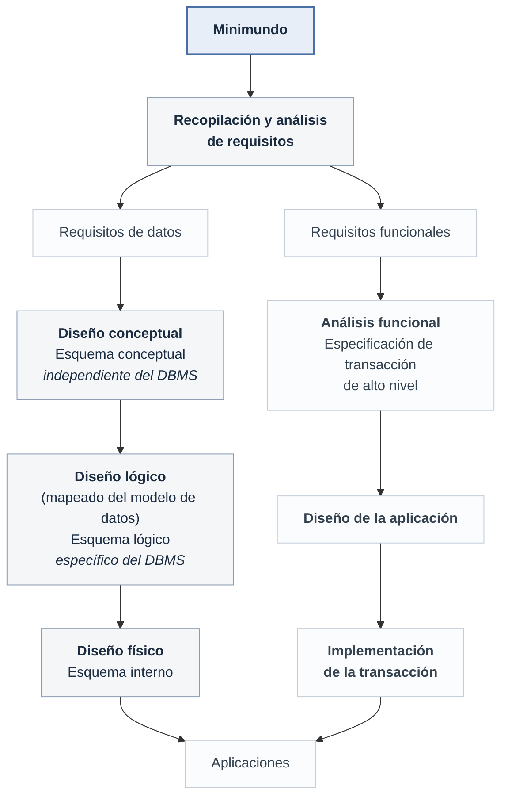
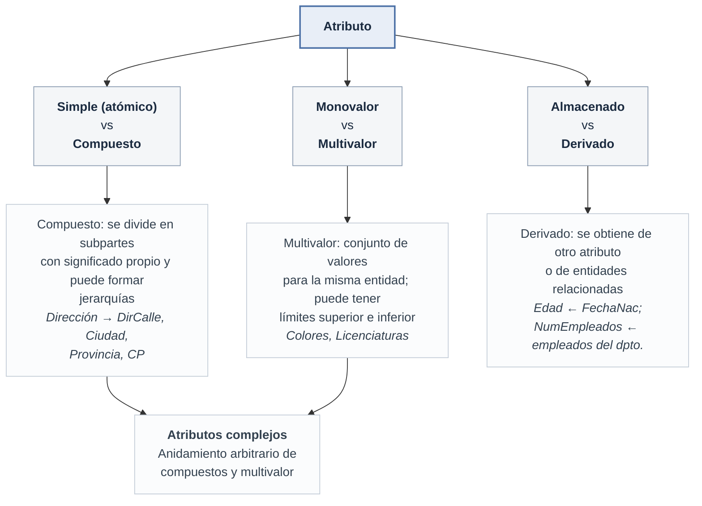
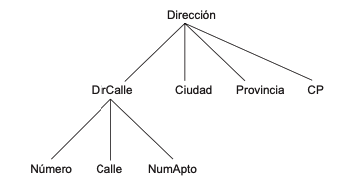
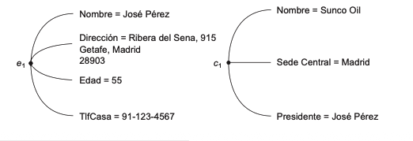
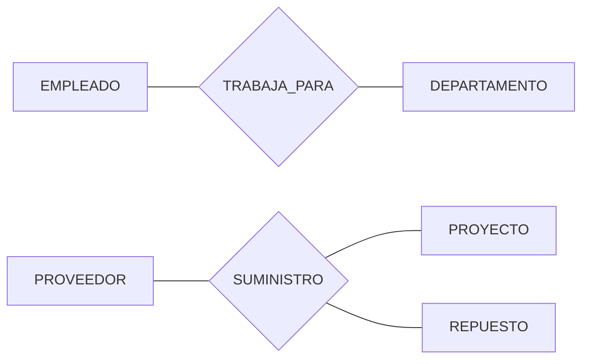
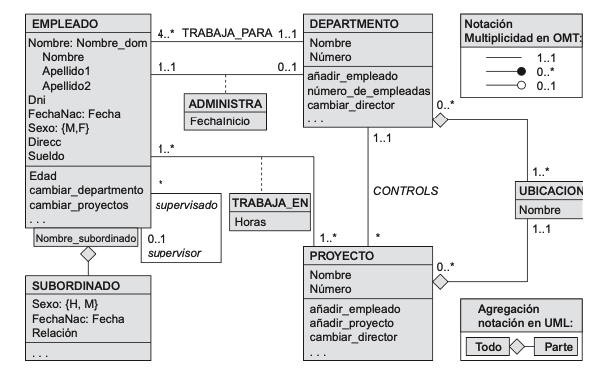
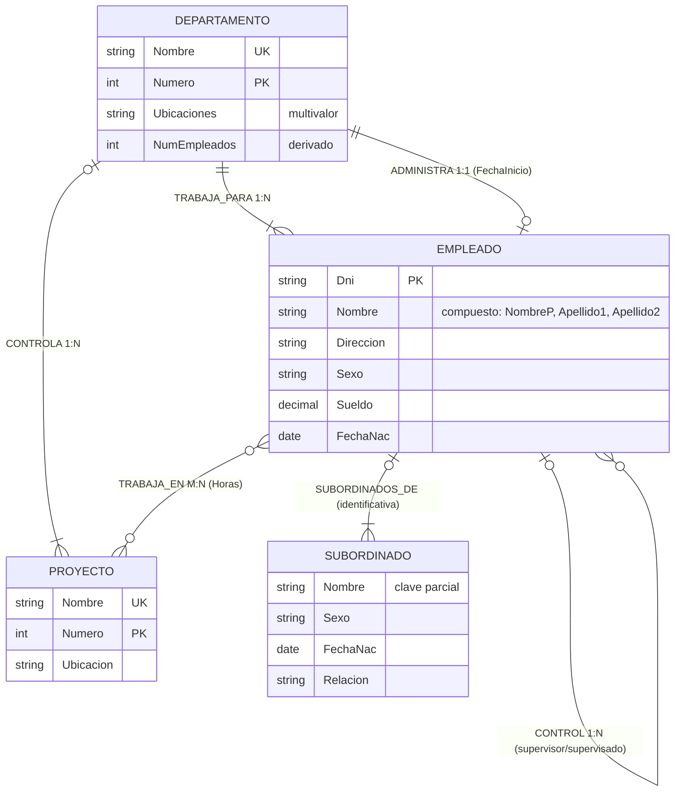

## Proceso de diseño de una base de datos

- **Minimundo**: la parte del mundo real que la base de datos va a representar
- **Requisitos de datos**: *qué* información hay que guardar (se obtienen entrevistando a los usuarios)
- **Requisitos funcionales**: *qué operaciones* (transacciones) se harán sobre esos datos
- **Esquema conceptual**: entidades, relaciones y restricciones → *independiente del DBMS*
- **Diseño lógico**: mapeo al modelo del DBMS (relacional…)
- **Diseño físico**: almacenamiento, índices, rutas de acceso


```mermaid
flowchart TD
    MM["<b>Minimundo</b>"] --> REQ["<b>Recopilación y análisis<br/>de requisitos</b>"]
    REQ --> FR["Requisitos funcionales"]
    REQ --> DR["Requisitos de datos"]

    FR --> AF["<b>Análisis funcional</b><br/>Especificación de transacción<br/>de alto nivel"]
    DR --> DC["<b>Diseño conceptual</b><br/>Esquema conceptual<br/><i>independiente del DBMS</i>"]

    DC --> DL["<b>Diseño lógico</b><br/>(mapeado del modelo de datos)<br/>Esquema lógico<br/><i>específico del DBMS</i>"]
    AF --> DA["<b>Diseño de la aplicación</b>"]
    DL --> DF["<b>Diseño físico</b><br/>Esquema interno"]
    DA --> IT["<b>Implementación<br/>de la transacción</b>"]
    DF --> APP["Aplicaciones"]
    IT --> APP

    classDef raiz fill:#e8eef7,stroke:#4a6fa5,stroke-width:2px,color:#1b2b40
    classDef fase fill:#f4f6f8,stroke:#8a9bb0,color:#1b2b40
    classDef detalle fill:#fbfcfd,stroke:#c3ccd7,color:#33414f
    class MM raiz
    class REQ,DC,DL,DF fase
    class FR,DR,AF,DA,IT,APP detalle
```

## Caso de estudio: EMPRESA

- **DEPARTAMENTO**: nombre y número únicos, un director (con fecha de inicio), varias ubicaciones
- **PROYECTO**: nombre y número únicos, una ubicación, controlado por un departamento
- **EMPLEADO**: nombre, DNI, dirección, sueldo, sexo, fecha de nacimiento
  - Pertenece a un departamento, trabaja en varios proyectos (horas/semana), tiene un supervisor
- **SUBORDINADO**: nombre, sexo, fecha de nacimiento, relación con el empleado

## Entidades y atributos

- **Entidad**: objeto del mundo real con existencia independiente
  - Física (persona, coche) o conceptual (empresa, curso)
- **Atributo**: propiedad que describe a la entidad

### Tipos de atributos

- **Simple** (atómico): no se divide (`Edad`) · **Compuesto**: formado por subpartes (`Dirección`)
- **Monovalor**: un solo valor por entidad (`FechaNac`) · **Multivalor**: varios valores (`Licenciaturas`)
- **Almacenado**: se guarda tal cual (`FechaNac`) · **Derivado**: se calcula a partir de otro (`Edad`)


```mermaid
flowchart TD
    A["<b>Atributo</b>"]

    A --> P1["<b>Simple (atómico)</b><br/>vs<br/><b>Compuesto</b>"]
    A --> P2["<b>Monovalor</b><br/>vs<br/><b>Multivalor</b>"]
    A --> P3["<b>Almacenado</b><br/>vs<br/><b>Derivado</b>"]

    P1 --> D1["Compuesto: se divide en subpartes<br/>con significado propio y puede formar<br/>jerarquías<br/><i>Dirección → DirCalle, Ciudad,<br/>Provincia, CP</i>"]
    P2 --> D2["Multivalor: conjunto de valores<br/>para la misma entidad; puede tener<br/>límites superior e inferior<br/><i>Colores, Licenciaturas</i>"]
    P3 --> D3["Derivado: se obtiene de otro atributo<br/>o de entidades relacionadas<br/><i>Edad ← FechaNac;<br/>NumEmpleados ← empleados del dpto.</i>"]

    D1 --> C["<b>Atributos complejos</b><br/>Anidamiento arbitrario de<br/>compuestos y multivalor"]
    D2 --> C

    classDef raiz fill:#e8eef7,stroke:#4a6fa5,stroke-width:2px,color:#1b2b40
    classDef tipo fill:#f4f6f8,stroke:#8a9bb0,color:#1b2b40
    classDef detalle fill:#fbfcfd,stroke:#c3ccd7,color:#33414f
    class A raiz
    class P1,P2,P3 tipo
    class D1,D2,D3,C detalle
```

---

#### Jerarquía de un atributo compuesto



- Las hojas son **atributos simples**
- Útil cuando se consulta la dirección completa *o* una parte (`Ciudad`, `CP`)
- Notación: compuesto `()`, multivalor `{}`

```text
{TlfDir( {Tlf(CodÁrea, NumTlf)}, Dir(DirCalle(Número, Calle, NumApto), Ciudad, Provincia, CP) )}
```

#### Entidades y valores



- Cada entidad tiene un **valor** por atributo
- **NULL**: valor especial que indica *ausencia de valor*. Se usa cuando:
  - No aplica (`NumApto` en una casa)
  - Existe pero se desconoce (`Altura`)
  - No se sabe si existe (`TlfCasa`)

### Tipo de entidad, clave y dominio

- **Tipo de entidad**: molde que define los atributos comunes (`EMPLEADO`) → es el *esquema* o **intención**
- **Conjunto de entidades**: todas las entidades de ese tipo en un momento dado → es la **extensión**
- **Atributo clave**: su valor es único para cada entidad, así que la identifica
  - Puede haber varias claves (`IdVehículo`, `Matrícula`)
  - Clave compuesta (varios atributos) debe ser **mínima**: sin atributos que sobren
  - Sin clave → **entidad débil** (se ve más adelante)
- **Dominio**: valores permitidos del atributo (no se dibuja en el ER)

### Diseño inicial de EMPRESA

| Tipo de entidad | Atributos | Notas |
| --- | --- | --- |
| `DEPARTAMENTO` | Nombre, Número, Ubicaciones, Director, FechaIngresoDirector | `Ubicaciones` multivalor |
| `PROYECTO` | Nombre, Número, Ubicación, DepartamentoControl | |
| `EMPLEADO` | Nombre (NombreP, Apellido1, Apellido2), Dni, Sexo, Dirección, Sueldo, FechaNac, Departamento, Supervisor, TrabajaEn (Proyecto, Horas) | `TrabajaEn` compuesto multivalor |
| `SUBORDINADO` | Empleado, NombreSubordinado, Sexo, FechaNac, Relación | |

> Los atributos que referencian otra entidad se convertirán en relaciones.

## Relaciones

- **Relación**: asociación entre entidades (un empleado *trabaja para* un departamento)
- **Tipo de relación**: la definición general (`TRABAJA_PARA` entre EMPLEADO y DEPARTAMENTO)
- **Instancia de relación**: un caso concreto, una entidad de cada tipo → *(José, Investigación)*
- Un atributo que **referencia otra entidad** (`Departamento` en EMPLEADO) debe modelarse como relación
- Se dibuja como **rombo**

### Grado de una relación

- **Grado** = cuántos tipos de entidad participan en la relación
- Cada instancia une **una** entidad de cada tipo participante

| Grado | Nombre | Ejemplo | Instancia |
| --- | --- | --- | --- |
| 2 | **Binaria** | `TRABAJA_PARA(EMPLEADO, DEPARTAMENTO)` | (José, Investigación) |
| 3 | **Ternaria** | `SUMINISTRO(PROVEEDOR, REPUESTO, PROYECTO)` | (Acme, tornillos, Puente) |


```mermaid
flowchart LR
    E1[EMPLEADO] --- R1{TRABAJA_PARA} --- D1[DEPARTAMENTO]
    S[PROVEEDOR] --- R2{SUMINISTRO} --- P[PROYECTO]
    R2 --- Q[REPUESTO]
```

- La mayoría de las relaciones son **binarias**; las de grado > 2 se ven más adelante

### Roles y recursividad

- **Nombre de rol**: papel que cumple cada entidad dentro de la relación
  - En `TRABAJA_PARA`: EMPLEADO es *trabajador*, DEPARTAMENTO es *empleador*
- **Relación recursiva**: la misma entidad participa dos veces
  - `CONTROL`: EMPLEADO como *supervisor* y *supervisado*

### Restricciones estructurales

- **Restricción estructural**: regla que limita cuántas veces participa una entidad en una relación
- **Razón de cardinalidad**: el **máximo** de instancias de relación por entidad → 1:1, 1:N, M:N
- **Participación**: el **mínimo**
  - **Total** (línea doble): *toda* entidad debe participar → **dependencia de existencia** (no existe sin la relación)
  - **Parcial** (línea sencilla): solo *algunas* entidades participan

| Relación | Razón | Significado |
| --- | --- | --- |
| `ADMINISTRA` | 1:1 | Un director por departamento |
| `TRABAJA_PARA` | 1:N | Un departamento, muchos empleados |
| `TRABAJA_EN` | M:N | Muchos empleados, muchos proyectos |

### Atributos de relación

- Dato que pertenece a la **asociación**, no a una sola entidad
- Ej.: `Horas` en `TRABAJA_EN`, `FechaInicio` en `ADMINISTRA`
- ¿Se puede **migrar** (mover) el atributo a una de las entidades?
- **1:1** → puede migrar a cualquiera de las dos entidades
- **1:N** → solo al lado **N**
- **M:N** → debe quedarse en la relación

## Entidades débiles

- **Entidad débil**: no tiene clave propia
- **Propietario**: entidad de la que depende para identificarse
- **Clave parcial**: atributo que distingue a las débiles *del mismo propietario*
- Identificación = clave del propietario **+** clave parcial
- **Relación identificativa**: la que une débil y propietario; la débil participa **siempre total**
- Ej.: `SUBORDINADO` (clave parcial `Nombre`) ← `EMPLEADO`
- Notación: rectángulo y rombo **dobles**; clave parcial con subrayado **discontinuo**
- Dependencia de existencia ≠ entidad débil (`PERMISO_CONDUCIR` tiene clave propia)

## Refinamiento de EMPRESA

| Relación | Participantes | Razón | Participación | Atributos |
| --- | --- | --- | --- | --- |
| `ADMINISTRA` | EMPLEADO – DEPARTAMENTO | 1:1 | EMP parcial, DEP total | `FechaInicio` |
| `TRABAJA_PARA` | DEPARTAMENTO – EMPLEADO | 1:N | ambas totales | |
| `CONTROLA` | DEPARTAMENTO – PROYECTO | 1:N | PROY total, DEP parcial | |
| `CONTROL` | EMPLEADO – EMPLEADO | 1:N | ambas parciales | |
| `TRABAJA_EN` | EMPLEADO – PROYECTO | M:N | ambas totales | `Horas` |
| `SUBORDINADOS_DE` | EMPLEADO – SUBORDINADO | 1:N | EMP parcial, SUB total | |

- Se eliminan los atributos convertidos en relaciones
- Objetivo: **mínima redundancia** (no guardar el mismo dato en varios lugares)

Notación del diagrama (pata de gallo; el símbolo se lee junto a la entidad del extremo):


## Notación del diagrama ER

| Símbolo | Significado |
| --- | --- |
| <svg width="100" height="40" viewBox="0 0 100 40" fill="none" stroke="currentColor" stroke-width="1.5"><rect x="10" y="8" width="80" height="24"/></svg> | Tipo de entidad |
| <svg width="100" height="40" viewBox="0 0 100 40" fill="none" stroke="currentColor" stroke-width="1.5"><rect x="10" y="6" width="80" height="28"/><rect x="14" y="10" width="72" height="20"/></svg> | Tipo de entidad débil |
| <svg width="100" height="40" viewBox="0 0 100 40" fill="none" stroke="currentColor" stroke-width="1.5"><polygon points="50,4 90,20 50,36 10,20"/></svg> | Tipo de relación |
| <svg width="100" height="40" viewBox="0 0 100 40" fill="none" stroke="currentColor" stroke-width="1.5"><polygon points="50,4 90,20 50,36 10,20"/><polygon points="50,10 78,20 50,30 22,20"/></svg> | Relación identificativa |
| <svg width="100" height="40" viewBox="0 0 100 40" fill="none" stroke="currentColor" stroke-width="1.5"><ellipse cx="50" cy="20" rx="38" ry="14"/></svg> | Atributo |
| <svg width="100" height="40" viewBox="0 0 100 40" fill="none" stroke="currentColor" stroke-width="1.5"><ellipse cx="50" cy="20" rx="38" ry="14"/><text x="50" y="24" font-size="11" text-anchor="middle" fill="currentColor" stroke="none" text-decoration="underline">Clave</text></svg> | Atributo clave (subrayado punteado = clave parcial) |
| <svg width="100" height="40" viewBox="0 0 100 40" fill="none" stroke="currentColor" stroke-width="1.5"><ellipse cx="50" cy="20" rx="40" ry="16"/><ellipse cx="50" cy="20" rx="34" ry="11"/></svg> | Atributo multivalor |
| <svg width="100" height="40" viewBox="0 0 100 40" fill="none" stroke="currentColor" stroke-width="1.5"><ellipse cx="50" cy="20" rx="38" ry="14" stroke-dasharray="4 3"/></svg> | Atributo derivado |
| <svg width="100" height="60" viewBox="0 0 100 60" fill="none" stroke="currentColor" stroke-width="1.5"><ellipse cx="50" cy="12" rx="24" ry="9"/><ellipse cx="22" cy="48" rx="18" ry="8"/><ellipse cx="78" cy="48" rx="18" ry="8"/><line x1="40" y1="20" x2="26" y2="40"/><line x1="60" y1="20" x2="74" y2="40"/></svg> | Atributo compuesto |
| <svg width="100" height="40" viewBox="0 0 100 40" fill="none" stroke="currentColor" stroke-width="1.5"><line x1="10" y1="17" x2="90" y2="17"/><line x1="10" y1="23" x2="90" y2="23"/></svg> | Participación total (dependencia de existencia) |
| <svg width="100" height="40" viewBox="0 0 100 40" fill="none" stroke="currentColor" stroke-width="1.5"><line x1="10" y1="20" x2="90" y2="20"/></svg> | Participación parcial |
| <svg width="100" height="40" viewBox="0 0 100 40" fill="none" stroke="currentColor" stroke-width="1.5"><line x1="10" y1="26" x2="90" y2="26"/><text x="20" y="18" font-size="11" text-anchor="middle" fill="currentColor" stroke="none">1</text><text x="80" y="18" font-size="11" text-anchor="middle" fill="currentColor" stroke="none">N</text></svg> | Razón de cardinalidad |
| <svg width="100" height="40" viewBox="0 0 100 40" fill="none" stroke="currentColor" stroke-width="1.5"><line x1="10" y1="28" x2="90" y2="28"/><text x="50" y="18" font-size="11" text-anchor="middle" fill="currentColor" stroke="none">(0,N)</text></svg> | Restricción estructural alternativa |

### Convenciones de nombres

- Tipos de entidad en **singular**
- ENTIDADES y RELACIONES en mayúsculas; Atributos con inicial mayúscula; roles en minúsculas
- **Sustantivos** → entidades; **verbos** → relaciones
- Leer de **izquierda a derecha** y de **arriba abajo**

### Opciones de diseño

- Atributo → **relación** (si referencia otra entidad)
- Atributo repetido en varias entidades → **nueva entidad**
- Entidad con un solo atributo → **atributo**

### Notación (mín, máx)

- Cada participación se anota con un par **(mín, máx)**: una entidad participa *al menos* `mín` y *a lo sumo* `máx` veces
- `mín = 0` → parcial; `mín > 0` → total
- Más precisa que la razón de cardinalidad (combina mínimo y máximo)

| Relación | Participaciones |
| --- | --- |
| `TRABAJA_PARA` | EMPLEADO (1,1), DEPARTAMENTO (4,N) |
| `ADMINISTRA` | EMPLEADO (0,1), DEPARTAMENTO (1,1) |
| `CONTROLA` | DEPARTAMENTO (0,N), PROYECTO (1,1) |
| `TRABAJA_EN` | EMPLEADO (1,N), PROYECTO (1,N) |
| `CONTROL` | supervisor (0,N), supervisado (0,1) |
| `SUBORDINADOS_DE` | EMPLEADO (0,N), SUBORDINADO (1,1) |

<iframe src="../../assets/notacion-chen.html" title="Simulación de notación Chen" width="100%" height="900" style="border:1px solid #dce2ea;border-radius:8px" loading="lazy"></iframe>

[Abrir la simulación en pantalla completa](../../assets/notacion-chen.html)

## ER vs UML

- **UML**: lenguaje estándar de modelado de software
- Su **diagrama de clases** cumple el mismo papel que el diagrama ER

| Modelo ER | UML |
| --- | --- |
| Tipo de entidad | **Clase** (nombre, atributos, operaciones) |
| Entidad | **Objeto** |
| Atributo multivalor | **Clase separada** |
| Tipo de relación | **Asociación** |
| Instancia de relación | **Vínculo** |
| (mín, máx) | **Multiplicidad** `mín..máx` (se escribe junto a la *otra* clase) |
| Relación recursiva | **Asociación reflexiva** |
| Entidad débil | **Asociación cualificada** (la clave parcial es el *discriminador*) |

## Relaciones de grado > 2

### Ternaria vs. tres binarias

- Recordatorio: **binaria** une 2 entidades; **ternaria** une 3 en un mismo hecho
- **Ternaria** `SUMINISTRO(PROVEEDOR, REPUESTO, PROYECTO)`: *quién* suministra *qué* a *quién*
- **Binarias**:
  - `PUEDE_SUMINISTRAR(PROVEEDOR, REPUESTO)`
  - `USA(PROYECTO, REPUESTO)`
  - `SUMINISTRA(PROVEEDOR, PROYECTO)`

> Las tres binarias **no** permiten reconstruir la ternaria.

| Hecho registrado | Relación |
| --- | --- |
| Acme **puede suministrar** tornillos | `PUEDE_SUMINISTRAR` |
| El proyecto Puente **usa** tornillos | `USA` |
| Acme **suministra** al proyecto Puente (pero solo cemento) | `SUMINISTRA` |
| ¿Acme suministra **tornillos** al Puente? | ❌ No se puede saber |

- Solución típica: ternaria **+** las binarias con significado propio

### Alternativas de representación

- **Entidad débil** `SUMINISTRO` con **tres relaciones identificativas** (una por participante)
- **Entidad regular** con **clave sustituta** `IdSuministro` (identificador artificial, sin significado propio) y tres relaciones 1:N

### Restricciones en relaciones n-arias

- **n-aria**: relación de grado *n* (ternaria = 3-aria)

- **Razón de cardinalidad**: indica qué combinación es **clave**
  - `1` en PROVEEDOR → cada par (proyecto, repuesto) tiene **un solo** proveedor
- **(mín, máx)**: cuántas veces participa **cada entidad** por separado
- Se necesitan **ambas** para describir la relación por completo

## UML



## Otro tipo de notación: Notación de Martin / IE

| Símbolo | Significado |
| --- | --- |
| <svg width="100" height="40" viewBox="0 0 100 40" fill="none" stroke="currentColor" stroke-width="1.5"><line x1="10" y1="20" x2="90" y2="20"/><line x1="70" y1="12" x2="70" y2="28"/><line x1="78" y1="12" x2="78" y2="28"/></svg> | exactamente uno |
| <svg width="100" height="40" viewBox="0 0 100 40" fill="none" stroke="currentColor" stroke-width="1.5"><line x1="10" y1="20" x2="60" y2="20"/><circle cx="66" cy="20" r="6"/><line x1="72" y1="20" x2="90" y2="20"/><line x1="80" y1="12" x2="80" y2="28"/></svg> | cero o uno |
| <svg width="100" height="40" viewBox="0 0 100 40" fill="none" stroke="currentColor" stroke-width="1.5"><line x1="10" y1="20" x2="90" y2="20"/><line x1="66" y1="12" x2="66" y2="28"/><line x1="76" y1="20" x2="90" y2="10"/><line x1="76" y1="20" x2="90" y2="30"/></svg> | uno o más |
| <svg width="100" height="40" viewBox="0 0 100 40" fill="none" stroke="currentColor" stroke-width="1.5"><line x1="10" y1="20" x2="60" y2="20"/><circle cx="66" cy="20" r="6"/><line x1="72" y1="20" x2="90" y2="20"/><line x1="76" y1="20" x2="90" y2="10"/><line x1="76" y1="20" x2="90" y2="30"/></svg> | cero o más |
| `PK` | clave primaria |
| `UK` | clave alternativa (valor único) |


```mermaid
erDiagram
    DEPARTAMENTO ||--|{ EMPLEADO : "TRABAJA_PARA 1:N"
    EMPLEADO |o--|| DEPARTAMENTO : "ADMINISTRA 1:1 (FechaInicio)"
    DEPARTAMENTO |o--|{ PROYECTO : "CONTROLA 1:N"
    EMPLEADO }o--o{ PROYECTO : "TRABAJA_EN M:N (Horas)"
    EMPLEADO |o--o{ EMPLEADO : "CONTROL 1:N (supervisor/supervisado)"
    EMPLEADO |o--|{ SUBORDINADO : "SUBORDINADOS_DE (identificativa)"

    EMPLEADO {
        string Dni PK
        string Nombre "compuesto: NombreP, Apellido1, Apellido2"
        string Direccion
        string Sexo
        decimal Sueldo
        date FechaNac
    }
    DEPARTAMENTO {
        string Nombre UK
        int Numero PK
        string Ubicaciones "multivalor"
        int NumEmpleados "derivado"
    }
    PROYECTO {
        string Nombre UK
        int Numero PK
        string Ubicacion
    }
    SUBORDINADO {
        string Nombre "clave parcial"
        string Sexo
        date FechaNac
        string Relacion
    }
```

## Resumen

- Entidades, atributos, claves, relaciones, restricciones y entidades débiles
- Suficiente para aplicaciones empresariales típicas
- Siguiente paso: **modelo ER mejorado (EER)** → especialización, generalización, herencia

[⬅️ Volver a Unidad I](./index.md)
