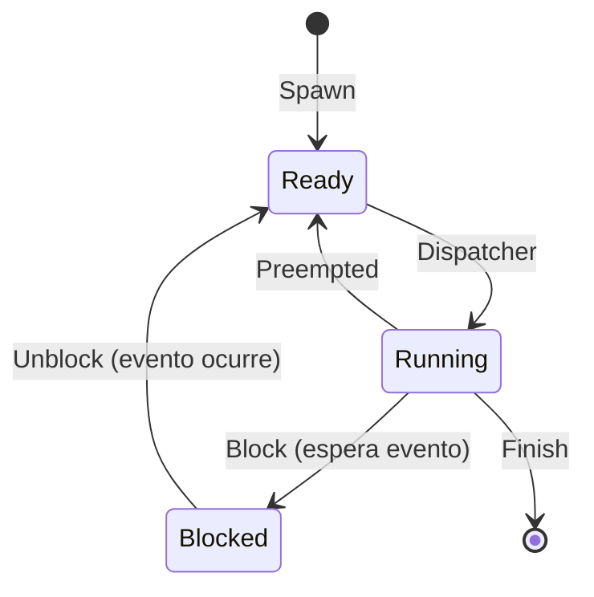
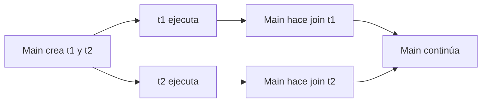

# Hilos (Threads)

**Referencias:**
- Tanenbaum & Bos, *Modern Operating Systems* (Cap. 2, Threads)
- William Stallings, *Operating Systems: Internals and Design Principles* (Cap. 2, Threads)

---

## Contenido

- [3.1 ¿Qué es un hilo?](#31-qué-es-un-hilo)
- [3.2 Hilos vs. Procesos](#32-hilos-vs-procesos)
- [3.3 Modelo de proceso multihilo](#33-modelo-de-proceso-multihilo)
- [3.4 Estados de un hilo](#34-estados-de-un-hilo)
- [3.5 Tipos de hilos: ULT vs KLT](#35-tipos-de-hilos-ult-vs-klt)
- [3.6 Casos de uso de hilos](#36-casos-de-uso-de-hilos)
- [3.7 Creación de hilos con POSIX (`pthreads`)](#37-creación-de-hilos-con-posix-pthreads)
- [3.8 Sincronización básica con `pthread_join`](#38-sincronización-básica-con-pthread_join)
- [3.9 Memoria compartida entre hilos](#39-memoria-compartida-entre-hilos)
- [3.10 Condiciones de carrera](#310-condiciones-de-carrera)
- [3.11 Medición: crear hilos vs crear procesos](#311-medición-crear-hilos-vs-crear-procesos)
- [3.12 Resumen](#312-resumen)

---

## 3.1 ¿Qué es un hilo?

Un **hilo** es una unidad de ejecución dentro de un proceso.  
Varios hilos de un mismo proceso comparten recursos, especialmente el espacio de memoria del proceso.

Cada hilo tiene su propio:
- Contador de programa (PC)
- Conjunto de registros
- Pila de ejecución (stack)

> "Processes are used to group resources together; threads are the entities scheduled for execution on the CPU."  
> — Tanenbaum & Bos, *Modern Operating Systems*, Cap. 2


---

## 3.2 Hilos vs. Procesos

| Aspecto | Proceso | Hilo |
|--------|---------|------|
| Memoria | Separada entre procesos | Compartida dentro del mismo proceso |
| Creación | Más costosa | Más ligera |
| Comunicación | IPC (pipes, sockets, señales, etc.) | Variables compartidas |
| Aislamiento | Alto | Menor |

En general, los hilos permiten mayor rendimiento para tareas concurrentes dentro de una misma aplicación, pero exigen más cuidado con la sincronización.

> "Multithreading refers to the ability of an OS to support multiple, concurrent paths of execution within a single process."  
> — Stallings, *Operating Systems: Internals and Design Principles*, Cap. 4

La siguiente figura ilustra la diferencia usando llamadas a procedimiento remoto (RPC). Una RPC es una petición que un proceso envía a un servidor externo y queda bloqueado esperando la respuesta. Con un solo hilo, las peticiones se hacen una a la vez; con múltiples hilos, cada hilo envía su petición en paralelo.


**(a)** Con un solo hilo, Process 1 envía las peticiones RPC en secuencia y permanece bloqueado entre cada una. **(b)** Con dos hilos del mismo proceso, Thread A y Thread B envían sus peticiones RPC en paralelo; mientras uno espera la respuesta del servidor, el otro puede avanzar, reduciendo el tiempo total de espera.*

---

## 3.3 Modelo de proceso multihilo

En un proceso de un solo hilo (modelo tradicional), el proceso contiene un único bloque de control del proceso (PCB) con su pila de usuario y pila del kernel.

En un proceso multihilo, sigue existiendo un único PCB compartido, pero **cada hilo tiene su propio**:
- Bloque de control de hilo (*Thread Control Block*, TCB) con registros y prioridad
- Pila de usuario
- Pila del kernel

Todos los hilos del mismo proceso comparten el espacio de dirección de usuario y los recursos del proceso (archivos abiertos, dispositivos, etc.).

> "All of the threads of a process share the state and resources of that process. They reside in the same address space and have access to the same data."  
> — Stallings, *Operating Systems*, Cap. 4


*Thread A (Proceso 1) se bloquea por I/O; mientras tanto Thread B (mismo proceso) pasa a Running. Thread C (Proceso 2) es creado y entra al sistema. Los tres hilos comparten el único procesador intercalando sus estados.*

---

## 3.4 Estados de un hilo

Al igual que los procesos, los hilos tienen estados de ejecución. Los estados clave son **Running**, **Ready** y **Blocked**.

> Nota: Los estados de suspensión (*Suspend*) son conceptos de nivel de proceso, no de hilo. Si un proceso se suspende, todos sus hilos se suspenden junto con él.

Las cuatro operaciones básicas que cambian el estado de un hilo son:

| Operación | Descripción |
|-----------|-------------|
| **Spawn** (crear) | Se crea un nuevo hilo con su propio contexto de registros y pila; pasa a la cola de Ready |
| **Block** (bloquear) | El hilo espera un evento; guarda registros, PC y punteros de pila |
| **Unblock** (desbloquear) | El evento ocurrió; el hilo pasa a Ready |
| **Finish** (terminar) | El hilo completa su ejecución; su contexto y pila son liberados |



> "Like processes, threads have execution states and may synchronize with one another."  
> — Stallings, *Operating Systems*, Cap. 4

---

## 3.5 Tipos de hilos: ULT vs KLT

Existen dos grandes categorías de implementación de hilos:

### Hilos a nivel de usuario (ULT — User-Level Threads)

Todo el trabajo de gestión de hilos lo realiza la **biblioteca de threads en espacio de usuario**; el kernel no sabe que existen hilos.

**Ventajas:**
- El cambio de contexto entre hilos no requiere modo kernel → menor sobrecarga
- La planificación es personalizable por aplicación
- Funciona en cualquier SO sin modificar el kernel

**Desventajas:**
- Una llamada al sistema bloqueante bloquea **todos** los hilos del proceso
- No puede aprovechar múltiples procesadores simultáneamente (el kernel solo ve un proceso)

### Hilos a nivel de kernel (KLT — Kernel-Level Threads)

El kernel gestiona directamente los hilos. No hay código de gestión de hilos en espacio de usuario.

**Ventajas:**
- El kernel puede planificar varios hilos del mismo proceso en distintos procesadores
- Si un hilo se bloquea, el kernel puede ejecutar otro hilo del mismo proceso

**Desventaja:**
- Cambiar de un hilo a otro dentro del mismo proceso requiere un cambio de modo → mayor overhead

### Comparación de latencias (VAX/UNIX)

| Operación | ULT | KLT | Procesos |
|-----------|-----|-----|----------|
| Null Fork (crear/ejecutar/terminar) | 34 μs | 948 μs | 11,300 μs |
| Signal-Wait (sincronización) | 37 μs | 441 μs | 1,840 μs |

> — Stallings, *Operating Systems*, Tabla 4.1 (Cap. 4)

### Enfoque combinado (ULT + KLT)

Algunos SO (como Solaris) permiten mapear múltiples ULTs sobre un número menor de KLTs. Esto combina:
- La eficiencia de los ULTs para cambios de contexto internos
- La capacidad de los KLTs de ejecutarse en paralelo en múltiples procesadores


**(a) ULT puro:** la biblioteca de threads vive en espacio de usuario; el kernel solo ve un proceso P. **(b) KLT puro:** cada hilo tiene un hilo de kernel correspondiente; el kernel planifica directamente. **(c) Combinado:** múltiples ULTs se mapean sobre un número menor de KLTs, obteniendo flexibilidad y paralelismo real.*

---

## 3.6 Casos de uso de hilos

Tanenbaum (Cap. 2) y Stallings (Cap. 4) identifican los siguientes escenarios donde los hilos aportan valor real:

| Caso de uso | Descripción |
|-------------|-------------|
| **Trabajo en primer y segundo plano** | Un hilo actualiza la pantalla/interfaz mientras otro ejecuta operaciones largas (ej. reformatear documento) |
| **Procesamiento asíncrono** | Un hilo realiza respaldo periódico a disco mientras otro atiende al usuario |
| **Velocidad de ejecución** | En multiprocessor, varios hilos del mismo proceso corren en paralelo en distintos cores |
| **Estructura modular** | Programas con múltiples fuentes de entrada/salida son más claros diseñados como hilos separados |
| **Servidor de archivos** | Cada solicitud entrante se maneja en un hilo nuevo; si uno espera disco, los demás siguen atendiendo |

> "The main reason for having threads is that in many applications, multiple activities are going on at once. Some of these may block from time to time. By decomposing such an application into multiple sequential threads that run in quasi-parallel, the programming model becomes simpler."  
> — Tanenbaum & Bos, *Modern Operating Systems*, Cap. 2

Estudios con el sistema Mach muestran que crear un hilo es **al menos 10 veces más rápido** que crear un proceso en UNIX.

> — Stallings, *Operating Systems*, Cap. 4

---

## 3.7 Creación de hilos con POSIX (`pthreads`)

Ejemplo base:

```c
#include <stdio.h>
#include <pthread.h>
#include <unistd.h>

int contador_global = 0;

void *incrementar(void *arg) {
    int id = *(int *)arg;
    for (int i = 0; i < 5; i++) {
        contador_global++;
        printf("[Thread %d] contador = %d\n", id, contador_global);
        sleep(1);
    }
    return NULL;
}

int main(void) {
    pthread_t t1, t2;
    int id1 = 1, id2 = 2;

    pthread_create(&t1, NULL, incrementar, &id1);
    pthread_create(&t2, NULL, incrementar, &id2);

    pthread_join(t1, NULL);
    pthread_join(t2, NULL);

    printf("Valor final del contador: %d\n", contador_global);
    return 0;
}
```

Compilación:

```bash
gcc -o hilos_ejemplo hilos_ejemplo.c -lpthread
./hilos_ejemplo
```

> "The thread has a program counter ... registers ... [and] a stack ..."  
> — Tanenbaum & Bos, *Modern Operating Systems*, Cap. 2

---

## 3.8 Sincronización básica con `pthread_join`

`pthread_join` hace que el hilo principal espere a que otro hilo termine.  
Sin `join`, el proceso principal podría finalizar antes de que los hilos completen su trabajo.



---

## 3.9 Memoria compartida entre hilos

Cuando un hilo modifica una variable global, el hilo principal ve ese cambio.  
Esto demuestra que los hilos del mismo proceso comparten memoria.

En contraste, con `fork()`, padre e hijo tienen espacios de memoria separados (lógicamente independientes tras copy-on-write).


*Dos hilos del Proceso 1 comparten el procesador: cuando Thread A se bloquea esperando I/O, Thread B puede ejecutar. Esto demuestra que la memoria compartida entre hilos del mismo proceso permite coordinación sin IPC.*

---

## 3.10 Condiciones de carrera

Cuando varios hilos escriben/leen una variable compartida sin exclusión mutua, puede aparecer una **condición de carrera**.

Síntoma típico: el resultado final cambia entre ejecuciones aunque el código no cambie.

Para evitarlo, se usan mecanismos de sincronización como:
- `pthread_mutex_t`
- Semáforos
- Variables de condición


*Con un solo hilo la aplicación envía una petición RPC y espera bloqueada; con dos hilos puede enviar ambas peticiones en paralelo y procesar las respuestas conforme llegan, reduciendo el tiempo total de espera.*

---

## 3.11 Medición: crear hilos vs crear procesos

En mediciones empíricas, crear 1000 hilos suele ser más rápido que crear 1000 procesos.

La diferencia depende del hardware, kernel y carga del sistema, pero la tendencia general es:
- Crear hilos: menor sobrecarga
- Crear procesos: mayor sobrecarga

---

## 3.12 Resumen

1. Un hilo es una unidad de ejecución dentro de un proceso.
2. Los hilos comparten memoria, por eso la comunicación es rápida.
3. Esa memoria compartida exige sincronización para evitar condiciones de carrera.
4. En la práctica, crear hilos suele ser más barato que crear procesos.
