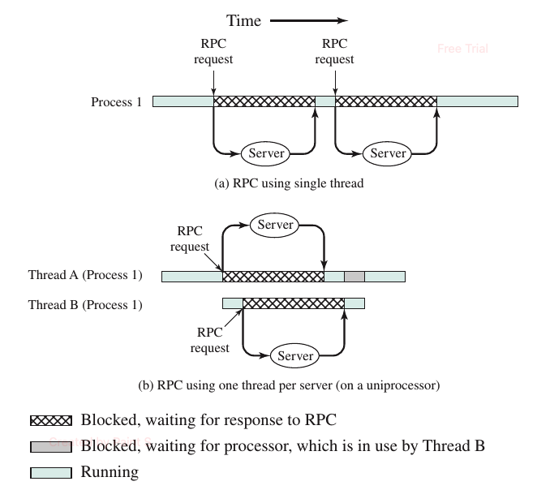
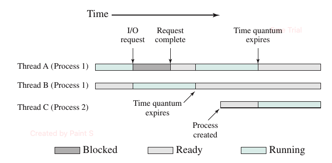
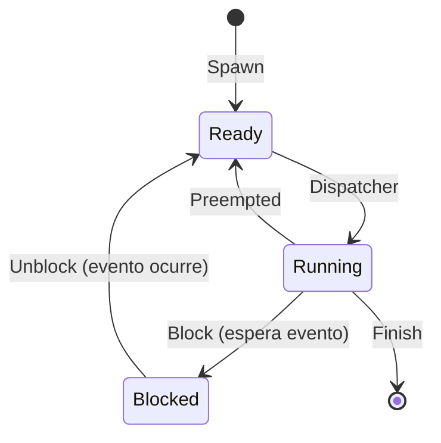
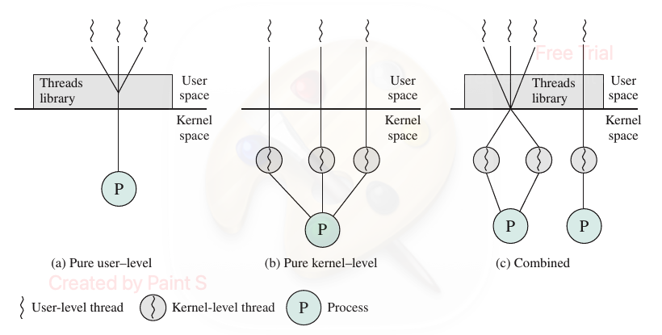
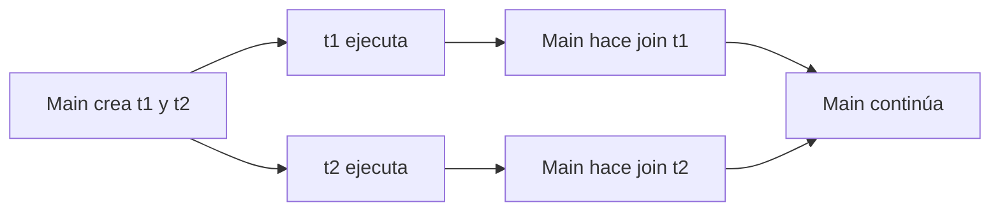
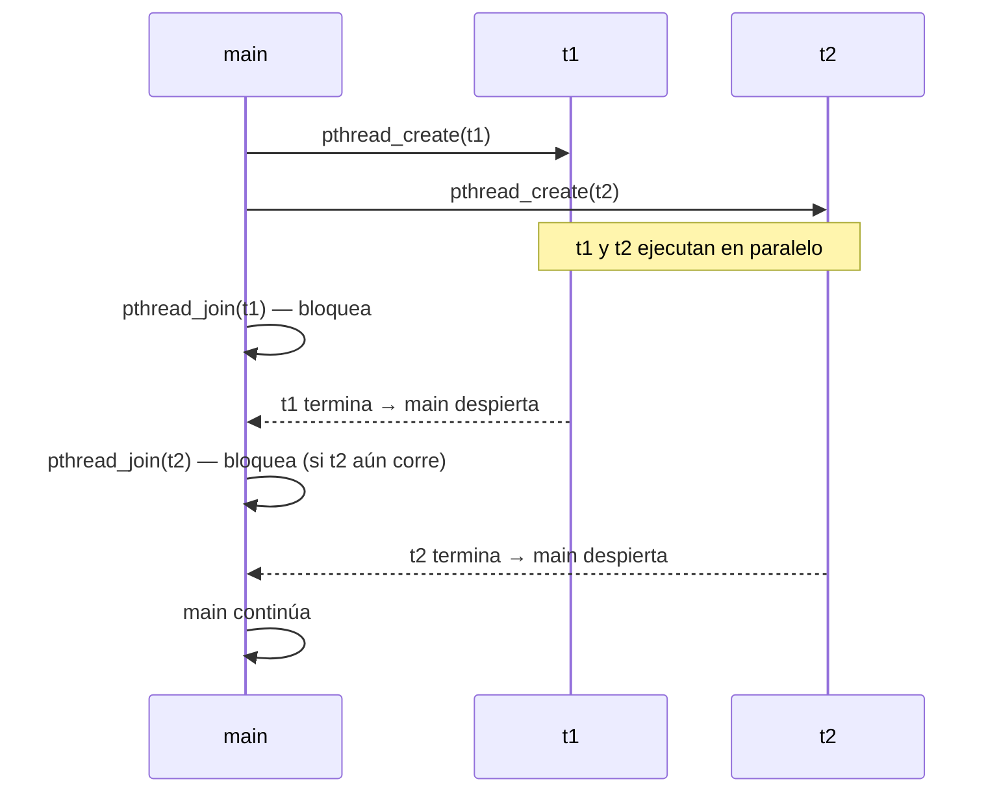
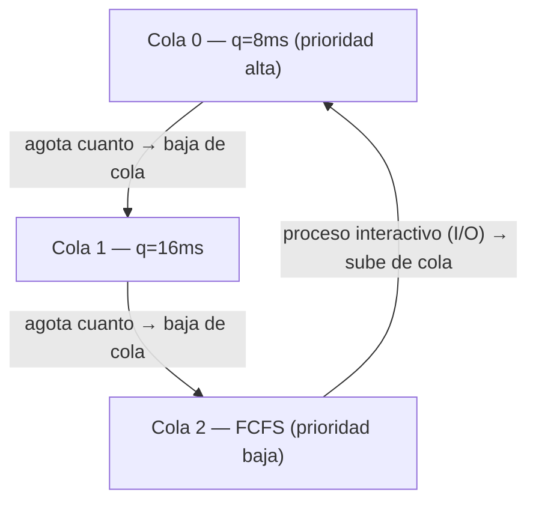
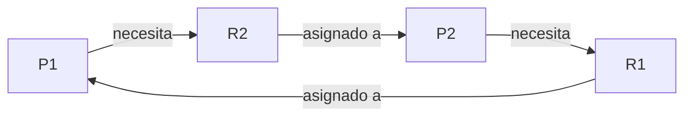

# Hilos (Threads)

**Referencias:**
- Tanenbaum & Bos, *Modern Operating Systems* (Cap. 2, Threads)
- William Stallings, *Operating Systems: Internals and Design Principles* (Cap. 2, Threads)

---

## Contenido

- [3.1 ¿Qué es un hilo?](#31-qué-es-un-hilo)
- [3.2 Hilos vs. Procesos](#32-hilos-vs-procesos)
- [3.3 Modelo de proceso multihilo](#33-modelo-de-proceso-multihilo)
- [3.4 Estados de un hilo](#34-estados-de-un-hilo)
- [3.5 Tipos de hilos: ULT vs KLT](#35-tipos-de-hilos-ult-vs-klt)
- [3.6 Casos de uso de hilos](#36-casos-de-uso-de-hilos)
- [3.7 Creación de hilos con POSIX (`pthreads`)](#37-creación-de-hilos-con-posix-pthreads)
- [3.8 Sincronización básica con `pthread_join`](#38-sincronización-básica-con-pthread_join)
- [3.9 Memoria compartida entre hilos](#39-memoria-compartida-entre-hilos)
- [3.10 Condiciones de carrera](#310-condiciones-de-carrera)
- [3.11 Medición: crear hilos vs crear procesos](#311-medición-crear-hilos-vs-crear-procesos)
- [3.12 La Sección Crítica](#312-la-sección-crítica)
- [3.13 Exclusión Mutua — Mutex](#313-exclusión-mutua--mutex)
- [3.14 Semáforos](#314-semáforos)
- [3.15 Variables de Condición](#315-variables-de-condición)
- [3.16 Problemas Clásicos de Sincronización](#316-problemas-clásicos-de-sincronización)
  - [3.16.1 Productor-Consumidor](#3161-productor-consumidor)
  - [3.16.2 Lectores-Escritores](#3162-lectores-escritores)
  - [3.16.3 Filósofos Comensales](#3163-filósofos-comensales)
- [3.17 Planificación de CPU (Scheduling)](#317-planificación-de-cpu-scheduling)
  - [3.17.1 Criterios de Planificación](#3171-criterios-de-planificación)
  - [3.17.2 FCFS — First Come First Served](#3172-fcfs--first-come-first-served)
  - [3.17.3 SJF — Shortest Job First](#3173-sjf--shortest-job-first)
  - [3.17.4 Round Robin](#3174-round-robin)
  - [3.17.5 Planificación por Prioridad](#3175-planificación-por-prioridad)
  - [3.17.6 Cola Multinivel con Retroalimentación](#3176-cola-multinivel-con-retroalimentación)
- [3.18 Interbloqueo (Deadlock)](#318-interbloqueo-deadlock)
  - [3.18.1 Condiciones de Coffman](#3181-condiciones-de-coffman)
  - [3.18.2 Prevención](#3182-prevención)
  - [3.18.3 Evitación — Algoritmo del Banquero](#3183-evitación--algoritmo-del-banquero)
  - [3.18.4 Detección y Recuperación](#3184-detección-y-recuperación)
- [3.19 Resumen](#319-resumen)

---

## 3.1 ¿Qué es un hilo?

Un **hilo** es una unidad de ejecución dentro de un proceso.  
Varios hilos de un mismo proceso comparten recursos, especialmente el espacio de memoria del proceso.

Cada hilo tiene su propio:
- Contador de programa (PC)
- Conjunto de registros
- Pila de ejecución (stack)

> "Processes are used to group resources together; threads are the entities scheduled for execution on the CPU."  
> — Tanenbaum & Bos, *Modern Operating Systems*, Cap. 2


---

## 3.2 Hilos vs. Procesos

| Aspecto | Proceso | Hilo |
|--------|---------|------|
| Memoria | Separada entre procesos | Compartida dentro del mismo proceso |
| Creación | Más costosa | Más ligera |
| Comunicación | IPC (pipes, sockets, señales, etc.) | Variables compartidas |
| Aislamiento | Alto | Menor |

En general, los hilos permiten mayor rendimiento para tareas concurrentes dentro de una misma aplicación, pero exigen más cuidado con la sincronización.

> "Multithreading refers to the ability of an OS to support multiple, concurrent paths of execution within a single process."  
> — Stallings, *Operating Systems: Internals and Design Principles*, Cap. 4

La siguiente figura ilustra la diferencia usando llamadas a procedimiento remoto (RPC). Una RPC es una petición que un proceso envía a un servidor externo y queda bloqueado esperando la respuesta. Con un solo hilo, las peticiones se hacen una a la vez; con múltiples hilos, cada hilo envía su petición en paralelo.



**(a)** Con un solo hilo, Process 1 envía las peticiones RPC en secuencia y permanece bloqueado entre cada una. **(b)** Con dos hilos del mismo proceso, Thread A y Thread B envían sus peticiones RPC en paralelo; mientras uno espera la respuesta del servidor, el otro puede avanzar, reduciendo el tiempo total de espera.*

---

## 3.3 Modelo de proceso multihilo

En un proceso de un solo hilo (modelo tradicional), el proceso contiene un único bloque de control del proceso (PCB) con su pila de usuario y pila del kernel.

En un proceso multihilo, sigue existiendo un único PCB compartido, pero **cada hilo tiene su propio**:
- Bloque de control de hilo (*Thread Control Block*, TCB) con registros y prioridad
- Pila de usuario
- Pila del kernel

Todos los hilos del mismo proceso comparten el espacio de dirección de usuario y los recursos del proceso (archivos abiertos, dispositivos, etc.).

> "All of the threads of a process share the state and resources of that process. They reside in the same address space and have access to the same data."  
> — Stallings, *Operating Systems*, Cap. 4



*Thread A (Proceso 1) se bloquea por I/O; mientras tanto Thread B (mismo proceso) pasa a Running. Thread C (Proceso 2) es creado y entra al sistema. Los tres hilos comparten el único procesador intercalando sus estados.*

---

## 3.4 Estados de un hilo

Al igual que los procesos, los hilos tienen estados de ejecución. Los estados clave son **Running**, **Ready** y **Blocked**.

> Nota: Los estados de suspensión (*Suspend*) son conceptos de nivel de proceso, no de hilo. Si un proceso se suspende, todos sus hilos se suspenden junto con él.

Las cuatro operaciones básicas que cambian el estado de un hilo son:

| Operación | Descripción |
|-----------|-------------|
| **Spawn** (crear) | Se crea un nuevo hilo con su propio contexto de registros y pila; pasa a la cola de Ready |
| **Block** (bloquear) | El hilo espera un evento; guarda registros, PC y punteros de pila |
| **Unblock** (desbloquear) | El evento ocurrió; el hilo pasa a Ready |
| **Finish** (terminar) | El hilo completa su ejecución; su contexto y pila son liberados |



> "Like processes, threads have execution states and may synchronize with one another."  
> — Stallings, *Operating Systems*, Cap. 4

---

## 3.5 Tipos de hilos: ULT vs KLT

Existen dos grandes categorías de implementación de hilos:

### Hilos a nivel de usuario (ULT — User-Level Threads)

Todo el trabajo de gestión de hilos lo realiza la **biblioteca de threads en espacio de usuario**; el kernel no sabe que existen hilos.

**Ventajas:**
- El cambio de contexto entre hilos no requiere modo kernel → menor sobrecarga
- La planificación es personalizable por aplicación
- Funciona en cualquier SO sin modificar el kernel

**Desventajas:**
- Una llamada al sistema bloqueante bloquea **todos** los hilos del proceso
- No puede aprovechar múltiples procesadores simultáneamente (el kernel solo ve un proceso)

### Hilos a nivel de kernel (KLT — Kernel-Level Threads)

El kernel gestiona directamente los hilos. No hay código de gestión de hilos en espacio de usuario.

**Ventajas:**
- El kernel puede planificar varios hilos del mismo proceso en distintos procesadores
- Si un hilo se bloquea, el kernel puede ejecutar otro hilo del mismo proceso

**Desventaja:**
- Cambiar de un hilo a otro dentro del mismo proceso requiere un cambio de modo → mayor overhead

### Comparación de latencias (VAX/UNIX)

| Operación | ULT | KLT | Procesos |
|-----------|-----|-----|----------|
| Null Fork (crear/ejecutar/terminar) | 34 μs | 948 μs | 11,300 μs |
| Signal-Wait (sincronización) | 37 μs | 441 μs | 1,840 μs |

> — Stallings, *Operating Systems*, Tabla 4.1 (Cap. 4)

### Enfoque combinado (ULT + KLT)

Algunos SO (como Solaris) permiten mapear múltiples ULTs sobre un número menor de KLTs. Esto combina:
- La eficiencia de los ULTs para cambios de contexto internos
- La capacidad de los KLTs de ejecutarse en paralelo en múltiples procesadores



**(a) ULT puro:** la biblioteca de threads vive en espacio de usuario; el kernel solo ve un proceso P. **(b) KLT puro:** cada hilo tiene un hilo de kernel correspondiente; el kernel planifica directamente. **(c) Combinado:** múltiples ULTs se mapean sobre un número menor de KLTs, obteniendo flexibilidad y paralelismo real.*

---

## 3.6 Casos de uso de hilos

Tanenbaum (Cap. 2) y Stallings (Cap. 4) identifican los siguientes escenarios donde los hilos aportan valor real:

| Caso de uso | Descripción |
|-------------|-------------|
| **Trabajo en primer y segundo plano** | Un hilo actualiza la pantalla/interfaz mientras otro ejecuta operaciones largas (ej. reformatear documento) |
| **Procesamiento asíncrono** | Un hilo realiza respaldo periódico a disco mientras otro atiende al usuario |
| **Velocidad de ejecución** | En multiprocessor, varios hilos del mismo proceso corren en paralelo en distintos cores |
| **Estructura modular** | Programas con múltiples fuentes de entrada/salida son más claros diseñados como hilos separados |
| **Servidor de archivos** | Cada solicitud entrante se maneja en un hilo nuevo; si uno espera disco, los demás siguen atendiendo |

> "The main reason for having threads is that in many applications, multiple activities are going on at once. Some of these may block from time to time. By decomposing such an application into multiple sequential threads that run in quasi-parallel, the programming model becomes simpler."  
> — Tanenbaum & Bos, *Modern Operating Systems*, Cap. 2

Estudios con el sistema Mach muestran que crear un hilo es **al menos 10 veces más rápido** que crear un proceso en UNIX.

> — Stallings, *Operating Systems*, Cap. 4

---

## 3.7 Creación de hilos con POSIX (`pthreads`)

La biblioteca estándar POSIX define la API `pthreads` para crear y gestionar hilos en C. Según Tanenbaum & Bos (Cap. 2), cada hilo tiene su propio contador de programa, conjunto de registros y pila de ejecución, aunque comparte con los demás hilos los recursos del proceso.

Las funciones principales de la API `pthreads` son:

| Función | Descripción |
|---------|-------------|
| `pthread_create` | Crea un nuevo hilo y lo pone en estado Ready |
| `pthread_exit` | Termina el hilo que la llama |
| `pthread_join` | Espera a que otro hilo finalice |
| `pthread_self` | Retorna el identificador del hilo actual |

Cada hilo recibe una función que ejecutará de forma independiente. Al crearlos, el planificador del SO decide cuándo y en qué orden corren, permitiendo que múltiples actividades avancen dentro del mismo proceso.

> "The main reason for having threads is that in many applications, multiple activities are going on at once. By decomposing such an application into multiple sequential threads that run in quasi-parallel, the programming model becomes simpler."  
> — Tanenbaum & Bos, *Modern Operating Systems*, Cap. 2

---

## 3.8 Sincronización básica con `pthread_join`

`pthread_join` hace que el hilo principal espere a que otro hilo termine.  
Sin `join`, el proceso principal podría finalizar antes de que los hilos completen su trabajo.



El siguiente diagrama muestra la **línea de tiempo real**: el hilo `main` se bloquea en cada `join` hasta que el hilo correspondiente termina.



---

## 3.9 Memoria compartida entre hilos

Cuando un hilo modifica una variable global, el hilo principal ve ese cambio.  
Esto demuestra que los hilos del mismo proceso comparten memoria.

En contraste, con `fork()`, padre e hijo tienen espacios de memoria separados (lógicamente independientes tras copy-on-write).


*Dos hilos del Proceso 1 comparten el procesador: cuando Thread A se bloquea esperando I/O, Thread B puede ejecutar. Esto demuestra que la memoria compartida entre hilos del mismo proceso permite coordinación sin IPC.*

---

## 3.10 Condiciones de carrera

Cuando varios hilos escriben/leen una variable compartida sin exclusión mutua, puede aparecer una **condición de carrera**.

Síntoma típico: el resultado final cambia entre ejecuciones aunque el código no cambie.

Para evitarlo, se usan mecanismos de sincronización como:
- `pthread_mutex_t`
- Semáforos
- Variables de condición


*Con un solo hilo la aplicación envía una petición RPC y espera bloqueada; con dos hilos puede enviar ambas peticiones en paralelo y procesar las respuestas conforme llegan, reduciendo el tiempo total de espera.*

---

## 3.11 Medición: crear hilos vs crear procesos

En mediciones empíricas, crear 1000 hilos suele ser más rápido que crear 1000 procesos.

La diferencia depende del hardware, kernel y carga del sistema, pero la tendencia general es:
- Crear hilos: menor sobrecarga
- Crear procesos: mayor sobrecarga

---

---

## 3.12 La Sección Crítica

Una **sección crítica** es un fragmento de código que accede a recursos compartidos (variables, archivos, dispositivos) y que **no puede ejecutarse simultáneamente** por más de un hilo o proceso.

### Requisitos de una solución correcta

| Requisito | Descripción |
|-----------|-------------|
| **Exclusión mutua** | Si un hilo está en su SC, ningún otro puede entrar a la suya |
| **Progreso** | Si ningún hilo está en su SC y varios quieren entrar, la decisión no puede postergarse indefinidamente |
| **Espera acotada** | Existe un límite en el número de veces que otros hilos pueden entrar antes de que el que espera sea admitido |

Un hilo repite indefinidamente la siguiente secuencia: ejecuta la **sección de entrada** (solicita permiso), entra a la **sección crítica** (accede al recurso compartido), ejecuta la **sección de salida** (libera el permiso) y continúa con la **sección restante** (trabajo no crítico).

---

## 3.13 Exclusión Mutua — Mutex

Un **mutex** (*mutual exclusion lock*) es el mecanismo más simple para proteger una sección crítica: un hilo adquiere el lock antes de entrar y lo libera al salir. Mientras el mutex está tomado, cualquier otro hilo que intente adquirirlo queda bloqueado hasta que sea liberado.

### API de mutex en pthreads

| Función | Descripción |
|---------|-------------|
| `pthread_mutex_init(&m, NULL)` | Inicializar (alternativa a la macro) |
| `pthread_mutex_lock(&m)` | Adquirir — bloquea si ya está tomado |
| `pthread_mutex_trylock(&m)` | Intentar adquirir sin bloquear (retorna error si ocupado) |
| `pthread_mutex_unlock(&m)` | Liberar |
| `pthread_mutex_destroy(&m)` | Liberar recursos del mutex |

### Mutex recursivo

Un mutex normal genera **deadlock** si el mismo hilo intenta adquirirlo dos veces. Para funciones recursivas se usa un mutex con atributo `PTHREAD_MUTEX_RECURSIVE`.

### Spinlock vs. Mutex bloqueante

| Tipo | Comportamiento si está ocupado | Cuándo usar |
|------|-------------------------------|-------------|
| **Mutex** | El hilo se bloquea (duerme) | Esperas largas o impredecibles |
| **Spinlock** | El hilo gira en bucle (*busy-wait*) | Esperas muy cortas en sistemas multicore |

---

## 3.14 Semáforos

Un **semáforo** es una variable entera con dos operaciones atómicas:

- **`wait()`** (también llamada P, down): decrementa el valor del semáforo; si el resultado es negativo, el hilo queda bloqueado en la cola del semáforo.
- **`signal()`** (también llamada V, up): incrementa el valor del semáforo; si había hilos bloqueados en su cola, desbloquea uno de ellos.

Ambas operaciones son **atómicas**: el SO garantiza que no pueden interrumpirse a la mitad.

### Tipos de semáforo

| Tipo | Valor inicial | Uso |
|------|--------------|-----|
| **Binario** (mutex semaphore) | 1 | Exclusión mutua — equivalente a un mutex |
| **De conteo** (counting semaphore) | N | Controlar acceso a N recursos simultáneos |

### API POSIX (`sem_t`)

En POSIX, los semáforos se representan con `sem_t`. Conceptualmente, la aplicación inicializa el semáforo con un valor, los hilos ejecutan una operación de espera antes de entrar a la zona protegida y ejecutan una operación de señalización al salir.

### Ejemplo conceptual — semáforo de conteo para limitar acceso

Un semáforo de conteo puede limitar cuántos hilos usan simultáneamente un recurso. Por ejemplo, si el valor inicial es `3`, solo tres hilos pueden entrar al área protegida al mismo tiempo; los demás quedan bloqueados hasta que alguno libere el recurso.

---

## 3.15 Variables de Condición

Una **variable de condición** permite que un hilo se bloquee esperando que una **condición lógica** se cumpla, sin consumir CPU (*busy-wait*). Siempre se usan junto con un mutex.

### API

| Función | Descripción |
|---------|-------------|
| `pthread_cond_init(&c, NULL)` | Inicializar |
| `pthread_cond_wait(&c, &m)` | Libera el mutex y bloquea el hilo; re-adquiere el mutex al despertar |
| `pthread_cond_signal(&c)` | Despierta **un** hilo esperando en la condición |
| `pthread_cond_broadcast(&c)` | Despierta **todos** los hilos esperando en la condición |
| `pthread_cond_destroy(&c)` | Liberar recursos |

### Patrón correcto

El patrón correcto consiste en proteger la condición con un mutex y verificarla dentro de un ciclo. El hilo que espera libera temporalmente el mutex mientras duerme y lo vuelve a adquirir al despertar. La verificación debe hacerse con `while`, no con `if`, porque pueden ocurrir **spurious wakeups**: despertares falsos generados por el sistema operativo.

> Stallings destaca que las variables de condición sirven para coordinar hilos cuando el avance depende de que cambie una condición compartida, no solo de proteger una región crítica.

---

## 3.16 Problemas Clásicos de Sincronización

### 3.16.1 Productor-Consumidor

**Problema:** un hilo *productor* genera elementos y los coloca en un buffer de tamaño N; un hilo *consumidor* los retira. El productor debe esperar si el buffer está lleno; el consumidor debe esperar si está vacío.


**Solución con semáforos:**

La solución clásica usa tres semáforos: uno cuenta los espacios vacíos del buffer, otro cuenta los espacios llenos y un tercero protege el acceso exclusivo al buffer. El productor espera si no hay espacios vacíos; el consumidor espera si no hay elementos disponibles. Este ejemplo conecta directamente con la discusión de Tanenbaum sobre sincronización entre procesos/hilos mediante semáforos.

---

### 3.16.2 Lectores-Escritores

**Problema:** múltiples hilos acceden a una base de datos compartida.
- Varios **lectores** pueden leer simultáneamente (no se modifican datos).
- Solo un **escritor** puede escribir a la vez, y mientras escribe **nadie más** puede acceder.

| Situación | ¿Permitido? |
|-----------|------------|
| Lector + Lector | Sí |
| Lector + Escritor | No |
| Escritor + Escritor | No |

**Solución (prioridad a lectores):**

La solución clásica con prioridad a lectores mantiene un contador de lectores activos y usa exclusión mutua para actualizarlo. El primer lector bloquea a los escritores y el último lector libera el acceso de escritura. Esta estrategia maximiza la concurrencia de lectura, pero puede producir **inanición** de escritores si siempre siguen llegando lectores.

> Tanenbaum presenta este problema como uno de los casos clásicos de comunicación entre procesos porque muestra que una solución correcta no solo debe evitar carreras, sino también considerar justicia y espera indefinida.

---

### 3.16.3 Filósofos Comensales

**Problema (Dijkstra, 1965):** cinco filósofos sentados en una mesa circular. Entre cada par hay un tenedor. Para comer, un filósofo necesita **los dos tenedores** a su lado. El resto del tiempo piensan.

```
        [F0]
    [T4]    [T0]
[F4]            [F1]
    [T3]    [T1]
        [F3][T2][F2]
```

**El peligro — Deadlock:** si todos toman el tenedor izquierdo simultáneamente, nadie puede tomar el derecho → bloqueo total.

**Intento incorrecto:**

Un intento ingenuo consiste en que todos los filósofos tomen primero el tenedor de un lado y luego el otro. Si todos hacen esto al mismo tiempo, cada uno retiene un tenedor y espera indefinidamente por el segundo. Ese patrón crea una espera circular.

**Soluciones:**

| Solución | Mecanismo |
|---------|-----------|
| **Asimétrico** | Filósofo par toma izquierdo primero; impar toma derecho primero |
| **Arbitro** | Un semáforo global limita a máximo 4 filósofos intentando comer |
| **Monitor** | Solo toma los tenedores si ambos están disponibles (operación atómica) |

---

## 3.17 Planificación de CPU (Scheduling)

El **planificador de CPU** (*scheduler*) decide cuál de los procesos/hilos en estado *Ready* obtiene la CPU y por cuánto tiempo.

### 3.17.1 Criterios de Planificación

| Criterio | Descripción | Optimizar |
|---------|-------------|-----------|
| **Utilización de CPU** | % del tiempo que la CPU está ocupada | Maximizar |
| **Throughput** | Procesos completados por unidad de tiempo | Maximizar |
| **Tiempo de retorno** (*turnaround*) | Tiempo desde envío hasta finalización | Minimizar |
| **Tiempo de espera** | Tiempo en cola Ready | Minimizar |
| **Tiempo de respuesta** | Tiempo hasta primera respuesta (sistemas interactivos) | Minimizar |

### Planificación expulsiva vs. no expulsiva

| Tipo | Descripción |
|------|-------------|
| **No expulsiva** (*non-preemptive*) | El proceso mantiene la CPU hasta que termina o se bloquea voluntariamente |
| **Expulsiva** (*preemptive*) | El SO puede quitarle la CPU al proceso en cualquier momento (p.ej. fin de cuanto de tiempo) |

---

### 3.17.2 FCFS — First Come First Served

El primer proceso en llegar es el primero en ejecutar. Cola FIFO.

**Ejemplo:**

| Proceso | Llegada | Ráfaga (burst) |
|---------|---------|----------------|
| P1 | 0 | 24 ms |
| P2 | 0 | 3 ms |
| P3 | 0 | 3 ms |

```
Orden: P1 → P2 → P3
Tiempo de espera: P1=0, P2=24, P3=27
Promedio: (0+24+27)/3 = 17 ms
```

**Problema — Efecto convoy:** un proceso largo bloquea a muchos procesos cortos.

---

### 3.17.3 SJF — Shortest Job First

El proceso con la **ráfaga de CPU más corta** ejecuta primero. Óptimo en tiempo de espera promedio.

**Ejemplo (mismos procesos, orden por burst):**

```
Orden: P2 → P3 → P1
Tiempo de espera: P2=0, P3=3, P1=6
Promedio: (0+3+6)/3 = 3 ms
```

**Problema:** requiere conocer de antemano la duración de la próxima ráfaga. En la práctica se **estima** con media exponencial:

```
τ(n+1) = α * t(n) + (1-α) * τ(n)
```

donde `t(n)` es la ráfaga real más reciente y `α ∈ [0,1]` pondera el pasado.

---

### 3.17.4 Round Robin

Cada proceso recibe un **cuanto de tiempo** (*time quantum*, típicamente 10–100 ms). Al agotarlo, el proceso va al final de la cola Ready y la CPU pasa al siguiente.


**Ejemplo con q = 4 ms:**

| Proceso | Burst |
|---------|-------|
| P1 | 24 |
| P2 | 3 |
| P3 | 3 |

```
Gantt: P1(0-4) P2(4-7) P3(7-10) P1(10-14) P1(14-18) P1(18-22) P1(22-26) P1(26-30)
Espera: P1=(10-4)=6+(14-14)… → total=6, P2=4, P3=7
Promedio: (6+4+7)/3 = 5.67 ms
```

**Elección del cuanto:**
- Muy pequeño → muchos cambios de contexto (overhead alto)
- Muy grande → degenera en FCFS

---

### 3.17.5 Planificación por Prioridad

Cada proceso tiene una **prioridad** (número entero; convención: menor número = mayor prioridad). El scheduler elige siempre el proceso listo de mayor prioridad.

**Problema — Inanición (*starvation*):** procesos de baja prioridad pueden esperar indefinidamente si siempre llegan procesos de mayor prioridad.

**Solución — Envejecimiento (*aging*):** la prioridad de un proceso aumenta conforme pasa más tiempo en espera.

```
prioridad_efectiva = prioridad_base - (tiempo_espera / factor)
```

---

### 3.17.6 Cola Multinivel con Retroalimentación

El planificador más complejo y más común en SO reales (Linux CFS, Windows). Los procesos se mueven entre colas de distintas prioridades según su comportamiento.



- Procesos nuevos entran a la cola de mayor prioridad (cuanto corto).
- Si agotan su cuanto, bajan a la siguiente cola (cuanto más largo).
- Si se bloquean por E/S (comportamiento interactivo), pueden subir.

---

## 3.18 Interbloqueo (Deadlock)

Un **interbloqueo** ocurre cuando un conjunto de procesos espera indefinidamente porque cada uno retiene un recurso que otro necesita.



### 3.18.1 Condiciones de Coffman

Para que exista un deadlock deben cumplirse **las cuatro condiciones simultáneamente**:

| Condición | Descripción |
|-----------|-------------|
| **Exclusión mutua** | Al menos un recurso no puede compartirse (solo un proceso a la vez) |
| **Retención y espera** (*hold and wait*) | Un proceso retiene al menos un recurso mientras espera adquirir otros |
| **Sin expropiación** (*no preemption*) | Los recursos no pueden quitarse forzosamente; el proceso los libera voluntariamente |
| **Espera circular** (*circular wait*) | Existe un ciclo P1→R1→P2→R2→…→Pn→Rn→P1 |

---

### 3.18.2 Prevención

Eliminar al menos una de las condiciones de Coffman:

| Condición a eliminar | Mecanismo |
|---------------------|-----------|
| **Exclusión mutua** | Usar recursos compartibles (no siempre posible) |
| **Retención y espera** | Exigir que el proceso solicite **todos** sus recursos de una sola vez antes de ejecutar |
| **Sin expropiación** | Si un proceso no puede adquirir un recurso, libera los que ya tiene y reintenta |
| **Espera circular** | Imponer un **orden total** en los recursos; los procesos solo solicitan en orden creciente |

---

### 3.18.3 Evitación — Algoritmo del Banquero

El SO evalúa si asignar un recurso lleva a un **estado seguro** (existe al menos una secuencia en que todos los procesos terminan).

**Estado seguro:** existe una secuencia segura `<P1, P2, …, Pn>` tal que los recursos que Pi necesita pueden satisfacerse con los disponibles más los que liberarán los procesos anteriores.

**Datos del algoritmo:**

| Variable | Descripción |
|----------|-------------|
| `Disponible[j]` | Instancias disponibles del recurso tipo j |
| `Max[i][j]` | Máximo que el proceso i puede solicitar del recurso j |
| `Asignado[i][j]` | Recursos del tipo j actualmente asignados a i |
| `Necesita[i][j]` | `Max[i][j] - Asignado[i][j]` |

**Limitación:** requiere conocer de antemano el máximo de recursos que cada proceso necesitará — poco práctico en la realidad.

---

### 3.18.4 Detección y Recuperación

En lugar de prevenir, el SO permite que ocurra el deadlock y lo detecta/resuelve.

**Detección:** el SO mantiene un grafo de asignación de recursos (*resource allocation graph*). Si hay un **ciclo**, hay deadlock (con una instancia por tipo de recurso).

**Recuperación:**

| Método | Descripción | Desventaja |
|--------|-------------|------------|
| **Terminación de procesos** | Abortar todos los procesos del ciclo, o uno a uno hasta romperlo | Pérdida de trabajo |
| **Expropiación de recursos** | Quitarle un recurso a un proceso y dárselo a otro | Posible inanición si siempre se elige el mismo |
| **Rollback** | Retroceder un proceso a un estado anterior (*checkpoint*) | Requiere guardar estado periódicamente |

---

## 3.19 Resumen

| Concepto | Esencia |
|----------|---------|
| **Sección crítica** | Código que accede a recursos compartidos; requiere exclusión mutua, progreso y espera acotada |
| **Mutex** | Lock binario; un solo hilo a la vez en la SC |
| **Semáforo** | Entero con operaciones P/V atómicas; binario (exclusión mutua) o de conteo |
| **Variable de condición** | Bloquea un hilo hasta que una condición se cumple; siempre usar con mutex y `while` |
| **Productor-Consumidor** | Semáforos `lleno`/`vacio` coordinan acceso a un buffer compartido |
| **Lectores-Escritores** | Múltiples lectores simultáneos, escritores exclusivos; riesgo de inanición |
| **Filósofos Comensales** | Ilustra deadlock; solución: orden asimétrico o árbitro |
| **Scheduling** | Políticas para asignar CPU: FCFS (simple), SJF (óptimo teórico), RR (justo), Prioridad+aging, MLFQ (adaptativo) |
| **Deadlock** | Cuatro condiciones de Coffman; se evita (Banquero), previene (romper condición) o detecta y recupera |
