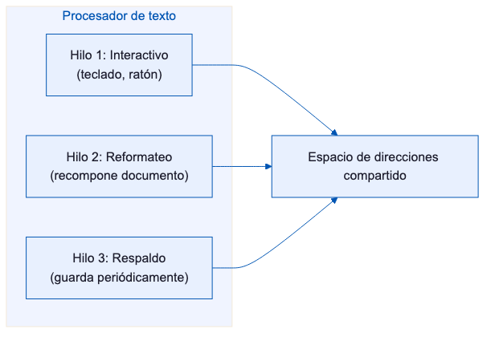
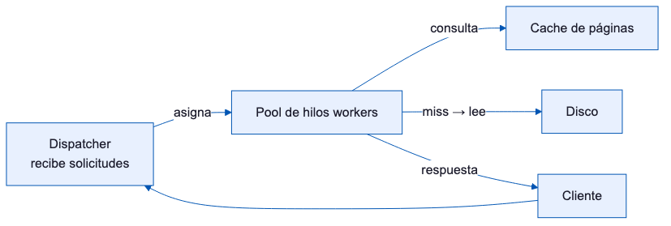
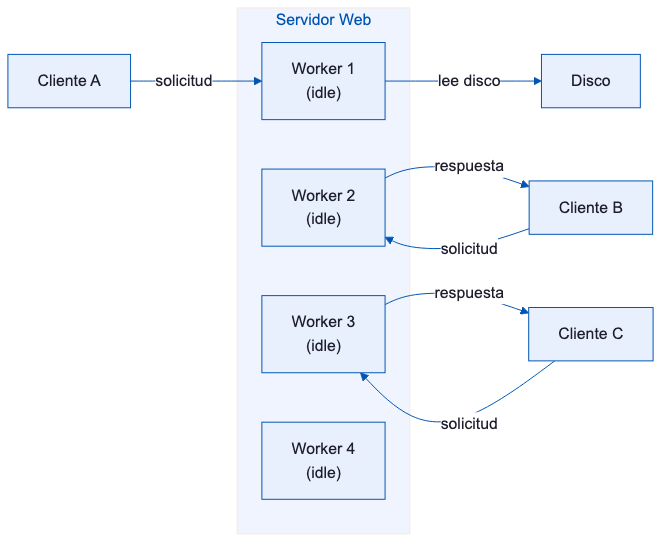
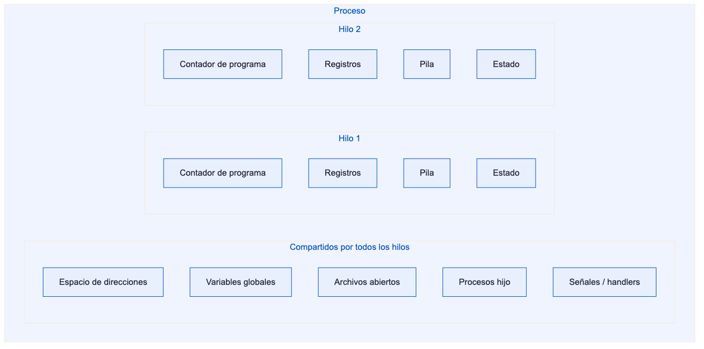
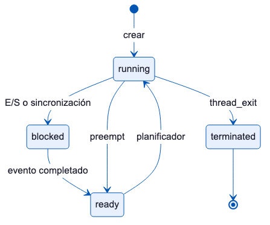
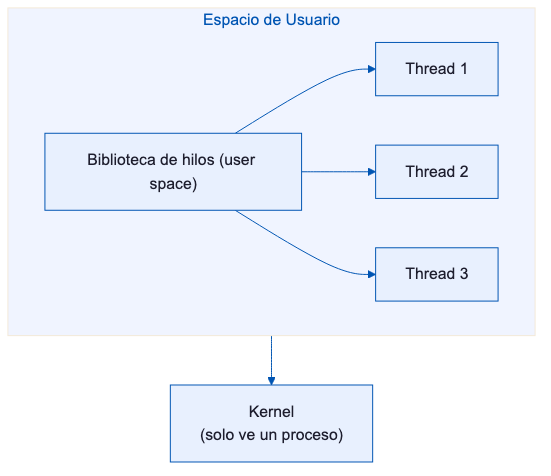
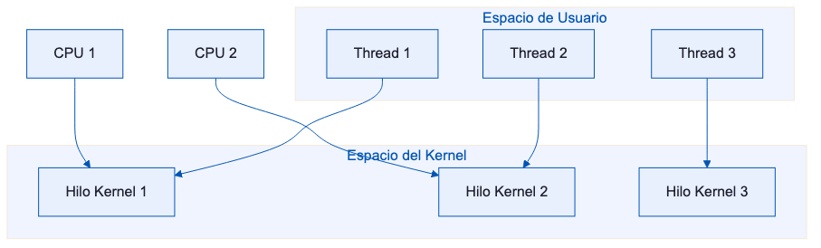
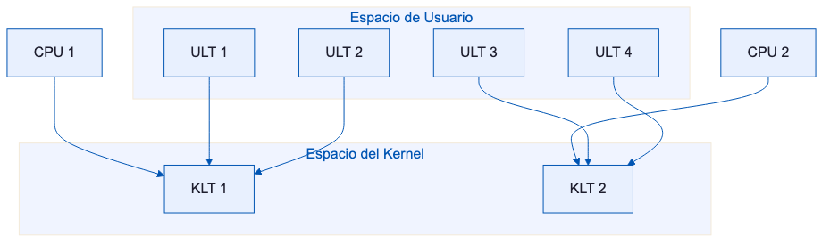
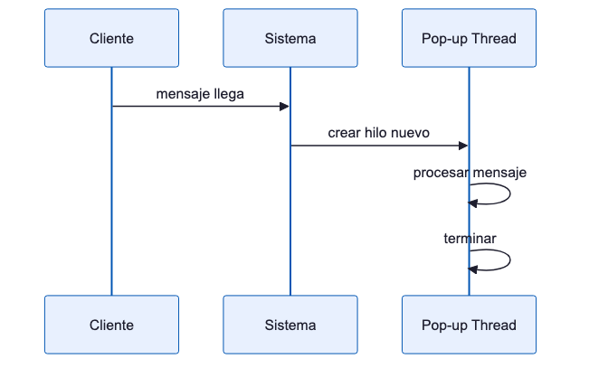
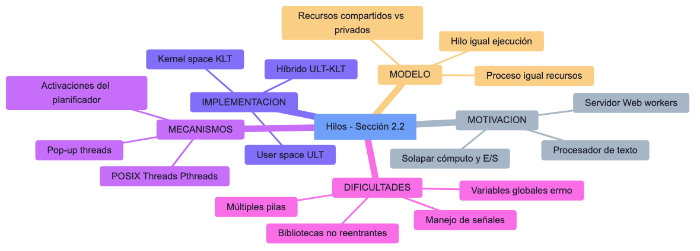

<!-- _class: titulo -->

# Capítulo 2: Hilos
## Sección 2.2 (Threads)
### Modern Operating Systems
#### Andrew S. Tanenbaum · Herbert Bos

---

# 2.2 Hilos: idea central

En sistemas tradicionales, un proceso tiene:
- su propio espacio de direcciones
- **un solo hilo de control**

La sección 2.2 introduce múltiples hilos de control dentro del mismo espacio de direcciones, ejecutándose en cuasi-paralelo.

> Los hilos permiten mantener ejecución secuencial por actividad, pero compartiendo memoria y datos del proceso.

<!--
**Contexto histórico:** en los sistemas UNIX clásicos cada proceso era monohilo. Para lograr concurrencia había que usar `fork()`, que duplica todo el espacio de memoria —muy costoso—. Los hilos resuelven esto al compartir el espacio de direcciones del proceso.

**Cuasi-paralelismo vs paralelismo real:** en un CPU de un núcleo los hilos alternan en la CPU (tiempo compartido); con multinúcleo pueden ejecutarse verdaderamente en paralelo.

**Pregunta de reflexión:** ¿qué diferencia hay entre tener 4 procesos y tener 1 proceso con 4 hilos?
-->

---

# 2.2.1 ¿Por qué usar hilos?

Razones principales:
- En muchas aplicaciones ocurren **múltiples actividades simultáneas**.
- Los hilos son más ligeros que los procesos: creación/destrucción mucho más rápida.
- Permiten superponer **cómputo + E/S** cuando una actividad se bloquea.
- En sistemas con múltiples CPU habilitan paralelismo real.

Limitación:
- Si todas las actividades son puramente CPU-bound, los hilos no aportan mejora de rendimiento por sí solos.

<!--
**Puntos clave:**
- El beneficio central en E/S es el **solapamiento**: mientras hilo A espera que el disco responda (puede tardar milisegundos), hilo B usa la CPU productivamente.
- Creación de hilo ≈ 10-100× más rápida que `fork()` porque no hay copia de memoria.
- La limitación CPU-bound es importante para el examen: si todos los hilos solo computan y no hacen E/S, el paralelismo real solo ocurre con múltiples núcleos.

**Ejemplo práctico:** un servidor web sin hilos que atiende 1000 req/s: con una sola petición lenta de disco todo el servidor se bloquea. Con hilos, solo ese hilo se bloquea.
-->

---

# Ejemplo 1: procesador de texto (Fig. 2-7)

### Modelo de tres hilos:



<!--
**Análisis del diagrama (Fig. 2-7):**
- **Hilo 1 (interactivo):** responde a teclado/ratón. Sin él, el usuario esperaría cada vez que el reformateador trabaja.
- **Hilo 2 (reformateo):** recalcula paginación en segundo plano mientras el usuario escribe.
- **Hilo 3 (respaldo):** guarda periódicamente sin detener los otros dos hilos.

**Sin hilos:** habría que usar una máquina de estados con interrupciones y callbacks, lo que hace el código muy difícil de mantener.
-->

---

# Procesador de texto: beneficios del modelo multihilo

- Mejor respuesta al usuario sin programación basada en interrupciones complejas.
- Compartir memoria del proceso permite operar sobre el mismo documento.

<!--
**El punto crítico es la memoria compartida:** los tres hilos acceden directamente a las mismas estructuras de datos del documento —sin IPC (pipes, sockets, shared memory explícita)—. Esto simplifica enormemente la comunicación pero obliga a usar sincronización (mutex, semáforos) para evitar condiciones de carrera.
-->

---

# Ejemplo 2: servidor Web multihilo (Fig. 2-8)

### Arquitectura:



<!--
**Patrón Dispatcher/Worker:** el dispatcher es un hilo ligero que solo recibe solicitudes y las asigna al pool; los workers hacen el trabajo real.

Este patrón es la base de Nginx, Apache MPM Worker, Java thread pools y Go routines.

**Ventaja clave:** si Worker 1 se bloquea esperando un disco lento, Worker 2 y 3 continúan atendiendo otras solicitudes sin interferencia.
-->

---

# Servidor Web multihilo: ventaja

- Mientras un worker espera disco, otros continúan procesando solicitudes.
- Se conserva un modelo de programación secuencial por hilo.

<!--
**Comparación directa con proceso monohilo:** si el servidor tuviese un solo hilo atendiendo solicitudes, mientras espera el disco **ningún** cliente puede ser atendido —el proceso entero está bloqueado en la syscall `read()`—.

Con hilos, la E/S de un hilo se solapa con el cómputo de otros. Este solapamiento es la razón principal de mejora de throughput en servidores web.
-->

---

# Servidor Web multihilo (Fig. 2-9)



<!--
**Pool precreado vs creación por demanda:** crear un hilo por cada solicitud introduciría latencia de creación y consumiría muchos recursos. El pool amortiza ese costo: los hilos se crean al arrancar el servidor y se reutilizan.

Cuando no hay workers libres, las solicitudes entran en cola. El tamaño del pool es un parámetro de configuración clave (ej. `MaxThreads` en Apache).
-->

---

# Tres modelos para construir un servidor (Fig. 2-10)

| Modelo | Características | Paralelismo | Simplicidad |
|---|---|---|---|
| **Hilos** | Paralelismo + llamadas bloqueantes | ✅ | ✅ |
| **Proceso monohilo** | Sin paralelismo + llamadas bloqueantes | ❌ | ✅ |
| **Máquina de estados finitos** | Paralelismo + llamadas no bloqueantes + interrupciones | ✅ | ❌ |

Conclusión:
- Hilos combinan **simplicidad** de llamadas bloqueantes con mejor **rendimiento** por solapamiento.

<!--
**Análisis de los tres modelos (Fig. 2-10):**
- **Monohilo:** el más simple, pero una llamada bloqueante detiene todo. Solo útil para cargas triviales.
- **Máquina de estados finitos (FSM):** usa `select()`/`epoll()` con E/S no bloqueante. Es el más eficiente en un solo núcleo pero muy difícil de programar (código como callbacks anidados — «callback hell»).
- **Hilos:** el mejor balance. El programador escribe código secuencial natural; el SO maneja la concurrencia.

**Node.js** usa el modelo FSM para el event loop; **Java EE** usa hilos; **Nginx** combina ambos.
-->

---

# 2.2.2 Modelo clásico de hilos

El modelo de proceso contiene dos conceptos:
1. **Agrupación de recursos** (espacio de direcciones, archivos, señales, etc.).
2. **Ejecución** (hilo con PC, registros y pila).

Separación conceptual:
- **Proceso** = unidad de recursos.
- **Hilo** = unidad planificable en CPU.

Múltiples hilos dentro de un proceso comparten recursos, pero cada hilo mantiene su contexto de ejecución privado.

<!--
**Separación conceptual fundamental:**
- **Proceso = contenedor de recursos** (espacio de direcciones, archivos abiertos, señales, procesos hijo). Garantiza aislamiento entre aplicaciones.
- **Hilo = unidad de ejecución** (PC, registros, pila). La CPU planifica hilos, no procesos.

Esta distinción aparece en Windows (PROCESS_OBJECT vs THREAD_OBJECT), POSIX pthreads, y en el modelo de 4 niveles de Solaris.

**Nota:** Linux difumina esta línea: proceso e hilo son ambos `task_struct` (ver Stallings cap. 4).
-->

---

# Recursos por proceso vs por hilo (Fig. 2-12)



<!--
**Para el examen — memorizar qué es compartido y qué es privado:**

| Compartido (proceso) | Privado (hilo) |
|---|---|
| Espacio de direcciones | Contador de programa (PC) |
| Variables globales | Registros del CPU |
| Archivos abiertos | Pila de ejecución |
| Procesos hijo | Estado del hilo |
| Señales y handlers | Variables locales |

**¿Por qué la pila es privada?** Cada hilo tiene su propia secuencia de llamadas a funciones con sus propias variables locales y direcciones de retorno.
-->

---

# Estados clásicos de un hilo



<!--
**Transiciones importantes:**
- `running → blocked`: el hilo hace una llamada bloqueante (E/S, `wait()`, adquirir mutex ocupado).
- `blocked → ready`: el evento que esperaba ocurrió (datos disponibles, mutex liberado).
- `running → ready`: el planificador expulsa al hilo por quantum agotado (preemption).
- `thread_exit → terminated`: fin del hilo; sus recursos no se liberan hasta que otro hilo haga `join()`.

**Diferencia con procesos:** los estados son análogos, pero las transiciones en hilos de kernel son más frecuentes y rápidas.
-->

---

# Operaciones básicas de hilos

- `thread_create` — crear hilo
- `thread_exit` — terminar hilo
- `thread_join` — esperar a otro hilo
- `thread_yield` — ceder CPU voluntariamente

<!--
**Mapeo con la API POSIX pthreads:**
```c
pthread_create(&tid, NULL, fn, arg);  // thread_create
pthread_exit(retval);                  // thread_exit
pthread_join(tid, &retval);            // thread_join
pthread_yield();                       // thread_yield (no estándar en todos los SO)
```

**`thread_yield`** raramente se usa directamente en producción; el planificador del kernel maneja la cesión de CPU automáticamente. Se usa principalmente en implementaciones de hilos en espacio de usuario donde no hay planificador con preemption.
-->

---

# Complicaciones del modelo multihilo

Problemas que aparecen al usar hilos:
- **Interacción con `fork`**
  - ¿Cuándo se duplican todos los hilos?
  - ¿Solo se duplica el hilo que invocó `fork`?
- **Acceso concurrente a estructuras compartidas**
  - Requiere sincronización (mutex, semáforos).
- **Cierre de recursos usados por otro hilo**
  - Un hilo cierra un archivo que otro hilo está usando.
  - Requiere conteo de referencias o cuidado en diseño.

<!--
**Problema del fork en contexto multihilo (POSIX):**
POSIX define que `fork()` en un proceso multihilo crea un hijo con **un solo hilo** (el que llamó a `fork()`). Los mutexes bloqueados por otros hilos en el padre quedan bloqueados en el hijo sin nadie que los libere → deadlock potencial.

**Solución:** usar `exec()` inmediatamente después de `fork()`, o registrar handlers con `pthread_atfork()`.

**Señales y multihilo:** `SIGINT` puede ser recibida por cualquier hilo. Para control preciso se usa `pthread_sigmask()` y `sigwait()`.
-->

---

# 2.2.3 POSIX Threads (Pthreads)

IEEE 1003.1c define un estándar portable de hilos.

Llamadas destacadas:

| Función | Descripción |
|---|---|
| `pthread_create` | Crea un nuevo hilo |
| `pthread_exit` | Termina el hilo actual |
| `pthread_join` | Espera a que otro hilo termine |
| `pthread_yield` | Cede voluntariamente la CPU |
| `pthread_attr_init` | Inicializa atributos de hilo |
| `pthread_attr_destroy` | Libera atributos de hilo |

La sección muestra un ejemplo de programa que crea 10 hilos, cada uno imprime su identificador y termina.

<!--
**Historia de Pthreads:** antes del estándar IEEE 1003.1c (1995), cada SO tenía su propia API de hilos incompatible (Solaris threads, DCE threads, POSIX draft, etc.). Pthreads permitió escribir código portable entre Linux, macOS, Solaris y otros UNIX.

**Implementación en Linux:** Pthreads usa internamente `clone()` con los flags `CLONE_VM | CLONE_FILES | CLONE_THREAD | CLONE_SIGHAND`. La biblioteca NPTL (Native POSIX Thread Library) reemplazó a LinuxThreads en 2003 con una implementación 1:1 mucho más eficiente.
-->

---

# 2.2.4 Hilos en espacio de usuario (Fig. 2-16a)



<!--
**La biblioteca de hilos** (como GNU Portable Threads) se ejecuta completamente en modo usuario. El kernel solo ve un proceso monohilo.

**Cómo funciona el cambio de contexto en user space:**
1. La biblioteca guarda los registros del hilo actual en su TCB (Thread Control Block)
2. Carga los registros del siguiente hilo desde su TCB
3. Salta al PC guardado del siguiente hilo
Todo esto sin una sola llamada al sistema → muy rápido.
-->

---

# Ventajas: hilos en espacio de usuario

- No requiere soporte de hilos en el kernel.
- Cambio de hilo muy rápido (sin llamada al sistema).
- Planificación personalizable por proceso.

<!--
**Velocidad del cambio de contexto en user space:**
Un cambio de contexto de kernel requiere:
1. Trap (cambio a modo kernel) — ~100 ciclos
2. Guardar/restaurar contexto de kernel
3. Retorno a modo usuario

Un cambio de contexto en user space: solo guardar/restaurar registros (~10-20 ciclos).

**En hardware moderno** con vDSO (Linux) y syscalls optimizadas, la diferencia es menos dramática que en los años 90, pero sigue siendo relevante para aplicaciones con millones de cambios de contexto por segundo.
-->

---

# Problemas de hilos en espacio de usuario

Problemas:
- **Llamadas bloqueantes** pueden bloquear todo el proceso.
  - Ejemplo: `read()` bloquea el proceso, no solo el hilo.
- **Fallos de página** bloquean el proceso completo.
- **Sin interrupción de reloj por hilo**, puede faltar equidad.
  - Un hilo CPU-bound monopoliza el proceso.

Solución: **jacketing** — envolver llamadas bloqueantes en wrappers que verifican si bloquearían y cambian de hilo en su lugar.

<!--
**Técnica de jacketing en detalle:**
En lugar de llamar directamente a `read()` (que bloquea el proceso entero), se llama a una versión envuelta:
```c
// Versión 'jacket' de read():
ssize_t read_jacket(int fd, void *buf, size_t n) {
    while (!data_available(fd))  // select() no bloqueante
        thread_yield();           // ceder CPU a otro hilo
    return real_read(fd, buf, n);
}
```

**El problema:** hay que envolver TODAS las llamadas bloqueantes del sistema. Esto es laborioso y propenso a errores. Los hilos de kernel eliminan esta necesidad.
-->

---

# 2.2.5 Hilos en el kernel (Fig. 2-16b)



<!--
**Diferencia clave con user space:** cada hilo tiene su propio hilo de kernel. Si Hilo A del proceso hace `read()` y se bloquea, el kernel puede planificar Hilo B del mismo proceso en otra CPU —o en la misma CPU después del bloqueo—.

**Paralelismo real en multinúcleo:** dos hilos del mismo proceso pueden ejecutarse simultáneamente en CPU1 y CPU2. Esto es imposible con hilos en user space (el kernel solo ve un proceso en una CPU a la vez).
-->

---

# Hilos en el kernel: ventajas y desventaja

## Ventajas:
- Si un hilo bloquea, el kernel puede ejecutar otro hilo listo.
- No requiere wrappers para evitar bloqueos de llamadas.
- Manejo más natural de page faults por hilo.

## Desventaja:
- Operaciones de hilo implican llamadas al sistema (más costo).

<!--
**Costo concreto de las syscalls para operaciones de hilo:**
- Crear un hilo de kernel: ~microsegundo
- Crear un hilo de user space: ~nanosegundos
- Bloquear en mutex de kernel: syscall `futex()` — tiene costo si hay contención

**Por eso se usan thread pools:** pagar el costo de creación una sola vez, reutilizar los hilos para muchas tareas.

**Pregunta de examen:** ¿qué ventaja tienen los hilos de kernel sobre los de user space? → Paralelismo real en multinúcleo y no bloquean el proceso entero en llamadas al sistema.
-->

---

# 2.2.6 Implementaciones híbridas (Fig. 2-17)



<!--
**Modelo M:N (muchos-a-muchos):** N hilos de usuario se mapean a M hilos de kernel (M ≤ N). Permite tener miles de hilos de usuario ligeros, con solo M hilos de kernel activos.

**NPTL en Linux eligió 1:1:** cada pthread corresponde exactamente a un hilo de kernel. Razón: las syscalls de Linux son muy eficientes, y la complejidad del M:N superó sus beneficios.

**Solaris 9+ también migró a 1:1** por la misma razón. El modelo híbrido persiste en Go (goroutines sobre hilos de OS) y en Erlang.
-->

---

# Implementaciones híbridas: análisis

## Idea:
- Combinar flexibilidad y bajo costo en user space con capacidad de bloqueo/planificación en kernel.

## Resultado:
- El kernel planifica hilos de kernel.
- El runtime de usuario planifica hilos de usuario sobre ellos.

<!--
**¿Por qué el M:N es difícil de implementar?**
El planificador de usuario necesita coordinarse con el planificador del kernel para evitar que ambos tomen decisiones conflictivas. Por ejemplo: si el kernel bloquea un hilo de kernel que el runtime de usuario cree que está libre, el runtime puede asignarle más trabajo que nunca se ejecutará.

**Conclusión práctica:** los SO modernos (Linux, Windows, macOS) usan 1:1 porque las syscalls son baratas y la simplicidad supera al rendimiento teórico del M:N.
-->

---

# 2.2.7 Activaciones del planificador

## Objetivo:
- Aproximar ventajas de hilos de kernel con rendimiento/flexibilidad de user space.

## Mecanismo clave:
- El kernel asigna **procesadores virtuales** por proceso.
- Cuando un hilo bloquea o se desbloquea, el kernel notifica al runtime mediante **upcalls**.
- El runtime decide qué hilo ejecutar después.

## Punto crítico:
- `upcall` rompe el patrón clásico estratificado (capa inferior invocando superior).

<!--
**El mecanismo de upcall rompe el principio de capas:**
Normalmente en un SO las capas inferiores nunca llaman a las superiores (el kernel no llama a código de usuario). Con activaciones del planificador, el kernel usa upcalls para notificar al runtime cuando un hilo se bloquea o se desbloquea.

**Flujo de una upcall:**
1. Hilo A llama a `read()` y el kernel lo bloquea
2. El kernel hace upcall al runtime: «el hilo A se bloqueó, te asigno un VP extra»
3. El runtime ejecuta el hilo B en ese VP
4. Cuando A se desbloquea, otra upcall notifica al runtime

**Implementación real:** `scheduler activations` de Anderson et al. (1991), base conceptual de los goroutines de Go.
-->

---

# 2.2.8 Pop-up threads

## Concepto:
Al llegar un mensaje, el sistema crea un hilo nuevo para atenderlo inmediatamente.



<!--
**Casos de uso reales de pop-up threads:**
- Servidores de red que crean un hilo por conexión entrante
- Sistemas de mensajería asíncrona (MQ, Kafka consumers)
- Manejadores de eventos en sistemas embebidos

**Diferencia clave con un pool de hilos:**
| Pop-up thread | Pool de hilos |
|---|---|
| Se crea al llegar el mensaje | Hilos esperan en idle |
| Latencia = costo de creación | Latencia mínima |
| Menor uso de memoria en idle | Mayor uso de memoria en idle |
| Riesgo de crear demasiados | Límite natural de hilos |
-->

---

# Pop-up threads: ventajas y consideraciones

## Ventaja principal:
- Muy baja latencia entre llegada del mensaje e inicio de procesamiento.

## Consideraciones:
- Puede ejecutarse en contexto de kernel (más rápido, acceso directo).
- Un bug en kernel thread es más peligroso que en user thread.

<!--
**Kernel thread vs user thread para pop-up:**
- **En kernel:** acceso directo a estructuras del kernel, más rápido, pero un bug puede corromper el estado del kernel (panic). Usado en controladores de dispositivos.
- **En user space:** más seguro, aislado, pero requiere cambio de contexto kernel↔usuario. Usado en la mayoría de aplicaciones.

**Regla práctica:** solo se usan pop-up threads en kernel para rutas de código extremadamente críticas en rendimiento y muy bien probadas.
-->

---

# 2.2.9 Convertir código monohilo a multihilo

## Dificultades destacadas:

| Problema | Ejemplo | Solución |
|---|---|---|
| Variables globales | `errno` (variable global de error) | Hacer `errno` privada por hilo |
| Bibliotecas no reentrantes | `strtok`, `malloc` no thread-safe | Wrappers/jackets para serializar |
| Señales | ¿Qué hilo recibe `SIGINT`? | Señales por proceso o hilo específico |
| Gestión de pilas | Múltiples pilas por proceso | Stack guard pages, crecimiento automático |

<!--
**El problema de `errno` ilustra perfectamente el desafío:**
En C estándar, `errno` es una variable global. Si Hilo 1 llama a `open()` y falla, y antes de leer `errno` el planificador cede a Hilo 2 que también falla en una syscall, Hilo 2 sobreescribe `errno`. Cuando Hilo 1 reanuda, lee el `errno` incorrecto.

**Solución moderna:** en glibc `errno` es una macro que expande a `(*__errno_location())` — una función que retorna un puntero a la copia TLS de `errno`.

**`strtok` no reentrante:** mantiene un puntero interno estático. Alternativa: `strtok_r()` que recibe el contexto como argumento.
-->

---

# Técnicas para conversión a multihilo

- Variables globales privadas por hilo (TLS — Thread-Local Storage).
- Wrappers/jackets para serializar secciones no seguras.

<!--
**TLS en diferentes lenguajes/plataformas:**
- **C/GCC:** `__thread int var;` o `_Thread_local int var;` (C11)
- **C++11:** `thread_local int var;`
- **Java:** `ThreadLocal<T> var = new ThreadLocal<>();`
- **Python:** `import threading; local = threading.local()`
- **Go:** no tiene TLS directo — goroutines evitan variables globales mediante closures
- **Rust:** el sistema de tipos previene data races en tiempo de compilación (`Send` y `Sync` traits)

**Wrappers para serialización** (jacketing): envuelven funciones no reentrantes con un mutex para garantizar acceso exclusivo.
-->

---

# Resumen: Modelos de implementación de hilos

| Característica | User space | Kernel | Híbrido |
|---|---|---|---|
| **Cambio de hilo** | Rápido (no syscall) | Lento (syscall) | Medio |
| **Bloqueo de llamada** | Bloquea proceso | Solo bloquea hilo | Depende |
| **Paralelismo en MP** | No | Sí | Sí (si hay KLTs >= CPUs) |
| **Flexibilidad** | Alta | Baja | Media |
| **Ejemplo** | GNU Portable Threads | Windows/Linux nativo | Solaris, NPTL |

<!--
**Para el examen — tabla de comparación:**

| Aspecto | User Space | Kernel | Híbrido |
|---|---|---|---|
| Cambio de contexto | Sin syscall (rápido) | Con syscall (lento) | Medio |
| Bloqueo E/S | Bloquea TODO el proceso | Solo bloquea ese hilo | Depende |
| Paralelismo (multicore) | NO | SÍ | SÍ (si M KLTs ≥ CPUs) |
| Flexibilidad planif. | Alta (programa define) | Baja (kernel decide) | Media |
| Ejemplo real | GNU Portable Threads | Linux NPTL, Windows | Go, Erlang |

**Tendencia actual:** la mayoría de SO modernos usa 1:1 (kernel threads) porque el hardware es rápido y la simplicidad supera los beneficios teóricos del M:N.
-->

---

# Resumen: conceptos clave de la sección 2.2



<!--
**Síntesis del capítulo 2.2:**
Los hilos son la solución del SO al problema de la concurrencia dentro de un proceso. Los temas están interconectados:
- La **motivación** (procesador de texto, servidor web) justifica la necesidad
- El **modelo clásico** define qué se comparte y qué es privado
- Las **implementaciones** (user/kernel/híbrido) son trade-offs del mismo problema
- Las **complicaciones** (fork, señales, TLS) son consecuencias del modelo compartido

**Conexión con Stallings (osid.md):** los conceptos aquí vistos son los fundamentos de las implementaciones reales en Windows (cap. 4.4), Solaris (4.5), Linux (4.6) y Android (4.7).
-->

---

<!-- _class: titulo -->

# Fin de la sección 2.2
## Hilos = concurrencia con memoria compartida

- Simplifican varios modelos interactivos y de servidor.
- Exigen diseño cuidadoso de sincronización y recursos compartidos.
- La implementación (usuario, kernel o híbrida) define el compromiso entre rendimiento y complejidad.

> *«Un hilo es una unidad de ejecución que comparte el espacio de direcciones del proceso con otros hilos, pero tiene su propio contador de programa, registros y pila.»*
> — Tanenbaum & Bos, Modern Operating Systems

