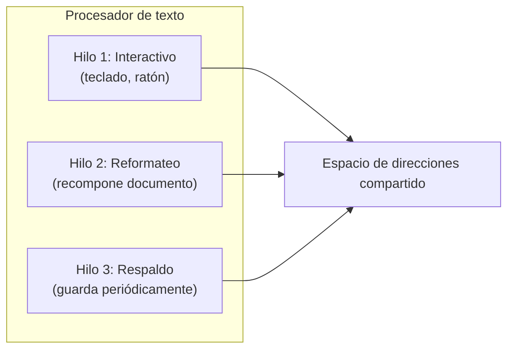
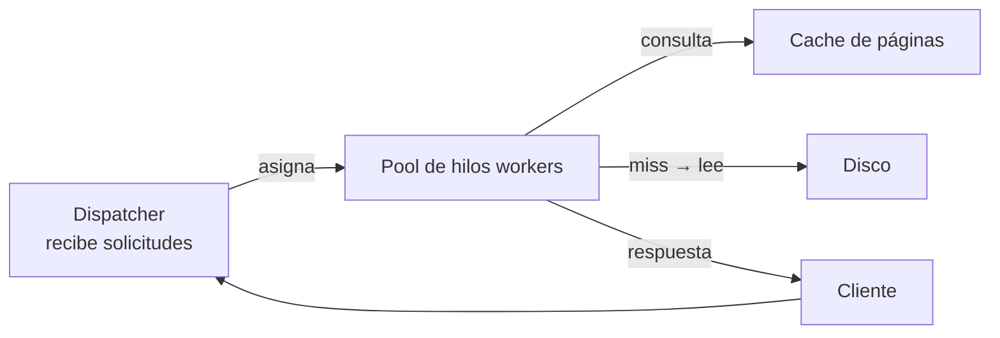
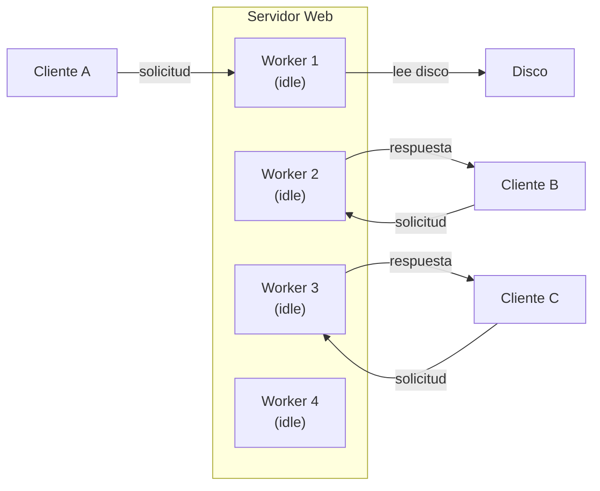
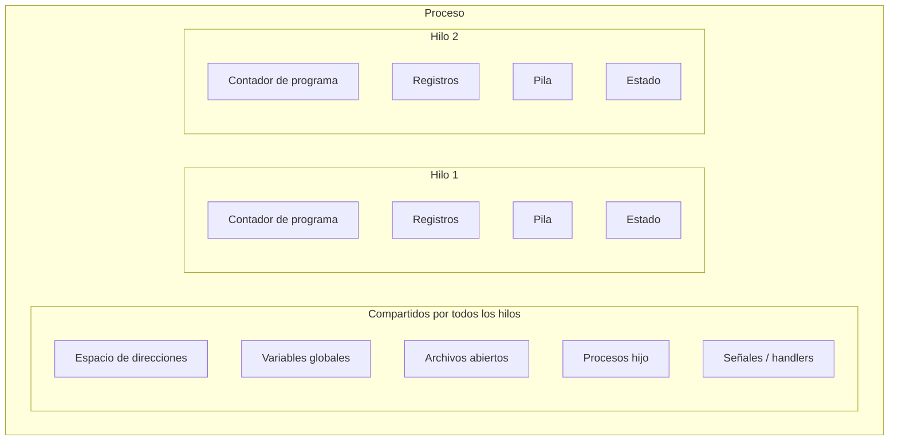
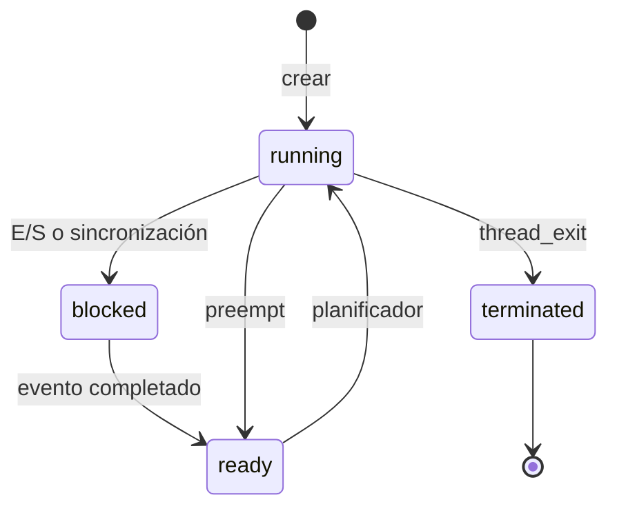
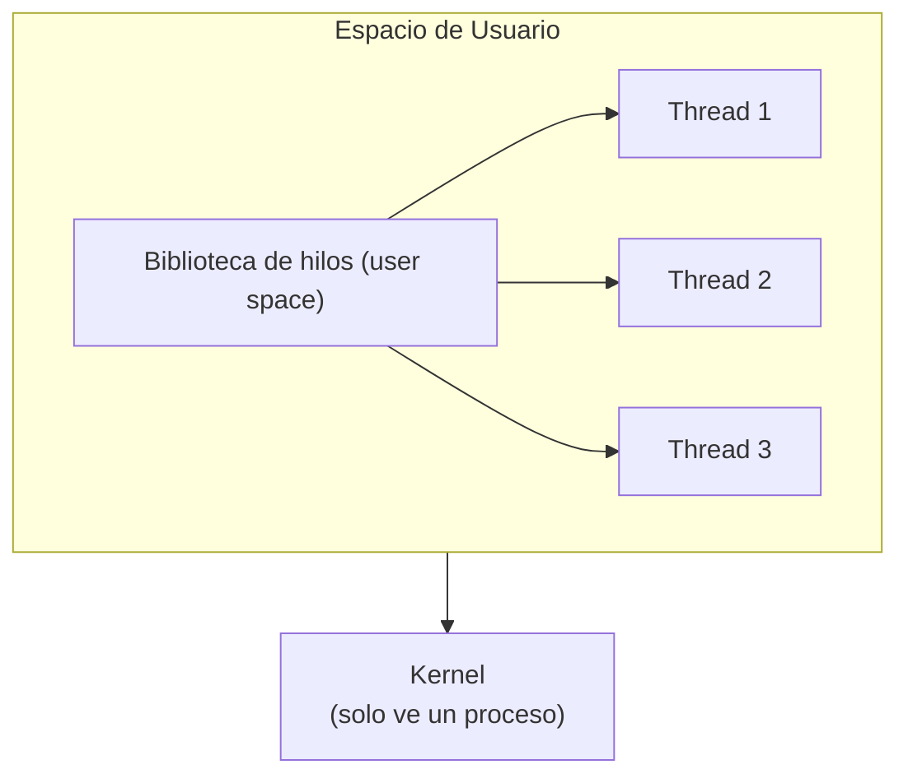
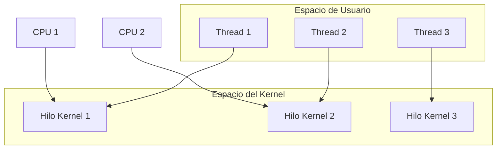
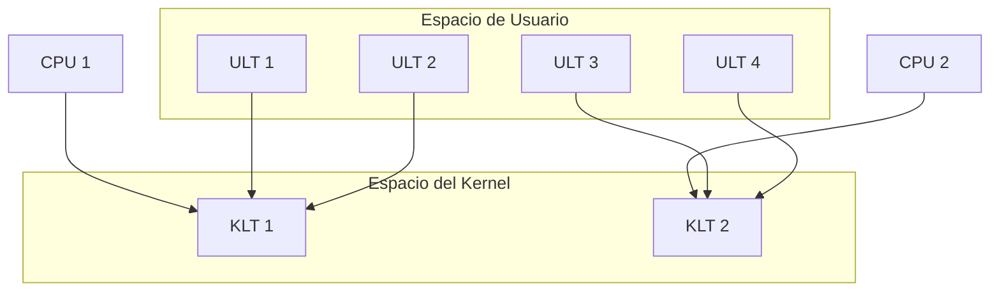
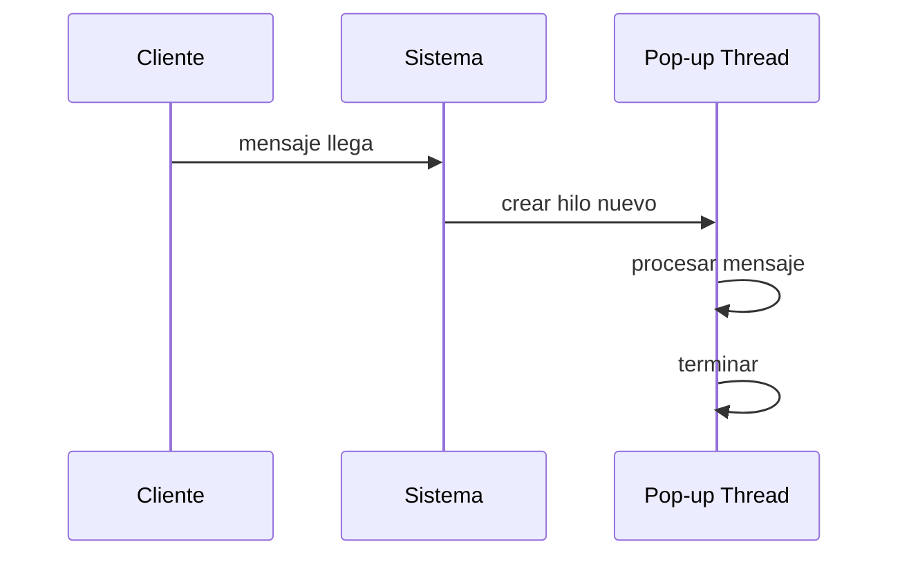

<!-- _class: titulo -->

# Capítulo 2: Hilos
## Sección 2.2 (Threads)
### Modern Operating Systems
#### Andrew S. Tanenbaum · Herbert Bos

---

# 2.2 Hilos: idea central

En sistemas tradicionales, un proceso tiene:
- su propio espacio de direcciones
- **un solo hilo de control**

La sección 2.2 introduce múltiples hilos de control dentro del mismo espacio de direcciones, ejecutándose en cuasi-paralelo.

> Los hilos permiten mantener ejecución secuencial por actividad, pero compartiendo memoria y datos del proceso.

---

# 2.2.1 ¿Por qué usar hilos?

Razones principales:
- En muchas aplicaciones ocurren **múltiples actividades simultáneas**.
- Los hilos son más ligeros que los procesos: creación/destrucción mucho más rápida.
- Permiten superponer **cómputo + E/S** cuando una actividad se bloquea.
- En sistemas con múltiples CPU habilitan paralelismo real.

Limitación:
- Si todas las actividades son puramente CPU-bound, los hilos no aportan mejora de rendimiento por sí solos.

---

# Ejemplo 1: procesador de texto (Fig. 2-7)

### Modelo de tres hilos:



### Beneficio:
- Mejor respuesta al usuario sin programación basada en interrupciones complejas.
- Compartir memoria del proceso permite operar sobre el mismo documento.

---

# Ejemplo 2: servidor Web multihilo (Fig. 2-8)

### Arquitectura:



Ventaja:
- Mientras un worker espera disco, otros continúan procesando solicitudes.
- Se conserva un modelo de programación secuencial por hilo.

---

# Servidor Web multihilo (Fig. 2-9)



---

# Tres modelos para construir un servidor (Fig. 2-10)

| Modelo | Características | Paralelismo | Simplicidad |
|---|---|---|---|
| **Hilos** | Paralelismo + llamadas bloqueantes | ✅ | ✅ |
| **Proceso monohilo** | Sin paralelismo + llamadas bloqueantes | ❌ | ✅ |
| **Máquina de estados finitos** | Paralelismo + llamadas no bloqueantes + interrupciones | ✅ | ❌ |

Conclusión:
- Hilos combinan **simplicidad** de llamadas bloqueantes con mejor **rendimiento** por solapamiento.

---

# 2.2.2 Modelo clásico de hilos

El modelo de proceso contiene dos conceptos:
1. **Agrupación de recursos** (espacio de direcciones, archivos, señales, etc.).
2. **Ejecución** (hilo con PC, registros y pila).

Separación conceptual:
- **Proceso** = unidad de recursos.
- **Hilo** = unidad planificable en CPU.

Múltiples hilos dentro de un proceso comparten recursos, pero cada hilo mantiene su contexto de ejecución privado.

---

# Recursos por proceso vs por hilo (Fig. 2-12)



---

# Estado de hilos y operaciones básicas

## Estados clásicos:



## Operaciones típicas:
- `thread_create` — crear hilo
- `thread_exit` — terminar hilo
- `thread_join` — esperar a otro hilo
- `thread_yield` — ceder CPU voluntariamente

---

# Complicaciones del modelo multihilo

Problemas que aparecen al usar hilos:
- **Interacción con `fork`**
  - ¿Cuándo se duplican todos los hilos?
  - ¿Solo se duplica el hilo que invocó `fork`?
- **Acceso concurrente a estructuras compartidas**
  - Requiere sincronización (mutex, semáforos).
- **Cierre de recursos usados por otro hilo**
  - Un hilo cierra un archivo que otro hilo está usando.
  - Requiere conteo de referencias o cuidado en diseño.

---

# 2.2.3 POSIX Threads (Pthreads)

IEEE 1003.1c define un estándar portable de hilos.

Llamadas destacadas:

| Función | Descripción |
|---|---|
| `pthread_create` | Crea un nuevo hilo |
| `pthread_exit` | Termina el hilo actual |
| `pthread_join` | Espera a que otro hilo termine |
| `pthread_yield` | Cede voluntariamente la CPU |
| `pthread_attr_init` | Inicializa atributos de hilo |
| `pthread_attr_destroy` | Libera atributos de hilo |

La sección muestra un ejemplo de programa que crea 10 hilos, cada uno imprime su identificador y termina.

---

# 2.2.4 Hilos en espacio de usuario (Fig. 2-16a)



## Ventajas:
- No requiere soporte de hilos en el kernel.
- Cambio de hilo muy rápido (sin llamada al sistema).
- Planificación personalizable por proceso.

---

# Problemas de hilos en espacio de usuario

Problemas:
- **Llamadas bloqueantes** pueden bloquear todo el proceso.
  - Ejemplo: `read()` bloquea el proceso, no solo el hilo.
- **Fallos de página** bloquean el proceso completo.
- **Sin interrupción de reloj por hilo**, puede faltar equidad.
  - Un hilo CPU-bound monopoliza el proceso.

Solución: **jacketing** — envolver llamadas bloqueantes en wrappers que verifican si bloquearían y cambian de hilo en su lugar.

---

# 2.2.5 Hilos en el kernel (Fig. 2-16b)



## Ventajas:
- Si un hilo bloquea, el kernel puede ejecutar otro hilo listo.
- No requiere wrappers para evitar bloqueos de llamadas.
- Manejo más natural de page faults por hilo.

## Desventaja:
- Operaciones de hilo implican llamadas al sistema (más costo).

---

# 2.2.6 Implementaciones híbridas (Fig. 2-17)



## Idea:
- Combinar flexibilidad y bajo costo en user space con capacidad de bloqueo/planificación en kernel.

## Resultado:
- El kernel planifica hilos de kernel.
- El runtime de usuario planifica hilos de usuario sobre ellos.

---

# 2.2.7 Activaciones del planificador

## Objetivo:
- Aproximar ventajas de hilos de kernel con rendimiento/flexibilidad de user space.

## Mecanismo clave:
- El kernel asigna **procesadores virtuales** por proceso.
- Cuando un hilo bloquea o se desbloquea, el kernel notifica al runtime mediante **upcalls**.
- El runtime decide qué hilo ejecutar después.

## Punto crítico:
- `upcall` rompe el patrón clásico estratificado (capa inferior invocando superior).

---

# 2.2.8 Pop-up threads

## Concepto:
Al llegar un mensaje, el sistema crea un hilo nuevo para atenderlo inmediatamente.



## Ventaja principal:
- Muy baja latencia entre llegada del mensaje e inicio de procesamiento.

## Consideraciones:
- Puede ejecutarse en contexto de kernel (más rápido, acceso directo).
- Un bug en kernel thread es más peligroso que en user thread.

---

# 2.2.9 Convertir código monohilo a multihilo

## Dificultades destacadas:

| Problema | Ejemplo | Solución |
|---|---|---|
| Variables globales | `errno` (variable global de error) | Hacer `errno` privada por hilo |
| Bibliotecas no reentrantes | `strtok`, `malloc` no thread-safe | Wrappers/jackets para serializar |
| Señales | ¿Qué hilo recibe `SIGINT`? | Señales por proceso o hilo específico |
| Gestión de pilas | Múltiples pilas por proceso | Stack guard pages, crecimiento automático |

## Técnicas:
- Variables globales privadas por hilo (TLS — Thread-Local Storage).
- Wrappers/jackets para serializar secciones no seguras.

---

# Resumen: Modelos de implementación de hilos

| Característica | User space | Kernel | Híbrido |
|---|---|---|---|
| **Cambio de hilo** | Rápido (no syscall) | Lento (syscall) | Medio |
| **Bloqueo de llamada** | Bloquea proceso | Solo bloquea hilo | Depende |
| **Paralelismo en MP** | No | Sí | Sí (si hay KLTs >= CPUs) |
| **Flexibilidad** | Alta | Baja | Media |
| **Ejemplo** | GNU Portable Threads | Windows/Linux nativo | Solaris, NPTL |

---

# Resumen: conceptos clave de la sección 2.2

```mermaid
mindmap
    root(Hilos - Sección 2.2)
        MOTIVACION
            "Procesador de texto (3 hilos)"
            "Servidor Web (pool de workers)"
            "Solapar cómputo y E/S"
        MODELO
            "Proceso = recursos"
            "Hilo = ejecución"
            "Recursos compartidos vs privados"
        IMPLEMENTACION
            "User space (ULT)"
            "Kernel space (KLT)"
            "Híbrido (ULT sobre KLT)"
        MECANISMOS
            "POSIX Threads (Pthreads)"
            "Activaciones de planificador"
            "Pop-up threads"
        DIFICULTADES
            "Variables globales (errno)"
            "Bibliotecas no reentrantes"
            "Manejo de señales"
            "Múltiples pilas"
```

---

<!-- _class: titulo -->

# Fin de la sección 2.2
## Hilos = concurrencia con memoria compartida

- Simplifican varios modelos interactivos y de servidor.
- Exigen diseño cuidadoso de sincronización y recursos compartidos.
- La implementación (usuario, kernel o híbrida) define el compromiso entre rendimiento y complejidad.

> *«Un hilo es una unidad de ejecución que comparte el espacio de direcciones del proceso con otros hilos, pero tiene su propio contador de programa, registros y pila.»*
> — Tanenbaum & Bos, Modern Operating Systems

<script type="module">
import mermaid from 'https://cdn.jsdelivr.net/npm/mermaid@10/dist/mermaid.esm.min.mjs';
mermaid.initialize({ startOnLoad: false, theme: 'base' });
document.querySelectorAll('pre[is="marp-pre"] code.language-mermaid').forEach(async el => {
  try {
    const { svg } = await mermaid.render('mmd' + Math.random().toString(36).slice(2), el.textContent.trim());
    const div = document.createElement('div');
    div.style.cssText = 'width:100%;text-align:center';
    div.innerHTML = svg;
    el.closest('pre').replaceWith(div);
  } catch(e) { console.warn('Mermaid render error:', e); }
});
</script>
