<!-- _class: titulo -->

# Capítulo 4: Hilos
## Secciones 4.3 – 4.10
### Sistemas Operativos: Fundamentos y Diseño
#### William Stallings, 9.ª Edición

---

# 4.3 Multinúcleo y Multihilo

**Pregunta clave:** ¿Qué tan bien puede el software aprovechar múltiples núcleos?

### Ley de Amdahl

$$\text{Aceleración} = \frac{1}{(1-f) + \frac{f}{N}}$$

- `f` = fracción del código paralelizable
- `N` = número de procesadores
- Con **10% de código serial** y **8 procesadores** → solo **4.7× de aceleración**

> Incluso pequeñas fracciones seriales limitan significativamente el rendimiento

<!--
**Ley de Amdahl — derivación intuitiva:**
Si f = fracción paralelizable, entonces (1-f) es la fracción serial que siempre tarda lo mismo.
Con N CPUs, la parte paralela se reduce N veces pero la serial no:
  Tiempo(N) = (1-f) + f/N  →  Aceleración = 1 / ((1-f) + f/N)

**Ejemplo concreto:** f=0.90, N=8
  Aceleración = 1 / (0.10 + 0.90/8) = 1 / 0.2125 ≈ **4.7×**
  Para lograr 8× necesitaríamos f = 1.0 (imposible en la práctica)

**Implicación crítica:** reducir la fracción serial es más impactante que agregar CPUs. Con f=0.99 y N=∞, la aceleración máxima es solo **100×**.
-->

---

# 4.3 Rendimiento Multinúcleo en la Práctica

### ¿Por qué no se alcanza la aceleración teórica?
- Sobrecarga de comunicación entre procesadores
- Costos de coherencia de caché
- Sobrecarga de distribución y planificación del trabajo

### Categorías de aplicaciones que escalan bien:
- **Apps nativas multihilo** (ej. Lotus Domino, Siebel CRM)
- **Apps multiproceso** (ej. Oracle DB, SAP, PeopleSoft)
- **Aplicaciones Java** (la JVM es inherentemente multihilo)
- **Apps multi-instancia** (ejecutan varias copias independientes)

<!--
**Coherencia de caché — el verdadero cuello de botella:**
Cuando CPU1 modifica un valor en su caché L1, el protocolo MESI debe invalidar las copias en caché de CPU2, CPU3... Cada invalidación es un mensaje de bus (IPI — Inter-Processor Interrupt). Con muchos núcleos compartiendo muchos datos, este overhead puede superar el beneficio del paralelismo.

**Las aplicaciones que escalan bien** tienen en común: **baja comunicación entre hilos**. Si cada hilo trabaja en su propio conjunto de datos (sin compartir estado), la fracción serial se acerca a cero y la ley de Amdahl favorece el escalado.
-->

---

# 4.3 Caso de Estudio: Motor Source de Valve

Valve reprogramó el motor Source para explotar chips multinúcleo (Intel/AMD).

### Tres estrategias de enhebrado evaluadas:

| Estrategia | Descripción | Resultado |
|---|---|---|
| **Gruesa** | Un sistema por procesador (IA, renderizado, física…) | ~1.2× en la práctica |
| **Granularidad fina** | Dividir bucles en micro-tareas paralelas | Complejo, tiempos variables |
| **Híbrida** ✅ | Mezcla de ambas; enfoque elegido | Mejor escalabilidad |

- Mezcla de sonido → fijada a un solo CPU (sin interacción, autocontenida)
- Renderizado → distribuido jerárquicamente entre hilos

<!--
**Lecciones del caso Valve (Motor Source):**
1. No existe una estrategia universal; hay que analizar cada módulo
2. Los sistemas predecibles y autocontenidos (audio) se fijan a un CPU → sin locks, sin overhead
3. Los sistemas con mucha independencia (renderizado de objetos) se paralelizan finamente
4. Los sistemas con dependencias fuertes (IA → física → renderizado) se manejan con granularidad gruesa

**Resultado medible:** el motor Source pasó de ~20 fps a ~60 fps en hardware quad-core de 2007 después de la refactorización multihilo.
-->

---

# 4.3 Enhebrado Híbrido – Módulo de Renderizado

Estructura jerárquica de hilos para el módulo de renderizado:

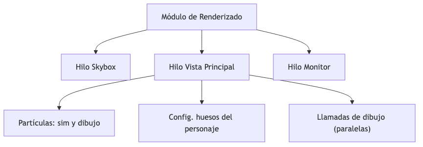

### Modelo de concurrencia clave:
- Bloqueo **un escritor / múltiples lectores**
- >95% del acceso a hilos es de **solo lectura** → alto paralelismo
- Solo ~5% requiere bloqueos de escritura

<!--
**Patrón lector/escritor con 95% lecturas:**
Con acceso 95% de lectura, usar `pthread_rwlock_t` (POSIX) o `std::shared_mutex` (C++17) permite que múltiples lectores accedan simultáneamente:
```c
pthread_rwlock_rdlock(&lock);  // múltiples lectores concurrentes
// leer datos...
pthread_rwlock_unlock(&lock);

pthread_rwlock_wrlock(&lock);  // escritor exclusivo
// modificar datos...
pthread_rwlock_unlock(&lock);
```
Con 95% lecturas, casi nunca hay contención real → alto paralelismo efectivo.
-->

---

# 4.4 Gestión de Procesos e Hilos en Windows

### Conceptos de ejecución principales:

| Objeto | Descripción |
|---|---|
| **Proceso** | Espacio de direcciones virtual + recursos + al menos un hilo |
| **Hilo** | Unidad planificable; comparte memoria del proceso |
| **Objeto de Trabajo** | Gestiona grupos de procesos como una unidad |
| **Grupo de Hilos** | Hilos trabajadores para callbacks asíncronos |
| **Fibra** | Planificada manualmente; sin apropiación |
| **UMS** | Planificación en modo usuario; cambio de hilo sin involucrar al núcleo |

<!--
**Jerarquía de abstracciones en Windows:**
- **Fibra:** planificada manualmente por la aplicación dentro de un hilo. El kernel no la conoce. Útil para migrar código cooperativo (como coroutines).
- **UMS (User-Mode Scheduling):** disponible en Windows 7+. Permite que la aplicación implemente su propio planificador, cambiando entre hilos UMS sin pasar por el kernel. Usado por runtimes de lenguajes (similar a goroutines de Go).
- **Grupo de Hilos (Thread Pool):** API de alto nivel. El SO gestiona la creación/destrucción de hilos automáticamente.
-->

---

# 4.4 Atributos del Objeto Proceso en Windows

| Atributo | Descripción |
|---|---|
| ID de Proceso | Identificador único |
| Descriptor de Seguridad | Información de control de acceso |
| Prioridad Base | Prioridad de ejecución base |
| Afinidad de Procesador | Procesadores permitidos |
| Límites de Cuota | Máx. memoria, paginación, tiempo de CPU |
| Estado de Salida | Razón de terminación |

**Hilo de Windows** añade: Contexto del Hilo, Prioridad Dinámica, Estado de Alerta, Contador de Suspensión, Token de Suplantación

<!--
**Descriptor de Seguridad:** contiene el SID del propietario, SID del grupo, DACL (permisos discrecionales) y SACL (auditoría). Permite que el modelo de seguridad de Windows sea uniforme: todo recurso (archivo, proceso, hilo, mutex) tiene un descriptor de seguridad.

**Afinidad de procesador:** fijar un hilo a una CPU específica evita la migración y maximiza la reutilización de caché L1/L2. Usado en aplicaciones de tiempo real, video juegos y procesamiento de señales digitales.

**Contador de suspensión:** cada llamada a `SuspendThread()` incrementa el contador; el hilo solo se reanuda cuando llega a 0 con `ResumeThread()`.
-->

---

# 4.4 Estados de Hilo en Windows

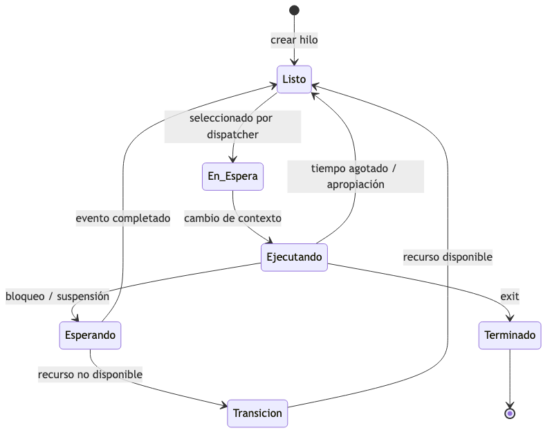

1. **Listo** – puede ser planificado
2. **En Espera** – seleccionado para ejecutar en un procesador
3. **Ejecutando** – en ejecución actualmente
4. **Esperando** – bloqueado por evento, sincronización o suspensión
5. **Transición** – listo para correr pero recursos no disponibles
6. **Terminado** – finalizado; puede retenerse para reinicialización

<!--
**El estado 'Transición' es único de Windows:**
Ocurre cuando:
1. El hilo está listo para ejecutar (su evento ocurrió)
2. Pero su pila de kernel fue paginada a disco (presión de memoria)
3. Debe esperar que la pila vuelva a RAM antes de ejecutar

Este estado es transparente para las aplicaciones pero visible en el Performance Monitor de Windows (contador de hilos en transición).

**Estado 'En Espera':** el dispatcher seleccionó el hilo para ejecutar en un procesador pero aún no ha completado el cambio de contexto (estado transitorio muy breve).
-->

---

# 4.4 Tareas en Segundo Plano (Windows 8/10)

### Nuevo modelo de ciclo de vida (apps Metro/Store):
- **Solo una app se ejecuta completamente** a la vez — las demás se **suspenden**
- El desarrollador debe **guardar el estado al suspender** y restaurarlo al reanudar
- Windows puede **terminar silenciosamente** apps en segundo plano para liberar memoria

### Límites de la API de tareas en segundo plano:
- Las tareas en segundo plano reciben solo **1 segundo de CPU por hora de CPU**
- Garantiza recursos a las apps en primer plano
- Notificaciones push entregadas vía **Servicio de Notificaciones de Windows (WNS)**

<!--
**Modelo de apps Metro/UWP — inspirado en iOS:**
Microsoft adoptó el modelo de ciclo de vida de iOS para Windows 8: solo una app en primer plano, las demás suspendidas.

**WNS (Windows Notification Service):** análogo a APNs (Apple) y FCM (Google). El dispositivo mantiene una conexión persistente con el servidor WNS. Cuando el backend quiere notificar, envía al WNS que reenvía al dispositivo. La app se 'despierta' brevemente sin necesidad de estar en ejecución.

**1 segundo de CPU por hora:** garantiza que apps en background no consumen batería. Tasa equivalente a ~0.028% de uso de CPU.
-->

---

# 4.5 Gestión de Hilos y SMP en Solaris

### Modelo de hilos de cuatro niveles:

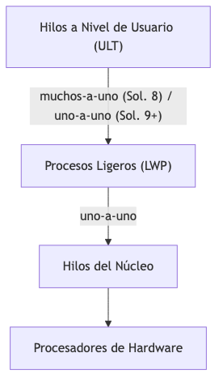

- **ULT** – creados por el usuario, invisibles al SO
- **LWP** – visible dentro del proceso; se mapea a un hilo del núcleo
- **Hilo del Núcleo** – entidad realmente planificable

<!--
**Evolución del modelo de hilos en Solaris:**
- **Solaris 2.x (años 90):** modelo M:N verdadero. Muchos ULT se mapeaban a pocos LWP. Flexible pero complejo.
- **Solaris 9+ (2002):** migró a 1:1. Cada ULT = 1 LWP = 1 hilo de núcleo. Los LWPs son ahora transparentes para el programador.

**¿Por qué el M:N fue abandonado?** La complejidad de sincronización entre el planificador de usuario y el kernel superó los beneficios en hardware moderno. Las syscalls de Solaris son eficientes y el 1:1 es mucho más predecible.
-->

---

# 4.5 Estados de Ejecución de Hilos en Solaris

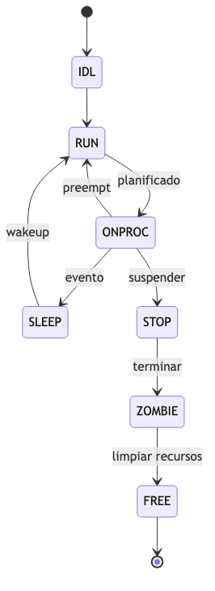

| Estado | Significado |
|---|---|
| **RUN** | Ejecutable / listo |
| **ONPROC** | Ejecutándose en un procesador |
| **SLEEP** | Bloqueado (esperando un evento) |
| **STOP** | Suspendido (ej. para depuración) |
| **ZOMBIE** | Terminado, aún no limpiado |
| **FREE** | Recursos liberados, esperando eliminación |

<!--
**Estado ZOMBIE — importante para entender `wait()`:**
Cuando un hilo/proceso termina, sus recursos se liberan pero la entrada en la tabla de procesos permanece hasta que el padre llame a `wait()`.
Esto permite al padre obtener el código de salida del hijo.

**Si el padre termina antes:** el hijo zombie es adoptado por `init` (PID 1), que inmediatamente llama a `wait()` para limpiarlo.

**Zombie leak:** si el padre nunca llama a `wait()`, la tabla de procesos se llena de zombies → el sistema se queda sin PIDs disponibles (DoS).
-->

---

# 4.5 Solaris: Interrupciones como Hilos

**Problema:** El manejo tradicional de interrupciones requiere bloquearlas durante accesos a datos del núcleo — costoso en multiprocesadores.

### Solución de Solaris:
1. Las interrupciones se convierten en **hilos del núcleo**
2. Los hilos de interrupción tienen **mayor prioridad** que todos los demás
3. El acceso a datos compartidos usa **primitivas de exclusión mutua** (igual que hilos normales)

### Beneficio:
- Elimina la necesidad de subir/bajar niveles de prioridad de interrupción
- Escala bien en sistemas multiprocesador
- Unifica el modelo de concurrencia: todo es un hilo del núcleo

<!--
**El problema de las interrupciones en multiprocesadores clásicos:**
Para acceder a estructuras compartidas del kernel durante un handler de interrupción, hay que deshabilitar interrupciones. En un SMP con 16 CPUs, deshabilitar interrupciones requiere un IPI (Inter-Processor Interrupt) a todos los CPUs — muy costoso.

**Solución de Solaris con hilos de interrupción:**
1. Cada interrupción activa un hilo de un pool precreado
2. El hilo usa mutex normales (sin deshabilitar interrupciones globalmente)
3. Prioridad más alta que todos los demás hilos → ejecuta casi inmediatamente
4. Al terminar, regresa al pool

**Resultado:** escala linealmente con el número de CPUs sin coordinación global.
-->

---

# 4.6 Gestión de Procesos e Hilos en Linux

### La estructura `task_struct` contiene:
- **Estado** – ejecutando, listo, suspendido, detenido, zombie
- **Info de planificación** – normal/tiempo real, prioridad, contador de tiempo
- **Identificadores** – PID, ID de usuario, ID de grupo
- **Enlaces** – padre, hermanos, hijos
- **IPC** – semáforos, colas de mensajes
- **Temporizadores** – tiempo de creación, CPU consumida, temporizadores de intervalo
- **Sistema de archivos** – archivos abiertos, directorio actual/raíz
- **Espacio de direcciones** – mapa de memoria virtual
- **Contexto del procesador** – registros, pila

<!--
**Campos clave de `task_struct` para el planificador (Linux kernel):**
```c
struct task_struct {
    volatile long  state;      // TASK_RUNNING, TASK_INTERRUPTIBLE...
    int            prio;       // prioridad dinámica [0-139]
    int            static_prio; // prioridad estática (nice value)
    unsigned int   policy;     // SCHED_NORMAL, SCHED_FIFO, SCHED_RR...
    struct sched_entity se;    // entidad del Completely Fair Scheduler
    pid_t          pid;        // ID del hilo
    pid_t          tgid;       // ID del grupo de hilos (= PID del proceso)
    struct mm_struct *mm;      // NULL en hilos de kernel
    // ... >100 campos más
};
```
El código fuente está en `include/linux/sched.h`.
-->

---

# 4.6 Estados de Proceso en Linux

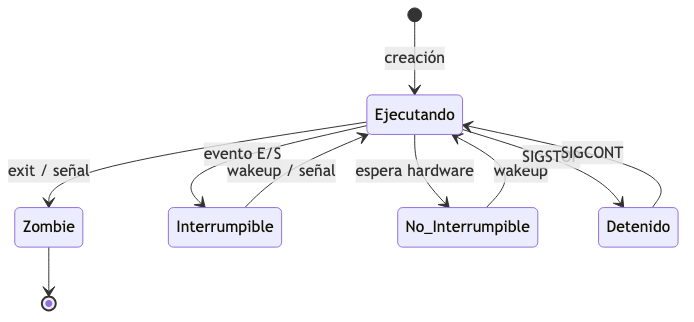

| Estado | Descripción |
|---|---|
| **Ejecutando** | En ejecución o listo para ejecutar |
| **Interrumpible** | Bloqueado; puede manejar señales |
| **No Interrumpible** | Bloqueado en hardware; ignora señales |
| **Detenido** | Pausado; reanuda por acción externa |
| **Zombie** | Terminado; estructura `task_struct` aún en tabla |

<!--
**¿Por qué dos estados de sleep?**
- `TASK_INTERRUPTIBLE`: espera un evento pero puede manejar señales. Ej: esperar input de terminal. `Ctrl+C` funciona.
- `TASK_UNINTERRUPTIBLE`: espera hardware y no puede ser interrumpido por señales. Ej: esperar que un disco NFS responda. `kill -9` no funciona.

**El estado 'D' en `ps aux`** corresponde a `TASK_UNINTERRUPTIBLE`. Un proceso en estado D que no avanza suele indicar un problema de hardware (disco roto, NFS caído). No puede matarse con señales.
-->

---

# 4.6 Hilos en Linux: ¡Sin Distinción!

> Linux **no distingue** entre hilos y procesos — ambos son `task_struct`

### `clone()` vs `fork()`
- `fork()` = `clone()` con todos los flags en cero (copia completa)
- `clone()` permite compartir recursos:

| Flag | Efecto |
|---|---|
| `CLONE_VM` | Compartir memoria virtual |
| `CLONE_FILES` | Compartir descriptores de archivo |
| `CLONE_THREAD` | Mismo grupo de hilos que el padre |
| `CLONE_FS` | Compartir info del sistema de archivos |
| `CLONE_NEWPID` | Nuevo espacio de nombres PID |

<!--
**`clone()` — la syscall más poderosa de Linux:**
Todo mecanismo de concurrencia en Linux se construye sobre ella:

| Llamada | Flags de clone() | Resultado |
|---|---|---|
| `fork()` | ninguno | Proceso hijo aislado (COW) |
| `pthread_create()` | VM + FILES + THREAD + SIGHAND | Hilo POSIX |
| `vfork()` | VM + VFORK | Proceso hijo sin copia |
| `unshare()` | NEWPID + NEWNET + ... | Nuevo namespace |

**La pila siempre es privada:** `clone()` requiere que el llamador suministre una pila nueva para el hijo. No hay forma de compartir la pila.
-->

---

# 4.6 Namespaces y cgroups en Linux

### 6 tipos de Namespaces:
`mnt` · `pid` · `net` · `ipc` · `uts` · `user`

- Cada proceso obtiene una **vista específica del sistema**
- Base de la **virtualización ligera** (Docker, LXC, Kubernetes)

### cgroups (Grupos de Control):
- Gestión de recursos: CPU, memoria, red, E/S
- Desarrollo iniciado en Google (2006) como "contenedores de proceso"
- `cgroups v2` lanzado en el núcleo 4.5 (2016) — interfaces consistentes
- Montado como sistema de archivos virtual en `/sys/fs/cgroup`
- Junto con namespaces → **Contenedores Linux**

<!--
**Docker usa exactamente `clone()` con flags de namespace:**
```bash
# Conceptualmente, docker run hace:
clone(fn, stack, CLONE_NEWPID | CLONE_NEWNET | CLONE_NEWNS |
           CLONE_NEWUTS | CLONE_NEWIPC, args)
# + configurar cgroups para limitar CPU/memoria
```
No hay hipervisor ni virtualización de hardware. Es puro Linux.

**Diferencia clave Namespaces vs cgroups:**
- **Namespaces** → aíslan lo que el proceso **ve** (su visión del sistema)
- **cgroups** → limitan lo que el proceso puede **consumir** (CPU, RAM, I/O)
Juntos = contenedores sin VM.
-->

---

# 4.7 Gestión de Procesos e Hilos en Android

### 4 Tipos de Componentes de Aplicación:

| Componente | Función |
|---|---|
| **Activity** | Pantalla de UI única; gestionada en pila LIFO |
| **Service** | Tareas en segundo plano (música, descargas) |
| **Content Provider** | Interfaz a datos de la app (privados o compartidos) |
| **Broadcast Receiver** | Responde a eventos del sistema |

**Modelo de sandboxing:** Cada app = su propio proceso + máquina virtual + ID de usuario Linux único

<!--
**Sandboxing de Android — más estricto que iOS en un aspecto:**
Cada app tiene un UID de Linux único. El kernel fuerza el aislamiento a nivel de SO, no solo a nivel de runtime. Incluso con root, cruzar límites de app requiere vulnerabilidades del kernel.

**Binder IPC:** el mecanismo de comunicación entre apps. Más eficiente que pipes o sockets (una sola copia en memoria vs dos). Toda la comunicación inter-componente (startActivity, bindService) usa Binder.
-->

---

# 4.7 Estados de una Activity en Android

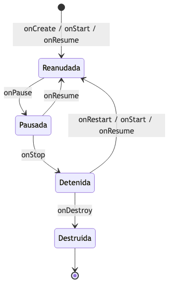

<!--
**Ciclo de vida de Activity — errores comunes de desarrollo:**
1. **No guardar estado en `onPause()`:** si el SO mata la Activity, el usuario pierde progreso
2. **Hacer trabajo lento en el hilo principal:** congela la UI → Android muestra "App no responde"
3. **Memory leaks:** referenciar la Activity desde un callback en background que sobrevive a ella

**`onSaveInstanceState(Bundle)`:** se llama antes de `onStop()`. Permite guardar estado que se restaura en `onCreate(savedInstanceState)` si la Activity es recreada (ej. al rotar la pantalla o por presión de memoria).
-->

---

# 4.7 Jerarquía de Precedencia de Procesos en Android

Cuando la memoria es escasa, Android elimina procesos desde la **menor prioridad**:

| Prioridad | Tipo | Ejemplo |
|---|---|---|
| 1 (mayor) | **Primer plano** | Activity con la que interactúa el usuario |
| 2 | **Visible** | Activity visible pero sin foco |
| 3 | **Servicio** | Música en fondo, descarga de red |
| 4 | **Segundo plano** | Activity detenida |
| 5 (menor) | **Vacío** | Sin componentes activos; retenido para inicio rápido |

<!--
**Low Memory Killer (LMK) de Android:**
Es un componente del kernel que activa la eliminación de procesos cuando la memoria libre cae por debajo de umbrales configurables:
- Umbral 1 (minfree[0]): elimina procesos vacíos
- Umbral 2: elimina procesos en segundo plano
- Umbral 3: elimina servicios
- Umbral 4 (emergencia): elimina procesos visibles

**El sistema de prioridades** implementa directamente los principios de diseño de SO: maximizar la experiencia del usuario priorizando lo que ve y con lo que interactúa.
-->

---

# 4.8 Grand Central Dispatch (GCD) de Mac OS X

**Objetivo:** Simplificar el multihilo; dejar que el SO gestione los grupos de hilos automáticamente.

### Bloques — la unidad de trabajo principal:
```c
x = ^{ printf("hola mundo\n"); }
x();  // invoca el bloque
```

Un bloque = **función + datos**, pasable como una variable: `F̄ = F + datos`

### Colas:
- **Cola concurrente** → bloques despachados cuando hay hilos disponibles
- **Cola serial** → bloques despachados uno tras otro (FIFO)
- Grupos de hilos **dimensionados automáticamente** por el SO

<!--
**GCD — paradigma orientado a tareas vs orientado a hilos:**
- **Orientado a hilos (tradicional):** `pthread_create()`, el programador gestiona hilos
- **Orientado a tareas (GCD):** `dispatch_async()`, el programador describe trabajo; el SO asigna hilos automáticamente

**Ventaja de GCD:** el pool de hilos se adapta al hardware. El mismo código corre eficientemente en un iPhone con 2 núcleos y en un Mac Pro con 24.

**Bloque = función + contexto capturado:**
```objc
int x = 42;
dispatch_async(queue, ^{
    NSLog(@"x = %d", x);  // x capturado por valor
});
```
-->

---

# 4.8 GCD en la Práctica

### Sin GCD (se ejecuta en el hilo principal — puede congelar la UI):
```objc
- (IBAction)analizarDocumento:(NSButton *)sender {
    NSDictionary *stats = [myDoc analyze];  // ¡puede ser lento!
    [myModel setDict:stats];
    [myStatsView setNeedsDisplay:YES];
}
```

### Con GCD (análisis en segundo plano; actualización de UI en cola principal):
```objc
dispatch_async(dispatch_get_global_queue(0, 0), ^{
    NSDictionary *stats = [myDoc analyze];
    dispatch_async(dispatch_get_main_queue(), ^{
        [myModel setDict:stats];
        [myStatsView setNeedsDisplay:YES];
    });
});
```

<!--
**La regla fundamental de UI en frameworks modernos:**
La cola serial del hilo principal garantiza que la UI se actualice desde un único hilo. Esta regla existe en todos los frameworks:
- GCD/Cocoa: `dispatch_get_main_queue()`
- Android: `runOnUiThread()` o `Handler(Looper.getMainLooper())`
- Windows Win32: `PostMessage()` al hilo principal
- JavaFX: `Platform.runLater()`

**¿Por qué?** Los frameworks de UI no son thread-safe. Actualizar un widget desde un hilo de background produce comportamiento indefinido (crashes, corrupción visual, condiciones de carrera).
-->

---

# 4.9 Resumen

| Tipo de Hilo | Ventajas | Desventajas |
|---|---|---|
| **Nivel de Usuario** | Sin cambio de modo; rápido | Solo uno ejecuta a la vez; bloqueo afecta al proceso |
| **Nivel de Núcleo** | Paralelismo real en multiprocesadores | Requiere cambio de modo en cada cambio de hilo |

### Distinciones clave:
- **Proceso** = propietario de recursos (espacio de direcciones, archivos, handles)
- **Hilo** = unidad de ejecución (planificable, comparte recursos del proceso)
- Los SO modernos difuminan esta línea (Linux) o la estructuran en capas (modelo de 4 niveles de Solaris)

<!--
**Síntesis comparativa para el examen:**

| SO | Primitiva base | Modelo | Distingue hilo/proceso |
|---|---|---|---|
| Windows | `CreateThread()` | Proceso + Hilo + Fibra + UMS | Sí |
| Solaris | `thr_create()` | ULT→LWP→KT→CPU (1:1 en Sol.9+) | Sí |
| Linux | `clone()` | `task_struct` unificado | No |
| Android | Java threads / NDK | Proceso Linux + VM | Sí |

**¿Por qué Linux no distingue hilo/proceso?** `clone()` permite cualquier grado de compartición. El planificador CFS trata todas las `task_struct` igual.
-->

---

# 4.10 Términos Clave

| Término | Definición |
|---|---|
| **Fibra** | Unidad planificada manualmente; sin apropiación |
| **Jacketing** | Envolver una llamada bloqueante para no bloquear todo el proceso |
| **Proceso Ligero (LWP)** | Mapea hilos de usuario a hilos del núcleo (Solaris) |
| **Namespaces** | Aíslan recursos del sistema por grupo de procesos |
| **Grupo de Hilos** | Hilos trabajadores precreados para tareas asíncronas |
| **UMS** | Planificación en Modo Usuario; cambio de hilo sin pasar por el núcleo |
| **Multihilo** | Múltiples hilos dentro de un mismo proceso |

<!--
**Definiciones clave para el examen:**

- **Jacketing:** envolver llamadas bloqueantes para que no bloqueen el proceso entero. Necesario solo con hilos en user space.
- **LWP (Lightweight Process):** en Solaris, entidad que mapea ULT a hilo de kernel. En Linux, el término se usa informalmente para hilos de kernel.
- **UMS:** permite cambiar entre hilos de un proceso sin involucrar al kernel (Windows 7+). Similar a goroutines de Go.
- **Grupo de Hilos:** pool precreado de hilos esperando trabajo. Evita el overhead de creación/destrucción repetida.
-->

---

<!-- _class: titulo -->

# Fin del Capítulo 4
## Hilos — De la Teoría a la Implementación en SO

> *«Un hilo es una unidad de trabajo despachable que se ejecuta secuencialmente y puede ser interrumpida.»*
> — Stallings, Sistemas Operativos: Fundamentos y Diseño

---

# 4.3 Diagrama: Ley de Amdahl Explicada

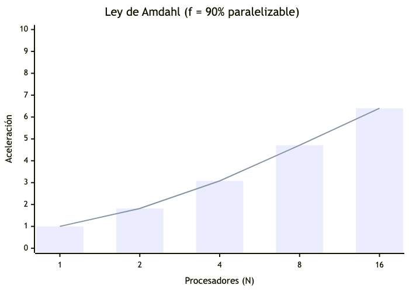

### ¿Por qué no escala perfectamente?
- La parte **serial siempre tarda lo mismo** sin importar cuántos núcleos haya
- A medida que `N → ∞`, la aceleración máxima está **limitada por `1/(1−f)`**
- Con 10% serial → aceleración máxima posible = **10×**, sin importar cuántos núcleos

<!--
**La asíntota de la Ley de Amdahl:**
A medida que N → ∞, la aceleración → 1/(1-f).
Con f=0.90: límite = 10×, con f=0.99: límite = 100×.

**Rendimientos decrecientes:** la curva se aplana rápidamente. Pasar de 1 a 2 CPUs con f=0.9 da 1.82× (ganancia del 82%). Pasar de 8 a 16 CPUs solo da de 4.71× a 6.40× (ganancia adicional del 36%).

**Implicación de diseño:** invertir en reducir la fracción serial siempre supera el beneficio de agregar más núcleos.
-->

---

# 4.3 Diagrama: Estrategias de Enhebrado en Valve

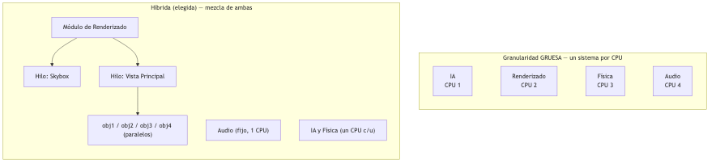

> La clave: fijar lo predecible, paralelizar lo costoso

<!--
**Clave del diseño híbrido de Valve:**
La estrategia no es 'paralelizar todo' sino 'fijar lo predecible y paralelizar lo costoso'.

- **Audio (fijo a 1 CPU):** el audio digital es extremadamente sensible al timing. Mezclar en un solo hilo garantiza latencia determinista sin locks.
- **Renderizado (paralelo por objeto):** cada objeto puede renderizarse independientemente. Alta independencia de datos → casi sin contención en locks.

**Resultado práctico:** ≥60 fps estables en hardware quad-core vs ~20 fps en versión single-threaded del mismo motor.
-->

---

# 4.4 Diagrama: Jerarquía de Objetos en Windows

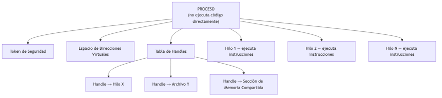

- El proceso **no ejecuta código** por sí mismo — solo posee recursos
- **Los hilos** son quienes realmente ejecutan instrucciones
- Un proceso puede tener **múltiples hilos** ejecutando en paralelo

<!--
**La separación proceso/hilo en Windows es más estricta que en Linux:**
Un proceso Windows sin hilos no puede ejecutar ninguna instrucción. Cuando se crea un proceso (`CreateProcess()`), Windows crea automáticamente un hilo principal.

**Handles vs punteros:** los procesos en Windows nunca tienen punteros directos a objetos del kernel. Usan handles (índices en la tabla de handles del proceso). Esto garantiza que cuando un proceso termina, todos sus handles se cierran automáticamente y los objetos se liberan.
-->

---

# 4.4 Diagrama: Ciclo de Vida de un Hilo en Windows

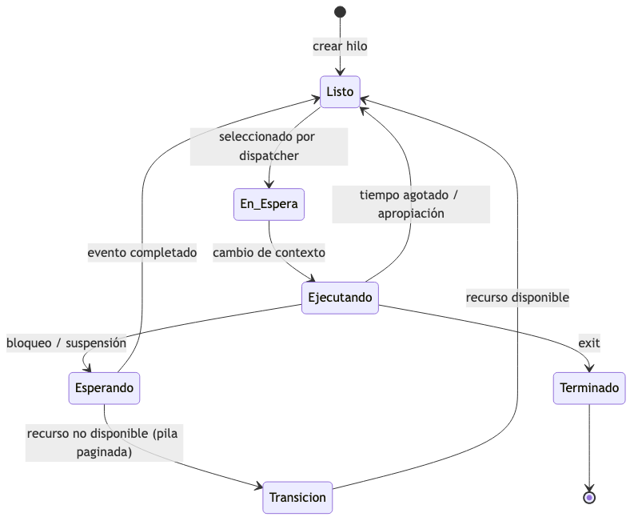

> **Transición** ocurre cuando el hilo está listo para correr pero su pila fue paginada a disco

<!--
**¿Cuándo ocurre el estado Transición en producción?**
En sistemas con alta carga de memoria, las pilas de hilos bloqueados son candidatas a ser paginadas a disco (page out). Esto es más probable con muchos hilos en WAIT simultáneamente.

**Diagnóstico:** el contador 'Threads - Transition' en Performance Monitor indica cuántos hilos están esperando que su pila vuelva de página.
Un valor alto sugiere presión de memoria → considerar aumentar RAM o reducir el número de hilos activos simultáneamente.
-->

---

# 4.5 Diagrama: Modelo de 4 Niveles de Solaris

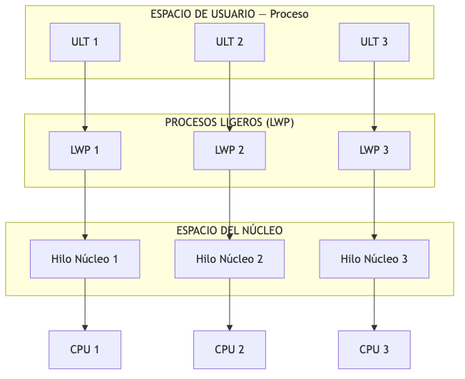

> Cada LWP se mapea **exactamente a un** hilo del núcleo (Solaris 9+)

<!--
**Modelo de 4 niveles en Solaris 8 vs 9+:**
- **Solaris 8 (M:N):** N ULTs → M LWPs → M KTs → CPUs. Un LWP podía servir a múltiples ULTs.
- **Solaris 9+ (1:1):** cada ULT → 1 LWP → 1 KT → 1 CPU. Los LWPs son prácticamente transparentes para el programador.

**¿Por qué el M:N fue abandonado en Solaris?**
La complejidad de los bugs de sincronización entre el runtime de usuario y el kernel fue mayor que el beneficio de rendimiento. Con hardware moderno, el overhead de syscalls es mínimo.
-->

---

# 4.5 Diagrama: Interrupciones como Hilos en Solaris

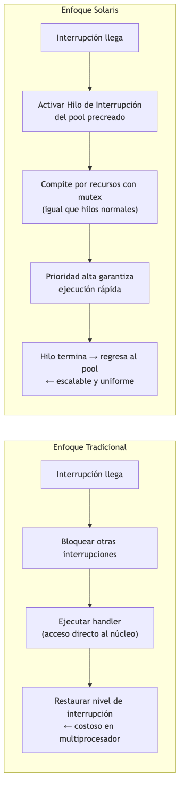

<!--
**Comparación del enfoque de interrupciones:**

| Aspecto | Tradicional | Solaris (hilos) |
|---|---|---|
| Deshabilitar interrupciones | Global (todas las CPUs) | No necesario |
| Costo en SMP | O(N CPUs) — IPI a todos | O(1) — mutex local |
| Escalabilidad | Pobre en >4 CPUs | Lineal con CPUs |
| Latencia | Baja (sin cambio de contexto) | Media (cambio de hilo) |
| Unificación del modelo | Interrupciones = especiales | Todo es un hilo |

Este enfoque influyó en el diseño de interrupciones en macOS/XNU (interrupt threads).
-->

---

# 4.6 Diagrama: `fork()` vs `clone()` en Linux

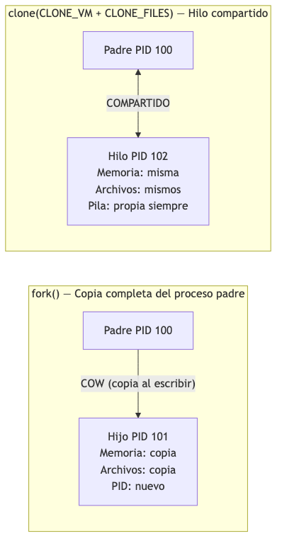

> La pila **nunca se comparte** — `clone()` crea espacios de pila separados

<!--
**Copy-on-Write (COW) en fork():**
Al llamar a `fork()`, el hijo no recibe una copia inmediata de la memoria del padre. Las páginas se marcan como de solo lectura y se comparten entre padre e hijo. Solo cuando padre O hijo intenta escribir en una página, esa página específica se copia (copy-on-fault).

**Ventaja:** `fork()` es casi tan rápido como `clone()` si el hijo llama a `exec()` inmediatamente (pattern fork+exec = ninguna copia real ocurre).

**La pila nunca se comparte en `clone()`:** el llamador debe proporcionar una nueva pila para el hijo. En pthreads, la biblioteca gestiona esto automáticamente.
-->

---

# 4.6 Diagrama: Namespaces y Contenedores Linux

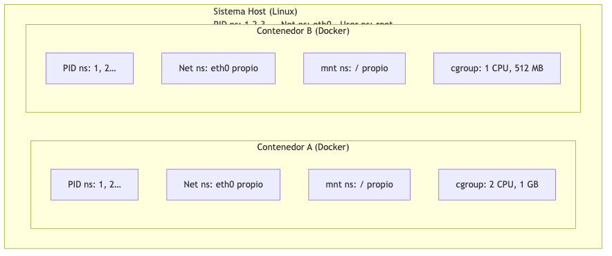

- **Namespaces** → cada contenedor cree que es el único en el sistema
- **cgroups** → limitan cuántos recursos puede consumir cada contenedor
- Juntos = **aislamiento + control de recursos** sin una VM completa

<!--
**Docker internamente usa exactamente esta arquitectura:**
```bash
# Verificar namespaces de un contenedor Docker:
docker run -d nginx
CONTAINER_PID=$(docker inspect --format '{{.State.Pid}}' <id>)
ls -la /proc/$CONTAINER_PID/ns/
# Muestra: ipc, mnt, net, pid, user, uts — todos distintos del host
```

**Kubernetes** agrega orquestación sobre Docker/containerd, pero el aislamiento sigue siendo namespaces + cgroups del kernel Linux.
-->

---

# 4.7 Diagrama: Pila de Activities en Android

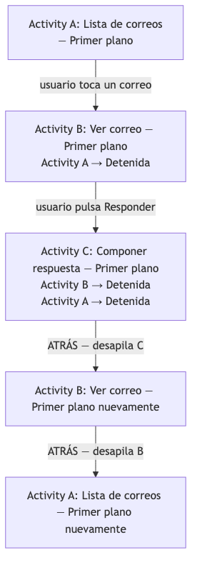

<!--
**La pila de Activities = navegación de usuario:**
El botón ATRÁS hace `pop()` en la pila de Activities, restaurando la Activity anterior. Las Activities debajo en la pila están en estado `STOPPED` (no destruidas), lo que hace la navegación de regreso instantánea.

**Task vs Back Stack:** Android agrupa Activities en 'Tasks'. Cada app tiene su propia Back Stack, pero una Task puede mezclar Activities de diferentes apps (ej. abrir una Activity de Gmail desde tu app).
-->

---

# 4.8 Diagrama: Colas en Grand Central Dispatch

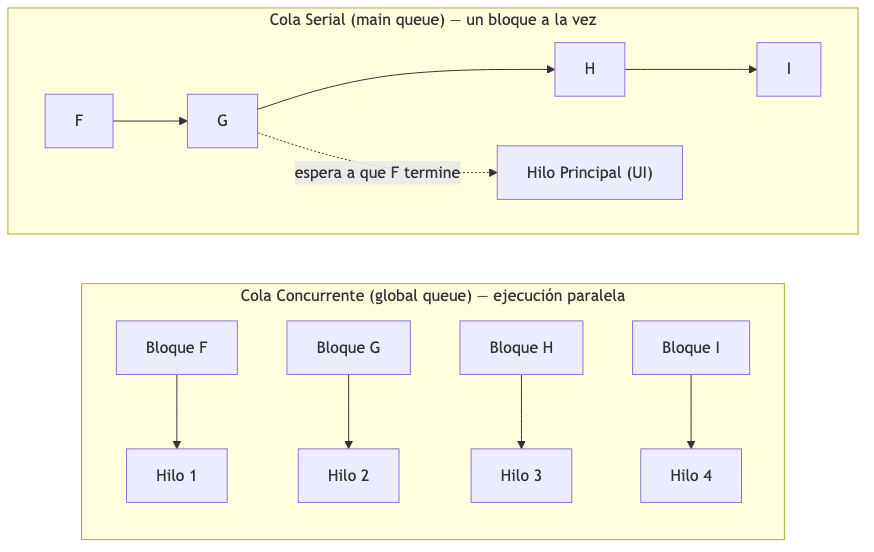

> La cola serial del hilo principal garantiza que la **UI solo se actualice desde un hilo**

<!--
**La cola serial = event loop de un solo hilo:**
La `dispatch_get_main_queue()` implementa el mismo patrón que el event loop de Node.js, el event loop de Qt, el RunLoop de Cocoa y el Looper de Android: un único hilo procesa eventos en orden FIFO.

**Regla de oro:** nunca ejecutar trabajo que tome más de ~16ms en la cola principal (equivale a 60 fps). Trabajo más largo = frames perdidos = UI entrecortada.

**`dispatch_after`:** programa trabajo en la cola principal después de un delay, sin bloquear el hilo principal.
-->

---

# Comparación General: Hilos entre Sistemas Operativos

| Característica | Windows | Solaris | Linux | Android |
|---|---|---|---|---|
| **Modelo de hilos** | Proceso + Hilo + Fibra | ULT → LWP → Hilo núcleo | `task_struct` unificado | Proceso + VM dedicada |
| **¿Distingue hilo/proceso?** | Sí | Sí (4 niveles) | No | Sí (sandboxing) |
| **Planificación** | Kernel (6 estados) | Kernel (por hilo núcleo) | Kernel (CFS) | Kernel Linux + jerarquía |
| **Interrupciones** | Rutinas del núcleo | Hilos del núcleo | Rutinas del núcleo | Rutinas del núcleo |
| **Virtualización ligera** | Hyper-V | Zonas | Namespaces + cgroups | Máquina virtual Dalvik/ART |
| **API de hilos** | Win32 / UMS | POSIX pthreads | `clone()` / pthreads | Java threads / NDK |

> Linux es el más flexible (sin distinción hilo/proceso); Solaris el más estructurado (4 capas)

<!--
**Para preparar el examen — diferencias clave:**
1. **Linux es el más flexible:** `clone()` puede crear cualquier combinación de compartición. No hay distinción conceptual entre proceso e hilo.
2. **Windows es el más rico en abstracciones:** fibras, UMS, grupos de hilos, objetos de trabajo. Mayor complejidad, mayor control.
3. **Solaris es el más estructurado:** 4 capas bien definidas, aunque hoy usa 1:1.
4. **Android prioriza la experiencia del usuario:** el sistema mata agresivamente procesos de baja prioridad para mantener la fluidez de la app en primer plano.

**Pregunta frecuente de examen:** compare `fork()` en Linux con `CreateProcess()` en Windows.
-->

---

# Resumen Visual: Todo el Capítulo 4

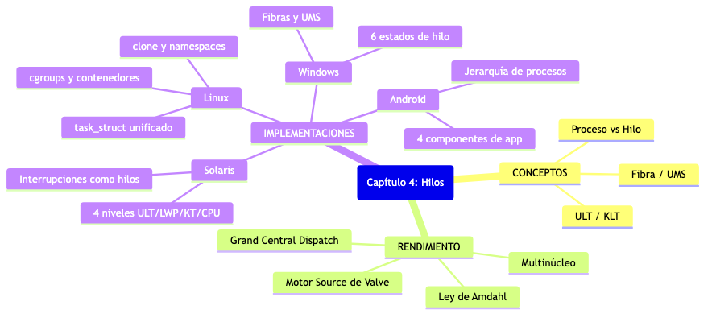

<!--
**Síntesis del Capítulo 4:**
Los cuatro SO representan cuatro filosofías de diseño:
- **Windows:** orientado a objetos, abstracciones ricas, gran empresa
- **Solaris:** POSIX estricto, modelo en capas, empresa/servidor
- **Linux:** minimalismo elegante, una primitiva poderosa (`clone()`), universal
- **Android:** optimizado para dispositivos con recursos limitados y batería

**Conexión con Tanenbaum (mos.md):** los conceptos de hilos en user space, kernel y híbrido de la sección 2.2 son la base teórica de todas estas implementaciones. Linux usa kernel threads (2.2.5), Solaris usó híbrido (2.2.6) y Go usa activaciones del planificador (2.2.7).
-->
