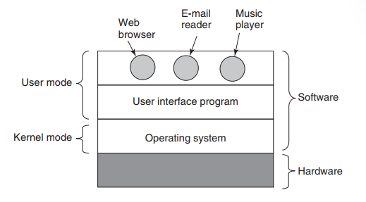
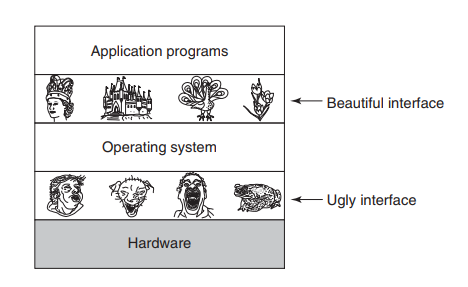
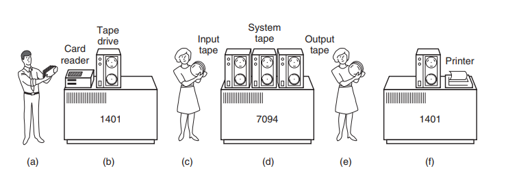
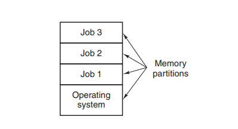
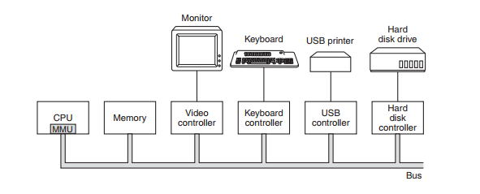
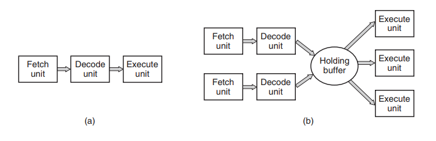
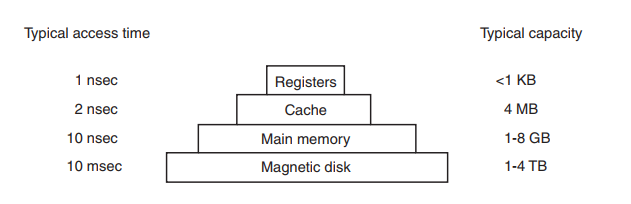
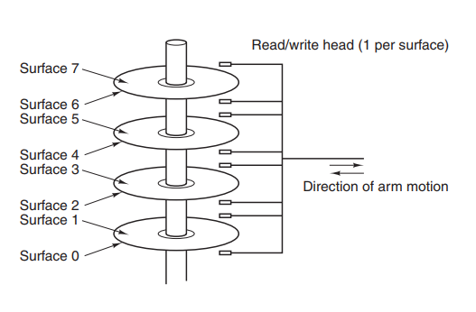
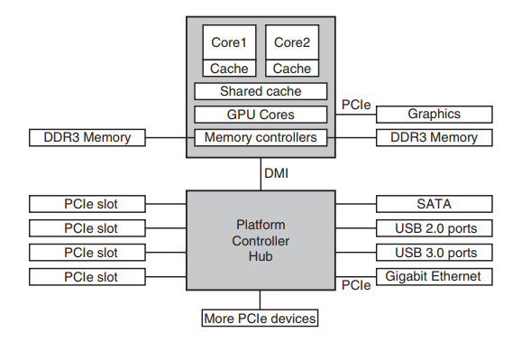

# Sistemas Operativos Modernos — Capítulo 1

**Andrew S. Tanenbaum · Herbert Bos · 4ª Edición**  
Vrije Universiteit Amsterdam

---

## Contenido

- [1.1 ¿Qué es un Sistema Operativo?](#11-qué-es-un-sistema-operativo)
- [1.2 Historia de los Sistemas Operativos](#12-historia-de-los-sistemas-operativos)
  - [1.2.1 Primera Generación (1945–1955)](#121-primera-generación-19451955-válvulas-de-vacío)
  - [1.2.2 Segunda Generación (1955–1965)](#122-segunda-generación-19551965-transistores-y-sistemas-batch)
  - [1.2.3 Tercera Generación (1965–1980)](#123-tercera-generación-19651980-circuitos-integrados-y-multiprogramación)
  - [1.2.4 Cuarta Generación (1980–Presente)](#124-cuarta-generación-1980presente-computadoras-personales)
  - [1.2.5 Quinta Generación (1990–Presente)](#125-quinta-generación-1990presente-computadoras-móviles)
- [1.3 Revisión del Hardware de Computadoras](#13-revisión-del-hardware-de-computadoras)
  - [1.3.1 Procesadores](#131-procesadores)
  - [1.3.2 Memoria](#132-memoria)
  - [1.3.3 Discos](#133-discos)
  - [1.3.4 Dispositivos de E/S](#134-dispositivos-de-es)
  - [1.3.5 Buses](#135-buses)
  - [1.3.6 Arranque del computador](#136-arranque-del-computador)

---

## 1.1 ¿Qué es un Sistema Operativo?

Un sistema operativo es una **capa de software** que proporciona a los programas de usuario un modelo más simple y limpio del hardware, y que gestiona todos los recursos de la computadora.

La mayoría de los computadores tienen **dos modos de operación**:

| Modo | Descripción |
|------|-------------|
| **Kernel (supervisor)** | Acceso completo al hardware y a todas las instrucciones del procesador. Aquí corre el SO. |
| **Usuario** | Subconjunto restringido de instrucciones. Las instrucciones de E/S y protección de memoria están prohibidas. |

La transición de modo usuario a modo kernel ocurre mediante una instrucción especial llamada **TRAP** (llamada al sistema / syscall).

> *"El trabajo del SO es proporcionar abstracciones limpias a los programas de usuario y administrar los recursos de hardware."*
> — Tanenbaum & Bos

### 1.1.1 El SO como Máquina Extendida

La arquitectura a nivel de lenguaje máquina es **primitiva e incómoda de programar**, especialmente para E/S. El SO oculta esa complejidad y ofrece abstracciones de alto nivel:

- **Disco** → abstracción de **archivos** (`open`, `read`, `write`, `close`)
- **CPU** → abstracción de **procesos** (programas en ejecución)
- **RAM** → abstracción de **espacio de direcciones** virtual
- **Hardware de red** → abstracción de **sockets**



*Fig. 1-1. Dónde se ubica el SO en el sistema (modo kernel vs. modo usuario).*

### 1.1.2 El SO como Gestor de Recursos

Desde una perspectiva **bottom-up**, el SO administra todos los componentes del sistema. Cuando múltiples programas intentan usar el mismo recurso simultáneamente, el SO arbitra los conflictos.

El SO **multiplexa** los recursos de dos maneras:

| Tipo | Descripción | Ejemplo |
|------|-------------|---------|
| **Multiplexación en tiempo** | Los procesos se turnan para usar el recurso | CPU asignada por turnos (scheduling) |
| **Multiplexación en espacio** | El recurso se divide en porciones | RAM dividida en particiones para distintos procesos |



*Fig. 1-2. El SO convierte la interfaz fea del hardware en abstracciones bellas para las aplicaciones.*

---

## 1.2 Historia de los Sistemas Operativos

Los SO han evolucionado estrechamente ligados a la arquitectura del hardware. Se identifican **cinco generaciones** principales.

---

### 1.2.1 Primera Generación (1945–1955): Válvulas de vacío

**Tecnología:** Válvulas de vacío (~20 000 por máquina)  
**Sistemas operativos:** Ninguno  
**Lenguajes:** Lenguaje máquina, tableros de cables (plugboards)

#### Características

- Máquinas enormes: ENIAC, Colossus, Mark I, Z3.
- Un mismo grupo diseñaba, construía, programaba, operaba y mantenía cada máquina.
- Programación directamente en código binario o tableros de cables.
- Las válvulas se quemaban constantemente; sin resultados se perdía el tiempo reservado.
- **1950:** Se introducen **tarjetas perforadas** para leer programas.

#### Modo de operación típico

1. El programador reservaba una franja horaria.
2. Llegaba con su tablero de cables o tarjetas perforadas.
3. Cargaba y ejecutaba su programa durante el tiempo asignado.
4. Si una válvula fallaba, perdía la sesión sin resultados.

---

### 1.2.2 Segunda Generación (1955–1965): Transistores y sistemas batch

**Tecnología:** Transistores  
**Sistemas operativos:** FMS (Fortran Monitor System), IBSYS  
**Lenguajes:** FORTRAN, ensamblador

#### Características

- Los transistores hicieron los computadores suficientemente fiables para venderse como **mainframes**.
- Surgió la separación de roles: diseñadores, constructores, operadores, programadores y mantenimiento.
- Solo grandes corporaciones, agencias gubernamentales y universidades podían costearlos.

#### El flujo de trabajo batch



*Fig. 1-3. Sistema batch: (a) programador trae tarjetas al IBM 1401, (b) 1401 lee y graba en cinta, (c-d) IBM 7094 computa, (e-f) 1401 imprime resultados.*

Pasos detallados:

1. El programador escribe el programa en papel (FORTRAN/ensamblador).
2. Perfora el programa en tarjetas perforadas.
3. El operador acumula un lote y los lee en el **IBM 1401** → cinta magnética.
4. La cinta se lleva al **IBM 7094** para el cómputo real.
5. Los resultados se graban en otra cinta de salida.
6. La cinta de salida se lleva al IBM 1401 para imprimir.
7. El programador recoge su salida impresa horas después.

#### Estructura de un trabajo FMS típico

```
$JOB, 10, 7710802, MARVIN TANENBAUM   ← tiempo máximo, cuenta, nombre
$FORTRAN                               ← cargar compilador FORTRAN
  [código fuente del programa]
$LOAD                                  ← cargar programa compilado
$RUN                                   ← ejecutar con datos siguientes
  [datos de entrada]
$END                                   ← fin del trabajo
```

> Estas **tarjetas de control** son los precursores de los shells e intérpretes de comandos modernos.

---

### 1.2.3 Tercera Generación (1965–1980): Circuitos integrados y multiprogramación

**Tecnología:** Circuitos integrados (IC)  
**Sistemas operativos:** OS/360, MULTICS, UNIX, CTSS  
**Lenguajes:** FORTRAN, C, ensamblador

#### El IBM System/360

IBM unificó sus dos líneas incompatibles con el **System/360**: una familia con la misma arquitectura pero diferente precio y rendimiento. El SO resultante (OS/360) tenía millones de líneas de ensamblador y miles de bugs. Fred Brooks describió su experiencia en *The Mythical Man-Month* (1975).

#### Multiprogramación



*Fig. 1-5. Multiprogramación: mientras Job A espera E/S, la CPU ejecuta Job B o Job C.*

Cuando un trabajo esperaba una operación de E/S (que podía ocupar el 80–90% del tiempo), la CPU quedaba ociosa. La solución: **mantener varios trabajos en memoria** y conmutar entre ellos.

#### Técnicas clave

| Técnica | Descripción |
|---------|-------------|
| **Multiprogramación** | Varios jobs en memoria; CPU cambia al siguiente cuando uno espera E/S |
| **Spooling** | Jobs leídos directamente al disco; elimina el transporte manual de cintas |
| **Timesharing** | Cada usuario tiene terminal online; CPU se reparte por turnos cortos |

#### El nacimiento de UNIX

```
1965  MULTICS (MIT + Bell Labs + GE)
1969  Ken Thompson escribe UNIX en un PDP-7 (simplificación de MULTICS)
1973  UNIX reescrito en C → portabilidad a distintas arquitecturas
1974  Código fuente disponible → System V (AT&T) y BSD (UC Berkeley)
1987  POSIX (IEEE): estándar mínimo de llamadas al sistema
1987  MINIX (Tanenbaum): clon educativo de UNIX
1991  Linux (Linus Torvalds): inspirado en MINIX, open source, GPL
```

---

### 1.2.4 Cuarta Generación (1980–Presente): Computadoras personales

**Tecnología:** LSI (Large Scale Integration) — miles de transistores por chip  
**Sistemas operativos:** CP/M, MS-DOS, Windows, macOS, Linux

#### Línea de tiempo

| Año | Evento |
|-----|--------|
| 1974 | Intel 8080. Gary Kildall crea **CP/M**. |
| 1981 | IBM PC + **MS-DOS** (Bill Gates compra DOS a Seattle Computer Products por ~$75 000). |
| 1984 | **Apple Macintosh**: primera GUI de éxito masivo (ideas de Xerox PARC). |
| 1985 | **Windows 1.0**: interfaz gráfica sobre MS-DOS. |
| 1991 | **Linux** (Linus Torvalds). Open source, licencia GPL. |
| 1995 | **Windows 95**: primer Windows autónomo. **Windows NT**: reescritura completa de 32 bits. |
| 1999 | **Mac OS X**: basado en microkernel Mach + BSD (UNIX certificado POSIX). |
| 2001 | **Windows XP**: unifica líneas doméstica y NT. |
| 2007 | **Windows Vista**: criticado por requisitos y restricciones DRM. |
| 2009 | **Windows 7**: más ligero y estable. |
| 2012 | **Windows 8**: interfaz orientada a pantallas táctiles. |

---

### 1.2.5 Quinta Generación (1990–Presente): Computadoras móviles

**Tecnología:** Chips ARM de bajo consumo, pantallas táctiles, conectividad ubicua  
**Sistemas operativos:** Symbian, BlackBerry OS, iOS, Android

#### Línea de tiempo

| Año | Evento |
|-----|--------|
| 1946 | Primer teléfono móvil (~40 kg, para automóvil). |
| 1970s | Primer teléfono portátil (~1 kg, "el ladrillo"). |
| 1996 | **Nokia N9000**: primer smartphone (teléfono + PDA). |
| 1997 | Ericsson acuña el término **"smartphone"** (GS88 "Penelope"). |
| 2002 | **BlackBerry OS** (RIM): domina el mercado empresarial. |
| 2007 | **iOS** (Apple): lanzado con el primer iPhone. Revoluciona la interfaz táctil. |
| 2008 | **Android** (Google): basado en Linux, open source. Los fabricantes pueden modificarlo. |
| 2011 | Android supera a todos sus rivales. Nokia abandona Symbian. |
| 2013+ | Android domina con >80% del mercado global. iOS es segundo claro. |

---

## 1.3 Revisión del Hardware de Computadoras

El SO está **íntimamente ligado al hardware** que gestiona. Debe conocer a fondo la CPU, la memoria, los discos y los dispositivos de E/S para manejarlos eficientemente.



*Fig. 1-6. Componentes de una PC: CPU, memoria y dispositivos E/S conectados por el bus del sistema.*

---

### 1.3.1 Procesadores

La CPU es el "cerebro" del computador. Su ciclo básico es:

```
Fetch → Decode → Execute → (repetir)
```

#### Registros importantes

| Registro | Función |
|----------|---------|
| **PC** (Program Counter) | Dirección de la próxima instrucción a ejecutar |
| **SP** (Stack Pointer) | Apunta al tope de la pila del proceso actual |
| **PSW** (Program Status Word) | Bits de condición, prioridad de CPU, modo (kernel/usuario) |

#### Modos de operación

- **Modo kernel:** puede ejecutar cualquier instrucción y acceder a cualquier dirección.
- **Modo usuario:** instrucciones de E/S y protección de memoria están prohibidas.
- Cambio de modo: instrucción **TRAP** → entra al kernel → ejecuta syscall → retorna a usuario.

#### Mejoras de rendimiento

**Pipeline y CPU Superescalar:**



*Fig. 1-7. (a) Pipeline de 3 etapas: Fetch, Decode, Execute simultáneos. (b) CPU superescalar: múltiples unidades de ejecución en paralelo.*

**Multihilo (Hyperthreading):** un núcleo físico mantiene el estado de 2 hilos y conmuta en nanosegundos, aprovechando ciclos ociosos durante accesos a memoria.

**Multicore:** varios núcleos completos en un chip (4, 8, 16, 64+). Cada núcleo ve al SO como una CPU separada.

**GPU:** miles de núcleos pequeños, excelente para paralelismo masivo (renderizado, machine learning).

#### Ley de Moore

> El número de transistores en un chip se duplica cada ~18 meses.  
> — Gordon Moore, cofundador de Intel (1965)

Ha sido válida por más de 3 décadas y está llegando a sus límites físicos a escala atómica.

---

### 1.3.2 Memoria

El sistema de memoria se construye como una **jerarquía de capas**:



*Fig. 1-9. Jerarquía de memoria: a mayor velocidad, menor capacidad y mayor costo por bit.*

| Nivel | Tiempo de acceso | Capacidad típica | Volátil |
|-------|-----------------|------------------|---------|
| Registros CPU | ~1 ns | < 1 KB | Sí |
| Caché L1/L2/L3 | ~2–10 ns | 4–32 MB | Sí |
| RAM (DRAM) | ~10 ns | 1–64 GB | Sí |
| Disco HDD | ~10 ms | 1–4 TB | No |
| Disco SSD | ~0.1 ms | 0.5–8 TB | No |

#### Memoria caché

- Controlada principalmente por **hardware**.
- Memoria principal dividida en **líneas de caché** de 64 bytes.
- **Cache hit:** dato encontrado en caché (~2 ciclos) → muy rápido.
- **Cache miss:** hay que ir a RAM → penalización significativa.

#### Tipos de memoria no volátil

| Tipo | Descripción | Uso típico |
|------|-------------|------------|
| **ROM** | Programada en fábrica, no modificable | Firmware antiguo |
| **EEPROM** | Eléctricamente borrable y reprogramable | BIOS/UEFI |
| **Flash** | No volátil, reescribible | SSD, USB, tarjetas SD |
| **CMOS** | Volátil, mantenida por batería | Hora, fecha, parámetros de arranque |

> **Principio de localidad:** los programas tienden a acceder repetidamente a las mismas regiones de memoria (localidad temporal) y a regiones contiguas (localidad espacial). Por eso las cachés son tan eficientes.

---

### 1.3.3 Discos

#### Disco duro (HDD)



*Fig. 1-10. Estructura de un disco duro: platos magnéticos giratorios con brazo de lectura/escritura.*

- **Platos:** discos metálicos recubiertos de material magnético, girando a 5400–10 800 RPM.
- **Brazo mecánico:** se desplaza radialmente para posicionar la cabeza.
- **Organización:** cilindros → pistas → sectores (512 B o 4 KB).
- **Tiempo de acceso:** ~10 ms → **100 000× más lento que la RAM**.
- **Capacidad:** 1–4 TB en discos de consumo; hasta 20 TB en servidores.

#### SSD (Solid State Drive)

- Memoria **flash** no volátil, sin partes móviles.
- Tiempo de acceso: ~0.1 ms (100× más rápido que HDD).
- El SO debe gestionar el **desgaste** (wear leveling): cada celda flash soporta ~10 000 escrituras.
- Más caro por GB que HDD.

---

### 1.3.4 Dispositivos de E/S

Cada dispositivo de E/S tiene dos partes:

1. **Controlador de hardware:** chip(s) en la tarjeta del dispositivo que controla el hardware físico.
2. **Driver de software (SO):** código en el SO que interactúa con el controlador.

#### Mecanismos de comunicación CPU ↔ Dispositivo

**Interrupciones (método principal):**

```
1. La CPU inicia operación E/S (ej: leer sector de disco)
2. La CPU sigue ejecutando otros procesos
3. Al completar, el controlador envía señal de interrupción (IRQ)
4. La CPU suspende el proceso actual (guarda contexto en la pila)
5. El SO atiende la interrupción (Interrupt Service Routine)
6. El SO retoma el proceso que esperaba los datos
```

**DMA (Direct Memory Access):**

```
Sin DMA:  CPU gestiona cada byte → CPU → Controlador → Memoria
Con DMA:  CPU inicia → DMA transfiere bloque entero → Memoria
                    → DMA interrumpe a CPU al terminar
```

El DMA libera a la CPU de transferencias masivas de datos.

---

### 1.3.5 Buses



*Fig. 1-12. Arquitectura x86 moderna: CPU con controlador de memoria integrado, GPU vía PCIe, y plataforma de E/S (PCH) con USB, SATA y Ethernet.*

#### Buses principales

| Bus | Velocidad | Uso |
|-----|-----------|-----|
| **PCIe** (PCI Express) | Hasta 128 GB/s (x16 Gen 5) | GPU, SSD NVMe, tarjetas de red |
| **USB 3.0 / 3.2** | 5–20 Gbps | Periféricos externos |
| **SATA III** | 6 Gbps | Discos HDD/SSD |
| **DDR4/DDR5** | 25–100 GB/s | RAM ↔ CPU |
| **DMI** | ~40 Gbps | CPU ↔ Platform Controller Hub |

**PCI clásico vs. PCIe:**
- **PCI:** bus paralelo compartido → contención entre dispositivos.
- **PCIe:** bus **serie punto a punto** → canal dedicado por dispositivo, más rápido y sin contención.

---

### 1.3.6 Arranque del computador

```
Encendido
    │
    ▼
BIOS / UEFI  (firmware en ROM/Flash de la placa base)
    │  POST: verifica CPU, RAM y dispositivos
    │  Busca dispositivo de arranque (disco, USB, red)
    ▼
Bootloader  (GRUB, Windows Boot Manager…)
    │  Cargado desde el sector de arranque del disco
    │  Localiza el kernel del SO en el sistema de archivos
    ▼
Kernel del SO
    │  Se carga en RAM
    │  Inicializa: gestión de memoria, planificador, drivers, sistema de archivos
    │  Monta el sistema de archivos raíz
    ▼
Proceso init / systemd  (PID 1)
    │  Lanza servicios del sistema
    ▼
Interfaz de usuario  (login / GUI)
```

**BIOS vs. UEFI:**

| Característica | BIOS | UEFI |
|----------------|------|------|
| Interfaz | Texto, 16-bit | Gráfica, 32/64-bit |
| Tabla de particiones | MBR (máx. 2 TB, 4 primarias) | GPT (máx. 9.4 ZB, 128 particiones) |
| Secure Boot | No | Sí |
| Velocidad de arranque | Lenta | Rápida |

---

## Resumen

| Sección | Tema | Conceptos clave |
|---------|------|-----------------|
| **1.1** | ¿Qué es un SO? | Máquina extendida, gestor de recursos, modo kernel/usuario, multiplexación en tiempo y espacio |
| **1.2.1** | 1ª Generación | Válvulas de vacío, sin SO, lenguaje máquina, plugboards (1945–1955) |
| **1.2.2** | 2ª Generación | Transistores, mainframes, sistemas batch, FMS/IBSYS, FORTRAN (1955–1965) |
| **1.2.3** | 3ª Generación | ICs, multiprogramación, spooling, timesharing, OS/360, MULTICS, UNIX (1965–1980) |
| **1.2.4** | 4ª Generación | PCs, LSI, CP/M → MS-DOS → Windows → Linux → macOS (1980–hoy) |
| **1.2.5** | 5ª Generación | Smartphones, iOS, Android, ARM (1990–hoy) |
| **1.3.1** | Procesadores | Fetch-Decode-Execute, registros, pipeline, superescalar, multicore, Ley de Moore |
| **1.3.2** | Memoria | Jerarquía registros→caché→RAM→disco, localidad, ROM/Flash/CMOS |
| **1.3.3** | Discos | HDD (~10 ms), SSD (~0.1 ms), cilindros/pistas/sectores |
| **1.3.4** | Dispositivos E/S | Controladores, drivers, interrupciones, DMA |
| **1.3.5** | Buses | PCIe, USB, SATA, DMI; paralelo vs. serie punto a punto |
| **1.3.6** | Arranque | BIOS/UEFI → Bootloader → Kernel → init/systemd |

---

*Modern Operating Systems, 4ª Edición — Tanenbaum & Bos — Pearson, 2015*
