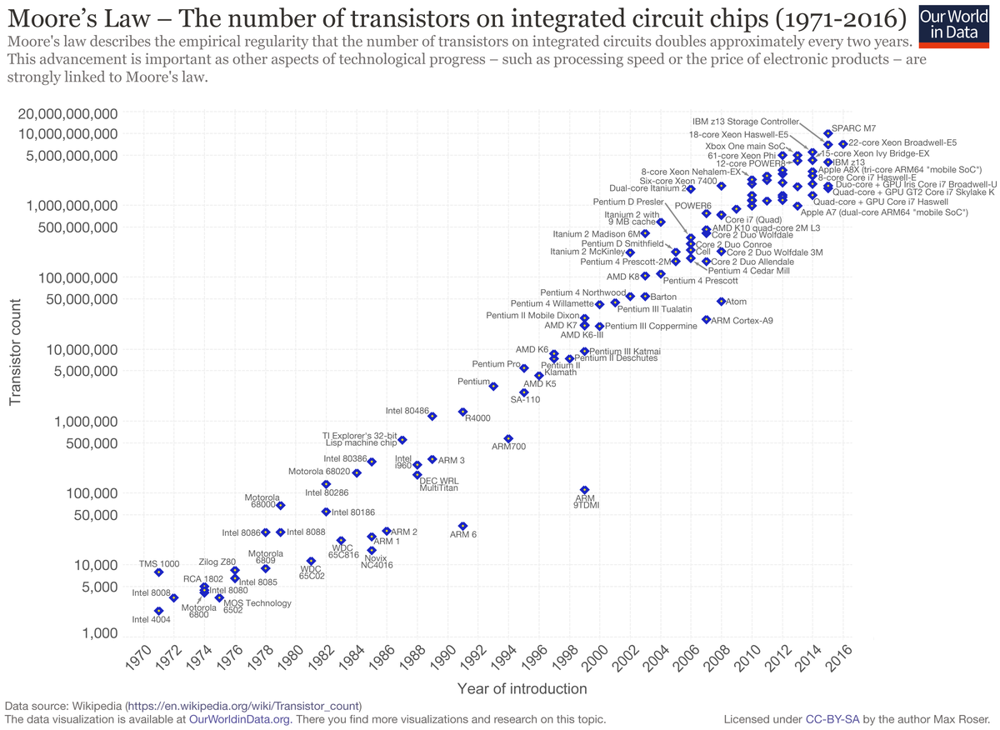

# Sistemas Operativos Modernos — Capítulo 1

**Andrew S. Tanenbaum · Herbert Bos · 4ª Edición**  
Vrije Universiteit Amsterdam

---

## Contenido

- [1.1 ¿Qué es un Sistema Operativo?](#11-qué-es-un-sistema-operativo)
- [1.2 Historia de los Sistemas Operativos](#12-historia-de-los-sistemas-operativos)
  - [1.2.1 Primera Generación (1945–1955)](#121-primera-generación-19451955-válvulas-de-vacío)
  - [1.2.2 Segunda Generación (1955–1965)](#122-segunda-generación-19551965-transistores-y-sistemas-batch)
  - [1.2.3 Tercera Generación (1965–1980)](#123-tercera-generación-19651980-circuitos-integrados-y-multiprogramación)
  - [1.2.4 Cuarta Generación (1980–Presente)](#124-cuarta-generación-1980presente-computadoras-personales)
  - [1.2.5 Quinta Generación (1990–Presente)](#125-quinta-generación-1990presente-computadoras-móviles)
- [1.3 Revisión del Hardware de Computadoras](#13-revisión-del-hardware-de-computadoras)
  - [1.3.1 Procesadores](#131-procesadores)
  - [1.3.2 Memoria](#132-memoria)
  - [1.3.3 Discos](#133-discos)
  - [1.3.4 Dispositivos de E/S](#134-dispositivos-de-es)
  - [1.3.5 Buses](#135-buses)
  - [1.3.6 Arranque del computador](#136-arranque-del-computador)
- [1.4 El Zoológico de los Sistemas Operativos](#14-el-zoológico-de-los-sistemas-operativos)
  - [1.4.1 SO para Mainframes](#141-so-para-mainframes)
  - [1.4.2 SO para Servidores](#142-so-para-servidores)
  - [1.4.3 SO para Multiprocesadores](#143-so-para-multiprocesadores)
  - [1.4.4 SO para Computadoras Personales](#144-so-para-computadoras-personales)
  - [1.4.5 SO para Dispositivos de Mano](#145-so-para-dispositivos-de-mano)
  - [1.4.6 SO Embebidos](#146-so-embebidos)
  - [1.4.7 SO para Nodos Sensores](#147-so-para-nodos-sensores)
  - [1.4.8 SO de Tiempo Real](#148-so-de-tiempo-real)
  - [1.4.9 SO para Tarjetas Inteligentes](#149-so-para-tarjetas-inteligentes)
- [1.5 Conceptos de Sistemas Operativos](#15-conceptos-de-sistemas-operativos)
  - [1.5.1 Procesos](#151-procesos)
  - [1.5.2 Espacios de Direcciones](#152-espacios-de-direcciones)
  - [1.5.3 Archivos](#153-archivos)
  - [1.5.4 Entrada/Salida](#154-entradasalida)
  - [1.5.5 Protección](#155-protección)
  - [1.5.6 El Shell](#156-el-shell)
  - [1.5.7 La Ontogenia Recapitula la Filogenia](#157-la-ontogenia-recapitula-la-filogenia)
- [1.6 Llamadas al Sistema](#16-llamadas-al-sistema)
  - [1.6.1 Llamadas al Sistema para Gestión de Procesos](#161-llamadas-al-sistema-para-gestión-de-procesos)
  - [1.6.2 Llamadas al Sistema para Gestión de Archivos](#162-llamadas-al-sistema-para-gestión-de-archivos)
  - [1.6.3 Llamadas al Sistema para Gestión de Directorios](#163-llamadas-al-sistema-para-gestión-de-directorios)
  - [1.6.4 Llamadas Misceláneas](#164-llamadas-misceláneas)
  - [1.6.5 La API Win32 de Windows](#165-la-api-win32-de-windows)
- [1.7 Estructura del Sistema Operativo](#17-estructura-del-sistema-operativo)
  - [1.7.1 Sistemas Monolíticos](#171-sistemas-monolíticos)
  - [1.7.2 Sistemas en Capas](#172-sistemas-en-capas)
  - [1.7.3 Microkernels](#173-microkernels)
  - [1.7.4 Modelo Cliente-Servidor](#174-modelo-cliente-servidor)
  - [1.7.5 Máquinas Virtuales](#175-máquinas-virtuales)
  - [1.7.6 Exokernels](#176-exokernels)
- [1.9 Investigación sobre Sistemas Operativos](#19-investigación-sobre-sistemas-operativos)
- [1.12 Resumen del Capítulo](#112-resumen-del-capítulo)

---

## 1.1 ¿Qué es un Sistema Operativo?

Un sistema operativo es una **capa de software** que proporciona a los programas de usuario un modelo más simple y limpio del hardware, y que gestiona todos los recursos de la computadora.

La mayoría de los computadores tienen **dos modos de operación**:

| Modo | Descripción |
|------|-------------|
| **Kernel (supervisor)** | Acceso completo al hardware y a todas las instrucciones del procesador. Aquí corre el SO. |
| **Usuario** | Subconjunto restringido de instrucciones. Las instrucciones de E/S y protección de memoria están prohibidas. |

La transición de modo usuario a modo kernel ocurre mediante una instrucción especial llamada **TRAP** (llamada al sistema / syscall).

> *"El trabajo del SO es proporcionar abstracciones limpias a los programas de usuario y administrar los recursos de hardware."*
> — Tanenbaum & Bos

### 1.1.1 El SO como Máquina Extendida

La arquitectura a nivel de lenguaje máquina es **primitiva e incómoda de programar**, especialmente para E/S. El SO oculta esa complejidad y ofrece abstracciones de alto nivel:

- **Disco** → abstracción de **archivos** (`open`, `read`, `write`, `close`)
- **CPU** → abstracción de **procesos** (programas en ejecución)
- **RAM** → abstracción de **espacio de direcciones** virtual
- **Hardware de red** → abstracción de **sockets**


*Fig. 1-1. Dónde se ubica el SO en el sistema (modo kernel vs. modo usuario).*

### 1.1.2 El SO como Gestor de Recursos

Desde una perspectiva **bottom-up**, el SO administra todos los componentes del sistema. Cuando múltiples programas intentan usar el mismo recurso simultáneamente, el SO arbitra los conflictos.

El SO **multiplexa** los recursos de dos maneras:

| Tipo | Descripción | Ejemplo |
|------|-------------|---------|
| **Multiplexación en tiempo** | Los procesos se turnan para usar el recurso | CPU asignada por turnos (scheduling) |
| **Multiplexación en espacio** | El recurso se divide en porciones | RAM dividida en particiones para distintos procesos |


*Fig. 1-2. El SO convierte la interfaz fea del hardware en abstracciones bellas para las aplicaciones.*

---

## 1.2 Historia de los Sistemas Operativos

Los SO han evolucionado estrechamente ligados a la arquitectura del hardware. Se identifican **cinco generaciones** principales.

---

### 1.2.1 Primera Generación (1945–1955): Válvulas de vacío

**Tecnología:** Válvulas de vacío (~20 000 por máquina)  
**Sistemas operativos:** Ninguno  
**Lenguajes:** Lenguaje máquina, tableros de cables (plugboards)

#### Características

- Máquinas enormes: ENIAC, Colossus, Mark I, Z3.
- Un mismo grupo diseñaba, construía, programaba, operaba y mantenía cada máquina.
- Programación directamente en código binario o tableros de cables.
- Las válvulas se quemaban constantemente; sin resultados se perdía el tiempo reservado.
- **1950:** Se introducen **tarjetas perforadas** para leer programas.

#### Modo de operación típico

1. El programador reservaba una franja horaria.
2. Llegaba con su tablero de cables o tarjetas perforadas.
3. Cargaba y ejecutaba su programa durante el tiempo asignado.
4. Si una válvula fallaba, perdía la sesión sin resultados.

---

### 1.2.2 Segunda Generación (1955–1965): Transistores y sistemas batch

**Tecnología:** Transistores  
**Sistemas operativos:** FMS (Fortran Monitor System), IBSYS  
**Lenguajes:** FORTRAN, ensamblador

#### Características

- Los transistores hicieron los computadores suficientemente fiables para venderse como **mainframes**.
- Surgió la separación de roles: diseñadores, constructores, operadores, programadores y mantenimiento.
- Solo grandes corporaciones, agencias gubernamentales y universidades podían costearlos.

#### El flujo de trabajo batch


*Fig. 1-3. Sistema batch: (a) programador trae tarjetas al IBM 1401, (b) 1401 lee y graba en cinta, (c-d) IBM 7094 computa, (e-f) 1401 imprime resultados.*

Pasos detallados:

1. El programador escribe el programa en papel (FORTRAN/ensamblador).
2. Perfora el programa en tarjetas perforadas.
3. El operador acumula un lote y los lee en el **IBM 1401** → cinta magnética.
4. La cinta se lleva al **IBM 7094** para el cómputo real.
5. Los resultados se graban en otra cinta de salida.
6. La cinta de salida se lleva al IBM 1401 para imprimir.
7. El programador recoge su salida impresa horas después.

#### Estructura de un trabajo FMS típico

```
$JOB, 10, 7710802, MARVIN TANENBAUM   ← tiempo máximo, cuenta, nombre
$FORTRAN                               ← cargar compilador FORTRAN
  [código fuente del programa]
$LOAD                                  ← cargar programa compilado
$RUN                                   ← ejecutar con datos siguientes
  [datos de entrada]
$END                                   ← fin del trabajo
```

> Estas **tarjetas de control** son los precursores de los shells e intérpretes de comandos modernos.

---

### 1.2.3 Tercera Generación (1965–1980): Circuitos integrados y multiprogramación

**Tecnología:** Circuitos integrados (IC)  
**Sistemas operativos:** OS/360, MULTICS, UNIX, CTSS  
**Lenguajes:** FORTRAN, C, ensamblador

#### El IBM System/360

IBM unificó sus dos líneas incompatibles con el **System/360**: una familia con la misma arquitectura pero diferente precio y rendimiento. El SO resultante (OS/360) tenía millones de líneas de ensamblador y miles de bugs. Fred Brooks describió su experiencia en *The Mythical Man-Month* (1975).

#### Multiprogramación


*Fig. 1-5. Multiprogramación: mientras Job A espera E/S, la CPU ejecuta Job B o Job C.*

Cuando un trabajo esperaba una operación de E/S (que podía ocupar el 80–90% del tiempo), la CPU quedaba ociosa. La solución: **mantener varios trabajos en memoria** y conmutar entre ellos.

#### Técnicas clave

| Técnica | Descripción |
|---------|-------------|
| **Multiprogramación** | Varios jobs en memoria; CPU cambia al siguiente cuando uno espera E/S |
| **Spooling** | Jobs leídos directamente al disco; elimina el transporte manual de cintas |
| **Timesharing** | Cada usuario tiene terminal online; CPU se reparte por turnos cortos |

#### El nacimiento de UNIX

```
1965  MULTICS (MIT + Bell Labs + GE)
1969  Ken Thompson escribe UNIX en un PDP-7 (simplificación de MULTICS)
1973  UNIX reescrito en C → portabilidad a distintas arquitecturas
1974  Código fuente disponible → System V (AT&T) y BSD (UC Berkeley)
1987  POSIX (IEEE): estándar mínimo de llamadas al sistema
1987  MINIX (Tanenbaum): clon educativo de UNIX
1991  Linux (Linus Torvalds): inspirado en MINIX, open source, GPL
```

---

### 1.2.4 Cuarta Generación (1980–Presente): Computadoras personales

**Tecnología:** LSI (Large Scale Integration) — miles de transistores por chip  
**Sistemas operativos:** CP/M, MS-DOS, Windows, macOS, Linux

#### Línea de tiempo

| Año | Evento |
|-----|--------|
| 1974 | Intel 8080. Gary Kildall crea **CP/M**. |
| 1981 | IBM PC + **MS-DOS** (Bill Gates compra DOS a Seattle Computer Products por ~$75 000). |
| 1984 | **Apple Macintosh**: primera GUI de éxito masivo (ideas de Xerox PARC). |
| 1985 | **Windows 1.0**: interfaz gráfica sobre MS-DOS. |
| 1991 | **Linux** (Linus Torvalds). Open source, licencia GPL. |
| 1995 | **Windows 95**: primer Windows autónomo. **Windows NT**: reescritura completa de 32 bits. |
| 1999 | **Mac OS X**: basado en microkernel Mach + BSD (UNIX certificado POSIX). |
| 2001 | **Windows XP**: unifica líneas doméstica y NT. |
| 2007 | **Windows Vista**: criticado por requisitos y restricciones DRM. |
| 2009 | **Windows 7**: más ligero y estable. |
| 2012 | **Windows 8**: interfaz orientada a pantallas táctiles. |

---

### 1.2.5 Quinta Generación (1990–Presente): Computadoras móviles

**Tecnología:** Chips ARM de bajo consumo, pantallas táctiles, conectividad ubicua  
**Sistemas operativos:** Symbian, BlackBerry OS, iOS, Android

#### Línea de tiempo

| Año | Evento |
|-----|--------|
| 1946 | Primer teléfono móvil (~40 kg, para automóvil). |
| 1970s | Primer teléfono portátil (~1 kg, "el ladrillo"). |
| 1996 | **Nokia N9000**: primer smartphone (teléfono + PDA). |
| 1997 | Ericsson acuña el término **"smartphone"** (GS88 "Penelope"). |
| 2002 | **BlackBerry OS** (RIM): domina el mercado empresarial. |
| 2007 | **iOS** (Apple): lanzado con el primer iPhone. Revoluciona la interfaz táctil. |
| 2008 | **Android** (Google): basado en Linux, open source. Los fabricantes pueden modificarlo. |
| 2011 | Android supera a todos sus rivales. Nokia abandona Symbian. |
| 2013+ | Android domina con >80% del mercado global. iOS es segundo claro. |

---

## 1.3 Revisión del Hardware de Computadoras

El SO está **íntimamente ligado al hardware** que gestiona. Debe conocer a fondo la CPU, la memoria, los discos y los dispositivos de E/S para manejarlos eficientemente.


*Fig. 1-6. Componentes de una PC: CPU, memoria y dispositivos E/S conectados por el bus del sistema.*

---

### 1.3.1 Procesadores

La CPU es el "cerebro" del computador. Su ciclo básico es:

```
Fetch → Decode → Execute → (repetir)
```

#### Registros importantes

| Registro | Función |
|----------|---------|
| **PC** (Program Counter) | Dirección de la próxima instrucción a ejecutar |
| **SP** (Stack Pointer) | Apunta al tope de la pila del proceso actual |
| **PSW** (Program Status Word) | Bits de condición, prioridad de CPU, modo (kernel/usuario) |

#### Modos de operación

- **Modo kernel:** puede ejecutar cualquier instrucción y acceder a cualquier dirección.
- **Modo usuario:** instrucciones de E/S y protección de memoria están prohibidas.
- Cambio de modo: instrucción **TRAP** → entra al kernel → ejecuta syscall → retorna a usuario.

#### Mejoras de rendimiento

**Pipeline y CPU Superescalar:**


*Fig. 1-7. (a) Pipeline de 3 etapas: Fetch, Decode, Execute simultáneos. (b) CPU superescalar: múltiples unidades de ejecución en paralelo.*

**Multihilo (Hyperthreading):** un núcleo físico mantiene el estado de 2 hilos y conmuta en nanosegundos, aprovechando ciclos ociosos durante accesos a memoria.

**Multicore:** varios núcleos completos en un chip (4, 8, 16, 64+). Cada núcleo ve al SO como una CPU separada.

**GPU:** miles de núcleos pequeños, excelente para paralelismo masivo (renderizado, machine learning).

#### Ley de Moore

> El número de transistores en un chip se duplica cada ~18 meses.  
> — Gordon Moore, cofundador de Intel (1965)

Ha sido válida por más de 3 décadas y está llegando a sus límites físicos a escala atómica.




---

### 1.3.2 Memoria

El sistema de memoria se construye como una **jerarquía de capas**:


*Fig. 1-9. Jerarquía de memoria: a mayor velocidad, menor capacidad y mayor costo por bit.*

| Nivel | Tiempo de acceso | Capacidad típica | Volátil |
|-------|-----------------|------------------|---------|
| Registros CPU | ~1 ns | < 1 KB | Sí |
| Caché L1/L2/L3 | ~2–10 ns | 4–32 MB | Sí |
| RAM (DRAM) | ~10 ns | 1–64 GB | Sí |
| Disco HDD | ~10 ms | 1–4 TB | No |
| Disco SSD | ~0.1 ms | 0.5–8 TB | No |

#### Memoria caché

- Controlada principalmente por **hardware**.
- Memoria principal dividida en **líneas de caché** de 64 bytes.
- **Cache hit:** dato encontrado en caché (~2 ciclos) → muy rápido.
- **Cache miss:** hay que ir a RAM → penalización significativa.

#### Tipos de memoria no volátil

| Tipo | Descripción | Uso típico |
|------|-------------|------------|
| **ROM** | Programada en fábrica, no modificable | Firmware antiguo |
| **EEPROM** | Eléctricamente borrable y reprogramable | BIOS/UEFI |
| **Flash** | No volátil, reescribible | SSD, USB, tarjetas SD |
| **CMOS** | Volátil, mantenida por batería | Hora, fecha, parámetros de arranque |

> **Principio de localidad:** los programas tienden a acceder repetidamente a las mismas regiones de memoria (localidad temporal) y a regiones contiguas (localidad espacial). Por eso las cachés son tan eficientes.

---

### 1.3.3 Discos

#### Disco duro (HDD)


*Fig. 1-10. Estructura de un disco duro: platos magnéticos giratorios con brazo de lectura/escritura.*

- **Platos:** discos metálicos recubiertos de material magnético, girando a 5400–10 800 RPM.
- **Brazo mecánico:** se desplaza radialmente para posicionar la cabeza.
- **Organización:** cilindros → pistas → sectores (512 B o 4 KB).
- **Tiempo de acceso:** ~10 ms → **100 000× más lento que la RAM**.
- **Capacidad:** 1–4 TB en discos de consumo; hasta 20 TB en servidores.

#### SSD (Solid State Drive)

- Memoria **flash** no volátil, sin partes móviles.
- Tiempo de acceso: ~0.1 ms (100× más rápido que HDD).
- El SO debe gestionar el **desgaste** (wear leveling): cada celda flash soporta ~10 000 escrituras.
- Más caro por GB que HDD.

---

### 1.3.4 Dispositivos de E/S

Cada dispositivo de E/S tiene dos partes:

1. **Controlador de hardware:** chip(s) en la tarjeta del dispositivo que controla el hardware físico.
2. **Driver de software (SO):** código en el SO que interactúa con el controlador.

#### Mecanismos de comunicación CPU ↔ Dispositivo

**Interrupciones (método principal):**

```
1. La CPU inicia operación E/S (ej: leer sector de disco)
2. La CPU sigue ejecutando otros procesos
3. Al completar, el controlador envía señal de interrupción (IRQ)
4. La CPU suspende el proceso actual (guarda contexto en la pila)
5. El SO atiende la interrupción (Interrupt Service Routine)
6. El SO retoma el proceso que esperaba los datos
```

**DMA (Direct Memory Access):**

```
Sin DMA:  CPU gestiona cada byte → CPU → Controlador → Memoria
Con DMA:  CPU inicia → DMA transfiere bloque entero → Memoria
                    → DMA interrumpe a CPU al terminar
```

El DMA libera a la CPU de transferencias masivas de datos.

---

### 1.3.5 Buses


*Fig. 1-12. Arquitectura x86 moderna: CPU con controlador de memoria integrado, GPU vía PCIe, y plataforma de E/S (PCH) con USB, SATA y Ethernet.*

#### Buses principales

| Bus | Velocidad | Uso |
|-----|-----------|-----|
| **PCIe** (PCI Express) | Hasta 128 GB/s (x16 Gen 5) | GPU, SSD NVMe, tarjetas de red |
| **USB 3.0 / 3.2** | 5–20 Gbps | Periféricos externos |
| **SATA III** | 6 Gbps | Discos HDD/SSD |
| **DDR4/DDR5** | 25–100 GB/s | RAM ↔ CPU |
| **DMI** | ~40 Gbps | CPU ↔ Platform Controller Hub |

**PCI clásico vs. PCIe:**
- **PCI:** bus paralelo compartido → contención entre dispositivos.
- **PCIe:** bus **serie punto a punto** → canal dedicado por dispositivo, más rápido y sin contención.

---

### 1.3.6 Arranque del computador

```
Encendido
    │
    ▼
BIOS / UEFI  (firmware en ROM/Flash de la placa base)
    │  POST: verifica CPU, RAM y dispositivos
    │  Busca dispositivo de arranque (disco, USB, red)
    ▼
Bootloader  (GRUB, Windows Boot Manager…)
    │  Cargado desde el sector de arranque del disco
    │  Localiza el kernel del SO en el sistema de archivos
    ▼
Kernel del SO
    │  Se carga en RAM
    │  Inicializa: gestión de memoria, planificador, drivers, sistema de archivos
    │  Monta el sistema de archivos raíz
    ▼
Proceso init / systemd  (PID 1)
    │  Lanza servicios del sistema
    ▼
Interfaz de usuario  (login / GUI)
```

**BIOS vs. UEFI:**

| Característica | BIOS | UEFI |
|----------------|------|------|
| Interfaz | Texto, 16-bit | Gráfica, 32/64-bit |
| Tabla de particiones | MBR (máx. 2 TB, 4 primarias) | GPT (máx. 9.4 ZB, 128 particiones) |
| Secure Boot | No | Sí |
| Velocidad de arranque | Lenta | Rápida |

---

## 1.4 El Zoológico de los Sistemas Operativos

Los sistemas operativos han evolucionado en distintas direcciones para satisfacer las necesidades de muy diferentes tipos de computadoras. A continuación se describe cada categoría principal.

---

### 1.4.1 SO para Mainframes

Los **mainframes** son computadoras del tamaño de una habitación que procesan millones de transacciones por segundo. Sus SO (como **OS/390**, evolución del OS/360) soportan tres tipos de trabajo simultáneamente:

| Tipo de trabajo | Descripción |
|-----------------|-------------|
| **Batch** | Trabajos rutinarios sin interacción del usuario (liquidación de nóminas, actualizaciones de inventario) |
| **Procesamiento de transacciones** | Miles de peticiones breves por segundo (reservas aéreas, operaciones bancarias) |
| **Timesharing** | Múltiples usuarios remotos ejecutando consultas interactivas |

Hoy los mainframes sobreviven en grandes bancos y aerolíneas, pero Linux los está desplazando gradualmente.

---

### 1.4.2 SO para Servidores

Los servidores sirven a múltiples usuarios a través de redes. Sus SO deben gestionar bien los recursos compartidos:

- **Solaris**, **FreeBSD**, **Linux**, **Windows Server** son los más comunes.
- Ofrecen servicios de archivos, impresión, web y bases de datos.
- Se ejecutan en hardware de alta gama con múltiples procesadores y terabytes de almacenamiento.

---

### 1.4.3 SO para Multiprocesadores

Al conectar varios procesadores en un mismo sistema se obtiene una enorme potencia de cómputo. Los SO para multiprocesadores son básicamente variaciones de los SO de servidor con características añadidas de **comunicación y coherencia entre procesadores**.

---

### 1.4.4 SO para Computadoras Personales

El objetivo es proporcionar buena experiencia a un **usuario individual**. Los más usados son:

- **Linux**, **FreeBSD**, **Windows 7/8/10/11**, **macOS (OS X)**

Todos ofrecen interfaz gráfica, gestión de procesos, sistema de archivos y soporte multimedia.

---

### 1.4.5 SO para Dispositivos de Mano

Incluyen **PDAs**, **tabletas** y **smartphones**. Sus restricciones son:

- Memoria y CPU limitadas
- Pantalla pequeña y táctil
- Batería como recurso crítico

Los SO dominantes son:
- **Android** (Google): basado en Linux, open source, modificable por fabricantes
- **iOS** (Apple): derivado de BSD/Mach, cerrado, eficiente

---

### 1.4.6 SO Embebidos

Se ejecutan en dispositivos que **no son considerados computadoras** por sus usuarios: microondas, TVs, automóviles, reproductores de DVD, teléfonos IP, equipos médicos.

Características clave:
- No permiten instalar software por parte del usuario
- Todo el software está en ROM
- Deben ser extremadamente fiables (fallar en un avión o en un marcapasos es inaceptable)

SO embebidos comunes: **Embedded Linux**, **QNX**, **VxWorks**.

---

### 1.4.7 SO para Nodos Sensores

Las redes de sensores están formadas por diminutos nodos que miden temperatura, humedad, movimiento o radiación, y envían los datos de forma inalámbrica.

- Funcionan con **batería** (deben durar años)
- Procesadores lentos y memoria escasa
- SO típico: **TinyOS** — orientado a eventos, sin bloqueos, muy compacto

---

### 1.4.8 SO de Tiempo Real

El requisito fundamental es que **las acciones deben completarse dentro de plazos estrictos**:

| Tipo | Consecuencia de incumplir el plazo | Ejemplo |
|------|------------------------------------|---------|
| **Tiempo real duro** | Falla catastrófica o peligrosa | Control de motor de avión, marcapasos |
| **Tiempo real suave** | Degradación de calidad tolerable | Streaming de vídeo, audio digital |

SO representativo: **eCos** (software libre para sistemas empotrados de tiempo real).

---

### 1.4.9 SO para Tarjetas Inteligentes

Las **smart cards** contienen un chip y ejecutan un SO extremadamente básico. Algunas incluyen una **JVM** (Java Virtual Machine) para ejecutar applets Java. Sus principales limitaciones son la energía (tomada del lector) y la memoria (<1 KB de RAM).

---

## 1.5 Conceptos de Sistemas Operativos

Todo SO proporciona ciertas abstracciones fundamentales a los programas. A continuación se describen los conceptos esenciales.

---

### 1.5.1 Procesos

Un **proceso** es esencialmente un **programa en ejecución**. Asociado a cada proceso hay:

- Su **espacio de direcciones** (mapa de memoria): segmentos de texto, datos y pila
- El contenido de los **registros del CPU** (PC, SP, PSW, etc.)
- Información del SO: **tabla de procesos** (*process table*), que almacena el estado de cada proceso

#### Llamadas clave para gestión de procesos (UNIX)

```c
fork()      // Crea una copia exacta del proceso actual (proceso hijo)
exec()      // Reemplaza la imagen del proceso con un nuevo programa
waitpid()   // El padre espera que el hijo termine
exit()      // El proceso termina y devuelve un código de estado
```

#### Comunicación entre procesos

El SO gestiona las **señales** (*signals*): notificaciones asíncronas enviadas a un proceso (equivalente a interrupciones por software). Cada proceso puede definir su manejador de señal o usar el comportamiento por defecto.

#### Identificación

- **UID** (*User ID*): identifica al usuario propietario del proceso
- **GID** (*Group ID*): identifica el grupo al que pertenece
- Un proceso con UID = 0 es el **superusuario (root)** y tiene privilegios totales

---

### 1.5.2 Espacios de Direcciones

Cada proceso tiene su propio **espacio de direcciones virtual**, que el hardware (MMU) traduce a direcciones físicas de RAM.

- En arquitecturas de 32 bits: espacio de hasta **2³² = 4 GB**
- En arquitecturas de 64 bits: espacio de hasta **2⁶⁴ bytes** (teóricamente)

La **memoria virtual** permite que el espacio de direcciones de un proceso sea mayor que la RAM física disponible, paginando partes al disco de forma transparente.

---

### 1.5.3 Archivos

El SO provee una abstracción de **archivo** que oculta los detalles del hardware de almacenamiento.

#### Jerarquía de directorios

```
/ (raíz)
├── bin/          ← ejecutables del sistema
├── etc/          ← archivos de configuración
├── home/
│   └── alice/    ← directorio home de un usuario
│       └── docs/
│           └── reporte.pdf
└── tmp/
```

- **Ruta absoluta:** `/home/alice/docs/reporte.pdf`
- **Ruta relativa:** `docs/reporte.pdf` (desde `/home/alice`)

#### Descriptor de archivo (*file descriptor*)

Entero pequeño que identifica un archivo abierto. Estándar en UNIX:

| FD | Canal |
|----|-------|
| 0 | Entrada estándar (stdin) |
| 1 | Salida estándar (stdout) |
| 2 | Error estándar (stderr) |

#### Archivos especiales

| Tipo | Descripción | Ejemplo |
|------|-------------|---------|
| **Block special** | Dispositivos de almacenamiento por bloques | `/dev/sda` (disco) |
| **Character special** | Dispositivos carácter a carácter | `/dev/tty` (terminal) |
| **Pipe (tubería)** | Comunicación entre procesos | `ls | grep txt` |

#### Sistemas de archivos montados

UNIX unifica múltiples dispositivos en un solo árbol mediante `mount`. Un disco USB montado en `/mnt/usb` aparece como directorio más, de forma transparente.

---

### 1.5.4 Entrada/Salida

El SO abstrae los dispositivos de E/S mediante:

- **Drivers** de dispositivo: código específico del fabricante
- **Software independiente del dispositivo**: capa intermedia del SO que provee una interfaz uniforme

Las operaciones de E/S pueden ser:
- **Síncronas (bloqueantes):** el proceso espera a que termine la operación
- **Asíncronas (no bloqueantes):** el proceso continúa y es notificado por interrupción

---

### 1.5.5 Protección

UNIX controla el acceso a archivos mediante un código de **9 bits** dividido en tres grupos de 3 bits (rwx):

```
rwxr-xr--
│││ │││ │││
│││ │││ └──  Otros:   r=leer, w=no escribir, x=no ejecutar
│││ └──────  Grupo:   r=leer, x=ejecutar
└──────────  Propietario: r=leer, w=escribir, x=ejecutar
```

El comando `chmod 755 archivo` establece estos permisos numéricamente:

| Valor | Bits | Permisos |
|-------|------|----------|
| 7 | 111 | rwx |
| 5 | 101 | r-x |
| 4 | 100 | r-- |

---

### 1.5.6 El Shell

El **shell** es el intérprete de comandos: un proceso de usuario que acepta órdenes, las ejecuta y devuelve resultados. No forma parte del SO, pero lo utiliza intensivamente.

Shells más comunes: `sh`, `csh`, `ksh`, **`bash`** (Bourne-Again Shell)

#### Características principales

```bash
# Redirección de entrada/salida
ls > archivos.txt        # stdout → archivo
sort < datos.txt         # stdin  ← archivo
ls 2> errores.txt        # stderr → archivo

# Tuberías (pipes): encadenar comandos
cat archivo | grep "clave" | sort | uniq

# Procesos en segundo plano
./compilar_proyecto &    # El '&' lo ejecuta en background

# Variables de entorno
echo $HOME               # Directorio del usuario actual
echo $PATH               # Rutas de búsqueda de ejecutables
```

---

### 1.5.7 La Ontogenia Recapitula la Filogenia

Existe un patrón curioso: cada vez que aparece un nuevo tipo de computadora (mainframes → PCs → smartphones), repite la misma evolución que sus predecesores: primero sin SO, luego básico, luego más sofisticado.

| Recurso | Historia |
|---------|----------|
| **Memoria grande** | Los primeros PCs tenían 32 KB; hoy tienen 32 GB. Las técnicas de gestión (overlays, swapping, paginación) evolucionaron igual que en mainframes |
| **Hardware de protección** | Los primeros PC no tenían; se añadió después conforme se necesitó multitarea |
| **Discos** | Primero sin SO de archivos, luego CP/M, luego FAT, NTFS, ext4 |
| **Memoria virtual** | Primero inexistente en PCs, luego adoptada de mainframes |

Este ciclo recurrente fue llamado la **"rueda de la reencarnación"** por los investigadores de SO.

---

## 1.6 Llamadas al Sistema

Las **llamadas al sistema** (*system calls*) son la interfaz entre los programas de usuario y el SO. Permiten que los programas soliciten servicios del kernel de forma controlada.

#### Mecanismo de una llamada al sistema

El siguiente ejemplo muestra los 11 pasos de `count = read(fd, buffer, nbytes)`:

```
Programa de usuario          Biblioteca C           Kernel (SO)
─────────────────────────   ──────────────────     ────────────────────
1. count = read(fd,buf,n) →
2.                            Parámetros en pila
3.                            TRAP (instrucción)  →
4.                                                  Dispatcher
5.                                                  Manejador de read
6.                                                  ← Retorna resultado
7.                            ← Retorna de TRAP
8. Resultado en count    ←
```

El programa de usuario **nunca accede directamente al hardware**; siempre pasa por la capa del SO.

---

### 1.6.1 Llamadas al Sistema para Gestión de Procesos

| Llamada | Descripción |
|---------|-------------|
| `pid = fork()` | Crea un proceso hijo idéntico al padre. Retorna 0 en el hijo, PID del hijo en el padre |
| `pid = waitpid(pid, &stat, opts)` | Espera a que un hijo termine; recibe su código de salida |
| `s = execve(name, argv, envp)` | Reemplaza la imagen del proceso con el programa `name` |
| `exit(status)` | Termina el proceso y devuelve `status` al padre |

#### Ejemplo: shell simplificado

```c
while (TRUE) {
    read_command(command, params);      // leer orden del usuario
    if (fork() != 0) {                  // proceso padre
        waitpid(-1, &status, 0);        // esperar al hijo
    } else {                            // proceso hijo
        execve(command, params, 0);     // ejecutar el comando
    }
}
```

---

### 1.6.2 Llamadas al Sistema para Gestión de Archivos

| Llamada | Descripción |
|---------|-------------|
| `fd = open(file, flags, mode)` | Abre o crea un archivo; retorna descriptor |
| `s = close(fd)` | Cierra el descriptor de archivo |
| `n = read(fd, buffer, nbytes)` | Lee hasta `nbytes` del archivo en `buffer` |
| `n = write(fd, buffer, nbytes)` | Escribe `nbytes` de `buffer` al archivo |
| `pos = lseek(fd, offset, whence)` | Reposiciona el puntero del archivo |
| `s = stat(name, &buf)` | Obtiene metadatos del archivo (tamaño, fechas, permisos) |

Flags comunes de `open()`:

```c
O_RDONLY    // solo lectura
O_WRONLY    // solo escritura
O_RDWR      // lectura y escritura
O_CREAT     // crear si no existe
O_TRUNC     // truncar a 0 bytes si existe
```

---

### 1.6.3 Llamadas al Sistema para Gestión de Directorios

| Llamada | Descripción |
|---------|-------------|
| `s = mkdir(name, mode)` | Crea un directorio |
| `s = rmdir(name)` | Elimina un directorio vacío |
| `s = link(old, new)` | Crea un enlace duro: `new` apunta al mismo i-nodo que `old` |
| `s = unlink(name)` | Elimina una entrada de directorio (borra el archivo si es el último enlace) |
| `s = mount(spec, name, flag)` | Monta un sistema de archivos en el árbol |
| `s = umount(name)` | Desmonta un sistema de archivos |

#### I-nodos e I-numbers

Cada archivo tiene un **i-nodo**: estructura interna que guarda metadatos (propietario, permisos, tamaño, tiempos, bloques de datos). El directorio relaciona nombres con **i-numbers** (índices de i-nodos).

`link()` permite que **dos nombres apunten al mismo i-nodo** (mismo archivo, mismo contenido).

---

### 1.6.4 Llamadas Misceláneas

| Llamada | Descripción |
|---------|-------------|
| `s = chdir(dirname)` | Cambia el directorio de trabajo actual |
| `s = chmod(name, mode)` | Cambia los permisos de acceso de un archivo |
| `s = kill(pid, signal)` | Envía una señal al proceso con PID dado |
| `seconds = time(&t)` | Retorna el tiempo actual en segundos (época UNIX: 1 enero 1970) |

---

### 1.6.5 La API Win32 de Windows

Windows no usa las llamadas POSIX directamente. En su lugar expone la **API Win32** (también llamada WinAPI), un conjunto de miles de funciones documentadas en MSDN.

Diferencia conceptual clave:

| Paradigma | Sistema | Descripción |
|-----------|---------|-------------|
| **Orientado a procedimientos** | UNIX/Linux | El programa ejecuta instrucciones secuenciales; llama al SO cuando necesita servicios |
| **Orientado a eventos** | Windows | El programa responde a eventos del entorno (clicks, mensajes de ventana, timers) |

#### Equivalencias seleccionadas UNIX ↔ Win32

| UNIX | Win32 | Función |
|------|-------|---------|
| `fork` / `exec` | `CreateProcess` | Crear proceso |
| `waitpid` | `WaitForSingleObject` | Esperar proceso |
| `exit` | `ExitProcess` | Terminar proceso |
| `open` | `CreateFile` | Abrir/crear archivo |
| `close` | `CloseHandle` | Cerrar handle |
| `read` | `ReadFile` | Leer archivo |
| `write` | `WriteFile` | Escribir archivo |
| `lseek` | `SetFilePointer` | Mover puntero |
| `stat` | `GetFileAttributesEx` | Metadatos de archivo |
| `mkdir` | `CreateDirectory` | Crear directorio |
| `rmdir` | `RemoveDirectory` | Eliminar directorio |
| `chdir` | `SetCurrentDirectory` | Cambiar directorio |
| `time` | `GetLocalTime` | Obtener hora |

---

## 1.7 Estructura del Sistema Operativo

Existen varias formas de organizar internamente un SO. Cada enfoque tiene ventajas e inconvenientes en cuanto a rendimiento, fiabilidad y mantenibilidad.

---

### 1.7.1 Sistemas Monolíticos

Es la organización más común. **Todo el SO corre en modo kernel** como un único programa grande:

```
┌─────────────────────────────────┐
│        Programa principal       │  ← Recibe las syscalls
├─────────────────────────────────┤
│     Procedimientos de servicio  │  ← Implementan las syscalls
├─────────────────────────────────┤
│     Procedimientos utilitarios  │  ← Funciones auxiliares
└─────────────────────────────────┘
           Modo kernel
```

- Cualquier procedimiento puede llamar a cualquier otro → **muy eficiente**.
- Un bug en cualquier parte puede **derribar todo el sistema**.
- El SO se compila como un único binario; las **DLL / shared libraries** se cargan dinámicamente en tiempo de ejecución.

**Ejemplos:** Linux, FreeBSD, MS-DOS, Windows XP (en gran parte).

---

### 1.7.2 Sistemas en Capas

Generalización del monolítico: el SO se organiza como una **jerarquía de capas**, cada una construida sobre la anterior. Primer ejemplo: sistema **THE** (Dijkstra, 1968):

| Capa | Función |
|------|---------|
| 5 | Operador (usuario) |
| 4 | Programas de usuario |
| 3 | Gestión de E/S |
| 2 | Comunicación operador-proceso |
| 1 | Gestión de memoria y drum |
| 0 | Asignación de CPU y multiprogramación |

**MULTICS** llevó este concepto más lejos con **anillos concéntricos de protección**: los anillos interiores son más privilegiados. Un proceso en anillo externo necesita una instrucción TRAP verificada por hardware para acceder a un anillo interior.

- **Ventaja:** modularidad clara; cada capa sólo conoce la interfaz de la capa inferior.
- **Desventaja:** mayor overhead por el cruce de capas; difícil definir capas limpias en la práctica.

---

### 1.7.3 Microkernels

El diseño microkernel lleva al mínimo lo que corre en **modo kernel**. El kernel sólo gestiona:

- Manejo de interrupciones
- Comunicación entre procesos (IPC por mensajes)
- Planificación básica de procesos

**Todo lo demás** (drivers de dispositivo, sistema de archivos, red) corre como **procesos de usuario** independientes.

#### Ventajas del diseño microkernel

- Un bug en un driver sólo tumba ese proceso, **no todo el sistema**
- En un sistema monolítico de 5 millones de líneas puede haber entre **10 000 y 50 000 bugs en el kernel** — todos fatales

#### MINIX 3 como ejemplo

```
┌────────────────────────────────────────────┐
│  Shell  Make  ...    Programas de usuario  │  Modo usuario
├────────────────────────────────────────────┤
│  FS  Proc  Reinc  ...      Servidores      │
├────────────────────────────────────────────┤
│  Disk  TTY  Net  Print  ...   Drivers      │
├────────────────────────────────────────────┤
│  Microkernel (interrupciones, procesos,    │  Modo kernel
│               scheduling, IPC)  + Clock    │
└────────────────────────────────────────────┘
```

- El **servidor de reencarnación** (*reincarnation server*) vigila a los demás servidores y drivers; si uno falla, lo reemplaza automáticamente.
- Principio fundamental: **mecanismo en el kernel, política en el espacio de usuario**.

**Ejemplos:** MINIX 3, QNX, L4, Integrity, Symbian, iOS (parcialmente).

---

### 1.7.4 Modelo Cliente-Servidor

Variante del microkernel donde se distinguen dos clases de procesos:

- **Servidores:** ofrecen servicios (sistema de archivos, impresión, red)
- **Clientes:** solicitan esos servicios enviando mensajes

La comunicación es **por paso de mensajes**. El cliente construye un mensaje con su petición y lo envía al servidor adecuado; el servidor realiza el trabajo y responde.

```
[Cliente] ─── mensaje ──→ [Servidor de archivos]
[Cliente] ←── respuesta ─ [Servidor de archivos]
              (a través del microkernel o red)
```

**Generalización en red:** el mismo modelo funciona cuando clientes y servidores están en **máquinas distintas** conectadas por LAN o WAN. El cliente no necesita saber si el servidor está en la misma máquina o en otra — el modelo es transparente.

---

### 1.7.5 Máquinas Virtuales

#### VM/370 — el origen

El sistema **VM/370** de IBM (originalmente CP/CMS, 1970s) separó completamente dos funciones del SO:

1. **Multiprogramación** (gestión de múltiples procesos)
2. **Máquina extendida** (interfaz de alto nivel para el usuario)

El **monitor de máquina virtual** (*virtual machine monitor*, VMM) corre en el hardware real y presenta varias **máquinas virtuales idénticas al hardware físico** (incluyendo modo kernel/usuario, interrupciones, E/S):

```
┌────────┐  ┌────────┐  ┌────────┐   ← Máquinas virtuales (VMs)
│  CMS   │  │  CMS   │  │  CMS   │
└────┬───┘  └────┬───┘  └────┬───┘
     └───────────┴───────────┘
              VM/370 (VMM)
       ─────────────────────────
              Hardware 370
```

Cada VM puede ejecutar **cualquier SO** que corra en el hardware real.

#### Virtualización moderna

| Tipo | Descripción | Ejemplos |
|------|-------------|----------|
| **Hipervisor tipo 1** | Corre directamente sobre el hardware (sin SO anfitrión) | VMware ESXi, Xen, Hyper-V |
| **Hipervisor tipo 2** | Corre sobre un SO anfitrión como proceso de usuario | VMware Workstation, VirtualBox |
| **Paravirtualización** | El SO invitado es modificado para cooperar con el hipervisor | Xen con kernels modificados |

**Traducción binaria (*binary translation*):** técnica que traduce bloques de código en tiempo de ejecución para instrucciones no virtualizables.

#### La Máquina Virtual Java (JVM)

Sun Microsystems inventó la **JVM** para que el código Java fuera portable: el compilador genera *bytecode* para la JVM (arquitectura virtual), que luego se ejecuta en cualquier máquina que tenga un intérprete JVM. También permite ejecutar código con verificación de seguridad en un entorno protegido (*sandbox*).

---

### 1.7.6 Exokernels

En lugar de clonar la máquina completa (como VM/370), el exokernel **particiona los recursos físicos** directamente:

- Una VM puede recibir los bloques de disco 0–1023, otra los bloques 1024–2047, etc.
- El **exokernel** (en modo kernel) simplemente asigna recursos y verifica que ninguna VM use los de otra.
- Cada VM ejecuta su propio SO de usuario con los recursos asignados.

**Ventaja:** elimina una capa de indirección (no se necesita tabla de reasignación de recursos), reduciendo el overhead de virtualización.

---

## 1.12 Resumen del Capítulo

Los SO pueden verse desde dos perspectivas complementarias:

1. **Máquina extendida:** proporciona abstracciones limpias (procesos, archivos, sockets) que ocultan la complejidad del hardware.
2. **Gestor de recursos:** administra CPU, memoria, dispositivos E/S y otros recursos de forma eficiente y equitativa.

### Puntos clave del capítulo

- Los SO tienen una larga historia: de simples monitores batch a sistemas multiprogramados de millones de líneas.
- El hardware (CPU, memoria, discos, E/S, buses) dicta en gran medida cómo se diseña el SO.
- Las abstracciones fundamentales son: **procesos**, **espacios de direcciones** y **archivos**.
- Las **llamadas al sistema** son la interfaz controlada entre programas de usuario y el kernel.
- Los SO pueden estructurarse como: **monolíticos**, **en capas**, **microkernels**, **cliente-servidor**, **máquinas virtuales** o **exokernels**.

---

*Modern Operating Systems, 4ª Edición — Tanenbaum & Bos — Pearson, 2015*
