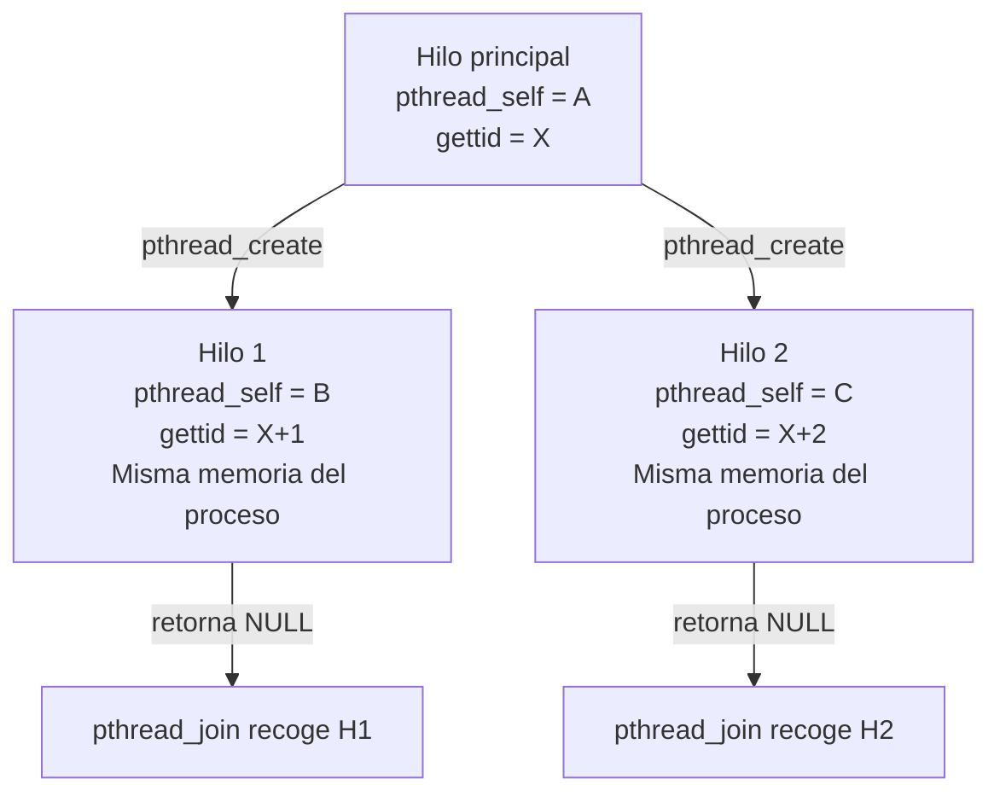
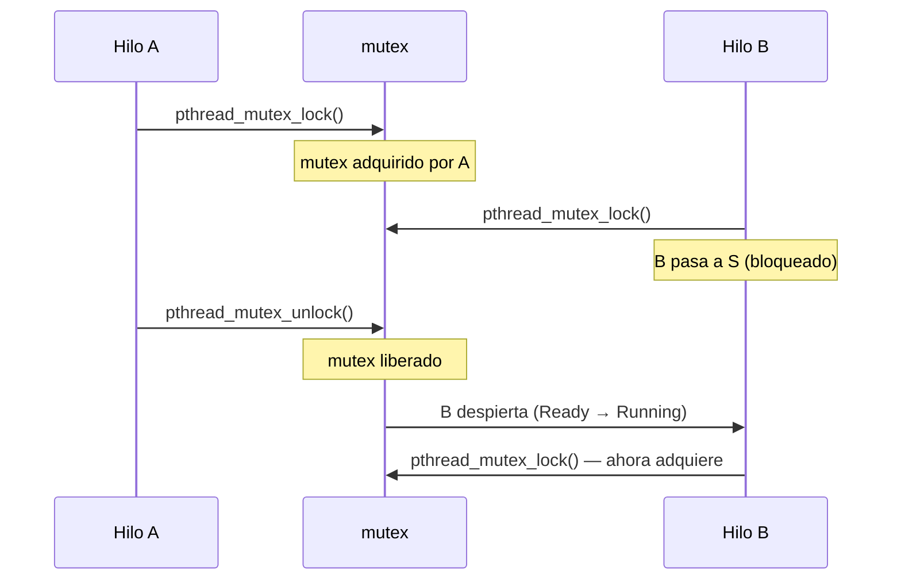
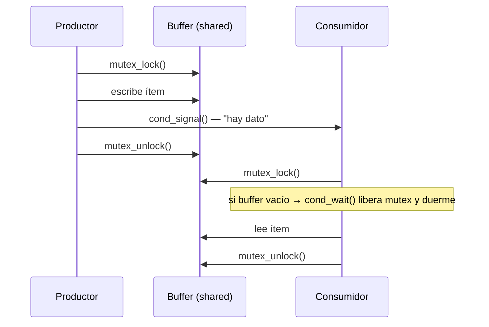

# Laboratorio: Hilos en Linux con GCC

**Plataforma:** GNU/Linux (Ubuntu / Debian)  
**Compilador:** GCC  
**Referencias:**
- Tanenbaum & Bos, *Modern Operating Systems*, 4.ª Ed., Sección 2.2
- Stallings, *Operating Systems: Internals and Design Principles*, 9.ª Ed., Cap. 4 (esp. 4.6)

---

## Contenido

- [Objetivo](#objetivo)
- [Preparación del entorno](#preparación-del-entorno)
  - [Referencia rápida de comandos](#referencia-rápida-de-comandos)
- [Ejercicio 1 — Identificación de un hilo](#ejercicio-1--identificación-de-un-hilo)
- [Ejercicio 2 — Creación de hilos con `pthread_create()`](#ejercicio-2--creación-de-hilos-con-pthread_create)
- [Ejercicio 3 — Memoria compartida y condición de carrera](#ejercicio-3--memoria-compartida-y-condición-de-carrera)
- [Ejercicio 4 — Exclusión mutua con `pthread_mutex_t`](#ejercicio-4--exclusión-mutua-con-pthread_mutex_t)
- [Ejercicio 5 — Sincronización: `pthread_join()` y `pthread_detach()`](#ejercicio-5--sincronización-pthread_join-y-pthread_detach)
- [Ejercicio 6 — Variables de condición: productor-consumidor](#ejercicio-6--variables-de-condición-productor-consumidor)
- [Resumen del laboratorio](#resumen-del-laboratorio)

---

## Objetivo

Observar en Linux los conceptos teóricos de los Capítulos 2 (MOS) y 4 (OSID):

- Identificación de hilos: TID de kernel vs. identificador POSIX
- Creación de hilos dentro de un proceso (`pthread_create`)
- Memoria compartida y condición de carrera
- Exclusión mutua con `pthread_mutex_t`
- Espera de terminación con `pthread_join` y desligue con `pthread_detach`
- Coordinación entre hilos con variables de condición

---

## Preparación del entorno

### Instalar herramientas necesarias

```bash
sudo apt update && sudo apt install -y gcc strace htop
```

| Paquete | Herramienta | Uso en el laboratorio |
|---------|-------------|----------------------|
| `gcc` | compilador C | compilar todos los ejercicios |
| `strace` | `strace` | trazar la syscall `clone` (ejercicio 2) |
| `htop` | `htop` | monitorear hilos del proceso en tiempo real |

Verifica la instalación:

```bash
gcc --version && strace --version && htop --version
```

> **Nota:** la biblioteca POSIX de hilos (`pthreads`) está incluida en `glibc`. Solo se necesita el flag `-lpthread` al compilar — no hay paquete adicional.

### Lanzar programas en segundo plano

El patrón `&` + `$!` permite observar el proceso desde la misma terminal:

```bash
./programa &
PID=$!
sleep 0.5
ls /proc/$PID/task          # lista los hilos del proceso
```

### Referencia rápida de comandos

#### Compilación con GCC y pthreads

| Comando | Descripción |
|---------|-------------|
| `gcc -Wall -pthread -o salida fuente.c` | Compila con soporte POSIX threads; `-pthread` activa la biblioteca y los flags del preprocesador necesarios |
| `./programa` | Ejecuta el binario en el directorio actual |

#### Inspección de hilos

| Comando | Descripción |
|---------|-------------|
| `ls /proc/<PID>/task/` | Lista los TIDs (kernel) de todos los hilos del proceso |
| `cat /proc/<PID>/task/<TID>/status` | Estado del hilo individual (nombre, TID, estado) |
| `cat /proc/<PID>/task/<TID>/status \| grep State` | Filtra solo el estado del hilo |
| `ps -p <PID> -L -o pid,lwp,state,comm` | Lista hilos del proceso con sus LWPs y estados |

#### Herramientas de monitoreo

| Comando | Descripción |
|---------|-------------|
| `strace -e trace=clone ./prog` | Muestra la llamada `clone()` que crea cada hilo |
| `htop` | Monitor interactivo; presiona `H` para ver hilos individuales dentro de cada proceso |

#### Estados de hilo en `/proc`

| Letra | Estado | Significado |
|-------|--------|-------------|
| `R` | Running / Runnable | En CPU o listo en la cola |
| `S` | Sleeping | Bloqueado (esperando mutex, E/S, join…) |
| `Z` | Zombie | El hilo terminó y aún no fue recogido |

---

### Directorio de trabajo

```bash
mkdir ~/lab-hilos
cd ~/lab-hilos
```

### Script de compilación rápida

Guarda como `run.sh`:

```bash
#!/bin/bash
# Uso: bash run.sh nombre_sin_extension
gcc -Wall -pthread -o "$1" "$1.c" && ./"$1"
```

```bash
chmod +x run.sh
```

---

## Ejercicio 1 — Identificación de un hilo

### Conceptos relacionados

En Linux cada hilo es un `task_struct` con su propio **TID de kernel** (visible en `/proc`). La API POSIX expone un identificador opaco `pthread_t` (retornado por `pthread_self()`). El proceso padre sigue siendo el mismo para todos los hilos (mismo `getpid()`).

| Campo | Función | API en C | Visible en `/proc` |
|-------|---------|----------|--------------------|
| **PID del proceso** | Identifica al proceso dueño de todos los hilos | `getpid()` | `/proc/<PID>/` |
| **TID de kernel** | Identifica al hilo individual dentro del kernel | `gettid()` *(Linux 2.4.11+)* | `/proc/<PID>/task/<TID>/` |
| **pthread_t** | Identificador opaco POSIX del hilo | `pthread_self()` | — |

> **Referencia:** MOS § 2.2.1 — *Thread Usage*; OSID § 4.6 — *task_struct* en Linux.

### Código — `t1_identidad.c`

```c
#define _GNU_SOURCE
#include <stdio.h>
#include <unistd.h>
#include <pthread.h>

static void *funcion_hilo(void *arg) {
    int numero = *(int *)arg;
    printf("[hilo %d] pthread_self = %lu  gettid = %d  getpid = %d\n",
           numero, (unsigned long)pthread_self(), gettid(), getpid());
    return NULL;
}

int main(void) {
    pthread_t h1, h2;
    int n1 = 1, n2 = 2;

    printf("[main]   pthread_self = %lu  gettid = %d  getpid = %d\n",
           (unsigned long)pthread_self(), gettid(), getpid());

    pthread_create(&h1, NULL, funcion_hilo, &n1);
    pthread_create(&h2, NULL, funcion_hilo, &n2);

    pthread_join(h1, NULL);
    pthread_join(h2, NULL);
    return 0;
}
```

### Compilación y ejecución

```bash
gcc -Wall -pthread -o t1_identidad t1_identidad.c
./t1_identidad
```

### Observación con `/proc`

```bash
./t1_identidad &
PID=$!
sleep 0.1
ls /proc/$PID/task
# muestra tres TIDs: el hilo principal + dos hilos creados
```

### Salida esperada

```
[main]   pthread_self = 139...  gettid = 4210  getpid = 4210
[hilo 1] pthread_self = 139...  gettid = 4211  getpid = 4210
[hilo 2] pthread_self = 139...  gettid = 4212  getpid = 4210
```

### Preguntas de análisis

1. ¿Por qué `getpid()` devuelve el mismo valor en el hilo principal y en los hilos creados?
2. El TID del hilo principal coincide con el PID del proceso. Explica por qué usando lo que sabes de `task_struct` en Linux (OSID § 4.6).
3. ¿Qué diferencia hay entre `pthread_t` y el TID de kernel?

---

## Ejercicio 2 — Creación de hilos con `pthread_create()`

### Conceptos relacionados

`pthread_create()` crea un nuevo hilo de ejecución dentro del **mismo proceso**. Internamente invoca la syscall `clone()` con flags que permiten compartir espacio de memoria, descriptores de archivo y señales:



> **Diferencia con `fork()`:** `fork()` copia el espacio de direcciones (o usa COW); `pthread_create()` comparte el mismo espacio. Un hilo nuevo es más barato de crear y puede comunicarse directamente a través de variables globales.

> **Referencia:** MOS § 2.2.3 — *POSIX Threads*; OSID § 4.6 — `clone()` con `CLONE_VM | CLONE_FILES | CLONE_THREAD`.

### Código — `t2_create.c`

```c
#include <stdio.h>
#include <unistd.h>
#include <pthread.h>

static void *tarea(void *arg) {
    int id = *(int *)arg;
    printf("[hilo %d] inicio — ejecutando concurrentemente con main\n", id);
    sleep(1);
    printf("[hilo %d] fin\n", id);
    return NULL;
}

int main(void) {
    pthread_t hilos[3];
    int ids[3] = {1, 2, 3};

    printf("[main] creando 3 hilos...\n");
    for (int i = 0; i < 3; i++)
        pthread_create(&hilos[i], NULL, tarea, &ids[i]);

    printf("[main] hilos creados, esperando con join...\n");
    for (int i = 0; i < 3; i++)
        pthread_join(hilos[i], NULL);

    printf("[main] todos los hilos terminaron\n");
    return 0;
}
```

### Compilación y ejecución

```bash
gcc -Wall -pthread -o t2_create t2_create.c
./t2_create
```

### Trazado con `strace`

```bash
strace -e trace=clone ./t2_create 2>&1 | grep clone
```

Cada llamada a `pthread_create()` genera un `clone()` con flags como `CLONE_VM`, `CLONE_FILES`, `CLONE_THREAD`, `CLONE_SIGHAND`.

### Salida esperada

```
[main] creando 3 hilos...
[main] hilos creados, esperando con join...
[hilo 1] inicio — ejecutando concurrentemente con main
[hilo 2] inicio — ejecutando concurrentemente con main
[hilo 3] inicio — ejecutando concurrentemente con main
[hilo 1] fin
[hilo 2] fin
[hilo 3] fin
[main] todos los hilos terminaron
```

> El orden de los hilos puede variar entre ejecuciones — el planificador decide cuál ejecuta primero.

### Preguntas de análisis

1. Ejecuta el programa varias veces. ¿El orden de los mensajes `inicio` y `fin` es siempre el mismo? ¿Por qué?
2. En el `strace`, identifica los flags de `clone()`. ¿Cuáles indican que los hilos comparten memoria?
3. ¿Qué pasaría si llamaras a `fork()` en lugar de `pthread_create()`? ¿Podrían los hijos comunicarse directamente a través de una variable global?

---

## Ejercicio 3 — Memoria compartida y condición de carrera

### Conceptos relacionados

Los hilos comparten el mismo espacio de direcciones, incluyendo variables globales y del heap. Sin sincronización, cuando dos hilos leen y modifican la misma variable de forma concurrente ocurre una **condición de carrera** (*race condition*): el resultado depende del orden de ejecución — no es determinista.

La secuencia problemática (ejemplo con `contador++`):

```
Hilo A lee contador = 100
Hilo B lee contador = 100       ← B lee ANTES de que A escriba
Hilo A escribe contador = 101
Hilo B escribe contador = 101   ← se pierde un incremento
```

> **Referencia:** MOS § 2.3.1 — *Race Conditions*; OSID § 5.1 — *Mutual Exclusion*.

### Código — `t3_carrera.c`

```c
#include <stdio.h>
#include <pthread.h>

#define N_HILOS    4
#define ITERACIONES 1000000

static long contador = 0;   /* variable compartida — sin protección */

static void *incrementar(void *arg) {
    for (int i = 0; i < ITERACIONES; i++)
        contador++;          /* lectura-modificación-escritura NO atómica */
    return NULL;
}

int main(void) {
    pthread_t hilos[N_HILOS];

    for (int i = 0; i < N_HILOS; i++)
        pthread_create(&hilos[i], NULL, incrementar, NULL);

    for (int i = 0; i < N_HILOS; i++)
        pthread_join(hilos[i], NULL);

    printf("Resultado: %ld  (esperado: %d)\n",
           contador, N_HILOS * ITERACIONES);
    return 0;
}
```

### Compilación y ejecución

```bash
gcc -Wall -pthread -o t3_carrera t3_carrera.c
./t3_carrera
./t3_carrera
./t3_carrera
```

### Salida esperada

```
Resultado: 1843217  (esperado: 4000000)
Resultado: 2671004  (esperado: 4000000)
Resultado: 3102891  (esperado: 4000000)
```

El resultado cambia en cada ejecución y es siempre menor que el esperado — evidencia directa de la condición de carrera.

### Preguntas de análisis

1. ¿Por qué `contador++` no es una operación atómica? Descompón la instrucción en pasos de CPU (leer, modificar, escribir).
2. ¿Por qué el resultado siempre es *menor* que `N_HILOS × ITERACIONES` y nunca mayor?
3. ¿Qué ocurre si reduces `N_HILOS` a 1? ¿Aparece la condición de carrera?

---

## Ejercicio 4 — Exclusión mutua con `pthread_mutex_t`

### Conceptos relacionados

Un **mutex** (*mutual exclusion*) garantiza que solo un hilo ejecute la **sección crítica** a la vez. El hilo que no puede adquirir el mutex pasa a estado `S (sleeping)` hasta que el hilo actual lo libere.



> **Referencia:** MOS § 2.3.3 — *Mutexes*; OSID § 5.3 — *Semaphores / Mutex*.

### Código — `t4_mutex.c`

```c
#include <stdio.h>
#include <pthread.h>

#define N_HILOS    4
#define ITERACIONES 1000000

static long contador = 0;
static pthread_mutex_t mutex = PTHREAD_MUTEX_INITIALIZER;

static void *incrementar(void *arg) {
    for (int i = 0; i < ITERACIONES; i++) {
        pthread_mutex_lock(&mutex);
        contador++;
        pthread_mutex_unlock(&mutex);
    }
    return NULL;
}

int main(void) {
    pthread_t hilos[N_HILOS];

    for (int i = 0; i < N_HILOS; i++)
        pthread_create(&hilos[i], NULL, incrementar, NULL);

    for (int i = 0; i < N_HILOS; i++)
        pthread_join(hilos[i], NULL);

    pthread_mutex_destroy(&mutex);
    printf("Resultado: %ld  (esperado: %d)\n",
           contador, N_HILOS * ITERACIONES);
    return 0;
}
```

### Compilación y ejecución

```bash
gcc -Wall -pthread -o t4_mutex t4_mutex.c
./t4_mutex
./t4_mutex
```

### Observar el estado `S` de un hilo bloqueado en el mutex

Lanza en background y observa los hilos bloqueados:

```bash
./t4_mutex &
PID=$!
sleep 0.2
ps -p $PID -L -o pid,lwp,state,comm
# LWP en estado S = hilo bloqueado esperando el mutex
```

### Salida esperada

```
Resultado: 4000000  (esperado: 4000000)
Resultado: 4000000  (esperado: 4000000)
```

El resultado es siempre correcto, pero el programa tarda más que sin mutex (el planificador serializa el acceso).

### Preguntas de análisis

1. Compara el tiempo de ejecución de `t3_carrera` y `t4_mutex` con el comando `time ./t4_mutex`. ¿Cuánto más lento es la versión con mutex? ¿Por qué?
2. ¿Qué sucede si un hilo llama a `pthread_mutex_lock()` dos veces seguidas sin llamar a `unlock()` entre medio?
3. ¿Qué es la sección crítica en este programa? ¿Por qué debe ser lo más corta posible?

---

## Ejercicio 5 — Sincronización: `pthread_join()` y `pthread_detach()`

### Conceptos relacionados

Igual que los procesos necesitan `wait()` para que el padre recoja al hijo, los hilos necesitan `pthread_join()` para que el hilo que espera obtenga el valor de retorno y libere los recursos del hilo terminado.

| Función | Analogía con procesos | Descripción |
|---------|----------------------|-------------|
| `pthread_join(t, &ret)` | `wait(&status)` | Bloquea hasta que `t` termina; recoge el valor de retorno |
| `pthread_detach(t)` | — | Marca el hilo como "fire-and-forget"; sus recursos se liberan automáticamente al terminar |

Un hilo que termina sin ser recogido (sin `join` y sin `detach`) se convierte en un **hilo zombie** — retiene recursos hasta que otro hilo haga `join`.

> **Referencia:** MOS § 2.2.3 — `pthread_join` / `pthread_detach`; OSID § 4.6 — estados de hilo en Linux.

### Código — `t5_join.c`

```c
#include <stdio.h>
#include <stdlib.h>
#include <unistd.h>
#include <pthread.h>

static void *calcular(void *arg) {
    int n = *(int *)arg;
    printf("[hilo] recibí n=%d, calculando...\n", n);
    sleep(1);
    int *resultado = malloc(sizeof(int));
    *resultado = n * n;
    printf("[hilo] resultado listo: %d\n", *resultado);
    return resultado;     /* retorna puntero al heap */
}

static void *tarea_detach(void *arg) {
    printf("[detach] inicio — este hilo se auto-limpia al terminar\n");
    sleep(2);
    printf("[detach] fin\n");
    return NULL;
}

int main(void) {
    pthread_t h_join, h_detach;
    int n = 7;
    void *ret;

    /* hilo que se recoge con join */
    pthread_create(&h_join, NULL, calcular, &n);

    /* hilo detached — el sistema libera sus recursos automáticamente */
    pthread_create(&h_detach, NULL, tarea_detach, NULL);
    pthread_detach(h_detach);

    printf("[main] esperando resultado con pthread_join...\n");
    pthread_join(h_join, &ret);
    printf("[main] resultado recogido: %d\n", *(int *)ret);
    free(ret);

    sleep(3);   /* dar tiempo al hilo detached de terminar */
    printf("[main] fin\n");
    return 0;
}
```

### Compilación y ejecución

```bash
gcc -Wall -pthread -o t5_join t5_join.c
./t5_join
```

### Observar hilos con `ps` y `/proc`

```bash
./t5_join &
PID=$!
sleep 0.5
ps -p $PID -L -o pid,lwp,state,comm
ls /proc/$PID/task
```

### Salida esperada

```
[main] esperando resultado con pthread_join...
[hilo] recibí n=7, calculando...
[detach] inicio — este hilo se auto-limpia al terminar
[hilo] resultado listo: 49
[main] resultado recogido: 49
[detach] fin
[main] fin
```

### Preguntas de análisis

1. ¿Qué ocurre si el hilo principal termina (`return` en `main`) mientras el hilo detached todavía está ejecutando?
2. Modifica el programa para que el hilo retorne un `struct` con dos campos en lugar de un entero. ¿Cómo se recoge con `pthread_join`?
3. ¿En qué se diferencia un hilo zombie de un proceso zombie en cuanto a los recursos que retienen?

---

## Ejercicio 6 — Variables de condición: productor-consumidor

### Conceptos relacionados

Una **variable de condición** permite que un hilo espere de forma eficiente hasta que otra condición sea verdadera, sin hacer *busy-waiting* (espera activa). Se usa siempre junto a un mutex.



> **Referencia:** MOS § 2.3.4 — *Condition Variables*; OSID § 5.7 — *Monitors*.

### Código — `t6_prodcons.c`

```c
#include <stdio.h>
#include <stdlib.h>
#include <unistd.h>
#include <pthread.h>

#define CAPACIDAD  5
#define N_ITEMS   12

static int buffer[CAPACIDAD];
static int cuenta = 0;        /* elementos actuales en el buffer */
static int siguiente_w = 0;   /* índice de escritura */
static int siguiente_r = 0;   /* índice de lectura */

static pthread_mutex_t mutex    = PTHREAD_MUTEX_INITIALIZER;
static pthread_cond_t  no_lleno  = PTHREAD_COND_INITIALIZER;  /* buffer tiene espacio */
static pthread_cond_t  no_vacio  = PTHREAD_COND_INITIALIZER;  /* buffer tiene datos */

static void *productor(void *arg) {
    for (int i = 0; i < N_ITEMS; i++) {
        pthread_mutex_lock(&mutex);

        while (cuenta == CAPACIDAD)
            pthread_cond_wait(&no_lleno, &mutex);  /* espera espacio */

        buffer[siguiente_w] = i;
        siguiente_w = (siguiente_w + 1) % CAPACIDAD;
        cuenta++;
        printf("[productor] produjo %2d  (buffer: %d/%d)\n", i, cuenta, CAPACIDAD);

        pthread_cond_signal(&no_vacio);
        pthread_mutex_unlock(&mutex);
        usleep(100000);  /* 100 ms */
    }
    return NULL;
}

static void *consumidor(void *arg) {
    for (int i = 0; i < N_ITEMS; i++) {
        pthread_mutex_lock(&mutex);

        while (cuenta == 0)
            pthread_cond_wait(&no_vacio, &mutex);  /* espera datos */

        int item = buffer[siguiente_r];
        siguiente_r = (siguiente_r + 1) % CAPACIDAD;
        cuenta--;
        printf("[consumidor] consumió %2d  (buffer: %d/%d)\n", item, cuenta, CAPACIDAD);

        pthread_cond_signal(&no_lleno);
        pthread_mutex_unlock(&mutex);
        usleep(250000);  /* 250 ms — más lento que el productor */
    }
    return NULL;
}

int main(void) {
    pthread_t hprod, hcons;

    pthread_create(&hprod, NULL, productor,  NULL);
    pthread_create(&hcons, NULL, consumidor, NULL);

    pthread_join(hprod, NULL);
    pthread_join(hcons, NULL);

    pthread_mutex_destroy(&mutex);
    pthread_cond_destroy(&no_lleno);
    pthread_cond_destroy(&no_vacio);
    printf("[main] fin — %d ítems procesados\n", N_ITEMS);
    return 0;
}
```

### Compilación y ejecución

```bash
gcc -Wall -pthread -o t6_prodcons t6_prodcons.c
./t6_prodcons
```

### Observar el hilo consumidor bloqueado

Cuando el buffer está vacío, el consumidor queda en estado `S`:

```bash
./t6_prodcons &
PID=$!
sleep 0.1
ps -p $PID -L -o pid,lwp,state,comm
# al menos un hilo en estado S esperando en cond_wait
```

### Salida esperada (fragmento)

```
[productor] produjo  0  (buffer: 1/5)
[productor] produjo  1  (buffer: 2/5)
[consumidor] consumió  0  (buffer: 1/5)
[productor] produjo  2  (buffer: 2/5)
[productor] produjo  3  (buffer: 3/5)
...
[main] fin — 12 ítems procesados
```

### Preguntas de análisis

1. ¿Por qué `pthread_cond_wait()` debe llamarse dentro de un `while` y no de un `if`?
2. ¿Qué ocurriría si el productor usara `cond_broadcast()` en lugar de `cond_signal()`? ¿Cambiaría el comportamiento con un solo consumidor?
3. Modifica el programa para agregar un segundo consumidor y verifica que los 12 ítems siguen procesándose exactamente una vez cada uno.

---

## Resumen del laboratorio

### Llamadas al sistema y funciones utilizadas

| Función | Propósito |
|---------|-----------|
| `pthread_create(t, attr, fn, arg)` | Crear un hilo nuevo dentro del proceso |
| `pthread_self()` | Identificador POSIX del hilo actual |
| `gettid()` | TID de kernel del hilo actual (Linux) |
| `pthread_join(t, &ret)` | Esperar la terminación del hilo `t` y recoger su valor de retorno |
| `pthread_detach(t)` | Marcar `t` como auto-limpiable al terminar |
| `pthread_mutex_lock/unlock(m)` | Adquirir / liberar el mutex `m` |
| `pthread_cond_wait(c, m)` | Liberar `m` y dormir hasta que `c` sea señalizada |
| `pthread_cond_signal(c)` | Despertar a un hilo esperando en `c` |

### Correspondencia con el laboratorio de procesos

| Concepto en procesos | Equivalente en hilos |
|----------------------|----------------------|
| `fork()` | `pthread_create()` |
| `wait()` / `waitpid()` | `pthread_join()` |
| Proceso zombie | Hilo zombie (sin `join` ni `detach`) |
| `pipe()` (canal unidireccional) | Variable global + mutex + cond_var |
| Espacio de memoria separado (COW) | Espacio de memoria compartido |

### Diferencia fundamental entre procesos e hilos (MOS § 2.2)

> Un proceso es la **unidad de propiedad de recursos**; un hilo es la **unidad de ejecución**. Varios hilos dentro de un proceso comparten el mismo espacio de direcciones, archivos abiertos y señales — por eso la sincronización es indispensable.

---

*Basado en:*  
*Tanenbaum & Bos, Modern Operating Systems, 4.ª Ed. (§ 2.2–2.3)*  
*Stallings, Operating Systems: Internals and Design Principles, 9.ª Ed. (Cap. 4, esp. § 4.6)*  
*Plataforma: GNU/Linux — Compilador: GCC — Biblioteca: POSIX Threads (pthreads)*
