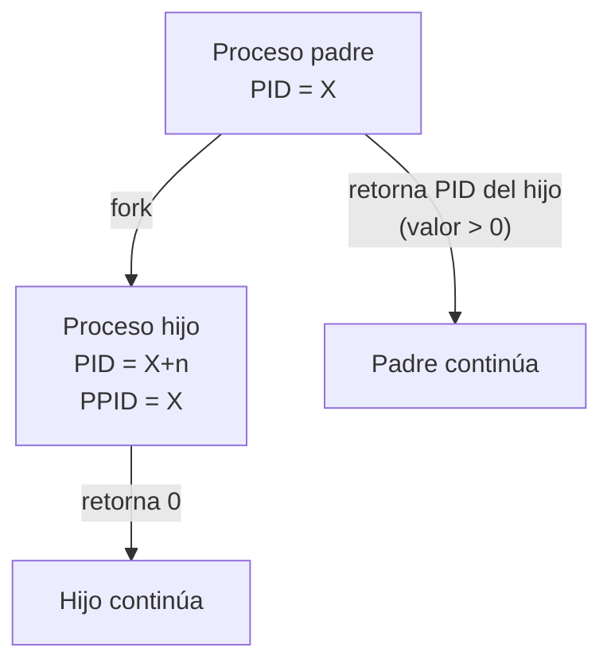
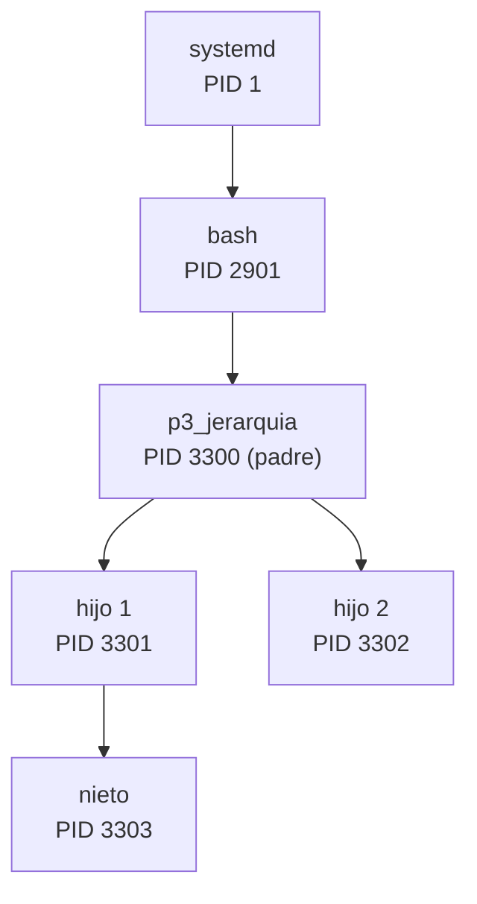
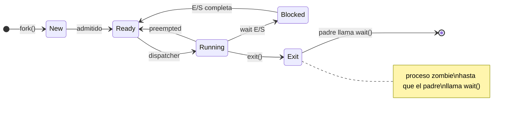
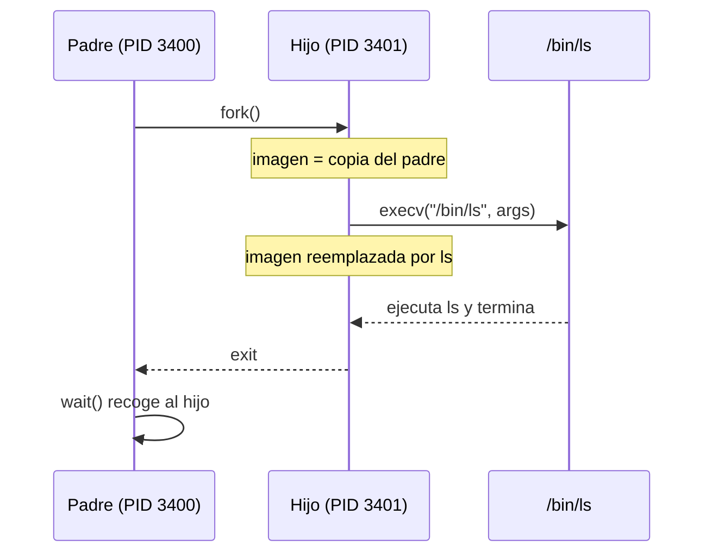

# Laboratorio: Procesos en Linux con GCC

**Plataforma:** GNU/Linux (Ubuntu / Debian)  
**Compilador:** GCC  
**Referencia:** Tanenbaum & Bos, *Modern Operating Systems*, Cap. 2

---

## Contenido

- [Objetivo](#objetivo)
- [Preparación del entorno](#preparación-del-entorno)
- [Ejercicio 1 — Identificación de un proceso](#ejercicio-1--identificación-de-un-proceso)
- [Ejercicio 2 — Creación de procesos con `fork()`](#ejercicio-2--creación-de-procesos-con-fork)
- [Ejercicio 3 — Jerarquía de procesos](#ejercicio-3--jerarquía-de-procesos)
- [Ejercicio 4 — Estados: `wait()` y procesos zombie](#ejercicio-4--estados-wait-y-procesos-zombie)
- [Ejercicio 5 — Reemplazar imagen con `execv()`](#ejercicio-5--reemplazar-imagen-con-execv)
- [Ejercicio 6 — Comunicación entre procesos con `pipe()`](#ejercicio-6--comunicación-entre-procesos-con-pipe)
- [Resumen del laboratorio](#resumen-del-laboratorio)

---

## Objetivo

Observar en Linux los conceptos teóricos del Capítulo 2:

- Identificación de procesos (PID, PPID, UID)
- Creación y terminación de procesos (`fork`, `exit`, `wait`)
- Jerarquía padre–hijo
- Transición de estados con `/proc`
- Reemplazo de imagen de proceso (`execv`)
- Comunicación básica mediante tuberías (`pipe`)

---

## Preparación del entorno

### Instalar herramientas necesarias

```bash
sudo apt update && sudo apt install -y gcc strace psmisc htop
```

| Paquete | Herramienta | Uso en el laboratorio |
|---------|-------------|----------------------|
| `gcc` | compilador C | compilar todos los ejercicios |
| `strace` | `strace` | trazar syscalls (ejercicios 2 y 5) |
| `psmisc` | `pstree` | visualizar árbol de procesos (ejercicio 3) |
| `htop` | `htop` | monitor interactivo de procesos |

Verifica que quedaron instaladas:

```bash
gcc --version && strace --version && pstree --version && htop --version
```

### Nota WSL — una sola terminal

En WSL no es necesario abrir múltiples ventanas. Ejecuta el programa en **segundo plano** con `&` y observa desde la misma terminal:

```bash
./programa &          # lanza en background, imprime el PID del job
PID=$!                # $! guarda el PID del último proceso en background
sleep 0.5             # espera a que el proceso arranque
cat /proc/$PID/status | grep State
```

Cada ejercicio que antes decía "en otra terminal" usará este patrón.

### Directorio de trabajo

```bash
mkdir ~/lab-procesos
cd ~/lab-procesos
```

### Script de compilación rápida

Guarda como `run.sh`:

```bash
#!/bin/bash
# Uso: bash run.sh nombre_sin_extension
gcc -Wall -o "$1" "$1.c" && ./"$1"
```

```bash
chmod +x run.sh
```

---

## Ejercicio 1 — Identificación de un proceso

### Conceptos relacionados

Cada proceso en Linux tiene un **PCB** representado en el sistema de archivos virtual `/proc`:

| Campo | Función | Syscall en C | Archivo en `/proc` |
|-------|---------|--------------|---------------------|
| **PID** | Identificador único del proceso | `getpid()` | `/proc/self/status` |
| **PPID** | Identificador del proceso padre | `getppid()` | `/proc/self/status` |
| **UID** | Identificador del usuario propietario | `getuid()` | `/proc/self/status` |

### Código — `p1_identidad.c`

```c
#include <stdio.h>
#include <unistd.h>

int main(void) {
    printf("PID  (este proceso) : %d\n", getpid());
    printf("PPID (proceso padre): %d\n", getppid());
    printf("UID  (usuario)      : %d\n", getuid());
    return 0;
}
```

### Compilación y ejecución

```bash
gcc -Wall -o p1_identidad p1_identidad.c
./p1_identidad
```

### Observación con `/proc`

```bash
cat /proc/self/status | grep -E "^(Pid|PPid|Uid)"
```

> `/proc/self` siempre apunta al proceso que lo lee.

### Salida esperada

```
PID  (este proceso) : 3142
PPID (proceso padre): 2901
UID  (usuario)      : 1000
```

### Preguntas de análisis

1. Verifica el PPID con `ps -p <PPID> -o comm=`. ¿Qué proceso es?
2. Ejecuta el programa dos veces seguidas. ¿El PID cambia? ¿Por qué?
3. ¿Qué diferencia hay entre UID `0` y UID `1000`?

---

## Ejercicio 2 — Creación de procesos con `fork()`

### Conceptos relacionados

`fork()` crea un **clon exacto** del proceso que lo llama:



### Código — `p2_fork.c`

```c
#include <stdio.h>
#include <unistd.h>
#include <sys/types.h>

int main(void) {
    pid_t pid;

    printf("[antes de fork] PID = %d\n", getpid());

    pid = fork();

    if (pid < 0) {
        perror("fork fallido");
        return 1;
    }

    if (pid == 0) {
        printf("[HIJO]  PID = %d  PPID = %d\n", getpid(), getppid());
    } else {
        printf("[PADRE] PID = %d  PID_hijo = %d\n", getpid(), pid);
    }

    printf("[ambos] PID = %d terminando\n", getpid());
    return 0;
}
```

### Compilación y ejecución

```bash
gcc -Wall -o p2_fork p2_fork.c
./p2_fork
```

### Trazado de syscalls con `strace`

Linux incluye `strace`, que muestra todas las llamadas al sistema que realiza un proceso:

```bash
strace -e trace=fork,clone,wait4 ./p2_fork
```

### Salida esperada

```
[antes de fork] PID = 3200
[PADRE] PID = 3200  PID_hijo = 3201
[PADRE] PID = 3200 terminando
[HIJO]  PID = 3201  PPID = 3200
[HIJO]  PID = 3201 terminando
```

### Preguntas de análisis

1. ¿Por qué `fork()` retorna valores distintos al padre y al hijo?
2. ¿El padre siempre imprime antes que el hijo? Ejecuta varias veces.
3. Usa `strace` y localiza la syscall `clone`. ¿Qué flags aparecen?

---

## Ejercicio 3 — Jerarquía de procesos

### Conceptos relacionados

En Linux los procesos forman un árbol cuya raíz es `systemd` (PID 1). Puedes verlo con `pstree`.



### Código — `p3_jerarquia.c`

```c
#include <stdio.h>
#include <unistd.h>
#include <sys/types.h>

int main(void) {
    pid_t hijo1, hijo2, nieto;

    hijo1 = fork();

    if (hijo1 == 0) {
        nieto = fork();
        if (nieto == 0) {
            printf("[NIETO]  PID=%d  PPID=%d\n", getpid(), getppid());
        } else {
            printf("[HIJO 1] PID=%d  PPID=%d  PID_nieto=%d\n",
                   getpid(), getppid(), nieto);
        }
        return 0;
    }

    hijo2 = fork();

    if (hijo2 == 0) {
        printf("[HIJO 2] PID=%d  PPID=%d\n", getpid(), getppid());
        return 0;
    }

    printf("[PADRE]  PID=%d  hijo1=%d  hijo2=%d\n",
           getpid(), hijo1, hijo2);
    return 0;
}
```

### Compilación y ejecución

```bash
gcc -Wall -o p3_jerarquia p3_jerarquia.c
./p3_jerarquia
```

### Visualización con `pstree` y `htop`

`p3_jerarquia` termina en milisegundos. Agrega `sleep(3)` en cada rama antes del `return 0` para tener una ventana de observación:

```c
/* al final del bloque del nieto */
sleep(3);  return 0;
/* al final del bloque del hijo 2 */
sleep(3);  return 0;
/* al final del bloque del padre */
sleep(3);  return 0;
```

Recompila, lanza en background y observa desde la misma terminal:

```bash
./p3_jerarquia &
sleep 0.3
pstree -p $!
```

Para la vista interactiva con `htop` (el programa sigue corriendo en background):

```bash
htop
```

Presiona `F5` para árbol y `F3` para buscar `p3_jerarquia`. Al salir con `q`, el proceso de background termina solo cuando se cumple el `sleep(3)`.

### Preguntas de análisis

1. ¿Cuántos procesos en total crea este programa?
2. Dibuja el árbol de procesos con los PIDs obtenidos.
3. Si el hijo 1 termina antes que el nieto, ¿quién adopta al nieto? Usa `cat /proc/<PID_nieto>/status | grep PPid` para verificar.

---

## Ejercicio 4 — Estados: `wait()` y procesos zombie

### Conceptos relacionados



### Código — `p4_wait.c`

```c
#include <stdio.h>
#include <stdlib.h>
#include <unistd.h>
#include <sys/types.h>
#include <sys/wait.h>

int main(void) {
    pid_t pid;
    int estado;

    pid = fork();

    if (pid < 0) {
        perror("fork");
        return 1;
    }

    if (pid == 0) {
        printf("[HIJO]  PID=%d iniciando\n", getpid());
        sleep(2);
        printf("[HIJO]  PID=%d terminando con exit(42)\n", getpid());
        exit(42);
    }

    printf("[PADRE] PID=%d esperando al hijo PID=%d...\n", getpid(), pid);

    pid_t terminado = wait(&estado);

    if (WIFEXITED(estado)) {
        printf("[PADRE] hijo PID=%d terminó con código %d\n",
               terminado, WEXITSTATUS(estado));
    }

    return 0;
}
```

### Compilación y ejecución

```bash
gcc -Wall -o p4_wait p4_wait.c
./p4_wait
```

### Observar el estado `S (sleeping)` en `/proc`

Lanza en background y captura el PID del hijo:

```bash
./p4_wait &
PADRE=$!
sleep 0.2
HIJO=$(pgrep -P $PADRE)
cat /proc/$HIJO/status | grep State
# State: S (sleeping)
```

### Observar un proceso zombie

Para crear un zombie real el padre debe mantenerse **vivo** después de que el hijo ya haya terminado, sin llamar a `wait()`. Si solo se comenta `wait()`, el padre termina primero y el hijo queda huérfano, no zombie.

Usa esta variante que invierte los tiempos:

```c
if (pid == 0) {
    printf("[HIJO]  PID=%d terminando\n", getpid());
    exit(42);          /* hijo termina de inmediato */
}

/* padre: NO llama wait(); se queda vivo 8 segundos */
printf("[PADRE] PID=%d sin llamar wait()...\n", getpid());
sleep(8);              /* ventana de observación del zombie */
return 0;
```

Recompila, lanza en background y observa:

```bash
./p4_wait &
PADRE=$!
sleep 0.5
HIJO=$(pgrep -P $PADRE)
cat /proc/$HIJO/status | grep State
# State: Z (zombie)
```

### Macros para inspeccionar el estado de salida

| Macro | Descripción |
|-------|-------------|
| `WIFEXITED(status)` | `true` si el hijo terminó con `exit()` |
| `WEXITSTATUS(status)` | Código de salida pasado a `exit()` |
| `WIFSIGNALED(status)` | `true` si el hijo fue terminado por una señal |
| `WTERMSIG(status)` | Número de la señal que mató al hijo |

### Preguntas de análisis

1. Comenta `wait()` y verifica con `/proc/<PID>/status` que el hijo queda en estado `Z`.
2. ¿Qué ocurre si el padre también termina sin recoger al hijo? ¿Quién lo adopta?
3. ¿Cuál es la diferencia entre proceso zombie y proceso huérfano?

---

## Ejercicio 5 — Reemplazar imagen con `execv()`

### Conceptos relacionados

`execv()` reemplaza la imagen del proceso actual con un programa diferente. El PID no cambia.



### Código — `p5_exec.c`

```c
#include <stdio.h>
#include <unistd.h>
#include <sys/types.h>
#include <sys/wait.h>

int main(void) {
    pid_t pid;
    int estado;

    pid = fork();

    if (pid < 0) {
        perror("fork");
        return 1;
    }

    if (pid == 0) {
        printf("[HIJO]  PID=%d antes de execv\n", getpid());

        char *args[] = { "ls", "-l", "/", NULL };
        execv("/bin/ls", args);

        perror("execv fallido");
        return 1;
    }

    printf("[PADRE] PID=%d esperando al hijo...\n", getpid());
    wait(&estado);
    printf("[PADRE] hijo terminó\n");

    return 0;
}
```

### Compilación y ejecución

```bash
gcc -Wall -o p5_exec p5_exec.c
./p5_exec
```

### Preguntas de análisis

1. ¿Por qué `perror("execv fallido")` solo se ejecuta si hay un error?
2. Verifica con `strace -e trace=execve ./p5_exec` que se invoca la syscall `execve`.
3. ¿Qué diferencia hay entre `execv`, `execve` y `execvp`?

---

## Ejercicio 6 — Comunicación entre procesos con `pipe()`

### Conceptos relacionados

Una tubería es un canal unidireccional en el kernel. El proceso lector queda en estado **Blocked** mientras no hay datos — demostración directa de Running → Blocked → Ready.


### Código — `p6_pipe.c`

```c
#include <stdio.h>
#include <string.h>
#include <unistd.h>
#include <sys/types.h>
#include <sys/wait.h>

int main(void) {
    int fd[2];
    pid_t pid;
    char mensaje[] = "Hola desde el padre";
    char buffer[64];

    if (pipe(fd) == -1) {
        perror("pipe");
        return 1;
    }

    pid = fork();

    if (pid < 0) {
        perror("fork");
        return 1;
    }

    if (pid == 0) {
        close(fd[1]);
        ssize_t n = read(fd[0], buffer, sizeof(buffer) - 1);
        buffer[n] = '\0';
        printf("[HIJO]  recibió: \"%s\"\n", buffer);
        close(fd[0]);
        return 0;
    }

    close(fd[0]);
    write(fd[1], mensaje, strlen(mensaje));
    printf("[PADRE] envió: \"%s\"\n", mensaje);
    close(fd[1]);

    wait(NULL);
    return 0;
}
```

### Compilación y ejecución

```bash
gcc -Wall -o p6_pipe p6_pipe.c
./p6_pipe
```

### Observación con `/proc`

El padre escribe en el pipe casi de inmediato. Agrega un `sleep(3)` en el padre **antes** del `write()` para garantizar que el hijo ya esté bloqueado en `read()`:

```c
close(fd[0]);
sleep(3);                              /* ventana de observación */
write(fd[1], mensaje, strlen(mensaje));
```

Recompila, lanza en background y observa desde la misma terminal:

```bash
./p6_pipe &
PADRE=$!
sleep 0.5
HIJO=$(pgrep -P $PADRE)
cat /proc/$HIJO/status | grep State
# State: S (sleeping)  ← proceso bloqueado en read()
```

### Preguntas de análisis

1. ¿En qué estado queda el hijo mientras el padre no ha escrito todavía?
2. ¿Qué pasa si el padre no cierra `fd[0]` antes de que el hijo llame a `read()`?
3. Modifica el programa para enviar un número entero en lugar de una cadena.

---

## Respuestas

Las respuestas a todas las preguntas de análisis están disponibles en [lab-procesos-linux-respuestas.md](lab-procesos-linux-respuestas.md).

---

## Resumen del laboratorio

| Ejercicio | Concepto demostrado | Herramienta Linux |
|-----------|--------------------|--------------------|
| 1 — Identidad | PID, PPID, UID del PCB | `/proc/self/status` |
| 2 — `fork()` | Creación y clonación del proceso | `strace` |
| 3 — Jerarquía | Árbol padre–hijo–nieto | `pstree`, `htop` |
| 4 — `wait()` / zombie | Estado Exit; zombie | `/proc/<PID>/status` |
| 5 — `execv()` | Reemplazo de imagen | `strace -e execve` |
| 6 — `pipe()` | IPC; Running → Blocked → Ready | `/proc/<PID>/status` |

### Llamadas al sistema utilizadas

| Syscall | Propósito |
|---------|-----------|
| `getpid()` | PID del proceso actual |
| `getppid()` | PPID (PID del padre) |
| `getuid()` | UID del propietario |
| `fork()` | Crear proceso hijo |
| `wait(&status)` | Esperar que un hijo termine |
| `exit(code)` | Terminar el proceso |
| `execv(path, args)` | Reemplazar imagen del proceso |
| `pipe(fd)` | Crear tubería de comunicación |

---

*Basado en: Modern Operating Systems 4ª Ed. (Tanenbaum & Bos, Cap. 2)*  
*Plataforma: GNU/Linux — Compilador: GCC*
