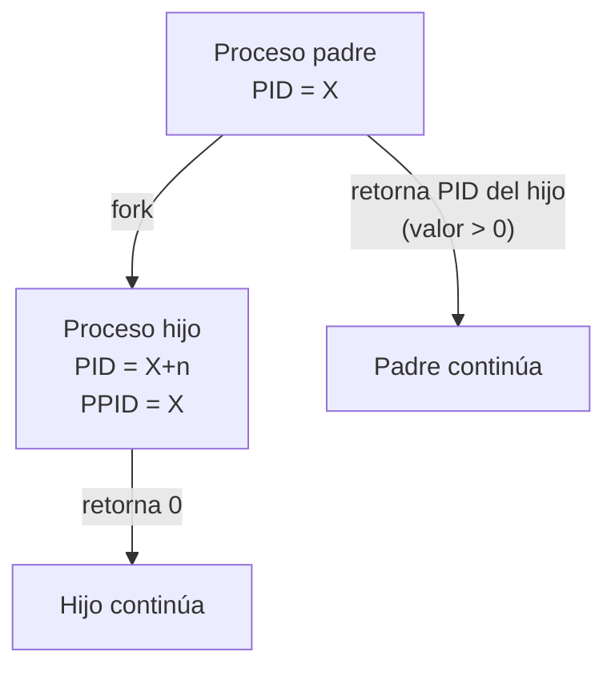
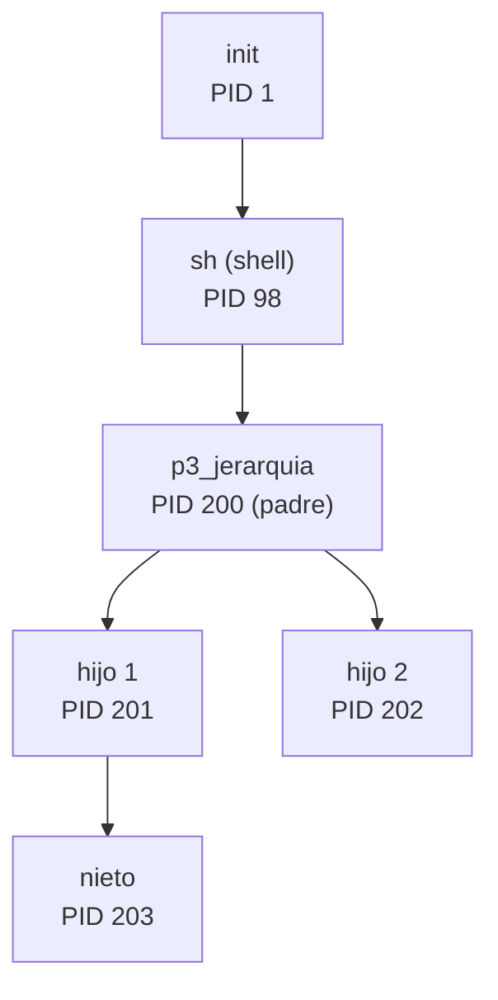
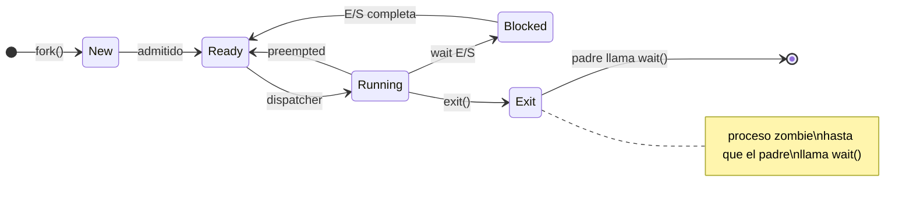
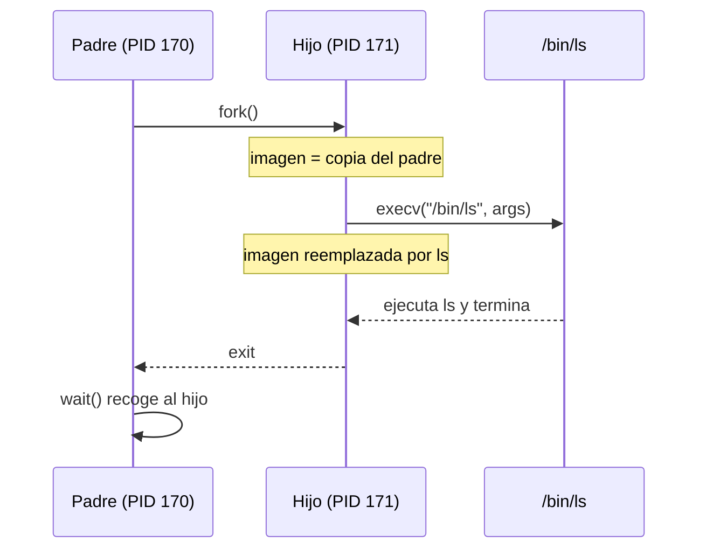
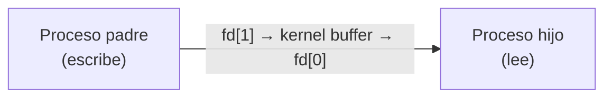

# Laboratorio: Procesos en Minix3 con Clang

**Plataforma:** Minix 3.3 (máquina virtual)  
**Compilador:** Clang  
**Referencia:** Tanenbaum & Bos, *Modern Operating Systems*, Cap. 2

---

## Contenido

- [Objetivo](#objetivo)
- [Preparación del entorno](#preparación-del-entorno)
- [Ejercicio 1 — Identificación de un proceso](#ejercicio-1--identificación-de-un-proceso)
- [Ejercicio 2 — Creación de procesos con `fork()`](#ejercicio-2--creación-de-procesos-con-fork)
- [Ejercicio 3 — Jerarquía de procesos](#ejercicio-3--jerarquía-de-procesos)
- [Ejercicio 4 — Estados: `wait()` y procesos zombie](#ejercicio-4--estados-wait-y-procesos-zombie)
- [Ejercicio 5 — Reemplazar imagen con `execv()`](#ejercicio-5--reemplazar-imagen-con-execv)
- [Ejercicio 6 — Comunicación entre procesos con `pipe()`](#ejercicio-6--comunicación-entre-procesos-con-pipe)
- [Resumen del laboratorio](#resumen-del-laboratorio)

---

## Objetivo

Observar en Minix3 los conceptos teóricos del Capítulo 2 del libro base:

- Identificación de procesos (PID, PPID, UID)
- Creación y terminación de procesos (`fork`, `exit`, `wait`)
- Jerarquía padre–hijo
- Transición de estados (Running → Blocked → Ready)
- Reemplazo de imagen de proceso (`execv`)
- Comunicación básica mediante tuberías (`pipe`)

> Minix3 es el sistema operativo diseñado por Tanenbaum como plataforma de enseñanza e investigación — los conceptos del libro se observan directamente en el sistema.

---

## Preparación del entorno

### Verificar que Clang está disponible

```sh
clang --version
```

Si no está instalado:

```sh
pkgin install clang
```

### Directorio de trabajo

```sh
mkdir ~/lab-procesos
cd ~/lab-procesos
```

### Script de compilación rápida

Guarda como `run.sh`:

```sh
#!/bin/sh
# Uso: sh run.sh nombre_sin_extension
clang -Wall -o "$1" "$1.c" && ./"$1"
```

```sh
chmod +x run.sh
```

> En Minix3 el shell por defecto es `sh` (ash), no bash. Usa `sh` en lugar de `bash` para los scripts.

---

## Ejercicio 1 — Identificación de un proceso

### Conceptos relacionados

Cada proceso tiene un **PCB** que contiene (entre otros campos):

| Campo | Función | Syscall en C |
|-------|---------|--------------|
| **PID** | Identificador único del proceso | `getpid()` |
| **PPID** | Identificador del proceso padre | `getppid()` |
| **UID** | Identificador del usuario propietario | `getuid()` |

> En Minix3 no existe el sistema de archivos `/proc`. La información del PCB se obtiene únicamente a través de las syscalls o con el comando `ps`.

### Código — `p1_identidad.c`

```c
#include <stdio.h>
#include <unistd.h>

int main(void) {
    printf("PID  (este proceso) : %d\n", getpid());
    printf("PPID (proceso padre): %d\n", getppid());
    printf("UID  (usuario)      : %d\n", getuid());
    return 0;
}
```

### Compilación y ejecución

```sh
clang -Wall -o p1_identidad p1_identidad.c
./p1_identidad
```

### Salida esperada

```
PID  (este proceso) : 142
PPID (proceso padre): 98
UID  (usuario)      : 0
```

### Verificar con `ps`

```sh
ps -ax | grep <PPID>
```

### Preguntas de análisis

1. ¿Qué proceso tiene el PPID que aparece?
2. Ejecuta el programa dos veces seguidas. ¿El PID es el mismo? ¿Por qué?
3. ¿Qué indica que el UID sea `0`?

---

## Ejercicio 2 — Creación de procesos con `fork()`

### Conceptos relacionados

`fork()` crea un **clon exacto** del proceso que lo llama. El SO realiza los siguientes pasos al ejecutar `fork()`:

1. Asigna un PID único al hijo y crea su entrada en la tabla de procesos.
2. Copia la imagen del proceso padre (datos, código, pila y PCB).
3. Incrementa los contadores de archivos abiertos compartidos.
4. Pone al hijo en estado **Ready**.
5. Retorna el PID del hijo al padre y `0` al hijo.



### Código — `p2_fork.c`

```c
#include <stdio.h>
#include <unistd.h>
#include <sys/types.h>

int main(void) {
    pid_t pid;

    printf("[antes de fork] PID = %d\n", getpid());

    pid = fork();

    if (pid < 0) {
        perror("fork fallido");
        return 1;
    }

    if (pid == 0) {
        printf("[HIJO]  PID = %d  PPID = %d\n", getpid(), getppid());
    } else {
        printf("[PADRE] PID = %d  PID_hijo = %d\n", getpid(), pid);
    }

    printf("[ambos] PID = %d terminando\n", getpid());
    return 0;
}
```

### Compilación y ejecución

```sh
clang -Wall -o p2_fork p2_fork.c
./p2_fork
```

### Salida esperada (el orden puede variar)

```
[antes de fork] PID = 150
[PADRE] PID = 150  PID_hijo = 151
[PADRE] PID = 150 terminando
[HIJO]  PID = 151  PPID = 150
[HIJO]  PID = 151 terminando
```

> El orden de ejecución entre padre e hijo **no está garantizado**. El dispatcher de Minix3 decide quién ejecuta primero.

### Preguntas de análisis

1. ¿Por qué `fork()` retorna dos valores distintos (uno al padre y otro al hijo)?
2. Ejecuta el programa varias veces. ¿El padre siempre imprime antes que el hijo?
3. ¿Qué pasaría si no verificamos el caso `pid < 0`?

---

## Ejercicio 3 — Jerarquía de procesos

### Conceptos relacionados

En Minix3, como en cualquier UNIX, los procesos forman un **árbol** cuya raíz es `init` (PID 1). Cada llamada a `fork()` añade un nivel al árbol.



### Código — `p3_jerarquia.c`

```c
#include <stdio.h>
#include <unistd.h>
#include <sys/types.h>

int main(void) {
    pid_t hijo1, hijo2, nieto;

    hijo1 = fork();

    if (hijo1 == 0) {
        nieto = fork();
        if (nieto == 0) {
            printf("[NIETO]  PID=%d  PPID=%d\n", getpid(), getppid());
        } else {
            printf("[HIJO 1] PID=%d  PPID=%d  PID_nieto=%d\n",
                   getpid(), getppid(), nieto);
        }
        return 0;
    }

    hijo2 = fork();

    if (hijo2 == 0) {
        printf("[HIJO 2] PID=%d  PPID=%d\n", getpid(), getppid());
        return 0;
    }

    printf("[PADRE]  PID=%d  hijo1=%d  hijo2=%d\n",
           getpid(), hijo1, hijo2);
    return 0;
}
```

### Compilación y ejecución

```sh
clang -Wall -o p3_jerarquia p3_jerarquia.c
./p3_jerarquia
```

### Verificar con `ps`

```sh
ps -ax
```

### Preguntas de análisis

1. ¿Cuántos procesos en total crea este programa (incluyendo el original)?
2. Dibuja el árbol de procesos con los PIDs que obtuviste.
3. Si el hijo 1 termina antes que el nieto, ¿quién se convierte en padre del nieto? ¿Qué PPID tendrá el nieto?

---

## Ejercicio 4 — Estados: `wait()` y procesos zombie

### Conceptos relacionados

Cuando un proceso termina, entra en el estado **Exit (Zombie)** hasta que su padre llama a `wait()` para recoger su código de salida.



### Código — `p4_wait.c`

```c
#include <stdio.h>
#include <stdlib.h>
#include <unistd.h>
#include <sys/types.h>
#include <sys/wait.h>

int main(void) {
    pid_t pid;
    int estado;

    pid = fork();

    if (pid < 0) {
        perror("fork");
        return 1;
    }

    if (pid == 0) {
        printf("[HIJO]  PID=%d iniciando\n", getpid());
        sleep(2);
        printf("[HIJO]  PID=%d terminando con exit(42)\n", getpid());
        exit(42);
    }

    printf("[PADRE] PID=%d esperando al hijo PID=%d...\n", getpid(), pid);

    pid_t terminado = wait(&estado);

    if (WIFEXITED(estado)) {
        printf("[PADRE] hijo PID=%d terminó con código %d\n",
               terminado, WEXITSTATUS(estado));
    }

    return 0;
}
```

### Compilación y ejecución

```sh
clang -Wall -o p4_wait p4_wait.c
./p4_wait
```

### Observar el estado zombie en Minix3

Mientras el hijo duerme, abre otra terminal y ejecuta:

```sh
ps -ax
```

Busca el proceso hijo. Si el padre **no llama** a `wait()`, el hijo permanece en estado `Z` (zombie) indefinidamente.

### Macros para inspeccionar el estado de salida

| Macro | Descripción |
|-------|-------------|
| `WIFEXITED(status)` | `true` si el hijo terminó con `exit()` |
| `WEXITSTATUS(status)` | Código de salida pasado a `exit()` |
| `WIFSIGNALED(status)` | `true` si el hijo fue terminado por una señal |
| `WTERMSIG(status)` | Número de la señal que mató al hijo |

### Preguntas de análisis

1. Comenta la llamada a `wait()` y ejecuta de nuevo. ¿Qué muestra `ps -ax` después de que el hijo termina?
2. ¿Qué ocurre con el zombie si el padre también termina? ¿Quién lo adopta?
3. ¿Cuál es la diferencia entre un proceso zombie y un proceso huérfano?

---

## Ejercicio 5 — Reemplazar imagen con `execv()`

### Conceptos relacionados

`execv()` **reemplaza** la imagen del proceso actual (código, datos, pila) con la del nuevo programa indicado. El PID no cambia.



### Código — `p5_exec.c`

```c
#include <stdio.h>
#include <unistd.h>
#include <sys/types.h>
#include <sys/wait.h>

int main(void) {
    pid_t pid;
    int estado;

    pid = fork();

    if (pid < 0) {
        perror("fork");
        return 1;
    }

    if (pid == 0) {
        printf("[HIJO]  PID=%d antes de execv\n", getpid());

        char *args[] = { "ls", "-l", "/", NULL };
        execv("/bin/ls", args);

        /* Si execv retorna, hubo un error */
        perror("execv fallido");
        return 1;
    }

    printf("[PADRE] PID=%d esperando al hijo...\n", getpid());
    wait(&estado);
    printf("[PADRE] hijo terminó\n");

    return 0;
}
```

### Compilación y ejecución

```sh
clang -Wall -o p5_exec p5_exec.c
./p5_exec
```

> Verifica que `/bin/ls` existe en Minix3. Si no: `which ls` para encontrar la ruta correcta.

### Notas sobre `execv` en Minix3

- El arreglo de argumentos **debe terminar con `NULL`**.
- Si `execv` tiene éxito, **nunca regresa** — el proceso es completamente reemplazado.
- El PID del proceso **no cambia**.
- Los descriptores de archivos abiertos se heredan a menos que tengan el flag `FD_CLOEXEC`.

### Preguntas de análisis

1. ¿Por qué la línea `perror("execv fallido")` solo se ejecutaría si hay un error?
2. ¿Qué pasa con los archivos que el hijo tenía abiertos al momento del `execv()`?
3. ¿Cuál es la diferencia entre `execv`, `execve` y `execvp`?

---

## Ejercicio 6 — Comunicación entre procesos con `pipe()`

### Conceptos relacionados

Una **tubería** (*pipe*) es un canal de comunicación unidireccional gestionado por el kernel. El extremo de escritura usa `fd[1]` y el de lectura usa `fd[0]`.



El proceso lector entra en estado **Blocked** mientras el buffer está vacío — demostración directa de la transición Running → Blocked → Ready.

### Código — `p6_pipe.c`

```c
#include <stdio.h>
#include <string.h>
#include <unistd.h>
#include <sys/types.h>
#include <sys/wait.h>

int main(void) {
    int fd[2];
    pid_t pid;
    char mensaje[] = "Hola desde el padre";
    char buffer[64];

    if (pipe(fd) == -1) {
        perror("pipe");
        return 1;
    }

    pid = fork();

    if (pid < 0) {
        perror("fork");
        return 1;
    }

    if (pid == 0) {
        /* Hijo: cierra extremo de escritura y lee */
        close(fd[1]);
        ssize_t n = read(fd[0], buffer, sizeof(buffer) - 1);
        buffer[n] = '\0';
        printf("[HIJO]  recibió: \"%s\"\n", buffer);
        close(fd[0]);
        return 0;
    }

    /* Padre: cierra extremo de lectura y escribe */
    close(fd[0]);
    write(fd[1], mensaje, strlen(mensaje));
    printf("[PADRE] envió: \"%s\"\n", mensaje);
    close(fd[1]);

    wait(NULL);
    return 0;
}
```

### Compilación y ejecución

```sh
clang -Wall -o p6_pipe p6_pipe.c
./p6_pipe
```

### Salida esperada

```
[PADRE] envió: "Hola desde el padre"
[HIJO]  recibió: "Hola desde el padre"
```

### ¿Por qué cerrar el extremo que no se usa?

Si el padre no cierra `fd[0]`, el sistema considera que todavía puede haber escritores en la tubería, y el hijo nunca recibirá EOF — quedará bloqueado indefinidamente en `read()`.

### Preguntas de análisis

1. ¿En qué estado se encuentra el hijo mientras el padre aún no ha escrito en la tubería?
2. Modifica el programa para enviar un número entero (no una cadena) del padre al hijo.
3. ¿Es posible comunicarse en ambas direcciones con una sola tubería? ¿Por qué?

---

## Resumen del laboratorio

| Ejercicio | Concepto del PCB / procesos demostrado |
|-----------|----------------------------------------|
| 1 — Identidad | PID, PPID, UID del PCB |
| 2 — `fork()` | Creación de procesos; clonación del PCB |
| 3 — Jerarquía | Árbol de procesos; init como raíz |
| 4 — `wait()` / zombie | Estado Exit; recolección del proceso hijo |
| 5 — `execv()` | Reemplazo de imagen del proceso |
| 6 — `pipe()` | IPC; transición Running → Blocked → Ready |

### Llamadas al sistema utilizadas

| Syscall | Propósito |
|---------|-----------|
| `getpid()` | PID del proceso actual |
| `getppid()` | PPID (PID del padre) |
| `getuid()` | UID del propietario |
| `fork()` | Crear proceso hijo |
| `wait(&status)` | Esperar que un hijo termine |
| `exit(code)` | Terminar el proceso |
| `execv(path, args)` | Reemplazar imagen del proceso |
| `pipe(fd)` | Crear tubería de comunicación |

---

*Basado en: Modern Operating Systems 4ª Ed. (Tanenbaum & Bos, Cap. 2)*  
*Plataforma: Minix 3.3 — Compilador: Clang*
