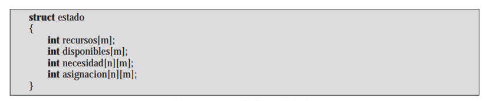
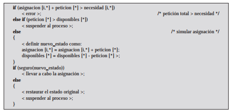
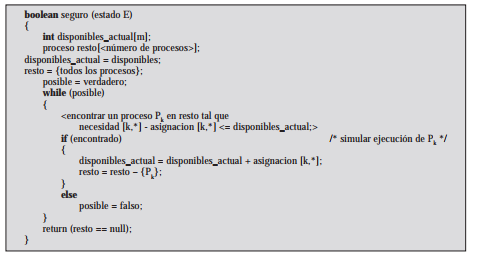

# **6.4 Detección del Interbloqueo**

---

Detección del Interbloqueo
Capítulo 6.4

---

Estrategias
La prevención es conservadora:
Resuelven el problema del interbloqueo limitando el acceso a los recursos
Imponen restricciones a los procesos.
Pero la detección no limita el acceso a los recursos ni restringe las acciones de los procesos. Se conceden los recursos pedidos a los procesos siempre que sea posible.

---

Algoritmo de Banquero

---

Estructuras de datos globales

---

Asignación de recursos

---

Comprobar si estado es seguro

---

Algoritmo de Detección de Interbloqueo
El rango de comprobación de si hay un interbloqueo varia:
Se puede hacer por cada vez que se haga una petición de un recurso.
Esto lleva a una detección temprana.
El algoritmo es sencillo porque esta basado en cambios individuales del estado del sistema.
Pero consumen un tiempo de procesador considerable.
El algoritmo usual de detección es que utiliza una matriz de Asignación y el vector de Disponibles.

---

Uso del algoritmo

---

Recuperación

---

Recuperación

