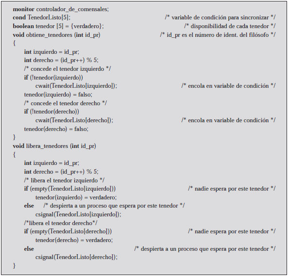
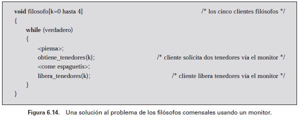

# **6.6 El problema de los filósofos comensales**

---

El problema de los filósofos comensales
Sección 6.6

---

Problema
## Cinco filósofos viven en una casa, donde hay una mesa preparada para ellos. Cada filósofo necesita dos tenedores para comer los
## espaguetis.
## El problema: diseñar un ritual (algoritmo)
## que permita a los filósofos comer. El algoritmo debe satisfacer la exclusión mutua (no puede haber dos filósofos que puedan utilizar el mismo tenedor a la vez) evitando el interbloqueo y la inanición.

---

Solución por semáforo
Cada filósofo toma primero el tenedor de la izquierda y después el de la derecha.
Una vez que el filósofo ha terminado de comer, vuelve a colocar los dos tenedores en la mesa.
Esta solución, desgraciadamente, conduce al interbloqueo: Si todos los filósofos están hambrientos al mismo tiempo, todos ellos se sentarán, asirán el tenedor de la izquierda y tenderán la mano para tomar el otro tenedor, que no estará allí.
En esta indecorosa posición, los filósofos pasarán hambre.

---

## Solución mediante semáforos

---

Segunda opción disminuir comensales
Como alternativa, se podría incorporar un asistente que sólo permitiera que haya cuatro filósofos al mismo tiempo en el comedor.
Con un máximo de cuatro filósofos sentados, al menos un filósofo tendrá acceso a los dos tenedores.
La Figura 6.13 muestra esta solución, utilizando de nuevo semáforos.
Esta solución está libre de interbloqueos e inanición.

---

## Solución utilizando un monitor

---

Solución utilizando un monitor
Se define un vector de cinco variables de condición, una variable de condición por cada tenedor. Estas variables de condición se utilizan para permitir que un filósofo espere hasta que esté disponible un tenedor.
Además, hay un vector de tipo booleano que registra la disponibilidad de cada tenedor (verdadero significa que el tenedor está disponible). El monitor consta de dos procedimientos:
El procedimiento obtiene_tenedores lo utiliza un filósofo para obtener sus tenedores, el situado a su izquierda y a su derecha. Si ambos tenedores están disponibles, el proceso que corresponde con el filósofo se encola en la variable de condición correspondiente. Esto permite que otro proceso filósofo entre en el monitor.
Se utiliza el procedimiento libera_tenedores para hacer que queden disponibles los dos tenedores.

---

---

