# **CAP06**

---

## Concurrencia: interbloqueo e inanición
## Capítulo 6

---

## Interbloqueo
## Bloqueo permanente de un conjunto de procesos que compiten por los recursos o bien se comunican unos con otros.
## No existe una solución eficiente.
## Suponen necesidades contradictorias de recursos por parte de dos o más procesos.

---

**(a) Posible interbloqueo**
**(b) Interbloqueo**
**Figura 6.1.  Representación del interbloqueo.**

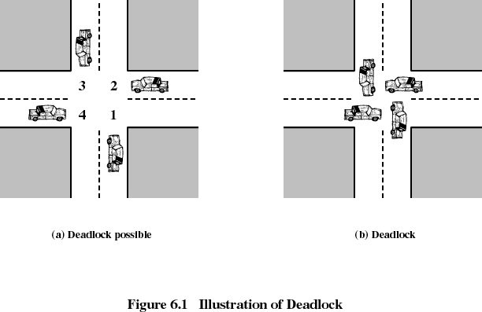

---

**Progreso de Q**
**A es necesario**
**B es necesario**
**A es necesario**
**Libera-**
**ción de B**
**Obtención**
**de A**
**Liberación de A**
**Obtención**
**de B**
**Obtención de A**
**Obtención de B**
**Liberación**
**de A**
**Progreso de P**
**Liberación**
**de B**
**A es necesario**
**B es necesario**
**P y Q quieren a A**
**P y Q quieren a B**
**Interblo-queo  inevitable**
**Figura 6.2.  Ejemplo de interbloqueo [BACO98].**

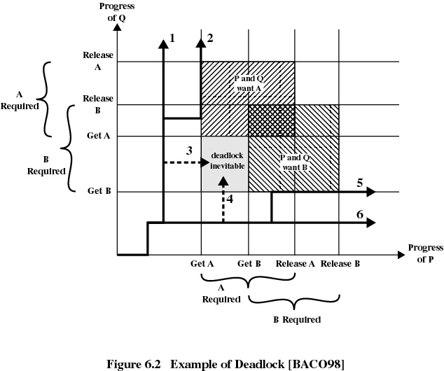

---

**Figura 6.3.  Ejemplo de sin interbloqueo [BACO98].**
**Obtención**
**de A**
**Obtención**
**de B**
**Obtención de B**
**Liberación  de**
**A**
**A es necesario**
**B es necesario**
**Progreso de P**
**Liberación  de**
**B**
**Obtención de B**
**Progreso de Q**
**Liberación de A**
**Libera-ción de B**
**A es necesario**
**B es necesario**
**P y Q quieren a A**
**P y Q quieren a B**

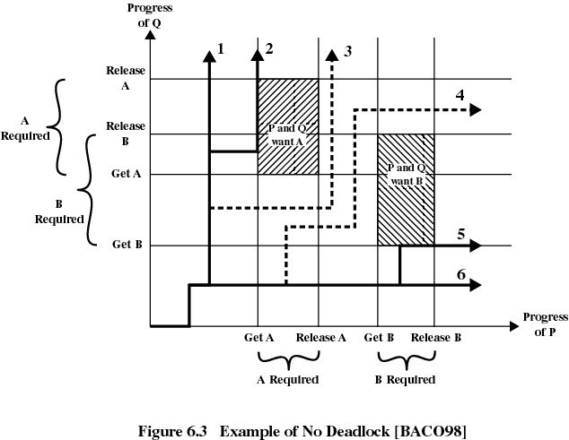

---

## Recursos reutilizables
## Pueden ser usados por un proceso y no se agotan con el uso.
## Los procesos obtienen unidades de recursos que liberan posteriormente para que otros procesos las reutilicen.
## Procesadores, canales de E/S, memoria principal y secundaria, archivos, bases de datos y semáforos.
## El interbloqueo se produce si cada proceso retiene un recurso y solicita el otro.

---

## Ejemplo de interbloqueo
**Figura 6.4.  Ejemplo de dos procesos compitiendo por recursos utilizables  [BACO98]**
**Solicitar (D)**
**Bloquear (D)**
**Solicitar (T)**
**Bloquear (T)**
**Realizar función**
**Desbloquear (D)**
**Desbloquear (T)**
**Solicitar (D)**
**Figura 6.4.  Ejemplo de dos procesos compitiendo por recursos reutilizables.**
**Proceso P**
**Proceso Q**
**Paso**
**Acción**
**Paso**
**Acción**
**p0	Solicitar (D)**
**p1	Bloquear (D)**
**p2	Solicitar (T)**
**p3	Bloquear (T)**
**p4	Realizar función**
**p5	Desbloquear (D)**
**p6	Desbloquear (T)**

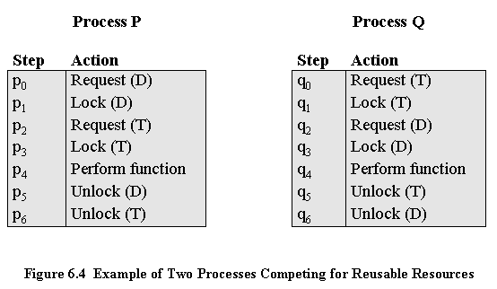

---

## Otro ejemplo de interbloqueo
## El espacio disponible es de 200 KB y se origina la siguiente secuencia de peticiones:
## Se produce un interbloqueo si ambos procesos avanzan hasta su segunda petición.
**P1**
**. . .**
**. . .**
**Solicitud de 80 Kbytes**
**Solicitud de 60 Kbytes;**
**P2**
**. . .**
**. . .**
**Solicitud de 70 Kbytes;**
**Solicitud de 80 Kbytes;**

---

## Recursos consumibles
## Puede ser creado (producido) y destruido (consumido) por un proceso.
## Interrupciones, señales, mensajes e información en buffers de E/S.
## El interbloqueo se produce si el Receive es bloqueante.
## Puede darse una combinación de sucesos poco habitual que origine el interbloqueo.

---

## Ejemplo de interbloqueo
## El interbloqueo se produce si el Receive es bloqueante.
**P1**
**. . .**
**. . .**
**Receive (P2);**
**Send (P2, M1);**
**P2**
**. . .**
**. . .**
**Receive (P1);**
**Send (P1, M2);**

---

## 6.2

---

## Condiciones de interbloqueo
## Exclusión mutua:
## Sólo un proceso puede usar un recurso cada vez.
## Retención y esperar:
## Un proceso solicita todos los recursos que necesita a un mismo tiempo.

---

## Condiciones de interbloqueo
## No apropiación:
## Si a un proceso que retiene ciertos recursos se le deniega una nueva solicitud, dicho proceso deberá liberar sus recursos anteriores.
## Si un proceso solicita un recurso que actualmente está retenido por otro proceso, el sistema operativo puede retener el segundo proceso y exigirle que libere sus recursos.

---

## Condiciones de interbloqueo
## Círculo vicioso de espera:
## Puede prevenirse definiendo una ordenación lineal de los tipos de recursos.
**Recurso**
**A**
**Recurso**
**B**
**Solicitado**
**Retenido por**
**Retenido por**
**Solicitado**
**Figura 6.5.  Círculo vicioso de espera.**
**Proceso**
**P1**
**Proceso**
**P2**

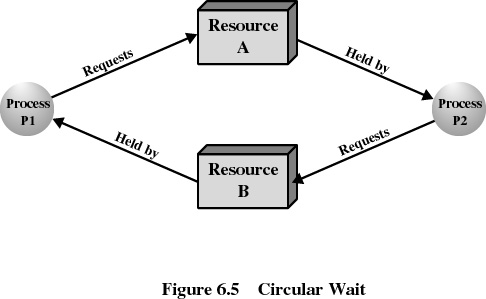

---

## Predicción del interbloqueo
## Se decide dinámicamente si la petición actual de asignación de un recurso podría, de concederse, llevar potencialmente a un interbloqueo.
## Necesita conocer las peticiones futuras de recursos.

---

## Dos enfoques para la predicción del interbloqueo
## No iniciar un proceso si sus demandas pueden llevar a interbloqueo.
## No conceder una solicitud de incrementar los recursos de un proceso si esta asignación puede llevar a interbloqueo.

---

## Negativa de asignación de recursos
## Denominada algoritmo del banquero.
## El estado del sistema es la asignación actual de recursos a los procesos.
## Un estado seguro es un estado en el cual existe al menos una secuencia que no lleva al interbloqueo.
## Un estado inseguro es un estado que no es seguro.

---

## Determinación de un estado seguro:estado inicial
**Matriz demanda**
**(a) Estado inicial**
**Matriz asignación**
**Vector recursos**
**Vector disponible**

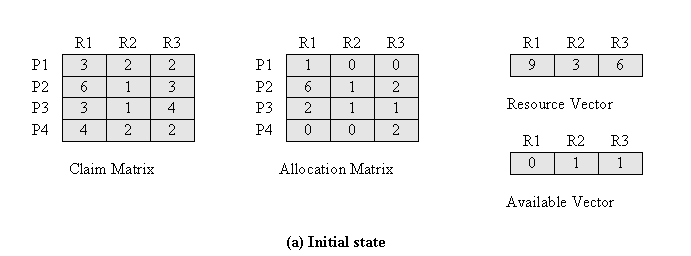

---

## Determinación de un estado seguro:P2 terminado
**Matriz demanda**
**Matriz asignación**
**Vector disponible**
**(b) P2 terminado**

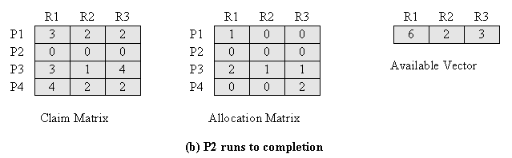

---

## Determinación de un estado seguro:P1 terminado
**(c) P1 terminado**
**Matriz demanda**
**Matriz asignación**
**Vector disponible**

---

## Determinación de un estado seguro:P3 terminado
**Matriz demanda**
**Matriz asignación**
**Vector disponible**
**(d) P3 terminado**

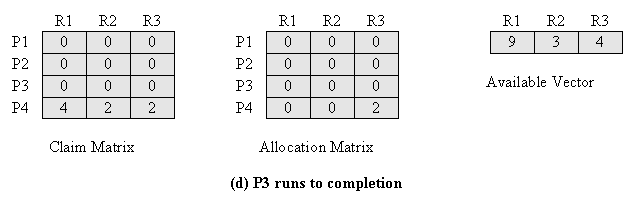

---

## Determinación de un estado inseguro
**Matriz demanda**
**Matriz asignación**
**Vector recursos**
**Vector disponible**
**(a) Estado inicial**

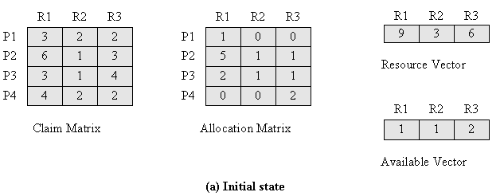

---

## Determinación de un estado inseguro
**Matriz demanda**
**Matriz asignación**
**Vector disponible**
**(b) P1 solicita una unidad de R1 y otra de R3**

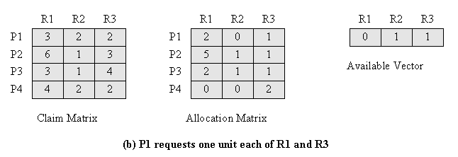

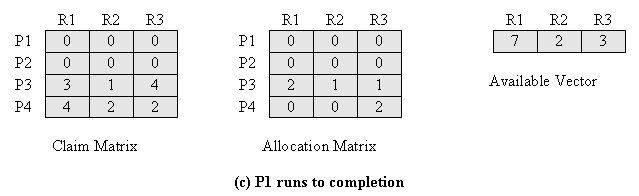

---

## 6.3

---

## Predicción del interbloqueo
## Se debe presentar la máxima demanda de recursos por anticipado.
## Los procesos a considerar deben ser independientes, no hay condiciones de sincronización.
## Debe haber un número fijo de recursos a repartir.
## Los procesos no pueden finalizar mientras retengan recursos.

---

## 6.4

---

## Detección del interbloqueo
**Matriz Solicitud Q**
**Matriz asignación A**
**Vector recursos**
**Vector disponible**
**Figura 6.9.  Ejemplo de detección de interbloqueo.**

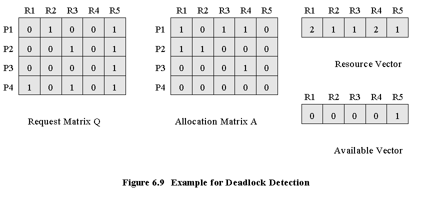

---

## Técnicas una vez detectado el interbloqueo
## Abortar todos los procesos interbloqueados.
## Retroceder cada proceso interbloqueado hasta algún punto de control definido previamente y volver a ejecutar todos los procesos:
## Puede repetirse el interbloqueo original.
## Abortar sucesivamente procesos interbloqueados hasta que deje de haber interbloqueo.
## Apropiarse de recursos sucesivamente hasta que deje de haber interbloqueo.

---

## Criterio de selección de los procesos interbloqueados
## La menor cantidad de tiempo de procesador consumido hasta ahora.
## El menor número de líneas de salida producidas hasta ahora.
## El mayor tiempo restante estimado.
## El menor número total de recursos asignados hasta ahora.
## La prioridad más baja.

---

## El problema de la cena de los filósofos

---

## Mecanismos de concurrencia en UNIX
## Tubos (pipes).
## Mensajes.
## Memoria compartida.
## Semáforos.
## Señales.

---

## Primitivas de sincronización de hilos en Solaris
## Cierres de exclusión mutua (mutex).
## Semáforos.
## Cierres de múltiples lectores, un escritor (lectores/escritores).
## Variables de condición.

---

**Figura 6.13.  Estructuras de datos de sincronización en Solaris.**
**(a) Cierre MUTEX**
**(b) Semáforo**
**Propietario (3 octetos)**
**Cierre  (1 octeto)**
**Esperas (2 octetos)**
**Información específica de tipo**
**(4 octetos)**
**(Posiblemente un id de Torno, cierre de tipo relleno o punteros estadísticos)**
**Tipo (1 octeto)**
**cierreescrt (1 octeto)**
**Esperas (2 octetos)**
**Contador (4 octetos)**

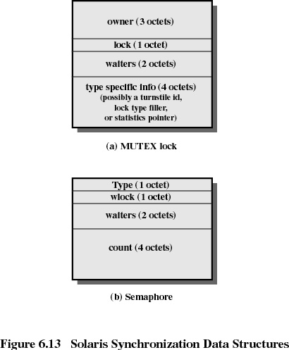

---

**( c)  Cierre de lectores/escritores**
**(d) Variable de condición**
**Figura 6.13.  Estructuras de datos de sincronización en Solaris.**
**Tipo (1 octeto)**
**cierreescrt (1 octeto)**
**Esperar (2 octetos)**
**Unión (4 octetos)**
**(Puntero estadístico o número de solicitudes de escritura)**
**Hilo propietario (4 octetos)**
**Esperas (2 octetos)**

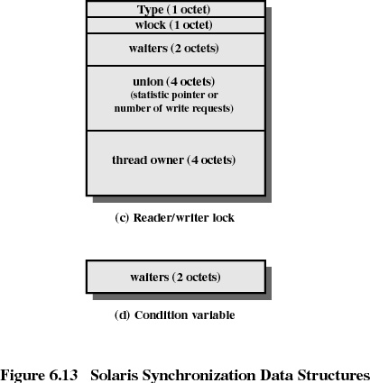

---

## Mecanismos de concurrencia en Windows 2000
## Proceso.
## Hilo.
## Archivo.
## Entrada de consola.
## Notificación de cambio de archivo.
## Mutante.
## Semáforo.
## Suceso.
## Temporizador.

