# **Capítulo 5: Concurrencia**

## Exclusión Mutua y Sincronización

### William Stallings — Operating Systems: Internals and Design Principles (9ª Ed.)

---

# **Contenido del Capítulo**

1. **Exclusión Mutua:** Enfoques de Software
2. **Principios de Concurrencia**
3. **Exclusión Mutua:** Soporte Hardware
4. **Semáforos**
5. **Monitores**
6. **Paso de Mensajes**
7. **Problema de Lectores/Escritores**

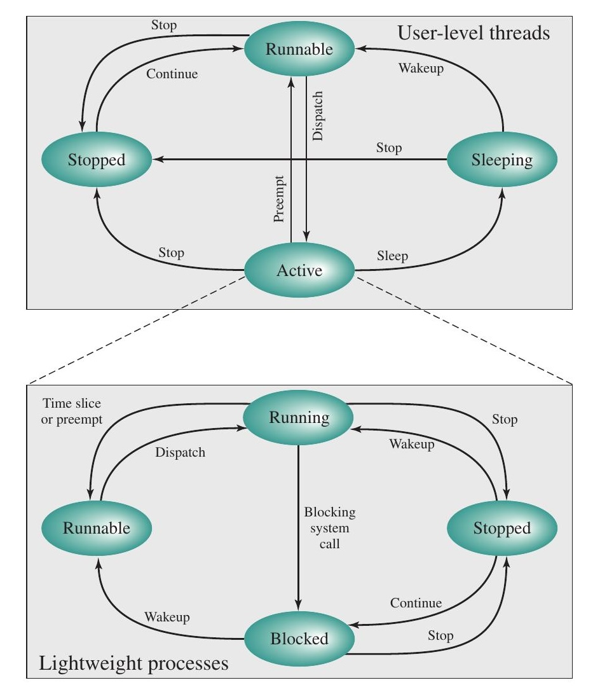

<!--
**Estructura del capítulo:** el capítulo 5 avanza de lo más básico (software) a lo más abstracto (monitores, mensajes). Cada mecanismo resuelve las limitaciones del anterior:

1. **Software (Dekker, Peterson):** demuestran que el problema es soluble sin hardware especial, pero son imprácticos para sistemas reales (busy waiting).
2. **Hardware (C&S, XCHG):** solución atómica a nivel de ISA, pero aún con busy waiting.
3. **Semáforos:** abstracción que elimina busy waiting usando colas de bloqueo.
4. **Monitores:** encapsulan datos + sincronización en una estructura.
5. **Mensajes:** permiten concurrencia en sistemas distribuidos sin memoria compartida.
-->

---

# **Objetivos de Aprendizaje**

- Discutir conceptos básicos de concurrencia: **condiciones de carrera**, preocupaciones del SO, requisitos de exclusión mutua
- Comprender **enfoques hardware** para soportar exclusión mutua
- Definir y explicar **semáforos**
- Definir y explicar **monitores**
- Explicar el **problema de lectores/escritores**

<!--
**Mapa conceptual para el estudiante:**
- Condiciones de carrera → ¿por qué ocurren? → intercalación no determinista de instrucciones
- Exclusión mutua → ¿cómo se garantiza? → mecanismos de software/hardware/semáforos
- Sincronización → ¿cómo coordinar eventos? → semáforos, monitores, mensajes

**Conexión con capítulos anteriores:** en el capítulo 4 vimos que los hilos comparten el espacio de direcciones del proceso. Ahora veremos cómo proteger ese espacio compartido de condiciones de carrera.
-->

---

# **Multiprogramación, Multiprocesamiento y Procesamiento Distribuido**

La concurrencia surge de tres entornos distintos, cada uno con sus propios retos:

| Entorno | Descripción |
|:--------|:------------|
| **Multiprogramación** (Uniprocesador) | Varios procesos comparten una sola CPU. La concurrencia se logra por **intercalación** — el SO multiplexa la CPU entre procesos. |
| **Multiprocesamiento** (SMP) | Dos o más CPUs comparten memoria física. La concurrencia es **real**: los procesos ejecutan simultáneamente en distintas CPUs. |
| **Procesamiento Distribuido** | Sistemas autónomos conectados por red, cada uno con su propia memoria. La concurrencia es **distribuida**: no hay memoria compartida física. |

<!--
**Multiprogramación, Multiprocesamiento y Procesamiento Distribuido — introducción conceptual:**
Esta diapositiva establece la base para entender por qué la concurrencia es importante: surge naturalmente de tres entornos computacionales distintos.

**Multiprogramación (uniprocesador):**
- Varios procesos se ejecutan en una sola CPU
- El SO intercala la ejecución (planificación)
- La concurrencia es aparente, no real
- Reto: condiciones de carrera entre procesos que comparten memoria

**Multiprocesamiento (SMP — Symmetric MultiProcessing):**
- Múltiples CPUs comparten memoria física
- Los procesos ejecutan simultáneamente en distintas CPUs
- Reto: coherencia de caché, acceso concurrente real a memoria compartida

**Procesamiento Distribuido:**
- Sistemas independientes conectados por red
- Cada sistema tiene su propia memoria
- Reto: coordinación sin memoria compartida, latencia de red, fallos parciales

**Mnemotecnia para el examen:** estos tres entornos representan un espectro de compartición: máxima (multiprogramación) → media (multiprocesamiento) → mínima (distribuido).
-->

---

# **Comparación de Entornos de Concurrencia**

| Característica | Multiprogramación | Multiprocesamiento | Distribuido |
|:---------------|:-----------------:|:------------------:|:-----------:|
| **# de CPUs** | 1 | 2+ | Múltiples sistemas |
| **Memoria** | Compartida | Compartida | Independiente (red) |
| **Paralelismo real** | No | Sí | Sí |
| **Sincronización** | Variables compartidas | Variables compartidas + coherencia caché | Paso de mensajes |
| **Escalabilidad** | Limitada (1 CPU) | Buena (hasta decenas de CPUs) | Excelente (centenares de nodos) |
| **Complejidad** | Baja-media | Media-alta | Alta (fallos parciales, red) |

<!--
**Tabla comparativa — ¿qué cambia entre los tres entornos?:**
Esta tabla es útil para entender las diferencias fundamentales.

**Para discusión en clase:**
- En multiprogramación, la exclusión mutua se resuelve fácilmente deshabilitando interrupciones (solo 1 CPU)
- En multiprocesamiento, necesitamos instrucciones atómicas como C&S porque dos procesos pueden ejecutar simultáneamente
- En distribuido, ni siquiera hay memoria compartida — necesitamos paso de mensajes o transacciones distribuidas

**Nota histórica:** Stallings organiza el capítulo 5 en torno a estos tres paradigmas. Las soluciones software (Dekker, Peterson) asumen multiprogramación. El soporte hardware (C&S) es necesario para multiprocesamiento. El paso de mensajes surge del procesamiento distribuido.
-->

---

# **Implicaciones para la Concurrencia**

**¿Por qué estudiar estos tres escenarios juntos?**

1. **Principios unificados:** los conceptos de exclusión mutua, sincronización y condiciones de carrera son universales —aparecen en los tres entornos.
2. **Mecanismos específicos:** cada entorno requiere mecanismos adaptados:
   - Multiprogramación → semáforos, monitores
   - Multiprocesamiento → instrucciones atómicas (C&S, XCHG)
   - Distribuido → paso de mensajes, bloqueos distribuidos
3. **Evolución histórica:** los SO modernos combinan los tres. Un servidor actual ejecuta multiprogramación (muchos procesos), multiprocesamiento (varios núcleos) y procesamiento distribuido (comunicación entre servidores).


<!--
**Implicaciones para la concurrencia — ¿por qué es importante esta clasificación?:**

Esta diapositiva cierra la introducción conceptual y conecta con la estructura del capítulo.

**Para ayudar a los estudiantes a ver el panorama general:**
Cada mecanismo del capítulo 5 está diseñado para uno o más de estos entornos:
1. Los algoritmos de software (Peterson, Dekker) asumen multiprogramación en uniprocesador
2. C&S y XCHG fueron diseñados para multiprocesamiento SMP
3. Los monitores funcionan en multiprogramación y multiprocesamiento
4. El paso de mensajes es la única opción para sistemas distribuidos

**Conexión con el contenido del capítulo:** la tabla de contenido (diapositiva 2) ahora tiene más sentido — cada sección del capítulo corresponde a uno de estos entornos.

**Pregunta de reflexión:** ¿qué mecanismo usarías para sincronizar dos hilos del mismo proceso? ¿Y para dos procesos en distintas máquinas?
-->

---

<!-- _class: lead -->
# **1. Exclusión Mutua: Enfoques de Software**

---

# **El Problema de la Exclusión Mutua**

- Múltiples procesos compiten por el mismo recurso
- Solo **un proceso** puede estar en su **sección crítica** a la vez
- Se necesita garantizar que ningún otro proceso acceda al recurso compartido mientras un proceso lo está usando

### Términos Clave

| Término | Definición |
|---|---|
| **Sección crítica** | Código que accede a recursos compartidos |
| **Carrera (race condition)** | Resultado depende del orden de ejecución |
| **Bloqueo mutuo (deadlock)** | Procesos esperando indefinidamente |
| **Inanición (starvation)** | Proceso nunca accede al recurso |

<!--
**Motivación para la sección:** antes de ver soluciones hardware o del SO, es importante entender por qué el problema es difícil. Los primeros intentos (variable turn, flag[]) muestran cómo soluciones aparentemente correctas fallan.

**Términos clave para el examen:**
- **Sección crítica:** segmento de código que accede a recurso compartido
- **Race condition:** el resultado depende del orden de ejecución (interleaving)
- **Deadlock:** procesos esperándose mutuamente para siempre
- **Starvation:** un proceso nunca accede al recurso mientras otros sí

**Pregunta de reflexión:** ¿podemos resolver la exclusión mutua solo con variables compartidas y sin instrucciones atómicas especiales?
-->

---

# **Tabla 5.1 — Términos Clave Relacionados con Concurrencia**

| Término | Definición |
|:--------|:-----------|
| **Sección crítica** | Segmento de código que accede a un recurso compartido; solo un proceso puede ejecutarla a la vez |
| **Condición de carrera (race condition)** | Situación donde el resultado depende del orden no determinista de ejecución (interleaving) de los procesos |
| **Bloqueo mutuo (deadlock)** | Dos o más procesos se esperan mutuamente para siempre, ninguno puede progresar |
| **Inanición (starvation)** | Un proceso nunca accede al recurso porque otros lo toman siempre antes |

<!--
**Tabla 5.1 — análisis de términos:**
Esta tabla unifica la terminología que se usará en todo el capítulo. Es importante que los estudiantes memoricen estos cuatro términos.

**Diferencias sutiles:**
- Deadlock vs starvation: en deadlock **todos** los procesos esperan; en starvation **solo uno** espera mientras otros progresan.
- Deadlock es siempre un interbloqueo; starvation es una postergación indefinida.

**Nota histórica:** el término 'race condition' fue acuñado informalmente en los años 70 para describir bugs en sistemas multihilo tempranos de UNIX.
-->

---

# **Primer Intento — Variable turn**

```c
/* PROCESS 0 */               /* PROCESS 1 */
while (turn != 0)             while (turn != 1)
  /* do nothing */ ;            /* do nothing */;
/* critical section */;       /* critical section */;
turn = 1;                     turn = 0;
```

**Problemas:**
- Garantiza exclusión mutua
- **Alternancia estricta** — proceso lento dicta el ritmo
- Si un proceso falla, el otro queda **bloqueado permanentemente**

---

**Secuencia de fallo (alternancia estricta — viola progreso):**

| Paso | P0 | P1 | `turn` |
|:----:|:---|:---|:------:|
| 1 | `while(turn≠0)` → turn=0 → sale, **entra a SC** | — | 0 |
| 2 | **Sección Crítica** | — | 0 |
| 3 | `turn = 1` — pasa el turno | — | → **1** |
| 4 | Código restante | Código restante (no necesita SC) | 1 |
| 5 | **Quiere reingresar a SC** | — | 1 |
| 6 | `while(turn≠0)` → turn=1 → **BLOQUEADO** | — | 1 |
| 7 | **↑ P0 bloqueado esperando** a que P1 entre y salga de SC | Sigue con código restante, sin necesitar SC | 1 |
| 8 | Espera innecesaria... | ...nunca entra a SC, turn nunca cambia | 1 |
| ⋮ | **P0 no progresa** aunque P1 no necesita el recurso | — | 1 |

<div style="font-size:0.75em; color:#666; margin-top:6px;">P0 no puede reingresar a SC porque P1 debe ceder el turno primero. Alternancia estricta viola el requisito #4.</div>


<!--
**Primer intento — análisis detallado:**

Funciona como un 'turno' en un juego de mesa: un proceso espera hasta que sea su turno.

Garantiza exclusión mutua porque la variable `turn` solo puede tener un valor a la vez.

**Problemas fundamentales:**
1. **Alternancia estricta:** si P0 entra a SC y sale, y quiere entrar inmediatamente otra vez, no puede —debe esperar a que P1 también entre y salga. Esto viola el requisito #4 (un proceso fuera de SC no debe interferir).
2. **Fallo catastrófico:** si P0 termina dentro de SC y nunca ejecuta `turn = 1`, P1 queda bloqueado permanentemente. Esto es peor que un deadlock típico porque no hay forma de recuperación.

**Analogía didáctica:** un semáforo peatonal que alterna estrictamente — si nadie cruza, los carros igual deben esperar su turno aunque no haya peatones.
-->


---

# **Segundo Intento — Vector flag[]**

```c
/* PROCESS 0 */               /* PROCESS 1 */
while (flag[1])               while (flag[0])
  /* do nothing */;             /* do nothing */;
flag[0] = true;               flag[1] = true;
/* critical section */;       /* critical section */;
flag[0] = false;              flag[1] = false;
```

**Problema:**
**No garantiza exclusión mutua** — ambos procesos pueden entrar si se intercalan correctamente
Si un proceso falla dentro de la sección crítica, el otro se bloquea

---

**Secuencia de fallo (race condition — viola exclusión mutua):**

| Paso | P0 | P1 | `flag[0]` | `flag[1]` |
|:----:|:---|:---|:---------:|:---------:|
| 1 | `while(flag[1])` → flag[1]=false → **sale del bucle** | — | false | false |
| 2 | **⇨ ¡Cambio de contexto!** P0 interrumpido justo aquí ⇨ | — | false | false |
| 3 | — | `while(flag[0])` → flag[0]=false → **sale del bucle** | false | false |
| 4 | — | `flag[1] = true` — **marca intención** | false | → **true** |
| 5 | — | **Sección Crítica** ← ¡P1 entra! | false | true |
| 6 | — | *(P1 dentro de SC)* | false | true |
| 7 | *(P0 reanuda)* `flag[0] = true` — **marca intención** | *(P1 en SC)* | → **true** | true |
| 8 | **Sección Crítica** ← ¡P0 también entra! | *(P1 aún en SC)* | true | true |


<!--
**Segundo intento — el error de diseño:**


Aquí cada proceso declara su intención de entrar (`flag[i] = true`) **después** de verificar que el otro no está interesado. El error es el orden de las operaciones.

**Escenario de fallo (race condition):**
1. P0: `while (flag[1])` → flag[1]=false → sale del while
2. **Cambio de contexto a P1**
3. P1: `while (flag[0])` → flag[0]=false → sale del while
4. P0: `flag[0] = true`
5. P1: `flag[1] = true`
6. ¡Ambos entran a SC simultáneamente!

**Lección:** verificar y luego marcar no es atómico. Entre la verificación y la marcación puede ocurrir un cambio de contexto.
-->

---

# **Tercer Intento — flag[] antes del while**

```c
/* PROCESS 0 */               /* PROCESS 1 */
flag[0] = true;               flag[1] = true;
while (flag[1])               while (flag[0])
  /* do nothing */;             /* do nothing */;
/* critical section */;       /* critical section */;
flag[0] = false;              flag[1] = false;
```

**Problema:**
Garantiza exclusión mutua
**Interbloqueo (deadlock)** — ambos se ponen en true simultáneamente

---

**Secuencia de fallo (deadlock — ambos esperan al otro):**

| Paso | P0 | P1 | `flag[0]` | `flag[1]` |
|:----:|:---|:---|:---------:|:---------:|
| 1 | `flag[0] = true` — **marca intención** | — | → **true** | false |
| 2 | — | `flag[1] = true` — **marca intención** | true | → **true** |
| 3 | `while(flag[1])` → flag[1]=true → **espera que P1 salga** | — | true | true |
| 4 | — | `while(flag[0])` → flag[0]=true → **espera que P0 salga** | true | true |
| 5 | **↑ P0 espera que P1 ponga flag[1]=false** | **↑ P1 espera que P0 ponga flag[0]=false** | true | true |
| 6 | Pero P1 **no puede** salir de su while (flag[0]=true) | Pero P0 **no puede** salir de su while (flag[1]=true) | true | true |
| ⋮ | **DEADLOCK** — nadie progresa | **DEADLOCK** — nadie progresa | true | true |

<div style="font-size:0.1em; color:#666; margin-top:3px;">P0 espera que P1 baje flag[1]; P1 espera que P0 baje flag[0]. Ninguno puede bajar su propio flag porque está atrapado en el while. Deadlock clásico: deadly embrace.</div>


<!--
**Tercer intento — deadlock por inversión de orden:**


Corrige el error anterior: ahora cada proceso marca su intención **antes** de verificar.

Garantiza exclusión mutua — si ambos marcan, ambos ven el flag del otro en true y ambos esperan.

**Deadlock:** si los dos procesos ejecutan `flag[0]=true` y `flag[1]=true` antes de llegar al while, ambos quedan atrapados:
- P0: `while (flag[1])` → flag[1]=true → espera
- P1: `while (flag[0])` → flag[0]=true → espera
- Ninguno puede avanzar porque `flag` del otro nunca cambiará.

**Patrón clásico:** este es el mismo principio del abrazo mortal (deadly embrace) que veremos más adelante en el capítulo sobre deadlocks.
-->

---

# **Cuarto Intento — Con retirada**

```c
/* PROCESS 0 */                    /* PROCESS 1 */
flag[0] = true;                    flag[1] = true;
while (flag[0]) {                  while (flag[1]) {
  flag[0] = false;                   flag[1] = false;
  /*delay */;                        /*delay */;
  flag[0] = true;                    flag[1] = true;
}                                  }
/* critical section */;            /* critical section */;
flag[0] = false;                   flag[1] = false;
```

**Problema:**
- Exclusión mutua garantizada
- **Livelock** — posibilidad de ciclo indefinido de cortesía mutua

---

**Secuencia de fallo (livelock — cortesía mutua, nadie avanza):**

| Paso | P0 | P1 | `flag[0]` | `flag[1]` |
|:----:|:---|:---|:---------:|:---------:|
| 1 | `flag[0]=true` → while(flag[1])→ lo ve=true | — | → **true** | false |
| 2 | — | `flag[1]=true` → while(flag[0])→ lo ve=true | true | → **true** |
| 3 | `flag[0]=false` — **cede el paso** | — | → **false** | true |
| 4 | `delay` — espera un momento | — | false | true |
| 5 | — | `flag[1]=false` — **cede el paso** | false | → **false** |
| 6 | — | `delay` — espera un momento | false | false |
| 7 | `flag[0]=true` — **reintenta** | — | → **true** | false |
| 8 | — | `flag[1]=true` — **reintenta** | true | → **true** |
| 9 | `while(flag[1])` → **sigue true** | — | true | true |
| 10 | — | `while(flag[0])` → **sigue true** | true | true |
| ⋮ | **↑ Vuelve al paso 3** — ciclo infinito | **↑ Vuelve al paso 3** — ciclo infinito | ⋮ | ⋮ |

---

<div style="font-size:0.75em; color:#666; margin-top:6px;">Ambos se retiran al mismo tiempo, esperan el mismo delay, y vuelven a encontrarse en la misma situación. Livelock: los procesos cambian de estado (alternan true/false) pero nunca progresan a SC. Es como dos personas que se apartan al mismo lado repetidamente en un pasillo.</div>


<!--
**Cuarto intento — livelock corrección temporal pero no definitiva:**


La 'retirada' (backoff) rompe el deadlock: si ambos ven ocupado, ceden el paso y reintentan. Pero esto introduce un nuevo problema.

**Livelock:** ambos procesos ejecutan el ciclo simultáneamente:
1. P0: flag[0]=true → while flag[1] → flag[0]=false → delay → flag[0]=true
2. P1: flag[1]=true → while flag[0] → flag[1]=false → delay → flag[1]=true
3. Se repite indefinidamente si los delays son iguales.

**Solución al livelock:** delays aleatorios (backoff exponencial) — técnica que se usa en Ethernet (CSMA/CD) y en algoritmos de locks.

**Analogía:** dos personas que se encuentran en un pasillo y ambos se mueven al mismo lado repetidamente para dejarse pasar.
-->

---

# **Figura 5.1 — Intentos de Exclusión Mutua**

| Intento | Propiedad violada |
|:--------|:-----------------|
| **1 (turn)** | Progreso si un proceso se detiene fuera de SC |
| **2 (flag después)** | Exclusión mutua |
| **3 (flag antes)** | Ausencia de deadlock |
| **4 (backoff)** | Ausencia de livelock |

> Ningún intento satisface los 5 requisitos. Para eso necesitamos Dekker o Peterson.

---



<!--
**Figura 5.1 — resumen de los 4 intentos:**
Esta figura muestra visualmente por qué cada intento falla. Es útil para el examen: entender qué propiedad viola cada uno.

| Intento | Propiedad violada |
|---------|-------------------|
| 1 (turn) | Progreso si un proceso se detiene fuera de SC |
| 2 (flag después) | Exclusión mutua |
| 3 (flag antes) | Ausencia de deadlock |
| 4 (backoff) | Ausencia de livelock |

**Nota:** ningún intento satisface los 5 requisitos. Para eso necesitamos Dekker o Peterson.
-->

---

# **Algoritmo de Dekker**

Combina **flag[]** (deseo) y **turn** (derecho a insistir):

```c
void P0() {
  while (true) {
    flag[0] = true;
    while (flag[1]) {
      if (turn == 1) {
        flag[0] = false;
        while (turn == 1) /* do nothing */;
        flag[0] = true;
      }
    }
    /* critical section */
    turn = 1;
    flag[0] = false;
  }
}
```
**Características:** Exclusión mutua. Sin deadlock. Progreso garantizado

<!--
**Regla #1:** flag[] indica **deseo** de entrar, turn decide **quién insiste** cuando hay conflicto.
**Regla #2:** Si ambos quieren entrar, el que **NO tiene el turno** retrocede temporalmente (cede el paso).
-->

<!--
**Algoritmo de Dekker — solución histórica:**

Publicado por Th. J. Dekker en 1965, es la **primera solución correcta documentada** al problema de la exclusión mutua para 2 procesos.

**Lógica de funcionamiento:**
1. `flag[i]` indica que el proceso i quiere entrar
2. `turn` decide quién tiene derecho a **insistir** cuando hay conflicto
3. Cuando P0 ve que P1 también quiere, consulta `turn`:
   - Si `turn == 1`: P0 retrocede temporalmente (cede el paso)
   - Si `turn == 0`: P0 espera activamente (tiene prioridad)

**Propiedades:**
- Exclusión mutua
- Progreso garantizado (no hay deadlock)
- Espera limitada (no hay starvation)

**Limitación:** solo funciona para 2 procesos.
-->

---

# **Figura 5.2 — Algoritmo de Dekker**



<!--
**Figura 5.2 — diagrama de flujo de Dekker:**
Esta figura es clave para entender el algoritmo visualmente. Comparar el diagrama con el código ayuda a comprender la lógica.

**Puntos de decisión en el diagrama:**
1. `flag[i] = true` — declaro mi intención
2. `flag[j] = true?` — ¿el otro proceso también quiere entrar?
3. `turn == i?` — si no es mi turno, retiro mi flag y espero
4. Cuando `turn` cambia, restablezco mi flag y reintento

**Nota para el examen:** el algoritmo de Peterson reemplaza a Dekker por ser más simple, pero Dekker es históricamente importante.
-->

---

**Puntos de decisión clave:**
1. `flag[i] = true` → declaro mi intención de entrar
2. `flag[j] == true?` → ¿el otro proceso también quiere entrar?
3. `turn == i?` → si es mi turno, espero activamente; si no, retiro mi flag y cedo el paso
4. Cuando `turn` cambia, restablezco mi flag y reintento

> **Nota:** el algoritmo de Peterson reemplaza a Dekker por ser más simple, pero Dekker es históricamente importante (primera solución correcta documentada, 1965).

---

# **Algoritmo de Peterson**

Solución más simple y elegante:

```c
void P0() {
  while (true) {
    flag[0] = true;
    turn = 1;
    while (flag[1] && turn == 1) /* do nothing */;
    /* critical section */
    flag[0] = false;
  }
}
```

Funciona para 2 procesos. **Principio:** si ambos quieren entrar, el que establece `turn` último **cede el paso**.

<!--
**Regla #1:** `flag[i]=true` declara intención, `turn=j` cede el paso cortésmente ("después de ti").
**Regla #2:** Si ambos quieren entrar, el último en escribir `turn` espera — el que cedió último se aparta.
**Regla #3:** Peterson = Dekker simplificado: solo 3 líneas vs ~10, misma funcionalidad.
-->

<!--
**Algoritmo de Peterson — solución elegante (1981):**

G. L. Peterson publicó esta solución mucho más simple que Dekker.

**¿Por qué funciona?**
1. `flag[i] = true`: declaro intención de entrar
2. `turn = j`: cedo cortésmente ('después de ti')
3. `while (flag[j] && turn == j)`: espero solo si el otro quiere entrar **y** además le cedí el turno

**Clave de la corrección:** el último en escribir `turn` es quien cede. Si ambos ejecutan `turn = 1` y `turn = 0`, uno de los dos valores prevalece (el último en escribir). Ese proceso verá `turn == j` y esperará.

**Ventaja sobre Dekker:**
- Solo 3 líneas de código por proceso (vs ~10 de Dekker)
- Más fácil de verificar formalmente
- Intuitivo: 'si ambos quieren, el que cedió último espera'

**Limitación:** igual que Dekker, solo 2 procesos.
-->

---

# **Figura 5.3 — Algoritmo de Peterson**


**Clave:** si ambos quieren entrar, el que establece `turn` último **cede el paso**.

<!--
**Figura 5.3 — diagrama de Peterson:**
Comparar con la figura 5.2 (Dekker) para apreciar la simplicidad.

Peterson elimina la necesidad de la variable `turn` adicional y la 'retirada temporal' (flag[0]=false / flag[0]=true).

**Ambos algoritmos demuestran** que la exclusión mutua es soluble con solo operaciones de lectura/escritura en memoria compartida — no se requiere soporte hardware especial. Sin embargo, en la práctica los SO modernos usan instrucciones atómicas hardware (C&S, XCHG) porque los algoritmos de software asumen un modelo de memoria secuencial que no siempre se cumple en hardware moderno (reordenamiento de instrucciones).
-->

---

<!-- _class: lead -->
# **2. Principios de Concurrencia**

---

# **Dificultades de la Concurrencia**

1. **Recursos globales compartidos** — el orden de lectura/escritura es crítico
2. **Asignación óptima de recursos** difícil para el SO
3. **Errores no deterministas** — resultados no reproducibles


### Ejemplo clásico — Procedimiento `echo`

```c
void echo() {
  chin = getchar();
  chout = chin;
  putchar(chout);
}
```

Problema: si P1 es interrumpido después de `getchar()`, P2 puede sobrescribir `chin` antes de que P1 lo use.

<!--
**Tres dificultades fundamentales — contexto más amplio:**

1. **Recursos globales compartidos:** el orden de lectura/escritura sobre variables compartidas no es determinista desde la perspectiva del programador. El planificador del SO decide cuándo cambiar de proceso.

2. **Asignación óptima de recursos:** el SO debe decidir cuánta CPU, memoria y E/S dar a cada proceso. No sabe de antemano las necesidades de cada proceso. Un proceso que pide más memoria de la disponible puede forzar swapping.

3. **Errores no deterministas:** el 'Heisenbug' clásico — errores que desaparecen al agregar código de depuración porque el instrumento cambia el timing. Estos son los bugs más difíciles de encontrar y corregir.

**Regla práctica:** los bugs de concurrencia son los más costosos de la industria del software —ej. el 'Therac-25' (1985-87) causado por condiciones de carrera.
-->

---

# **Ejemplo de Condición de Carrera (Race Condition)**

### Escenario del problema echo:

| Paso | Proceso P1 | Proceso P2 |
|:----:|:----------|:----------|
| 1 | `chin = 'x'` | — |
| 2 | (interrupción) | — |
| 3 | — | `chin = getchar()` → **'y'** |
| 4 | — | `chout = chin` → 'y' |
| 5 | — | `putchar('y')` |
| 6 | **`chout = chin` → 'y'** | — |
| 7 | `putchar('y')` | — |

**Resultado:** Se pierde 'x', se muestra 'y' dos veces

<!--
**Ejemplo `echo` — análisis instrucción por instrucción:**

El código parece inocente: leer un char, copiarlo, imprimirlo. Pero al compartir `chin` y `chout` entre procesos, el interleaving lo rompe.

**Secuencia real del desastre:**
1. P1: `chin = getchar()` → chin='x'
2. **P1 interrumpido** — el planificador da CPU a P2
3. P2: `chin = getchar()` → chin='y' (sobrescribe 'x')
4. P2: `chout = chin` → chout='y'
5. P2: `putchar('y')` → imprime 'y'
6. P1 reanuda: `chout = chin` → **chout='y'** (lee el 'y' de P2, no 'x')
7. P1: `putchar('y')` → imprime 'y' otra vez

**Resultado:** se perdió 'x', se imprimió 'y' dos veces. Pérdida de datos por condición de carrera.

**Solución trivial (pero incorrecta):** usar variables locales en la pila — eso no funciona porque cada proceso tiene su propia pila.
-->

---

# **Interacción entre Procesos**

**Tabla 5.2 — Grados de Conocimiento entre Procesos**

| Grado de Conocimiento | Relación | Problemas |
|:---------------------|:---------|:----------|
| **Sin conocimiento** | Competición | Exclusión mutua, Deadlock, Inanición |
| **Conocimiento indirecto** | Cooperación por compartición | Exclusión mutua, Deadlock, Inanición, Coherencia de datos |
| **Conocimiento directo** | Cooperación por comunicación | Deadlock, Inanición |

<!--
**Tabla 5.2 — grados de conocimiento entre procesos:**

Esta tabla clasifica los problemas de concurrencia según cuánto saben los procesos unos de otros. Es fundamental para entender qué mecanismo usar.

- **Sin conocimiento:** procesos compiten por recursos (ej. dos usuarios imprimiendo). El SO debe mediar. Problemas: exclusión mutua, deadlock, inanición.
- **Conocimiento indirecto:** procesos comparten datos a través de un recurso (ej. variables compartidas, archivos). Además de exclusión mutua, hay que mantener coherencia de datos. Los semáforos y monitores resuelven esto.
- **Conocimiento directo:** procesos se comunican explícitamente mediante mensajes. No hay memoria compartida, pero puede haber deadlock si A espera a B y B espera a A.

**Regla general:** a mayor conocimiento, más mecanismos de coordinación disponibles pero también más complejidad.
-->

---

# **Interacción entre Procesos (cont.)**

| Tipo de relación | Característica | Ejemplo |
|:-----------------|:---------------|:--------|
| **Sin conocimiento** | Compiten por recursos | Dos procesos imprimiendo |
| **Conocimiento indirecto** | Comparten datos vía recurso | Variables compartidas |
| **Conocimiento directo** | Se comunican explícitamente | Paso de mensajes |

Los sistemas modernos raramente caen en una sola categoría. Un servidor web típico tiene competición (CPU, RAM), cooperación (caché compartida) y comunicación (paso de mensajes entre workers).

<!--
**Figura 5.4 — representación visual de las relaciones:**
Esta figura complementa la tabla 5.2 con diagramas de cada tipo de interacción.

**Puntos de discusión:**
- Los sistemas modernos raramente caen en una sola categoría. Un servidor web típico tiene competición (CPU, RAM), cooperación (caché compartida) y comunicación (paso de mensajes entre procesos workers).
- La clasificación de Stallings es útil para el análisis académico, pero en la práctica los límites son borrosos.
-->

---

# **Competición por Recursos**

- Procesos compiten por recursos **no compartibles** (impresora, archivo, etc.)
- Recurso crítico → **sección crítica**
- Solo un proceso puede estar en su sección crítica a la vez

<!--
**Competición por recursos — el escenario más común:**

**Recursos no compartibles:** impresora, archivo en modo exclusivo, estructura de datos compartida, conexión de red, dispositivo de E/S.

**Sección crítica (SC):** el segmento de código que accede al recurso no compartible. La SC es la 'zona prohibida' donde solo un proceso puede estar a la vez.

**Figura 5.x — diagrama de competencia:**
- Proceso A intenta entrar a SC: si recurso libre, entra y lo marca ocupado.
- Proceso B intenta entrar a SC: recurso ocupado, espera.
- Proceso A sale de SC: libera recurso.
- Proceso B entra a SC.

**Analogía:** un baño público con una sola cabina — solo una persona puede usarlo a la vez, las demás hacen fila.
-->

---

# **Requisitos para la Exclusión Mutua**

1. Solo un proceso puede estar en su sección crítica
2. Un proceso detenido fuera de su SC no debe interferir
3. Ningún proceso debe esperar indefinidamente (sin deadlock/inanición)
4. Si no hay proceso en SC, cualquier solicitud debe permitirse sin demora
5. Sin suposiciones sobre velocidades relativas o número de procesadores
6. Un proceso permanece en su SC solo por tiempo finito

<!--
**Los 6 requisitos de la exclusión mutua — cada uno importa:**

1. **Exclusión mutua:** solo un proceso en SC (el requisito fundamental)
2. **No interferencia:** un proceso que se detiene fuera de SC no debe afectar a otros (el primer intento con `turn` viola esto)
3. **Sin espera indefinida:** deadlock e inanición están prohibidos (el tercer intento con flag[] viola esto)
4. **Acceso inmediato sin contención:** si nadie usa el recurso, no debe demorarse (bajo demanda, sin espera innecesaria)
5. **Sin suposiciones de hardware:** debe funcionar con CPUs lentas o rápidas, 1 o N CPUs
6. **Tiempo finito en SC:** ningún proceso debe monopolizar el recurso (esto depende del programador, no del mecanismo)

**Pregunta de examen frecuente:** '¿Cuál de los 6 requisitos NO depende del mecanismo de exclusión mutua, sino del programa?' — Respuesta: el #6.
-->

---

<!-- _class: lead -->
# **3. Exclusión Mutua: Soporte Hardware**

---

# **Deshabilitación de Interrupciones**

Solución simple para **uniprocesador**:

```c
while (true) {
  /* disable interrupts */;
  /* critical section */;
  /* enable interrupts */;
}
```

### Problemas:
- Degradación de eficiencia
- No funciona en multiprocesador
- Riesgo si el proceso falla con interrupciones deshabilitadas

<!--
**Deshabilitación de interrupciones — la solución más simple:**

En un **uniprocesador**, deshabilitar interrupciones evita el cambio de contexto mientras se ejecuta la SC. El proceso no puede ser interrumpido.

**Tres problemas graves:**
1. **Degradación de eficiencia:** el SO usa interrupciones para el timer. Si las deshabilitamos, el planificador no puede redistribuir la CPU. Un proceso en SC podría usarla por milisegundos que otros necesitan.
2. **No funciona en multiprocesador:** deshabilitar interrupciones solo afecta al CPU donde se ejecuta el proceso. Otro proceso en otro CPU puede entrar a la misma SC.
3. **Riesgo catastrófico:** si el proceso falla (bug, segmentation fault) mientras las interrupciones están deshabilitadas, el sistema nunca las re-habilita → sistema congelado. Solo el watchdog timer podría reiniciarlo.

**Uso real:** el kernel de Linux la usa internamente para proteger estructuras de datos muy pequeñas (spinlocks con IRQ disable), pero no se expone al usuario.
-->

---

# **Instrucción Compare&Swap**

```c
int compare_and_swap(int *word, int testval, int newval) {
  int oldval;
  oldval = *word;
  if (oldval == testval) *word = newval;
  return oldval;
}
```

### Uso para exclusión mutua:
- Variable compartida `bolt` inicializada en 0
- `compare_and_swap(bolt, 0, 1)` → si bolt=0, lo establece a 1 y entra
- Al salir: `bolt = 0`

<!--
**Compare&Swap (C&S) — la instrucción atómica más versátil:**

```c
int compare_and_swap(int *word, int testval, int newval) {
  int oldval = *word;
  if (oldval == testval) *word = newval;
  return oldval;
}
```

**Atomicidad:** C&S se ejecuta como una sola instrucción. Ningún otro proceso puede modificar `*word` entre la lectura y la escritura.

**Uso típico para exclusión mutua:**
- Variable compartida `bolt = 0` (0 = libre, 1 = ocupado)
- `while (compare_and_swap(&bolt, 0, 1) == 1)` → espera mientras bolt=1
- Cuando C&S retorna 0 → bolt pasó de 0 a 1 → entramos a SC
- Al salir: `bolt = 0`

**Variantes:** CAS (x86: `CMPXCHG`), LL/SC (ARM, PowerPC), C++ `std::atomic::compare_exchange_weak()`.

**Nota:** C&S es la base de implementación de semáforos, mutexes y casi todos los mecanismos de sincronización en SO modernos.
-->

---

# **Instrucción Exchange (XCHG)**

```c
void exchange(int *register, int *memory) {
  int temp;
  temp = *memory;
  *memory = *register;
  *register = temp;
}
```

### Uso para exclusión mutua:

```c
int keyi = 1;
do exchange(&keyi, &bolt);
while (keyi != 0);
/* critical section */
bolt = 0;
```

- Intel IA-32/IA-64 incluyen XCHG
- Invariante: `bolt + Σkeyi = n`

<!--
**Exchange (XCHG) — intercambio atómico registro↔memoria:**

```c
void exchange(int *register, int *memory) {
  int temp = *memory;
  *memory = *register;
  *register = temp;
}
```

**Uso típico:**
- Cada proceso tiene `keyi = 1` (local)
- Variable compartida `bolt = 0` (inicialmente libre)
- `do exchange(&keyi, &bolt); while (keyi != 0)`
  - Si bolt=0: exchange hace bolt=1, keyi=0 → sale del while → entra a SC
  - Si bolt=1: exchange mantiene bolt=1, keyi=1 → sigue esperando
- Al salir: `bolt = 0`

**Invariante:** `bolt + Σkeyi = n` (n = número de procesos). Cuando n=4 y 2 procesos están en SC (imposible), la invariante se violaría.

**Intel IA-32/IA-64:** XCHG con prefijo `LOCK` garantiza atomicidad en el bus de memoria, incluso en sistemas multiprocesador. Sin `LOCK`, la instrucción no es atómica entre CPUs.
-->

---

# **Figura 5.5 — Soporte Hardware para Exclusión Mutua**

| Técnica | ¿Funciona en? | ¿Busy waiting? | Riesgo |
|:--------|:-------------:|:--------------:|:-------|
| **Deshabilitar IRQ** | Uniprocesador (no en MultiCPU) | Sí | Sistema congelado si falla |
| **Compare&Swap** | Uniprocesador y MultiCPU | Sí | Inanición |
| **Exchange (XCHG)** | Uniprocesador y MultiCPU | Sí | Inanición |

<!--
**Figura 5.5 — comparativa de soporte hardware:**
Esta figura muestra las tres técnicas hardware lado a lado: deshabilitación de interrupciones, C&S y XCHG.

**Para el examen:** entender las diferencias fundamentales:
- Deshabilitar IRQ solo sirve en uniprocesador
- C&S y XCHG funcionan en multiprocesador
- Todos tienen **busy waiting** — el proceso consume CPU mientras espera
- Todos pueden causar **inanición** (un proceso nunca logra entrar)
-->

---


<!--
**Propiedades — ventajas y desventajas del soporte hardware:**

**Ventajas:**
- Aplicable a cualquier número de procesos
- Simple de implementar y verificar (la atomicidad la garantiza el hardware)
- Soporta múltiples secciones críticas (cada SC puede usar su propia variable)

**Desventajas:**
- **Busy waiting:** el proceso gasta ciclos de CPU mientras espera. En uniprocesador esto es catastrófico (el proceso que espera nunca cede la CPU si el planificador es no expulsivo).
- **Inanición:** posible si varios procesos esperan y el planificador nunca selecciona a uno en particular.
- **Deadlock por inversión de prioridades:** en uniprocesador con planificación por prioridades, un proceso de baja prioridad en SC puede ser interrumpido por uno de alta prioridad que también necesita la SC → el de alta prioridad espera al de baja, que no puede ejecutar porque el de alta tiene más prioridad → deadlock.

**Conclusión:** el soporte hardware es necesario pero no suficiente. Se necesita una abstracción mejor: los **semáforos**.
-->

---

# **Propiedades del Enfoque por Instrucción Máquina**

### Ventajas:
- Aplicable a cualquier número de procesos
- Simple y fácil de verificar
- Soporta múltiples secciones críticas

### Desventajas:
- **Espera ocupada (busy waiting)** — consume CPU
- Posible **inanición**
- Posible **deadlock** (inversión de prioridades en uniprocesador)

---

<!-- _class: lead -->
# **4. Semáforos**

<!--
**Tabla 5.3 — comparativa de mecanismos de concurrencia:**
Esta tabla es un resumen de todo el capítulo. Los estudiantes deberían poder reproducirla al final.

**Categorías principales:**
1. **Cerradura (lock):** mecanismo simple de exclusión mutua (binario)
2. **Semáforo:** generalización del lock con contador y cola de espera
3. **Monitor:** encapsulación de datos + sincronización
4. **Mensajes:** paso de datos entre procesos

**Pregunta de reflexión:** ¿por qué necesitamos tantos mecanismos? → Cada uno resuelve un conjunto diferente de problemas.
-->

---

# **Mecanismos Comunes de Concurrencia**

Existen cuatro mecanismos fundamentales para gestionar la concurrencia, cada uno con distintas propiedades:

### 🔒 Cerradura (Lock)
- **Descripción:** mecanismo simple de exclusión mutua — solo un proceso puede tener la cerradura
- **Dato compartido:** variable compartida
- **Sincronización:** exclusión mutua (espera ocupada o bloqueo)

### 🚦 Semáforo
- **Descripción:** variable entera con `semWait`/`semSignal` atómicos; generalización del lock con contador
- **Dato compartido:** contador + cola de bloqueo
- **Sincronización:** exclusión mutua + sincronización de condición

### 🏛️ Monitor
- **Descripción:** encapsulación de datos + procedimientos + sincronización en una estructura
- **Dato compartido:** datos privados + variables de condición
- **Sincronización:** exclusión mutua automática + señalización con `cwait`/`csignal`

### ✉️ Mensajes
- **Descripción:** paso de datos entre procesos sin memoria compartida
- **Dato compartido:** buzones / colas de mensajes
- **Sincronización:** por rendezvous o buffering

<!--
**Definición formal del semáforo — el concepto central del capítulo:**

Un semáforo `s` es una variable entera con tres operaciones atómicas:
1. **Inicializar** a valor no negativo
2. **semWait(s):** `s.count--`; si `s.count < 0`, el proceso se bloquea y se añade a `s.queue`
3. **semSignal(s):** `s.count++`; si `s.count <= 0`, se mueve un proceso de `s.queue` a la cola de listos

**Interpretación del valor:**
- `s.count >= 0`: hay `s.count` recursos disponibles
- `s.count < 0`: hay `|s.count|` procesos bloqueados esperando

**Analogía:** un semáforo de tráfico:
- `semWait` = esperar luz verde (decrementa el 'pase disponible')
- `semSignal` = luz verde (incrementa el 'pase disponible')
- Si no hay pases disponibles, los procesos hacen fila

**Clave:** la atomicidad de semWait y semSignal es crítica. Deben implementarse con C&S o deshabilitando interrupciones.
-->

---

# **Definición de Semáforo**

- Variable entera con **3 operaciones atómicas**:
  1. **Inicializar** a valor no negativo
  2. **semWait(s):** decrementa; si valor < 0, el proceso se bloquea
  3. **semSignal(s):** incrementa; si valor ≤ 0, desbloquea un proceso

### Interpretación del valor:
- `s.count >= 0`: número de procesos que pueden ejecutar semWait sin bloqueo
- `s.count < 0`: magnitud = número de procesos bloqueados en s.queue

<!--
**Figura 5.6 — diagrama de las primitivas semWait/semSignal:**
Esta figura muestra el flujo de decisión dentro de semWait y semSignal.

**semWait:**
1. Decrementa contador
2. Si contador < 0 → bloquea el proceso en la cola
3. Si contador >= 0 → proceso continúa

**semSignal:**
1. Incrementa contador
2. Si contador <= 0 → desbloquea un proceso de la cola
3. El proceso desbloqueado pasa a la cola de listos

**Nota importante:** el signo ≤ en semSignal (no <). Si antes de signal el contador era -3 (3 procesos bloqueados), después de signal es -2 (2 bloqueados, 1 desbloqueado). La condición `<= 0` garantiza que siempre se desbloquee a alguien si hay procesos esperando.
-->

---

# **Figura 5.6 — Primitivas de Semáforo**


<!--
**Semáforo binario — simplificación para exclusión mutua:**

Solo dos valores: 0 (tomado/rojo) y 1 (libre/verde).

**semWaitB:**
- Si value == one → cambia a zero y continúa
- Si value == zero → bloquea el proceso en la cola

**semSignalB:**
- Si cola vacía → cambia value a one (libera el recurso)
- Si cola no vacía → despierta un proceso (no cambia value, porque el proceso despertado tomará el recurso inmediatamente)

**Diferencia clave con semáforo general:** en el binario, el valor nunca pasa de 1. En el general, puede tener cualquier valor ≥ 0.

**Uso típico:** `semWaitB(mutex)` / `semSignalB(mutex)` para proteger SC.
-->

---

| Operación | `s.count` antes | `s.count` después | Efecto |
|:---------:|:---------------:|:-----------------:|:-------|
| semWait (libre) | 2 | 1 | Proceso entra |
| semWait (ocupado) | 0 | -1 | Proceso se bloquea |
| semSignal (con espera) | -3 | -2 | Se despierta 1 proceso |
| semSignal (sin espera) | 1 | 2 | Solo incrementa |

> **Nota:** `≤` en semSignal (no `<`). Si antes de signal el contador era `-3` (3 bloqueados), después de signal es `-2` (2 bloqueados, 1 desbloqueado).

<!--
**Figura 5.7 — semáforo binario en detalle:**
Esta figura es análoga a la 5.6 pero para el caso binario.

**Observación:** la única diferencia con el semáforo general es que el valor se satura en 0 y 1, mientras que en el general puede tomar cualquier valor entero.

**Importante para el examen:** en el semáforo binario, cuando semSignalB despierta a un proceso, no cambia el valor del semáforo. El proceso despertado ejecutará inmediatamente (y marcará el semáforo como tomado). En el semáforo general, signal siempre incrementa el contador.
-->

---

# **Semáforo Binario**

Valores solo 0 y 1:

```c
struct binary_semaphore {
  enum {zero, one} value;
  queueType queue;
};
void semWaitB(binary_semaphore s) {
  if (s.value == one) s.value = zero;
  else {
    /* place this process in s.queue */;
    /* block this process */;
  }
}
void semSignalB(semaphore s) {
  if (s.queue is empty()) s.value = one;
  else {
    /* remove a process P from s.queue */;
    /* place process P on ready list */;
  }
}
```

<!--
**Semáforo fuerte vs débil — la cola marca la diferencia:**

**Fuerte (FIFO):** los procesos se desbloquean en el orden exacto en que llegaron. La cola es una estructura de datos FIFO. Garantiza que ningún proceso muera de hambre (libertad de inanición). Es el modelo asumido en la mayoría de libros de texto.

**Débil:** el orden de desbloqueo no está especificado. El SO puede despertar cualquier proceso de la cola. Puede causar inanición si algunos procesos siempre son ignorados (ej. planificador que siempre da prioridad a procesos de mayor prioridad).

**En la práctica:** Linux y Windows implementan semáforos fuertes (FIFO). Sin embargo, POSIX no exige FIFO para `sem_post()`/`sem_wait()`, por lo que el programador no debe asumir orden en código portable.

**Analogía:** fila del banco:
- **Fuerte:** se atiende en orden de llegada (justo)
- **Débil:** el guardia elige a quién atender (posible favoritismo)
-->

---

# **Semáforo Fuerte vs. Débil**

### **Fuerte (Strong):**
- Cola FIFO — el proceso que más tiempo lleva bloqueado se libera primero
- **Garantiza libertad de inanición**

### **Débil (Weak):**
- Orden de extracción no especificado
- Puede causar inanición

<!--
**Figura 5.8 — ejemplo completo del mecanismo de semáforo:**
Esta figura muestra una línea de tiempo con 3 procesos compitiendo por un semáforo inicializado a 1.

**Secuencia típica:**
1. P1: semWait(s) → s=0 → entra a SC
2. P2: semWait(s) → s=-1 → bloqueado
3. P3: semWait(s) → s=-2 → bloqueado
4. P1: semSignal(s) → s=-1 → despierta a P2
5. P2: entra a SC...

**Observar:** el semáforo actúa como portero: solo deja pasar a uno a la vez, los demás hacen fila.
-->

---

# **Figura 5.8 — Ejemplo del Mecanismo de Semáforo**

| Tiempo | P1 | P2 | P3 | `s.count` | Cola de bloqueo |
|:------:|:--:|:--:|:--:|:---------:|:---------------:|
| t1 | semWait(s) → **SC** | — | — | 0 | vacía |
| t2 | **SC** | semWait(s) → bloqueado | — | -1 | [P2] |
| t3 | **SC** | bloqueado | semWait(s) → bloqueado | -2 | [P2, P3] |
| t4 | semSignal(s) → sale | **despierta → SC** | bloqueado | -1 | [P3] |
| t5 | — | **SC** | bloqueado | -1 | [P3] |
| t6 | — | semSignal(s) → sale | **despierta → SC** | 0 | vacía |

El semáforo actúa como **portero**: solo deja pasar a uno a la vez, los demás hacen fila.

<!--
**Exclusión mutua con semáforos — el patrón más usado:**

```c
semaphore s = 1;  // 1 recurso disponible

void P(int i) {
  while (true) {
    semWait(s);         // solicitar acceso
    /* critical section */;
    semSignal(s);       // liberar acceso
    /* remainder */;
  }
}
```

**¿Por qué s = 1?** Inicializar semáforo a 1 crea un 'mutex' (Mutual Exclusion). Un proceso puede pasar; los demás se bloquean.

**El patrón es idéntico para N procesos:**
- s=1 → primer proceso decrementa a 0, entra a SC
- s=0 → otros procesos decrementan a <0, se bloquean
- semSignal despierta a uno de la cola

**Este patrón es universal:** se usa igual en pthreads (`pthread_mutex_lock`), Java (`synchronized`), C++ (`std::mutex`), etc.
-->

---

# **Exclusión Mutua con Semáforos**

```c
const int n = /* number of processes */;
semaphore s = 1;

void P(int i) {
  while (true) {
    semWait(s);
    /* critical section */;
    semSignal(s);
    /* remainder */;
  }
}
```

- `s = 1` → primer proceso entra inmediatamente
- `s = 0` → otros procesos se bloquean
- Al salir: `semSignal(s)` → despierta un proceso en cola

<!--
**Figura 5.9 — exclusión mutua con semáforos en acción:**
Esta figura muestra tres procesos (A, B, C) compitiendo por un recurso protegido por un semáforo.

**Interpretación del diagrama:**
- El tiempo avanza de izquierda a derecha
- Las barras muestran cuándo cada proceso está ejecutando
- Las regiones sombreadas indican la sección crítica
- Las líneas punteadas muestran cuándo un proceso está bloqueado en semWait

**Observar cómo:**
- Los procesos se turnan para acceder a la SC
- Mientras un proceso está en SC, los otros esperan (no hay ejecución concurrente en SC)
- Fuera de SC, los procesos ejecutan libremente en paralelo
-->

---

# **Figura 5.9 — Exclusión Mutua con Semáforos**

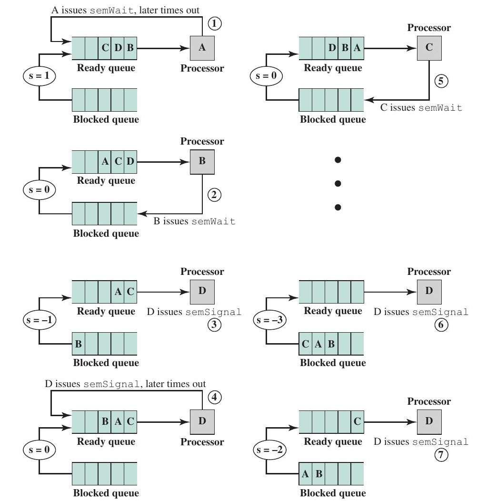

<!--
**Figura 5.10 — datos compartidos y semáforos:**
Esta figura complementa la anterior mostrando qué datos son compartidos y cómo el semáforo protege el acceso.

**Arquitectura de memoria:**
- Datos compartidos (variables globales, buffers, estructuras)
- Semáforo de protección (uno o más)
- Cada proceso tiene sus datos privados (pila, registros)

**Concepto importante:** el semáforo protege los datos, no el código. Si dos procesos acceden a la misma variable pero no la modifican, no necesitan exclusión mutua. Solo la necesitan si hay **escritura**.
-->

---

# **Figura 5.10 — Procesos Accediendo a Datos Compartidos**

> **Concepto importante:** el semáforo protege los **datos**, no el código. Si dos procesos acceden a la misma variable pero no la modifican, no necesitan exclusión mutua.

<!--
**Problema del Productor/Consumidor — el ejemplo clásico de concurrencia:**

**Buffer infinito (teórico):**
- `in`: índice donde el productor coloca el siguiente elemento
- `out`: índice donde el consumidor toma el siguiente elemento
- `n = in - out`: número de elementos en el buffer
- **Condición:** consumidor no debe tomar si `n == 0` (in ≤ out)

**Problema fundamental:**
1. Productor y consumidor comparten `in`, `out` y `n`
2. `n` se modifica por ambos procesos
3. La verificación `n == 0` no es atómica con la toma del elemento

**Analogía:** un mostrador de atención al cliente donde se toman números. El productor imprime números, el consumidor atiende. Si no coordinamos quién vio el último número, pueden atenderse dos personas al mismo tiempo.
-->

---


<!--
**Solución incorrecta — el error típico de diseño:**

El error está en usar semáforo binario para proteger la E/S pero NO para proteger la verificación de `n == 0`.

**Escenario de fallo:**
1. Consumidor: `semWait(s)` → entra a SC, lee `n = 0`
2. **Cambio de contexto:** productor entra, produce elemento, `n = 1`
3. Productor: `semWait(s)` → bloqueado (consumidor está en SC)
4. Consumidor: sale de SC `semSignal(s)`, encuentra `n == 0` (obsoleto) → **no consume** → ¡pierde el dato!
5. **Inanición:** consumidor nunca consume lo que el productor produjo

**Lección:** la verificación de condición y el consumo deben ser atómicos con respecto a la modificación compartida.

**Error clásico en exámenes:** muchos estudiantes proponen esta solución incorrecta.
-->

---

# **Problema del Productor/Consumidor**

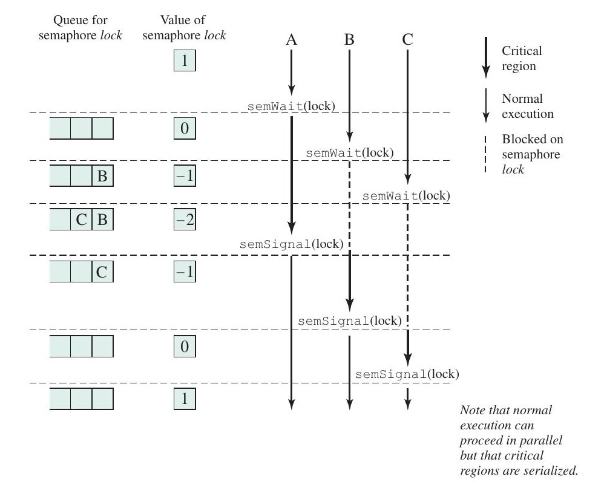

### Buffer Infinito:
- **Productor:** genera datos y los coloca en `b[in]`, incrementa `in`
- **Consumidor:** toma datos de `b[out]`, incrementa `out`
- **Condición:** consumidor no debe tomar si `in <= out`

<!--
**Tabla 5.4 — línea de tiempo del error:**
Esta tabla muestra paso a paso cómo la solución incorrecta lleva a la pérdida de datos.

**Columnas de la tabla:**
- Paso: número de paso
- Productor: qué ejecuta el productor
- Consumidor: qué ejecuta el consumidor
- `n`: valor de la variable compartida después de cada paso
- Semáforo: estado del semáforo binario

**Punto crítico:** en el paso 4, el consumidor sale de la SC con `n = 1` (productor puso un dato) pero su variable local `m` (que guardó `n` al entrar) sigue siendo 0. No consume el dato porque `m == 0`.
-->

---

# **Tabla 5.4 — Escenario del Programa Incorrecto**

| Paso | Productor | Consumidor | `n` | Semáforo `s` |
|:----:|:----------|:-----------|:---:|:------------:|
| 1 | — | `semWait(s)` → SC | 0 | 0 (tomado) |
| 2 | — | `m = n` → `m = 0` | 0 | 0 |
| 3 | — | `semSignal(s)` → sale | 0 | 1 (libre) |
| 4 | Produce dato | — | 1 | 1 |
| 5 | `semWait(s)` → SC | — | 1 | 0 |
| 6 | `append()` | — | 1 | 0 |
| 7 | `semSignal(s)` → sale | — | 1 | 1 |
| 8 | — | Verifica: `m == 0` → **no consume** | 1 | 1 |

**Resultado:** el consumidor pierde el dato porque su variable local `m` guardó `n = 0` antes de que el productor produjera.

<!--
**Solución correcta — buffer infinito con variable local:**

**La clave:** usar una **variable local** `m` para guardar el valor de `n` dentro de la sección crítica.

```c
void consumer() {
  int m;
  semWait(s);
  m = n;           // guardar n localmente
  semSignal(s);    // salir de SC inmediatamente
  if (m == 0) sleep();  // ahora podemos verificar fuera de SC
  else consume();
}
```

**¿Por qué funciona?**
1. La lectura de `n` se hace dentro de la SC → valor consistente
2. La salida de SC se hace antes del consumo → el productor puede producir
3. La verificación y el consumo se hacen con `m` local → no hay condición de carrera

**Pero aún queda un problema:** el `sleep()` no está sincronizado con el productor. Si el consumidor duerme mientras el productor produce, el consumidor no se despierta → inanición.
-->

---

# **Solución Correcta — Buffer Infinito**

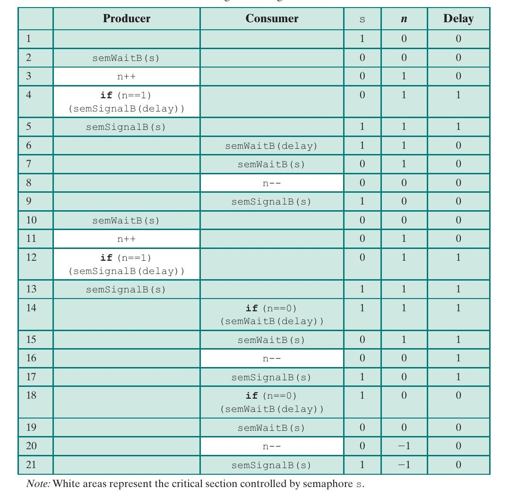

**Clave:** Variable local `m` guarda el valor de `n` dentro de la sección crítica

<!--
**Solución con semáforos generales — la mejor alternativa:**

Aquí `n` **es un semáforo**, no una variable entera. Maneja automáticamente la atomicidad de la verificación y el bloqueo.

```c
semaphore n = 0;  // inicialmente sin elementos
semaphore s = 1;  // mutex para el buffer

void producer() {
  produce_item();
  semWait(s);
  append();
  semSignal(s);
  semSignal(n);   // avisar que hay un nuevo elemento
}

void consumer() {
  semWait(n);     // esperar hasta que haya un elemento
  semWait(s);
  take();
  semSignal(s);
}
```

**Ventaja:** `semWait(n)` bloquea automáticamente al consumidor si `n=0`. Cuando el productor hace `semSignal(n)`, el consumidor se despierta automáticamente. No hay busy waiting ni sleeps no coordinados.
-->

---

# **Solución con Semáforos Generales**

**Ventaja:** `n` es un semáforo, se maneja atomicidad automáticamente

<!--
**Buffer circular finito — la versión realista:**

A diferencia del buffer infinito (teórico), el buffer real tiene tamaño fijo. Esto agrega la restricción de **buffer lleno**: el productor debe esperar si el buffer no tiene espacio.

**Tres semáforos necesarios:**
1. `e` (empty): cuenta espacios vacíos → inicializado al tamaño del buffer
2. `n` (full): cuenta elementos ocupados → inicializado a 0
3. `s` (mutex): exclusión mutua para acceso al buffer

**Relación clave:** `e + n = tamaño_del_buffer` (invariante). Cuando `e = 0`, el buffer está lleno (productor bloqueado). Cuando `n = 0`, el buffer está vacío (consumidor bloqueado).
-->

---

# **Buffer Circular Finito — Figura 5.15**

**Relaciones:**
- Productor se bloquea si buffer **lleno**
- Consumidor se bloquea si buffer **vacío**
- Semáforo `e` (empty) + `n` (full) + `s` (mutex)

<!--
**Solución con buffer acotado — el patrón canónico:**

```
Productor:
1. semWait(e)     → pedir espacio vacío
2. semWait(s)     → entrar a SC del buffer
3. append()       → agregar elemento
4. semSignal(s)   → salir de SC
5. semSignal(n)   → avisar que hay un elemento

Consumidor:
1. semWait(n)     → pedir un elemento
2. semWait(s)     → entrar a SC del buffer
3. take()         → extraer elemento
4. semSignal(s)   → salir de SC
5. semSignal(e)   → avisar que hay un espacio vacío
```

**¿Por qué este orden?**
- Productor: pide espacio (e) ANTES del mutex (s) → si no hay espacio, se bloquea sin ocupar el mutex
- Consumidor: pide elemento (n) ANTES del mutex (s) → mismo principio

**Regla de oro:** siempre pedir el recurso de condición (e/n) antes que el mutex (s). Invertir el orden puede causar deadlock.
-->

---

# **Solución con Buffer Acotado (Bounded-Buffer)**

### Esquema:
```
semaphore s = 1, n = 0, e = sizeofbuffer;

Productor: semWait(e) → semWait(s) → append() → semSignal(s) → semSignal(n)
Consumidor: semWait(n) → semWait(s) → take() → semSignal(s) → semSignal(e)
```

<!--
**Implementación de semáforos — dos enfoques:**

**1. Con C&S (Figura 5.x):**
```c
void semWait(semaphore s) {
  while (compare_and_swap(s.count, 0, 0) != 0
         || compare_and_swap(s.count, ..., ...));
}
```
Aún hay busy waiting en la implementación de semWait, pero solo por unos pocos ciclos (dentro de la función), no en la SC del usuario.

**2. Deshabilitando interrupciones (uniprocesador):**
```c
void semWait(semaphore s) {
  inhibit_interrupts();
  s.count--;
  if (s.count < 0) {
    place_on_queue(s.queue);
    allow_interrupts();
    block();  // cambio de contexto
  } else allow_interrupts();
}
```
Aquí deshabilitamos interrupciones solo por el tiempo de modificar el contador y la cola (microsegundos), no durante toda la SC del usuario.

**Lección:** los semáforos se construyen sobre el soporte hardware, pero lo usan por períodos mínimos, no por toda la SC.
-->

---

# **Implementación de Semáforos**

### Con instrucción Compare&Swap:

### Deshabilitando interrupciones (uniprocesador):
- `inhibit interrupts` antes de modificar semáforo
- `allow interrupts` después

---

<!-- _class: lead -->
# **5. Monitores**

<!--
**Estructura de un monitor — encapsulación de sincronización:**

El monitor resuelve la limitación clave de los semáforos: los semáforos están dispersos en el código y es fácil olvidar un semWait o semSignal. El monitor condensa **datos + procedimientos + sincronización** en una sola unidad.

**Reglas del monitor:**
1. Los datos locales son privados — solo se acceden mediante procedimientos del monitor
2. Un proceso entra invocando un procedimiento del monitor
3. **Solo un proceso puede ejecutar en el monitor a la vez** — el compilador/run-time garantiza exclusión mutua automáticamente

**Analogía:** una biblioteca con una sola sala de lectura. Varias personas pueden usar la biblioteca (= monitor), pero solo una persona a la vez puede estar en la sala de lectura ejecutando procedimientos del monitor.

**Lenguajes que implementan monitores:**
- Concurrent Pascal, Modula-2, Mesa (históricos)
- Java: `synchronized` methods + `wait()`/`notify()`
- C#: `lock` statement + `Monitor.Wait()`/`Monitor.Pulse()`
- Python: `threading.Condition`
-->

---

# **Estructura de un Monitor**

### Características:
1. Datos locales accesibles solo por procedimientos del monitor
2. Un proceso entra invocando un procedimiento
3. **Solo un proceso a la vez** puede ejecutar en el monitor

<!--
**Variables de condición — el mecanismo de señalización del monitor:**

Dentro de un monitor, las variables de condición permiten que un proceso espere por una condición específica y que otro la señale.

**cwait(c):**
- Libera el monitor (permite que otro proceso entre)
- Suspende el proceso en la cola de condición c
- Cuando otro proceso hace csignal(c), se reanuda
- Al reanudarse, **re-adquiere el monitor** (puede que tenga que esperar si hay otro proceso activo)

**csignal(c):**
- Si hay procesos esperando en c, despierta a uno
- Si no hay procesos esperando, **la señal se pierde** — diferencia fundamental con semáforos

**Diferencia con semáforos (importante para el examen):**
| Aspecto | Semáforo | Variable condición |
|---------|----------|--------------------|
| Señal sin espera | Se acumula (el valor del semáforo aumenta) | Se pierde |
| Asociación | Variable global | Dentro del monitor |
| Contador | Sí (entero) | No (solo cola) |
-->

---

# **Variables de Condición**

Dos operaciones en variables de condición:

- **cwait(c):** Suspende el proceso en la condición `c`, libera el monitor
- **csignal(c):** Reanuda un proceso bloqueado en condición `c`

### Diferencia con semáforos:
- Si no hay proceso esperando, **la señal se pierde**

<!--
**Monitor para buffer acotado — ejemplo concreto:**

```c
monitor boundedbuffer;
char buffer[N];
int nextin, nextout, count;
cond notfull, notempty;  // condiciones

void append(char x) {
  if (count == N) cwait(notfull);
  buffer[nextin] = x;
  nextin = (nextin + 1) % N;
  count++;
  csignal(notempty);
}

void take(char *x) {
  if (count == 0) cwait(notempty);
  *x = buffer[nextout];
  nextout = (nextout + 1) % N;
  count--;
  csignal(notfull);
}
```

**Observación:** la exclusión mutua del buffer está implícita en el monitor. No hay semWait/semSignal explícitos para el acceso al buffer.

**Nota:** en el modelo Hoare (original), se usa `if` - el proceso señalizado ejecuta inmediatamente. En el modelo Mesa, se usa `while` - el proceso señalizado reverifica la condición.
-->

---

# **Monitor para Buffer Acotado**

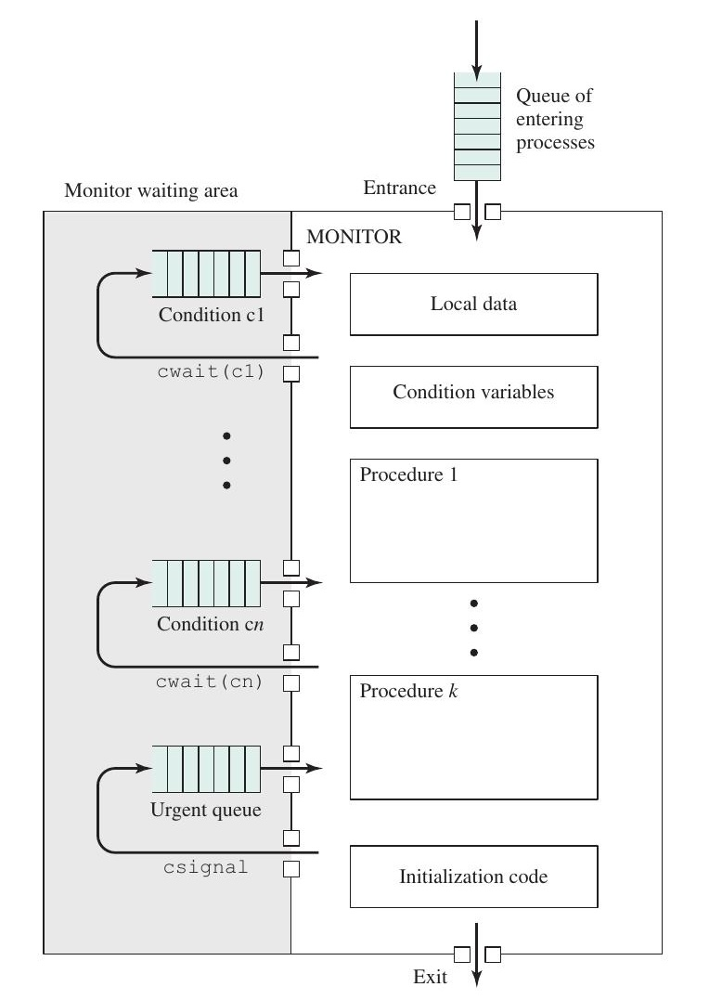

```c
monitor boundedbuffer;
cond notfull, notempty;

void append(char x) {
  if (count == N) cwait(notfull);
  buffer[nextin] = x;
  count++;
  csignal(notempty);
}
```

<!--
**Modelo Mesa vs Hoare — dos filosofías de señalización:**

**Modelo Hoare (original):**
- `csignal` transfiere inmediatamente el control al proceso despertado
- El proceso que señaliza se bloquea hasta que el otro sale del monitor
- La condición se cumple con certeza al reanudar → se usa `if`
- Requiere dos cambios de contexto por señalización

**Modelo Mesa (Lampson/Redell — Xerox PARC):**
- `cnotify` solo marca que la condición puede ser cierta
- El proceso despertado compite por el monitor (como cualquier otro)
- La condición **puede haber cambiado** al reanudar → se usa `while`
- Menos cambios de contexto, más robusto

**¿Cuál se usa en la práctica?** Mesa — Java `notify()`, C# `Pulse()`, Python `notify()` usan el modelo Mesa.

**Pregunta de examen:** ¿por qué en Mesa se usa `while` en lugar de `if`? → Porque cuando el proceso se reanuda, otro proceso pudo haber tomado la condición antes.
-->

---

# **Modelo Mesa (Lampson/Redell)**

| Característica | Hoare | Mesa |
|:--------------|:-----|:-----|
| Señal | `csignal` — inmediata | `cnotify` — diferida |
| Verificación | `if (condición)` | `while (condición)` |
| Cambio de contexto | Inmediato al señalizar | El notificado compite por el monitor |

<!--
**Modelo Mesa — ventajas adicionales:**

1. **cbroadcast:** notifica a todos los procesos en espera. Útil cuando no sabemos cuántos pueden progresar (ej. liberación de recursos).
2. **Timeout:** un proceso puede esperar con límite de tiempo. Si la condición no se cumple, se reanuda automáticamente.
3. **Eficiencia:** el señalizador no se bloquea → puede seguir trabajando mientras el señalizado espera su turno.

**Diagrama:** el proceso A notifica a B y C. B y C compiten por el monitor. A continúa ejecutando. Cuando A sale, B y C compiten (el que gana entra).

**Analogía:** un restaurante:
- **Hoare:** el mesero deja caer todo y atiende a la mesa que llamó
- **Mesa:** el mesero anota que la mesa pidió, termina lo que hace, y luego va a atender la mesa
-->

---

# **Modelo Mesa (cont.)**

### Ventajas del Modelo Mesa:
**Menos cambios de contexto**
El proceso que notifica **continúa ejecutándose**
Menos propenso a errores — cada proceso **reverifica** la condición
Soporta **cbroadcast** — notifica a todos los procesos en espera
Permite **timeout** en condiciones

---

<!-- _class: lead -->
# **6. Paso de Mensajes**

<!--
**Sistemas de mensajes — concurrencia sin memoria compartida:**

Hasta ahora todos los mecanismos asumen **memoria compartida** (variables, semáforos, monitores). El paso de mensajes permite concurrencia incluso cuando los procesos no comparten espacio de direcciones — crucial para sistemas distribuidos.

**Características del modelo:**
1. **Send/receive como primitivas básicas**
2. **Sincronización:** bloqueante vs no bloqueante
3. **Direccionamiento:** directo (PID) vs indirecto (buzones)
4. **Formato del mensaje:** cabecera + cuerpo
5. **Propiedades de la cola:** FIFO, prioridad, etc.

**Ejemplos reales:**
- Microkernel Minix: servidores como procesos de usuario que se comunican por mensajes
- Windows: LPC (Local Procedure Call) → ALPC
- Mach: puertos + mensajes
-->

---

# **Características de los Sistemas de Mensajes**

| Característica | Descripción |
|:--------------|:-----------|
| **Send/Receive** | Primitivas básicas de comunicación |
| **Sincronización** | Bloqueante vs no bloqueante |
| **Direccionamiento** | Directo (PID) vs indirecto (buzones) |
| **Formato** | Cabecera + cuerpo del mensaje |
| **Propiedades de cola** | FIFO, prioridad, inspección |

**Ejemplos reales:**
- **Minix:** servidores como procesos de usuario que se comunican por mensajes
- **Windows:** LPC (Local Procedure Call) → ALPC
- **Mach:** puertos + mensajes

<!--
**Primitivas y modos de sincronización — compensaciones de diseño:**

**send(destination, message):** envía un mensaje a un destino
**receive(source, message):** recibe un mensaje de una fuente

**Modos de sincronización (Tabla comparativa):**

| Modo | Send | Receive | Uso típico |
|:----|:----|:--------|:-----------|
| **Bloqueante/Bloqueante (Rendezvous)** | Espera hasta recibido | Espera hasta recibir | RPC síncrono |
| **No bloqueante/Bloqueante** | Continúa inmediato | Espera hasta recibir | Servidor, productor |
| **No bloqueante/No bloqueante** | Continúa inmediato | Abandona si no hay | Sondeo (polling) |

**Rendezvous (cita):** ambos procesos se sincronizan en el intercambio. El send bloquea hasta que el receive correspondiente se ejecuta, y viceversa. Es el modo más seguro (no hay buffers) pero puede causar deadlock fácilmente.
-->

---

# **Primitivas de Paso de Mensajes**

```c
send(destination, message);
receive(source, message);
```

### Modos de Sincronización:

| Modo | Send | Receive |
|:----|:----|:--------|
| **Bloqueante/Bloqueante** | Espera hasta recibido | Espera hasta recibir |
| **No bloqueante/Bloqueante** | Continúa inmediato | Espera hasta recibir |
| **No bloqueante/No bloqueante** | Continúa inmediato | Abandona si no hay |

<!--
**Direccionamiento directo vs indirecto — ¿cómo encuentro al destinatario?:**

**Directo:**
- `send(P2, msg)` — especifico el proceso destino
- `receive(P1, msg)` — especifico la fuente (o implícito = cualquiera)
- Simétrico: ambos se conocen
- Asimétrico: solo el receptor especifica la fuente

**Indirecto (buzones/mailboxes/ports):**
- `send(box, msg)` — envío a un buzón
- `receive(box, msg)` — recibo de un buzón
- Los procesos no se conocen entre sí, solo conocen el buzón

**Ventaja del indirecto:** desacoplamiento — el productor no necesita saber quiénes son los consumidores. Permite añadir o quitar consumidores dinámicamente.

**Relaciones (muchos:muchos):** varios productores pueden enviar al mismo buzón, varios consumidores pueden recibir del mismo buzón.
-->

---

# **Direccionamiento Directo vs. Indirecto**

### Directo:
- `send(destino, msg)` — identificador explícito
- `receive(fuente, msg)` — puede ser implícito

### Indirecto (Mailboxes/Ports):
- Mensajes enviados a un **buzón compartido**
- Relaciones: 1:1, muchos:1, 1:muchos, muchos:muchos

<!--
**Figura 5.xx — direccionamiento indirecto:**
Esta figura muestra las 4 configuraciones posibles con buzones:
1. **1:1** — un proceso envía, un proceso recibe (típico en pipeline)
2. **Muchos:1** — varios procesos envían, uno recibe (servidor centralizado)
3. **1:Muchos** — uno envía, varios reciben (broadcast/multicast)
4. **Muchos:Muchos** — varios envían y reciben (sistema de mensajería)

**Propiedad importante de buzones:** el buzón es un recurso que debe ser creado, gestionado y destruido. Si un buzón se destruye mientras hay procesos esperando, esos procesos reciben un error.
-->

---

# **Direccionamiento Indirecto**

```
┌─────────────────────────────────────────┐
│         DIRECCIONAMIENTO INDIRECTO        │
│              (Mailboxes)                  │
├─────────────────────────────────────────┤
│                                          │
│  1:1          Muchos:1     1:Muchos      │
│  P1 → □ → P2  P1,P2 → □ → P3  P1 → □ → │
│                                        P2,P3 │
│                                          │
│  Muchos:Muchos                            │
│  P1,P2 → □ → P3,P4                       │
└─────────────────────────────────────────┘
```

**Ventaja:** desacoplamiento — el productor no necesita saber quiénes son los consumidores.

<!--
**Formato del mensaje y disciplinas de cola:**

**Cabecera:** información de control (tipo, destino, fuente, longitud, checksum)
**Cuerpo:** datos del mensaje

**Disciplina de cola:**
1. **FIFO:** el primer mensaje enviado es el primero en ser recibido (estándar)
2. **Prioridad:** los mensajes con mayor prioridad se entregan primero (importante para sistemas de tiempo real)
3. **Inspección y selección:** el receptor puede inspeccionar la cabecera y decidir si recibir o no — no consume el mensaje hasta que decide

**Nota de implementación:** las colas de mensajes tienen capacidad limitada. Si un productor envía más rápido de lo que el consumidor recibe, la cola se llena y el send se bloquea (modo bloqueante) o falla (modo no bloqueante).
-->

---

# **Formato de Mensaje**

- **Cabecera:** tipo, ID destino, ID fuente, longitud, control
- **Cuerpo:** contenido del mensaje

### Disciplina de Cola:
- FIFO (por defecto)
- Por prioridad
- El receptor puede inspeccionar y seleccionar

<!--
**Exclusión mutua con mensajes — el patrón del 'token':**

```c
void P(int i) {
  message msg;
  while (true) {
    receive(box, msg);       // espera el token
    /* critical section */;
    send(box, msg);          // libera el token
  }
}
```

**Mecanismo:**
- El buzón `box` contiene exactamente **un mensaje** (el token)
- `receive` = tomar el token (si no está, el proceso se bloquea)
- `send` = devolver el token al buzón
- Solo el proceso que tiene el token puede estar en SC

**Equivalencia con semáforo binario:**
- `semWait(s)` ≡ `receive(box, msg)`
- `semSignal(s)` ≡ `send(box, msg)`
- `s = 1` ≡ enviar el mensaje inicial al buzón

**Ventaja:** funciona en sistemas distribuidos sin memoria compartida. El buzón puede estar en otra máquina.
-->

---

# **Exclusión Mutua con Mensajes**

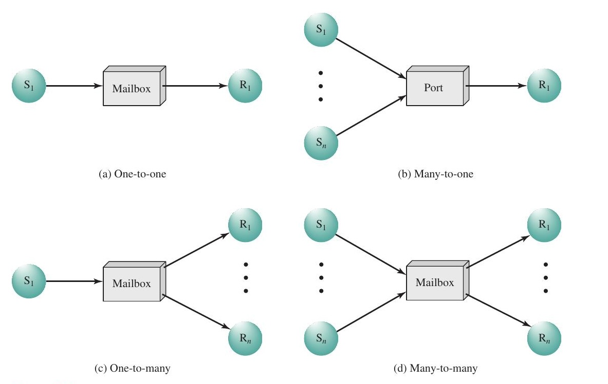

```c
void P(int i) {
  message msg;
  while (true) {
    receive(box, msg);       // Espera el token
    /* critical section */;
    send(box, msg);          // Libera el token
  }
}
```

<!--
**Inicialización y puesta en marcha del sistema de mensajes:**

```c
create_mailbox(box);         // crear el buzón
send(box, null);             // poner el token inicial
parbegin(P(1), P(2), ..., P(n));  // iniciar todos los procesos
```

**Detalles importantes:**
1. `create_mailbox` crea la cola de mensajes en el kernel
2. `send(box, null)` coloca el token inicial — el primer `receive` tomará este token y entrará a SC
3. `parbegin` inicia todos los procesos concurrentemente (es una construcción clásica de Dijkstra)

**Análisis de corrección:**
- Solo un proceso puede tener el token → exclusión mutua
- El token siempre se devuelve → ningún proceso se bloquea permanentemente
- Si N procesos están esperando y uno libera, exactamente uno lo recibe
- **Pero:** hay busy waiting si `receive` es no bloqueante (polling)
-->

---

# **Inicialización — Exclusión Mutua con Mensajes**

```c
// Inicialización:
create_mailbox(box);
send(box, null);
parbegin(P(1), P(2), ..., P(n));
```

**Mecanismo:**
- El buzón `box` contiene un token que da acceso a la SC
- Cada proceso recibe el token → entra en SC → libera el token
- Garantiza exclusión mutua

<!--
**Buffer acotado con mensajes — dos buzones de control:**

En lugar de usar semáforos `e` y `n`, usamos buzones mensajeros:

```c
create_mailbox(mayproduce);   // control de espacio
create_mailbox(mayconsume);   // control de elementos

// Inicializar mayproduce con 'capacity' mensajes vacíos
for (i = 0; i < capacity; i++) send(mayproduce, null);
```

**Flujo del productor:**
1. `receive(mayproduce, msg)` → espera espacio disponible
2. Produce el elemento y lo envía
3. `send(mayconsume, element)` → pone el elemento en el buzón de consumo

**Flujo del consumidor:**
1. `receive(mayconsume, msg)` → espera un elemento
2. Consume el elemento
3. `send(mayproduce, null)` → devuelve un espacio al buzón de producción

**Equivalencia con semáforos:**
- `mayproduce` ≡ semáforo `e` (empty)
- `mayconsume` ≡ semáforo `n` (full)
- Sin necesidad de un mutex separado — el paso de mensajes es intrínsecamente atómico
-->

---

# **Buffer Acotado con Mensajes**

- **mayproduce:** inicializado con `capacity` mensajes vacíos
- **mayconsume:** contiene los mensajes producidos
- Productor: recibe de `mayproduce`, envía a `mayconsume`
- Consumidor: recibe de `mayconsume`, envía a `mayproduce`

---

<!-- _class: lead -->
# **7. Problema de Lectores/Escritores**

<!--
**Problema de Lectores/Escritores — motivación y contexto:**

Es uno de los problemas clásicos de concurrencia más estudiados. Su importancia radica en que muchos sistemas reales tienen este patrón.

**Casos de uso reales:**
- Bases de datos: miles de lectores concurrentes, pocos escritores (actualizaciones)
- Sistemas de archivos: caché de directorios compartida
- Memoria caché: lectura frecuente, escritura ocasional
- Diccionarios en memoria: búsquedas constantes, actualizaciones periódicas

**Las 3 condiciones:**
1. Varios lectores pueden leer simultáneamente
2. Solo un escritor a la vez
3. Nadie lee mientras se escribe (consistencia de datos)

**Analogía:** una biblioteca pública — muchas personas pueden leer libros al mismo tiempo, pero si alguien está escribiendo en una pizarra, los lectores deben esperar a que termine.
-->

---

# **Definición del Problema**

- **Área de datos compartida** (archivo, memoria, etc.)
- **Lectores:** solo leen — pueden coexistir múltiples lectores
- **Escritores:** solo escriben — **exclusión mutua** total

### Condiciones:
1. Varios lectores pueden leer simultáneamente
2. Solo un escritor a la vez
3. Si un escritor escribe, ningún lector puede leer

<!--
**Solución: Lectores tienen prioridad — el problema de la inanición:**

```c
int readcount;              // contador de lectores activos
semaphore x = 1;            // mutex para readcount
semaphore wsem = 1;         // semáforo de escritura

void reader() {
  semWait(x); readcount++;  // incrementar contador
  if(readcount == 1) semWait(wsem);  // primer lector bloquea escritores
  semSignal(x);
  READUNIT();               // leer
  semWait(x); readcount--;  // decrementar contador
  if(readcount == 0) semSignal(wsem);  // último lector libera escritores
  semSignal(x);
}
```

**Mecanismo:**
- `wsem` protege el recurso de los escritores
- Solo el **primer** lector ejecuta `semWait(wsem)` — los demás lectores entran libremente
- Solo el **último** lector ejecuta `semSignal(wsem)` — libera a los escritores

**Problema:** si siempre hay al menos un lector en SC, los escritores nunca pueden escribir → **inanición de escritores**.
-->

---

# **Solución: Lectores tienen Prioridad**

```c
int readcount;
semaphore x = 1, wsem = 1;

void reader() {
  semWait(x); readcount++;
  if(readcount == 1) semWait(wsem);
  semSignal(x);
  READUNIT();
  semWait(x); readcount--;
  if(readcount == 0) semSignal(wsem);
  semSignal(x);
}
```

<!--
**Figura 5.xx — comportamiento de la solución lectores-prioritarios:**
Esta figura muestra una línea de tiempo con múltiples lectores y escritores.

**Observar:**
- Los lectores L1, L2, L3 entran simultáneamente (no hay exclusión entre lectores)
- El escritor W1 se bloquea porque `wsem` está tomado por L1
- L1 sale, pero L4 ya está esperando → `readcount` no llega a 0 → W1 sigue bloqueado
- Esto puede durar indefinidamente si siempre llegan nuevos lectores

**Pregunta de discusión:** ¿es siempre incorrecto que los lectores tengan prioridad? Depende del sistema: en un servidor web de solo lectura (catálogo), dar prioridad a lectores es óptimo. En un sistema bancario, los escritores deben tener prioridad para evitar datos obsoletos.
-->

---

# **Solución: Lectores tienen Prioridad (cont.)**

### Mecanismo:
- `wsem`: controla el acceso del escritor (los lectores lo bloquean solo el primero/último)
- `x`: protege `readcount`
- Los escritores solo pueden escribir si `readcount == 0`

<!--
**Tabla 5.6 — estado de las colas en la solución lector-prioritario:**
Esta tabla muestra, paso a paso, los valores de las variables y el estado de las colas.

**Columnas:**
- Acción: qué operación se ejecutó
- readcount: número de lectores activos
- Cola wsem: procesos bloqueados en el semáforo de escritura
- Cola x: procesos bloqueados en el mutex de readcount
- Estado: qué procesos están en SC

**Interpretación:** cuando readcount=3 y llega un escritor, el escritor se bloquea en wsem. Cuando readcount baja a 0 (último lector sale), el escritor se desbloquea.
-->

---

# **Tabla 5.6 — Estado de las Colas de Procesos**

| Acción | `readcount` | Cola `wsem` | Cola `x` | Estado (SC) |
|:-------|:-----------:|:-----------:|:--------:|:-----------|
| L1: reader() | 0 → 1 | — | — | L1 leyendo |
| L2: reader() | 1 → 2 | — | — | L1, L2 leyendo |
| L3: reader() | 2 → 3 | — | — | L1, L2, L3 leyendo |
| E1: writer() | 3 | E1 bloqueado | — | L1, L2, L3 leyendo |
| L1: sale | 3 → 2 | E1 bloqueado | — | L2, L3 leyendo |
| L4: reader() | 2 → 3 | E1 bloqueado | — | L2, L3, L4 leyendo |
| L2: sale | 3 → 2 | E1 bloqueado | — | L3, L4 leyendo |
| L3: sale | 2 → 1 | E1 bloqueado | — | L4 leyendo |
| L4: sale | 1 → 0 | E1 desbloqueado | — | E1 escribiendo |

**Interpretación:** mientras `readcount > 0` el escritor E1 permanece bloqueado en `wsem`. Nuevos lectores (L4) pueden seguir entrando, manteniendo `readcount > 0` y retrasando a E1 indefinidamente — esto es la **inanición de escritores**.

<!--
**Solución: Escritores tienen prioridad — más compleja pero más justa:**

**Mecanismos adicionales:**
- `rsem` — semáforo que inhibe a los lectores cuando hay escritores esperando
- `writecount` — contador de escritores esperando
- `z` — semáforo para encolar lectores adicionales (solo un lector espera en `rsem`)

**¿Cómo funciona?**
1. Cuando llega un escritor, incrementa `writecount`
2. Si es el primer escritor (`writecount == 1`), ejecuta `semWait(rsem)` — esto bloquea la entrada de nuevos lectores
3. Los lectores que ya están leyendo terminan (readcount baja a 0)
4. El escritor ejecuta `semWait(wsem)` y escribe
5. Al salir, si hay más escritores esperando, el siguiente escritor entra; si no, libera `rsem` para que los lectores puedan leer

**Problema:** puede causar inanición de lectores si siempre hay escritores esperando.

**Trade-off:** no hay solución perfecta — cualquier esquema puede causar inanición de un lado u otro.
-->

---

# **Solución: Escritores tienen Prioridad**

### Mecanismos adicionales:
- `rsem` — inhibe lectores cuando hay escritores esperando
- `writecount` — controla `rsem`
- `z` — encola lectores adicionales (solo uno espera en `rsem`)

<!--
**Solución con paso de mensajes — controlador centralizado:**

**Arquitectura:**
- Un proceso controlador gestiona el acceso a los datos
- Tres buzones: `readrequest`, `writerequest`, `finished`
- Variable `count`: >0 (lectores activos), =0 (inactivo), <0 (escritor activo)

**Protocolo del controlador:**
1. Recibe solicitudes de lectura/escritura o notificaciones de finalización
2. Si `count >= 0` (no hay escritor) y llega solicitud de lectura → incrementa `count` y permite leer
3. Si `count == 0` y llega solicitud de escritura → decrementa `count` a -1 y permite escribir
4. Cuando recibe `finished`, ajusta `count` y decide si admitir a la siguiente solicitud en espera

**Ventaja del controlador centralizado:** toda la lógica de decisión está en un solo lugar → fácil de verificar y modificar. Desventaja: el controlador es un punto único de fallo y cuello de botella.
-->

---

# **Solución con Paso de Mensajes**

### Controlador centralizado:
- Tres buzones: `readrequest`, `writerequest`, `finished`
- Variable `count`: >0 (lectores activos), =0 (escritor espera), <0 (escritor activo)
- Servicio de mensajes `finished` antes de nuevas solicitudes

<!--
**Resumen del Capítulo 5 — tabla comparativa final:**

Esta tabla es material de examen directo. Los estudiantes deben conocer las ventajas y desventajas de cada mecanismo.

**Mnemotecnia para el examen:**
- **Software:** simple pero complejo + busy waiting
- **Hardware:** atómico pero busy waiting + inanición
- **Semáforos:** flexibles pero fáciles de usar mal (errores comunes)
- **Monitores:** estructurados pero requieren soporte del lenguaje
- **Mensajes:** distribuibles pero overhead de comunicación

**Conexión con Tanenbaum (mos.md):** los conceptos aquí vistos son la base de los mecanismos de sincronización que se usan en sistemas reales: mutexes de pthreads (semáforo binario), variables de condición POSIX (monitores), y pipes/sockets (paso de mensajes).
-->

---

# **Resumen del Capítulo 5**

| Mecanismo | Ventajas | Desventajas |
|:----------|:---------|:------------|
| **Software** (Dekker, Peterson) | No requiere soporte HW/SO | Complejo, espera ocupada |
| **Hardware** (C&S, XCHG) | Simple, multiprocesador | Espera ocupada, inanición |
| **Semáforos** | Poderoso, flexible | Propenso a errores |
| **Monitores** | Estructurado, encapsulado | Soporte del lenguaje |
| **Mensajes** | Distribuido, comunicación | Sobrecarga |

<!--
**Términos clave — glosario para el examen:**

Estos términos aparecen con frecuencia en exámenes de SO. Los estudiantes deben poder definirlos y dar ejemplos.

**Los más importantes:**
- **Atomic:** indivisible — clave para semáforos y C&S
- **Busy waiting:** espera activa que consume CPU — el problema de los semáforos implementados con C&S
- **Condition variable:** mecanismo de bloqueo selectivo en monitores — se usa con `cwait`/`csignal`
- **Deadlock:** el clásico abrazo mortal — los 4 requisitos de Coffman
- **Livelock:** procesos que 'bailan' sin progresar — el cuarto intento de exclusión mutua
- **Mutex:** la cerradura más simple — equivalente a semáforo binario
- **Race condition:** el problema que motivó todo el capítulo
- **Semaphore:** la abstracción central — entender semWait/semSignal
- **Starvation:** cuando un proceso espera indefinidamente — el problema de dar prioridad a lectores
-->

---

# **Términos Clave**

| Término | Definición |
|:--------|:-----------|
| **Atomic** | Operación indivisible |
| **Busy waiting** | Proceso consume CPU esperando |
| **Condition variable** | Variable para bloquear/despertar en monitores |
| **Deadlock** | Procesos bloqueados esperándose mutuamente |
| **Livelock** | Procesos cambian estados sin progresar |
| **Mutex** | Cerradura de exclusión mutua |
| **Race condition** | Resultado depende del orden de ejecución |
| **Semaphore** | Entero para señalización entre procesos |
| **Starvation** | Proceso omitido indefinidamente |

---

<!-- _class: lead -->
# **Fin del Capítulo 5**
## Concurrencia: Exclusión Mutua y Sincronización

### William Stallings — Operating Systems: Internals and Design Principles (9ª Ed.)
