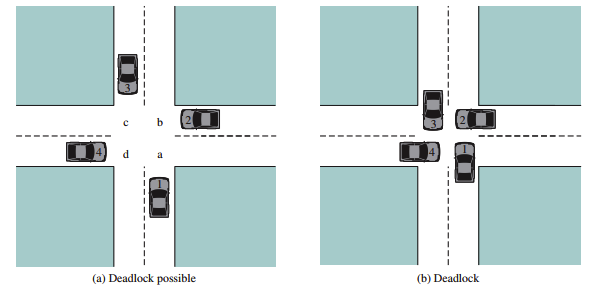
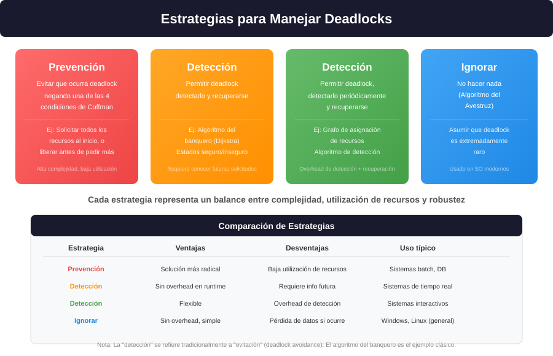
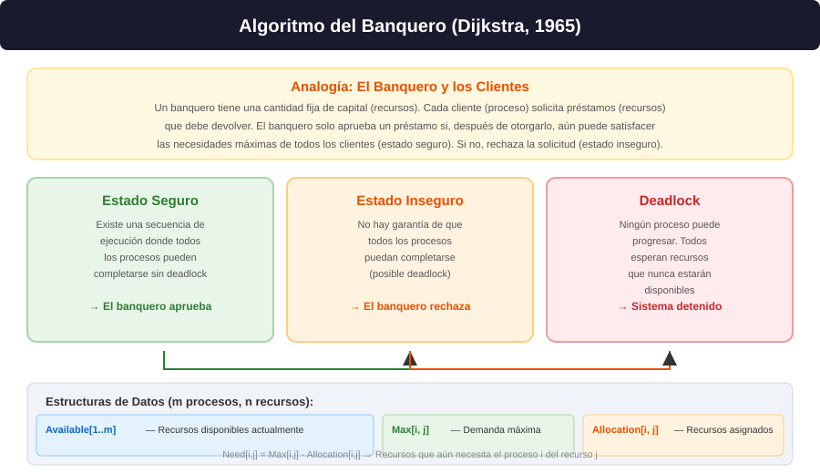

# **Capítulo 6: Deadlock e Inanición**

## Principios, Prevención, Evitación y Recuperación

### William Stallings — Operating Systems: Internals and Design Principles (9ª Ed.)

---

# **Contenido del Capítulo**

1. **Principios de Deadlock**
2. **Prevención de Deadlock**
3. **Evitación de Deadlock (Algoritmo del Banquero)**
4. **Detección de Deadlock**
5. **Recuperación de Deadlock**
6. **El Problema de la Cena de los Filósofos**
7. **Inanición (Starvation)**


---

# **Objetivos de Aprendizaje**

- Definir **deadlock** y distinguirlo de otros problemas de concurrencia
- Explicar las **4 condiciones de Coffman** necesarias para deadlock
- Describir las **cuatro estrategias** para manejar deadlocks
- Implementar el **algoritmo del banquero** para evitación de deadlocks
- Comprender los **algoritmos de detección** basados en grafos
- Analizar el **problema de la cena de los filósofos**
- Diferenciar **deadlock**, **inanición** y **livelock**

---

<!-- _class: lead -->
# **1. Principios de Deadlock**



---

# **Definición de Deadlock**

**Deadlock (bloqueo mutuo):** un conjunto de procesos está en deadlock cuando cada proceso en el conjunto espera un evento que solo otro proceso del conjunto puede provocar.

> Un deadlock es el **abrazo mortal** donde ninguno puede avanzar porque todos esperan a los demás.

### Ejemplo clásico — Dos procesos y dos recursos:
```
P1: Tiene el recurso A, espera el recurso B
P2: Tiene el recurso B, espera el recurso A
```
Resultado: **ambos esperan para siempre**.

<!--
**Definición formal (Stallings, Sección 6.1):** 
Un deadlock ocurre cuando un conjunto de procesos está bloqueado permanentemente. Cada proceso en el conjunto espera un recurso que solo puede ser liberado por otro proceso en el mismo conjunto. Como todos esperan, ninguno puede liberar sus recursos → bloqueo permanente.

**Diferencia con otros bloqueos:**
- **Deadlock:** todos los procesos involucrados están bloqueados
- **Starvation:** solo un proceso está bloqueado (los otros progresan)
- **Livelock:** los procesos están activos pero no progresan (cambian de estado sin avanzar)
-->

---

# **Condiciones de Coffman (1971)**

**Cuatro condiciones necesarias para que ocurra deadlock:**

| # | Condición | Descripción | Cómo negarla |
|:-:|:----------|:------------|:-------------|
| 1 | **Exclusión Mutua** | Los recursos no pueden ser compartidos (modo exclusivo) | Usar recursos compartibles cuando sea posible |
| 2 | **Retener y Esperar** | Un proceso retiene recursos mientras espera otros | Solicitar todos los recursos al inicio |
| 3 | **Sin Desalojo** | Los recursos no pueden ser quitados forzosamente | Permitir desalojo de recursos |
| 4 | **Espera Circular** | Existe un ciclo en el grafo de asignación | Establecer orden jerárquico de recursos |

> **Importante:** estas condiciones son **necesarias** pero no **suficientes**. Si las 4 se cumplen, puede ocurrir deadlock (no es garantía).

---

# **Modelado con Grafos de Asignación de Recursos**

**Elementos del grafo:**
| Símbolo | Representa | Descripción |
|:-------:|:----------|:------------|
| ![Círculo] | **Proceso** | Nodo del grafo |
| ![Cuadrado] | **Recurso** | Nodo del grafo |
| $\rightarrow$ | **Asignación** | Recurso asignado a proceso |
| $\leftarrow$ | **Solicitud** | Proceso espera recurso |

**Regla de detección (Stallings, Sección 6.1.3):**
- Si el grafo **no tiene ciclos** → no hay deadlock
- Si el grafo **tiene un ciclo** y cada recurso en el ciclo tiene **una sola instancia** → deadlock
- Si el grafo tiene un ciclo pero algún recurso tiene **múltiples instancias** → puede no haber deadlock

---

# **Ejemplo de Deadlock con Grafos de Asignación**

El grafo de asignación de recursos permite visualizar cuándo ocurre deadlock:

- **P1** tiene asignado R (flecha R → P1) y solicita S (flecha P1 → S)
- **P2** tiene asignado S (flecha S → P2) y solicita R (flecha P2 → R)
- Se forma un ciclo: **P1 → S → P2 → R → P1**
- Como R y S tienen **solo 1 instancia** cada uno → **deadlock inevitable**

> **Conclusión:** un ciclo en el grafo donde cada recurso tiene una sola instancia indica deadlock.

---

# **Recursos Reutilizables vs. Consumibles**

| Tipo | Descripción | Ejemplos | Deadlock potencial |
|:----|:------------|:---------|:------------------:|
| **Reutilizables** | Se pueden usar y liberar sin consumirse | CPU, memoria, archivos, dispositivos | Sí — deadlock clásico |
| **Consumibles** | Se crean y destruyen durante su uso | Mensajes, buffers, señales, interrupciones | Sí — deadlock por pérdida |

### Deadlock con recursos consumibles (Stallings, p. 331):
```
Proceso A: espera un mensaje de B → envía mensaje a B
Proceso B: espera un mensaje de A → envía mensaje a A
```
Ambos esperan recibir antes de enviar → **deadlock**.

<!--
**Recursos reutilizables:** un recurso físico que puede ser usado por un proceso a la vez. Después de usarlo, el proceso lo libera y puede ser reasignado.

**Recursos consumibles:** un recurso que se consume al usarlo. El proceso "crea" el recurso (send) y otro lo "consume" (receive). 
-->

---

# **Estrategias para Manejar Deadlocks**

| Estrategia | Descripción | Overhead | Utilización |
|:-----------|:------------|:--------:|:-----------:|
| **Prevención** | Negar una de las 4 condiciones | Alto | Baja |
| **Evitación** | Decidir si otorgar recursos (Banquero) | Medio | Media |
| **Detección + Recuperación** | Permitir deadlock, detectarlo y recuperarse | Medio | Alta |
| **Ignorar (Avestruz)** | Asumir que deadlock es extremadamente raro | Bajo | Máxima |

---



---

# **Ciclo sin Deadlock — Recursos con Múltiples Instancias**

El lado derecho de la figura muestra un escenario donde **no hay deadlock** aunque existe un ciclo en el grafo:

- **P3** tiene asignado T (flecha T → P3) y solicita U (flecha P3 → U)
- **P4** tiene asignada **una** instancia de U (flecha U → P4) y solicita T (flecha P4 → T)
- Hay un ciclo: **P3 → T → P4 → U → P3**
- Sin embargo, **U tiene 2 instancias**. P4 solo tiene 1, la segunda está libre
- P4 puede obtener la **segunda instancia de U**, completar y liberar T → **no hay deadlock**

> **Conclusión clave (Stallings, p. 330):** un ciclo en el grafo es condición **necesaria** para deadlock, pero no **suficiente** cuando existen recursos con múltiples instancias.

---

<!-- _class: lead -->
# **2. Prevención de Deadlock**

---

# **Prevención — Negar la Exclusión Mutua (Stallings, p. 335)**

### Objetivo: permitir que los recursos sean compartibles

| Condición | Estrategia | Problema |
|:----------|:-----------|:---------|
| **Exclusión Mutua** | Usar recursos compartibles (archivos de solo lectura) | Algunos recursos son **inherentemente no compartibles** (impresora, dispositivos de E/S) |

**Limitación fundamental:** no todos los recursos pueden ser compartidos.
- Un archivo de solo lectura → sí puede ser compartido
- Una impresora → debe ser usada por un proceso a la vez
- Un recurso de E/S → por definición es de exclusión mutua

> **Conclusión:** negar la exclusión mutua solo funciona para un subconjunto limitado de recursos.

---

# **Prevención — Negar "Retener y Esperar" (Stallings, p. 335)**

### Dos enfoques:
1. **Solicitud total inicial:** el proceso solicita **todos** los recursos que necesitará antes de comenzar
2. **Liberación antes de nueva solicitud:** el proceso libera todos los recursos actuales antes de solicitar nuevos

### Problemas:
- **Baja utilización de recursos:** los recursos están asignados aunque no se usen activamente
- **Planificación impredecible:** el proceso no siempre sabe cuántos recursos necesitará al inicio
- **Posible inanición:** un proceso que necesita muchos recursos puede esperar indefinidamente

---

# **Prevención — Negar "Sin Desalojo" (Stallings, p. 335)**

### Estrategias:
1. **Desalojo preventivo:** si un proceso pide un recurso que no está disponible, el SO le **quita** todos los recursos que ya tiene
2. **Desalojo con salvaguarda:** el SO guarda el estado del proceso, desaloja los recursos, y los devuelve cuando estén todos disponibles

### Problemas:
- Costoso (guardar/restaurar estado)
- Complejo de implementar
- Algunos recursos no pueden ser desalojados

<!--
**Recursos desalojables vs no desalojables (Stallings, p. 336):**

**Desalojables:** CPU (cambio de contexto), memoria.
**No desalojables:** impresora (no se puede quitar un trabajo a medio imprimir), archivo en escritura (pérdida de datos), regiones críticas.

**Costo del desalojo con salvaguarda:**
1. Guardar estado del proceso (registros, memoria)
2. Liberar recursos
3. Asignar recursos al proceso solicitante
4. Cuando todos los recursos del proceso original estén disponibles, restaurar estado
5. Reanudar el proceso original
-->

---

# **Prevención — Negar "Espera Circular" (Stallings, p. 336)**

### Estrategia: **Ordenamiento jerárquico de recursos**
- Asignar un **número único** a cada recurso
- Los procesos deben solicitar recursos en **orden ascendente**
- Si un proceso tiene el recurso $i$, solo puede solicitar recursos $> i$

```
// Orden de recursos: R1 < R2 < R3 < ...
// VÁLIDO: R1 → R2 → R3
solicitar(R1);
solicitar(R2);
solicitar(R3);

// INVÁLIDO: R1 → R3 → R2
solicitar(R1);
solicitar(R3);   // Válido hasta aquí (R3 > R1)
solicitar(R2);   // INVALIDO: R2 < R3
```

### Ventajas:
- Simple de implementar
- Garantiza ausencia de espera circular

<!--
**Demostración (Stallings, p. 336):**

Supongamos que existe una espera circular: P0 → R0 → P1 → R1 → ... → Pn → Rn → P0.
Por la regla de orden, si Pi tiene Ri y solicita R{i+1}:
- Ri < R{i+1} (por la regla de orden)
Pero entonces R0 < R1 < ... < Rn < R0, lo que implica R0 < R0 → **contradicción**.

**No puede existir espera circular bajo ordenamiento jerárquico.**
-->

---

# **Resumen — Prevención de Deadlock (Stallings, p. 337)**

| Condición negada | Estrategia | Desventaja principal |
|:-----------------|:-----------|:-------------------|
| **Exclusión Mutua** | Recursos compartibles | No aplicable a todos los recursos |
| **Retener y Esperar** | Solicitud total al inicio | Baja utilización, requiere predicción |
| **Sin Desalojo** | Desalojo forzoso | Costoso, no siempre posible |
| **Espera Circular** | Orden jerárquico | Requiere convención global |

> **Ninguna estrategia de prevención es ideal.** Todas sacrifican eficiencia o flexibilidad.

---

<!-- _class: lead -->
# **3. Evitación de Deadlock — Algoritmo del Banquero**

---

# **Algoritmo del Banquero (Dijkstra, 1965) — Stallings, p. 337**

### Idea central:
El SO decide si prestar recursos (aprobar una solicitud) basándose en si el estado resultante es **seguro**.

### Definiciones:
| Término | Descripción |
|:--------|:------------|
| **Estado seguro** | Existe al menos una secuencia de procesos que pueden completarse exitosamente |
| **Estado inseguro** | No hay garantía de que todos los procesos puedan completarse (posible deadlock) |
| **Secuencia segura** | Orden de ejecución donde cada proceso puede obtener todos sus recursos |

> **Regla del banquero:** solo aprueba un préstamo si el estado resultante es seguro. Si es inseguro, rechaza la solicitud (aunque haya recursos disponibles).

---



---

# **Estructuras de Datos (Stallings, p. 338)**

El algoritmo del banquero utiliza 4 matrices/vectores:

### Para $m$ procesos y $n$ tipos de recursos:

| Estructura | Tipo | Significado |
|:-----------|:----:|:------------|
| `Available[j]` | Vector de $n$ | Recursos disponibles del tipo $j$ |
| `Max[i, j]` | Matriz $m \times n$ | Demanda máxima del proceso $i$ para recurso $j$ |
| `Allocation[i, j]` | Matriz $m \times n$ | Recursos actualmente asignados al proceso $i$ del tipo $j$ |
| `Need[i, j]` | Matriz $m \times n$ | Recursos que aún necesita el proceso $i$: **Need = Max - Allocation** |

> **Precondición:** $Max[i, j] \leq Total[j]$ — ningún proceso puede demandar más del total disponible del sistema.

---

# **Algoritmo de Verificación de Estado Seguro (Stallings, p. 339)**

```
bool is_safe(Process processes[], int avail[], int max[][], int alloc[][]) {
    int work[n];  // Copia de available
    bool finish[m] = {false};

    for (int j = 0; j < n; j++) work[j] = avail[j];

    // Buscar un proceso que pueda completarse
    for (int k = 0; k < m; k++) {
        bool found = false;
        for (int i = 0; i < m; i++) {
            if (!finish[i]) {
                bool can_run = true;
                for (int j = 0; j < n; j++) {
                    if (need[i][j] > work[j]) {
                        can_run = false;
                        break;
                    }
                }
                if (can_run) {
                    // Proceso i puede completarse
                    for (int j = 0; j < n; j++)
                        work[j] += alloc[i][j];
                    finish[i] = true;
                    found = true;
                }
            }
        }
        if (!found) break;
    }
    return all(finish);  // Seguro si todos terminan
}
```

---

# **Ejemplo del Algoritmo del Banquero (Stallings, p. 340)**

**Sistema con 5 procesos (P0-P4) y 3 recursos (A:10, B:5, C:7):**

| Proceso | Allocation | Max | Need |
|:-------:|:----------:|:---:|:----:|
| | A B C | A B C | A B C |
| **P0** | 0 1 0 | 7 5 3 | 7 4 3 |
| **P1** | 2 0 0 | 3 2 2 | 1 2 2 |
| **P2** | 3 0 2 | 9 0 2 | 6 0 0 |
| **P3** | 2 1 1 | 2 2 2 | 0 1 1 |
| **P4** | 0 0 2 | 4 3 3 | 4 3 1 |

**Available: (3, 3, 2)**

**¿Es seguro?** Sí. Secuencia segura: **P1 → P3 → P0 → P2 → P4**

<!--
**Verificación paso a paso:**

1. **P1:** Need(1,2,2) ≤ Available(3,3,2) → ejecuta → libera(2,0,0) → Available(5,3,2)
2. **P3:** Need(0,1,1) ≤ Available(5,3,2) → ejecuta → libera(2,1,1) → Available(7,4,3)
3. **P0:** Need(7,4,3) ≤ Available(7,4,3) → ejecuta → libera(0,1,0) → Available(7,5,3)
4. **P2:** Need(6,0,0) ≤ Available(7,5,3) → ejecuta → libera(3,0,2) → Available(10,5,5)
5. **P4:** Need(4,3,1) ≤ Available(10,5,5) → ejecuta → libera(0,0,2) → Available(10,5,7)
-->

---

# **Ejemplo — Solicitud de Recursos**

**¿Qué pasa si P1 solicita (1, 0, 2)?**

| Proceso | Allocation (nuevo) | Need (nuevo) |
|:-------:|:-----------------:|:------------:|
| **P0** | 0 1 0 | 7 4 3 |
| **P1** | **3 0 2** | **0 2 0** |
| **P2** | 3 0 2 | 6 0 0 |
| **P3** | 2 1 1 | 0 1 1 |
| **P4** | 0 0 2 | 4 3 1 |

**Available (nuevo): (2, 3, 0)**

**¿Estado seguro?** Sí. Secuencia: **P1 → P3 → P0 → P2 → P4**

> **El banquero aprueba** la solicitud.

---

# **Ejemplo — Solicitud que Lleva a Estado Inseguro**

**¿Qué pasa si P4 solicita (3, 3, 0)?**

Si se otorga:
- Available = (0, 0, 2)
- Need(P4) = (1, 0, 1)

**¿Estado seguro?** **NO.** Ningún proceso puede ejecutarse:
- P0 necesita (7,4,3) → no hay recursos
- P1 necesita (1,2,2) → necesita recurso A
- P2 necesita (6,0,0) → necesita recurso A
- P3 necesita (0,1,1) → necesita recurso B
- P4 necesita (1,0,1) → necesita recurso A y C

> **El banquero rechaza** la solicitud.

---

# **Limitaciones del Algoritmo del Banquero (Stallings, p. 342)**

| Limitación | Descripción |
|:-----------|:------------|
| **Conocimiento previo** | Los procesos deben declarar su máximo de recursos **por adelantado** |
| **Número fijo de procesos** | No se adapta bien a procesos que crean/destruyen procesos hijos |
| **Recursos fijos** | Asume que los recursos no se añaden/eliminan dinámicamente |
| **Overhead** | El algoritmo es O(m² × n) por cada solicitud ($m$ procesos, $n$ recursos) |

> El algoritmo del banquero se emplea principalmente en **sistemas de bases de datos** y sistemas **embebidos de tiempo real**.

---

<!-- _class: lead -->
# **4. Detección de Deadlock**

---

# **Detección de Deadlock — Un solo recurso de cada tipo (Stallings, p. 343)**

**Algoritmo:** buscar **ciclos** en el grafo de asignación de recursos.

```
Algoritmo de detección (DFS):
1. Para cada proceso P en el grafo:
   a. Realizar DFS desde P
   b. Si se encuentra un ciclo → deadlock detectado
   c. Si no hay ciclo desde P → continuar con siguiente proceso

Complejidad: O(n + e) donde n = número de nodos, e = número de aristas
```

> **Caso especial:** si cada recurso tiene una sola instancia, un ciclo en el grafo es condición suficiente y necesaria para deadlock.

---

# **Detección — Múltiples recursos de cada tipo (Stallings, p. 344)**

Similar al algoritmo del banquero, pero sin necesidad de conocer `Max`:

```
bool detect_deadlock(int avail[], int alloc[][], int request[][]) {
    int work[n];          // Copia de available
    bool finish[m];       // false si proceso en deadlock

    // Inicializar: procesos sin recursos asignados terminan
    for (int i = 0; i < m; i++) {
        bool allocated = false;
        for (int j = 0; j < n; j++)
            if (alloc[i][j] > 0) { allocated = true; break; }
        finish[i] = !allocated;
    }

    for (int j = 0; j < n; j++) work[j] = avail[j];

    // Buscar proceso que pueda completarse
    bool progress = true;
    while (progress) {
        progress = false;
        for (int i = 0; i < m; i++) {
            if (!finish[i]) {
                bool can_run = true;
                for (int j = 0; j < n; j++)
                    if (request[i][j] > work[j])
                        { can_run = false; break; }
                if (can_run) {
                    for (int j = 0; j < n; j++)
                        work[j] += alloc[i][j];
                    finish[i] = true;
                    progress = true;
                }
            }
        }
    }

    // Procesos en deadlock: finish[i] == false
    for (int i = 0; i < m; i++)
        if (!finish[i]) printf("Proceso %d en deadlock\n", i);
    return !all(finish);
}
```

<!--
**Diferencia con el algoritmo del banquero:**
- El algoritmo de detección usa `request[i][j]` (solicitudes **actuales** pendientes)
- El algoritmo del banquero usa `need[i][j]` (necesidades **futuras** máximas)
- La detección es más permisiva: solo verifica si las solicitudes actuales pueden ser satisfechas
- El banquero es más conservador: verifica si las necesidades máximas futuras pueden ser satisfechas
-->

---

# **Tabla de Comparación — Detección vs. Banquero**

| Característica | Algoritmo del Banquero | Algoritmo de Detección |
|:---------------|:---------------------:|:----------------------:|
| **Propósito** | Evitación (predecir) | Detección (diagnosticar) |
| **Información requerida** | Max (necesidad futura) | Request (solicitud actual) |
| **Uso** | Antes de cada solicitud | Periódicamente |
| **Efecto** | Evita estados inseguros | Permite deadlock y lo detecta |
| **Overhead** | Alto (cada solicitud) | Bajo (periódico) |

---

# **¿Cuándo Ejecutar la Detección? (Stallings, p. 346)**

### Opciones:
1. **Cada vez que se deniega una solicitud** — detección inmediata pero overhead alto
2. **Periódicamente** — basado en tiempo o uso de CPU
3. **Bajo demanda** — el administrador ejecuta la detección manualmente

### Trade-off:
```
Frecuencia alta → detección rápida → más overhead
Frecuencia baja → menos overhead → deadlock persiste más tiempo
```

---

<!-- _class: lead -->
# **5. Recuperación de Deadlock**

---

# **Recuperación — Una vez detectado el deadlock (Stallings, p. 347)**

### Opción 1: **Abortar procesos**
- **Abortar todos los procesos en deadlock** — solución radical, pérdida de trabajo
- **Abortar un proceso a la vez** — más selectivo, pero requiere volver a ejecutar detección

### Opción 2: **Desalojar recursos (preempt)**
- Quitar recursos a procesos seleccionados y dárselos a otros
- **Tres decisiones:**
  1. **¿Qué proceso desalojar?** — el que tenga menos recursos, menos tiempo restante, mayor prioridad, etc.
  2. **¿Qué recursos desalojar?** — los más fáciles de restaurar
  3. **¿Cómo reanudar?** — rollback total o parcial

| Método | Ventaja | Desventaja |
|:-------|:--------|:-----------|
| **Abortar todos** | Simple, garantizado | Pérdida total de trabajo |
| **Abortar uno a uno** | Selectivo, menos pérdida | Overhead de múltiples detecciones |
| **Desalojar recursos** | Preserva procesos | Complejo, puede causar inanición |

---

# **Criterios para Elegir un Proceso Víctima (Stallings, p. 348)**

| Criterio | Descripción |
|:---------|:------------|
| **Prioridad del proceso** | Menor prioridad → más probable de ser víctima |
| **Tiempo de cómputo restante** | Menos tiempo restante → menos pérdida |
| **Recursos asignados** | Menos recursos → menos costo de desalojo |
| **Recursos necesarios** | Más recursos necesarios → más difícil de satisfacer |
| **Número de procesos hijos** | Menos hijos → menos impacto |
| **Tipo de proceso** | Batch vs interactivo (interactivo tiene prioridad) |

> **Ningún criterio es universal.** La elección depende del sistema y la carga de trabajo.

---

<!-- _class: lead -->
# **6. El Problema de la Cena de los Filósofos**

---

# **El Problema de la Cena de los Filósofos (Stallings, p. 349)**

### Escenario:
- 5 filósofos en una mesa redonda
- Cada filósofo alterna entre **pensar** y **comer**
- Hay 5 tenedores, **uno entre cada par de filósofos**
- Para comer, un filósofo necesita **ambos** tenedores (izquierdo y derecho)

```
     F0
   P0   P1
 F4     F1
   P4   P2
     F3   F2
     P3
```

<!--
**Importancia del problema:** es el ejemplo clásico que demuestra cómo un diseño aparentemente correcto puede llevar a deadlock. Combina exclusión mutua (tenedores), espera circular y condiciones de carrera.
-->

---

# **Solución Ingenua — Deadlock Garantizado**

```
semaphore tenedor[5] = {1, 1, 1, 1, 1};

void filosofo(int i) {
    while (true) {
        pensar();
        semWait(tenedor[i]);               // Tenedor izquierdo
        semWait(tenedor[(i + 1) % 5]);     // Tenedor derecho
        comer();
        semSignal(tenedor[i]);
        semSignal(tenedor[(i + 1) % 5]);
    }
}
```

**Resultado:** si todos los filósofos toman el tenedor izquierdo al mismo tiempo → **¡Deadlock!**

<!--
**Escenario de deadlock:**
1. P0 toma tenedor 0, P1 toma tenedor 1, ..., P4 toma tenedor 4
2. Cada filósofo espera el tenedor derecho (que tiene el vecino)
3. **Deadlock** — nadie puede comer, nadie suelta su tenedor

**Las 4 condiciones de Coffman se cumplen:**
1. Exclusión mutua: tenedores no compartibles
2. Retener y esperar: cada filósofo tiene 1 tenedor y espera el otro
3. Sin desalojo: no se puede quitar un tenedor a la fuerza
4. Espera circular: P0 espera tenedor de P1, P1 espera tenedor de P2, etc.
-->

---

# **Soluciones al Problema (Stallings, p. 350)**

### 1. **Límite de comensales** — Máximo 4 filósofos a la vez
Solución más simple: un semáforo `room = 4` limita cuántos pueden competir por tenedores.

### 2. **Orden jerárquico** — Tenedores numerados, tomar en orden ascendente
Los filósofos impares toman izquierdo primero, los pares toman derecho primero.

### 3. **Monitor** — Usar variables de condición
Implementar con monitor que verifique disponibilidad de ambos tenedores.

---

# **Solución 1 — Máximo 4 Filósofos**

```
semaphore tenedor[5] = {1, 1, 1, 1, 1};
semaphore room = 4;  // Máximo 4 filósofos a la vez

void filosofo(int i) {
    while (true) {
        pensar();
        semWait(room);
        semWait(tenedor[i]);
        semWait(tenedor[(i+1)%5]);
        comer();
        semSignal(tenedor[i]);
        semSignal(tenedor[(i+1)%5]);
        semSignal(room);
    }
}
```

> **¿Por qué funciona?** Con 4 filósofos, al menos uno podrá tomar ambos tenedores (el quinto tenedor está libre). Esto rompe la espera circular.

---

# **Solución 2 — Orden Jerárquico (Asimétrica)**

```
semaphore tenedor[5] = {1, 1, 1, 1, 1};

void filosofo(int i) {
    while (true) {
        pensar();
        if (i % 2 == 0) {  // Pares: izquierdo primero
            semWait(tenedor[i]);
            semWait(tenedor[(i + 1) % 5]);
        } else {           // Impares: derecho primero
            semWait(tenedor[(i + 1) % 5]);
            semWait(tenedor[i]);
        }
        comer();
        semSignal(tenedor[i]);
        semSignal(tenedor[(i + 1) % 5]);
    }
}
```

> **¿Por qué funciona?** Rompe la espera circular. El filósofo 0 toma 0→1, el filósofo 1 toma 2→1 (invierte). El ciclo se rompe.

---

# **Solución 3 — Monitor (Stallings, p. 351)**

```
monitor CenaFilosofos {
    enum {PENSANDO, HAMBRIENTO, COMIENDO} estado[5];
    cond puede_comer[5];

    void prueba(int i) {
        if (estado[i] == HAMBRIENTO &&
            estado[(i+4)%5] != COMIENDO &&
            estado[(i+1)%5] != COMIENDO) {
            estado[i] = COMIENDO;
            csignal(puede_comer[i]);
        }
    }

    void tomar_tenedores(int i) {
        estado[i] = HAMBRIENTO;
        prueba(i);
        if (estado[i] != COMIENDO)
            cwait(puede_comer[i]);
    }

    void dejar_tenedores(int i) {
        estado[i] = PENSANDO;
        prueba((i+4)%5);  // Verificar vecino izquierdo
        prueba((i+1)%5);  // Verificar vecino derecho
    }
}
```

> **Ventaja:** encapsula toda la lógica de sincronización. **Sin deadlock, sin inanición.**

---

<!-- _class: lead -->
# **7. Inanición (Starvation)**

---

# **Inanición — Definición y Comparación (Stallings, p. 353)**

**Inanición (starvation):** un proceso es **pospuesto indefinidamente** aunque no esté en deadlock.

### Comparación de problemas de concurrencia:

| Problema | ¿Progresan otros? | Estado de los procesos |
|:---------|:-----------------:|:----------------------|
| **Deadlock** | No | Todos bloqueados |
| **Inanición** | Sí | Uno espera, otros progresan |
| **Livelock** | No | Activos pero sin progresar |

### Ejemplo de inanición:
```
Planificador: procesos con prioridades
P1: prioridad alta (ejecuta siempre que está listo)
P2: prioridad baja (nunca recibe CPU si P1 siempre está listo)
```
**P2 sufre inanición** — aunque no hay deadlock, P2 nunca se ejecuta.

---

# **Causas de Inanición (Stallings, p. 353)**

### 1. **Planificación injusta**
- Prioridades fijas → procesos de baja prioridad nunca se ejecutan

### 2. **Mecanismos de sincronización**
- **Semáforos débiles:** orden de desbloqueo no especificado → algunos procesos pueden ser "saltados" repetidamente
- **Lectores prioritarios:** si siempre hay lectores, los escritores nunca escriben

### 3. **Algoritmos de evitación de deadlock**
- El algoritmo del banquero puede causar inanición si rechaza consistentemente a un proceso

### 4. **Colas FIFO mal implementadas**
- Si la cola permite inserción por prioridad, los procesos de baja prioridad pueden esperar indefinidamente

---

# **Inanición en Lectores/Escritores (Capítulo 5)**

### Prioridad a lectores → **Inanición de escritores**
```
L1 lee (t1) → L2 lee (t2) → E1 espera (t3) → L3 llega y lee (t4)
→ L4 llega y lee (t5) → ... → E1 nunca escribe
```

### Soluciones:
| Estrategia | Descripción |
|:-----------|:------------|
| **Cola FIFO** | Atender solicitudes en orden de llegada (sin prioridad) |
| **Envejecimiento (aging)** | Aumentar prioridad del proceso que más espera |
| **Tiempo límite** | Forzar ejecución después de un tiempo máximo de espera |

---

# **Estrategias contra la Inanición (Stallings, p. 354)**

| Estrategia | Cómo funciona |
|:-----------|:--------------|
| **Envejecimiento (Aging)** | Incrementar la prioridad del proceso con el tiempo |
| **Cola FIFO estricta** | Primer solicitante, primer servido |
| **Prioridades dinámicas** | Ajustar prioridades según historial de ejecución |
| **Tiempo límite** | Garantizar tiempo máximo de espera |

> **El envejecimiento (aging)** es la técnica más común. Cada cierto tiempo, la prioridad de los procesos en espera aumenta gradualmente hasta que se ejecutan.

---

# **Tabla: Deadlock vs. Inanición vs. Livelock**

| Aspecto | **Deadlock** | **Inanición** | **Livelock** |
|:--------|:-----------:|:-------------:|:------------:|
| **Estado** | Todos bloqueados | Uno bloqueado, otros progresan | Todos activos |
| **Consumo de CPU** | Cero (bloqueados) | Cero (el que espera) | Alto (todos ejecutan) |
| **Progreso** | Ninguno | Selectivo (solo algunos) | Ninguno (falso progreso) |
| **Detección** | Difícil | Fácil | Difícil |
| **Solución** | Abortar, desalojar, prevenir | Envejecimiento, colas justas | Backoff exponencial |

---

# **Resumen del Capítulo 6**

| Tema | Conceptos clave |
|:-----|:----------------|
| **Principios de Deadlock** | 4 condiciones de Coffman, grafos de asignación de recursos |
| **Prevención** | Negar una de las 4 condiciones (costoso) |
| **Evitación** | Algoritmo del banquero (estados seguro/inseguro) |
| **Detección** | Búsqueda de ciclos en grafos, algoritmo de detección |
| **Recuperación** | Abortar procesos, desalojar recursos |
| **Cena de los Filósofos** | Deadlock clásico y 3 soluciones |
| **Inanición** | Proceso pospuesto indefinidamente, envejecimiento, colas justas |

---

# **Términos Clave**

| Término | Definición |
|:--------|:-----------|
| **Deadlock** | Conjunto de procesos bloqueados esperándose mutuamente |
| **Espera circular** | Ciclo en el grafo de asignación de recursos |
| **Estado seguro** | Existe secuencia donde todos los procesos completan |
| **Estado inseguro** | No hay garantía de que todos los procesos completen |
| **Algoritmo del Banquero** | Decidir si otorgar recursos basado en estado seguro |
| **Secuencia segura** | Orden de procesos que garantiza finalización sin deadlock |
| **Inanición** | Proceso pospuesto indefinidamente |
| **Livelock** | Procesos activos que no progresan |
| **Envejecimiento (aging)** | Aumentar prioridad de procesos en espera prolongada |

---

<!-- _class: lead -->
# **Fin del Capítulo 6**
## Deadlock e Inanición: Principios, Prevención, Evitación y Recuperación

### William Stallings — Operating Systems: Internals and Design Principles (9ª Ed.)
