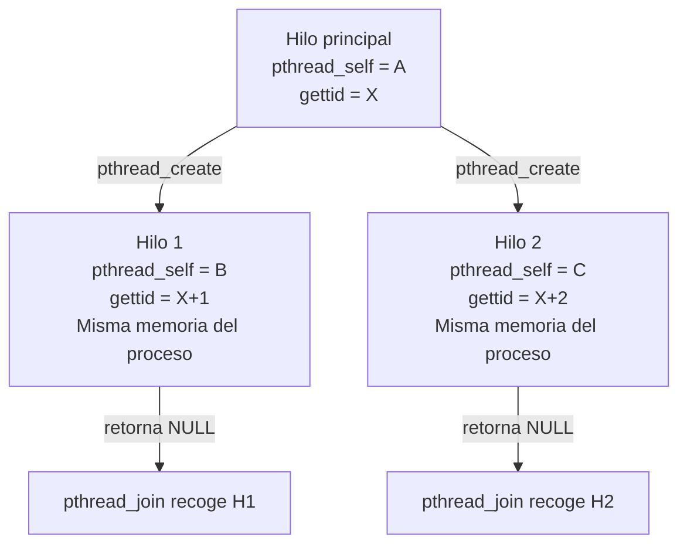

# Laboratorio: Hilos en Linux con GCC

**Plataforma:** GNU/Linux (Ubuntu / Debian)  
**Compilador:** GCC  
**Referencias:**
- Tanenbaum & Bos, *Modern Operating Systems*, 4.ª Ed., Sección 2.2
- Stallings, *Operating Systems: Internals and Design Principles*, 9.ª Ed., Cap. 4 (esp. 4.6)

## Contenido

- [Objetivo](#objetivo)
- [Preparación del entorno](#preparación-del-entorno)
  - [Referencia rápida de comandos](#referencia-rápida-de-comandos)
- [Ejercicio 1 — Identificación de un hilo](#ejercicio-1--identificación-de-un-hilo)
- [Ejercicio 2 — Creación de hilos con `pthread_create()`](#ejercicio-2--creación-de-hilos-con-pthread_create)
- [Ejercicio 3 — Memoria compartida y condición de carrera](#ejercicio-3--memoria-compartida-y-condición-de-carrera)
- [Ejercicio 4 — Estados de un hilo en Linux](#ejercicio-4--estados-de-un-hilo-en-linux)
- [Ejercicio 5 — `task_struct`: proceso vs. hilo en Linux](#ejercicio-5--task_struct-proceso-vs-hilo-en-linux)
- [Ejercicio 6 — Hilos en el sistema: exploración con herramientas](#ejercicio-6--hilos-en-el-sistema-exploración-con-herramientas)

## Objetivo

Observar en Linux los conceptos teóricos de los Capítulos relacionados con hilos y procesos, y cómo se implementan en la práctica:

- Identificación de hilos: TID de kernel vs. identificador POSIX
- Creación de hilos dentro de un proceso (`pthread_create`)
- Memoria compartida y condición de carrera
- Estados de un hilo (`R`, `S`, `D`, `T`, `Z`) vistos en `/proc`
- `task_struct` y TGID: cómo Linux representa proceso vs. hilo
- Exploración de los hilos del sistema con herramientas estándar

---

## Preparación del entorno

### Instalar herramientas necesarias

```bash
sudo apt update && sudo apt install -y gcc strace htop
```

| Paquete | Herramienta | Uso en el laboratorio |
|---------|-------------|----------------------|
| `gcc` | compilador C | compilar todos los ejercicios |
| `strace` | `strace` | trazar la syscall `clone` (ejercicio 2) |
| `htop` | `htop` | monitorear hilos del proceso en tiempo real |

Verifica la instalación:

```bash
gcc --version && strace --version && htop --version
```

> **Nota:** la biblioteca POSIX de hilos (`pthreads`) está incluida en `glibc`. Solo se necesita el flag `-lpthread` al compilar — no hay paquete adicional.

### Lanzar programas en segundo plano

El patrón `&` + `$!` permite observar el proceso desde la misma terminal:

```bash
./programa &
PID=$!
sleep 0.5
ls /proc/$PID/task          # lista los hilos del proceso
```

### Referencia rápida de comandos

#### Compilación con GCC y pthreads

| Comando | Descripción |
|---------|-------------|
| `gcc -Wall -pthread -o salida fuente.c` | Compila con soporte POSIX threads; `-pthread` activa la biblioteca y los flags del preprocesador necesarios |
| `./programa` | Ejecuta el binario en el directorio actual |

#### Inspección de hilos

| Comando | Descripción |
|---------|-------------|
| `ls /proc/<PID>/task/` | Lista los TIDs (kernel) de todos los hilos del proceso |
| `cat /proc/<PID>/task/<TID>/status` | Estado del hilo individual (nombre, TID, estado) |
| `cat /proc/<PID>/task/<TID>/status \| grep State` | Filtra solo el estado del hilo |
| `ps -p <PID> -L -o pid,lwp,state,comm` | Lista hilos del proceso con sus LWPs y estados |

#### Herramientas de monitoreo

| Comando | Descripción |
|---------|-------------|
| `strace -e trace=clone ./prog` | Muestra la llamada `clone()` que crea cada hilo |
| `htop` | Monitor interactivo; presiona `H` para ver hilos individuales dentro de cada proceso |

#### Estados de hilo en `/proc`

| Letra | Estado | Significado |
|-------|--------|-------------|
| `R` | Running / Runnable | En CPU o listo en la cola |
| `S` | Sleeping | Bloqueado (esperando mutex, E/S, join…) |
| `Z` | Zombie | El hilo terminó y aún no fue recogido |

---

### Directorio de trabajo

```bash
mkdir ~/lab-hilos
cd ~/lab-hilos
```

### Script de compilación rápida

Guarda como `run.sh`:

```bash
#!/bin/bash
# Uso: bash run.sh nombre_sin_extension
gcc -Wall -pthread -o "$1" "$1.c" && ./"$1"
```

```bash
chmod +x run.sh
```

---

## Ejercicio 1 — Identificación de un hilo

### Conceptos relacionados

En Linux cada hilo es un `task_struct` con su propio **TID de kernel** (visible en `/proc`). La API POSIX expone un identificador opaco `pthread_t` (retornado por `pthread_self()`). El proceso padre sigue siendo el mismo para todos los hilos (mismo `getpid()`).

| Campo | Función | API en C | Visible en `/proc` |
|-------|---------|----------|--------------------|
| **PID del proceso** | Identifica al proceso dueño de todos los hilos | `getpid()` | `/proc/<PID>/` |
| **TID de kernel** | Identifica al hilo individual dentro del kernel | `gettid()` *(Linux 2.4.11+)* | `/proc/<PID>/task/<TID>/` |
| **pthread_t** | Identificador opaco POSIX del hilo | `pthread_self()` | — |

> **Referencia:** MOS § 2.2.1 — *Thread Usage*; OSID § 4.6 — *task_struct* en Linux.

### Código — `t1_identidad.c`

```c
#define _GNU_SOURCE
#include <stdio.h>
#include <unistd.h>
#include <pthread.h>

static void *funcion_hilo(void *arg) {
    int numero = *(int *)arg;
    printf("[hilo %d] pthread_self = %lu  gettid = %d  getpid = %d\n",
           numero, (unsigned long)pthread_self(), gettid(), getpid());
    return NULL;
}

int main(void) {
    pthread_t h1, h2;
    int n1 = 1, n2 = 2;

    printf("[main]   pthread_self = %lu  gettid = %d  getpid = %d\n",
           (unsigned long)pthread_self(), gettid(), getpid());

    pthread_create(&h1, NULL, funcion_hilo, &n1);
    pthread_create(&h2, NULL, funcion_hilo, &n2);

    pthread_join(h1, NULL);
    pthread_join(h2, NULL);
    return 0;
}
```

### Compilación y ejecución

```bash
gcc -Wall -pthread -o t1_identidad t1_identidad.c
./t1_identidad
```

### Observación con `/proc`

```bash
./t1_identidad &
PID=$!
sleep 0.1
ls /proc/$PID/task
# muestra tres TIDs: el hilo principal + dos hilos creados
```

### Salida esperada

```
[main]   pthread_self = 139...  gettid = 4210  getpid = 4210
[hilo 1] pthread_self = 139...  gettid = 4211  getpid = 4210
[hilo 2] pthread_self = 139...  gettid = 4212  getpid = 4210
```

### Preguntas de análisis

1. ¿Por qué `getpid()` devuelve el mismo valor en el hilo principal y en los hilos creados?
2. El TID del hilo principal coincide con el PID del proceso. Explica por qué usando lo que sabes de `task_struct` en Linux.
3. ¿Qué diferencia hay entre `pthread_t` y el TID de kernel?

---

## Ejercicio 2 — Creación de hilos con `pthread_create()`

### Conceptos relacionados

`pthread_create()` crea un nuevo hilo de ejecución dentro del **mismo proceso**. Internamente invoca la syscall `clone()` con flags que permiten compartir espacio de memoria, descriptores de archivo y señales:



> **Diferencia con `fork()`:** `fork()` copia el espacio de direcciones (o usa COW); `pthread_create()` comparte el mismo espacio. Un hilo nuevo es más barato de crear y puede comunicarse directamente a través de variables globales.

### Código — `t2_create.c`

```c
#include <stdio.h>
#include <unistd.h>
#include <pthread.h>

static void *tarea(void *arg) {
    int id = *(int *)arg;
    printf("[hilo %d] inicio — ejecutando concurrentemente con main\n", id);
    sleep(1);
    printf("[hilo %d] fin\n", id);
    return NULL;
}

int main(void) {
    pthread_t hilos[3];
    int ids[3] = {1, 2, 3};

    printf("[main] creando 3 hilos...\n");
    for (int i = 0; i < 3; i++)
        pthread_create(&hilos[i], NULL, tarea, &ids[i]);

    printf("[main] hilos creados, esperando con join...\n");
    for (int i = 0; i < 3; i++)
        pthread_join(hilos[i], NULL);

    printf("[main] todos los hilos terminaron\n");
    return 0;
}
```

### Compilación y ejecución

```bash
gcc -Wall -pthread -o t2_create t2_create.c
./t2_create
```

### Trazado con `strace`

```bash
strace -e trace=clone ./t2_create 2>&1 | grep clone
```

Cada llamada a `pthread_create()` genera un `clone()` con flags como `CLONE_VM`, `CLONE_FILES`, `CLONE_THREAD`, `CLONE_SIGHAND`.

### Salida esperada

```
[main] creando 3 hilos...
[main] hilos creados, esperando con join...
[hilo 1] inicio — ejecutando concurrentemente con main
[hilo 2] inicio — ejecutando concurrentemente con main
[hilo 3] inicio — ejecutando concurrentemente con main
[hilo 1] fin
[hilo 2] fin
[hilo 3] fin
[main] todos los hilos terminaron
```

> El orden de los hilos puede variar entre ejecuciones — el planificador decide cuál ejecuta primero.

### Preguntas de análisis

1. Ejecuta el programa varias veces. ¿El orden de los mensajes `inicio` y `fin` es siempre el mismo? ¿Por qué?
2. En el `strace`, identifica los flags de `clone()`. ¿Cuáles indican que los hilos comparten memoria?
3. ¿Qué pasaría si llamaras a `fork()` en lugar de `pthread_create()`? ¿Podrían los hijos comunicarse directamente a través de una variable global?

---

## Ejercicio 3 — Memoria compartida y condición de carrera

### Conceptos relacionados

Los hilos comparten el mismo espacio de direcciones, incluyendo variables globales y del heap. Sin sincronización, cuando dos hilos leen y modifican la misma variable de forma concurrente ocurre una **condición de carrera** (*race condition*): el resultado depende del orden de ejecución — no es determinista.

La secuencia problemática (ejemplo con `contador++`):

```
Hilo A lee contador = 100
Hilo B lee contador = 100       ← B lee ANTES de que A escriba
Hilo A escribe contador = 101
Hilo B escribe contador = 101   ← se pierde un incremento
```

### Código — `t3_carrera.c`

```c
#include <stdio.h>
#include <pthread.h>

#define N_HILOS    4
#define ITERACIONES 1000000

static long contador = 0;   /* variable compartida — sin protección */

static void *incrementar(void *arg) {
    for (int i = 0; i < ITERACIONES; i++)
        contador++;          /* lectura-modificación-escritura NO atómica */
    return NULL;
}

int main(void) {
    pthread_t hilos[N_HILOS];

    for (int i = 0; i < N_HILOS; i++)
        pthread_create(&hilos[i], NULL, incrementar, NULL);

    for (int i = 0; i < N_HILOS; i++)
        pthread_join(hilos[i], NULL);

    printf("Resultado: %ld  (esperado: %d)\n",
           contador, N_HILOS * ITERACIONES);
    return 0;
}
```

### Compilación y ejecución

```bash
gcc -Wall -pthread -o t3_carrera t3_carrera.c
./t3_carrera
./t3_carrera
./t3_carrera
```

### Salida esperada

```
Resultado: 1843217  (esperado: 4000000)
Resultado: 2671004  (esperado: 4000000)
Resultado: 3102891  (esperado: 4000000)
```

El resultado cambia en cada ejecución y es siempre menor que el esperado — evidencia directa de la condición de carrera.

### Preguntas de análisis

1. ¿Por qué `contador++` no es una operación atómica? Descomponer la instrucción en pasos de CPU (leer, modificar, escribir).
2. ¿Por qué el resultado siempre es *menor* que `N_HILOS × ITERACIONES` y nunca mayor?
3. ¿Qué ocurre si reduces `N_HILOS` a 1? ¿Aparece la condición de carrera?

---

## Ejercicio 4 — Estados de un hilo en Linux

### Conceptos relacionados

Linux no distingue estados de hilo de los de proceso: cada hilo es un `task_struct` y expone el mismo conjunto de estados en `/proc/<PID>/task/<TID>/status`.

| Estado | Letra en `/proc` | Descripción |
|--------|-------------------|-------------|
| **Running/Runnable** | `R` | En CPU o listo en la cola de ejecución |
| **Sleeping (interruptible)** | `S` | Bloqueado esperando E/S, señal, `sleep()`, mutex, etc. |
| **Uninterruptible sleep** | `D` | Esperando E/S de disco; no puede interrumpirse con señales |
| **Stopped** | `T` | Detenido por `SIGSTOP` o being traced (`ptrace`) |
| **Zombie** | `Z` | Terminó pero nadie ha hecho `pthread_join`/`wait` sobre él |

> **Referencia:** OSID § 4.6 — estados de proceso/hilo en Linux; `man proc` — formato de `/proc/[pid]/status`.

### Código — `t4_estados.c`

```c
#include <stdio.h>
#include <unistd.h>
#include <pthread.h>

/* Demostración de estados de hilo: R (ocupado) y S (durmiendo). */

static void *hilo_ocupado(void *arg) {
    printf("[ocupado]  TID = %d — bucle intensivo (→ R)\n", gettid());
    volatile long suma = 0;
    for (long i = 0; i < 3000000000L; i++)
        suma += i;
    printf("[ocupado]  fin, suma = %ld\n", suma);
    return NULL;
}

static void *hilo_durmiente(void *arg) {
    printf("[durmiente] TID = %d — sleep(4) (→ S)\n", gettid());
    sleep(4);
    printf("[durmiente] desperté (→ R)\n");
    return NULL;
}

int main(void) {
    pthread_t h1, h2;

    printf("[main] PID = %d\n", getpid());
    pthread_create(&h1, NULL, hilo_ocupado, NULL);
    pthread_create(&h2, NULL, hilo_durmiente, NULL);

    pthread_join(h1, NULL);
    pthread_join(h2, NULL);
    printf("[main] ambos hilos terminaron\n");
    return 0;
}
```

### Compilación y ejecución

```bash
gcc -Wall -pthread -o t4_estados t4_estados.c
./t4_estados &
PID=$!
sleep 1
ps -p $PID -L -o pid,lwp,state,comm
# uno de los LWP debería verse en R y el otro en S
```

### Salida esperada

```
[main] PID = 8341
[ocupado]  TID = 8342 — bucle intensivo (→ R)
[durmiente] TID = 8343 — sleep(4) (→ S)
  PID   LWP S COMMAND
 8341  8341 S t4_estados
 8341  8342 R t4_estados
 8341  8343 S t4_estados
[durmiente] desperté (→ R)
[ocupado]  fin, suma = ...
[main] ambos hilos terminaron
```

### Preguntas de análisis

1. De los 5 estados de la tabla, ¿cuáles observaste directamente con `ps -L`? ¿Cuáles no, y por qué son difíciles de provocar aquí?
2. ¿Qué diferencia hay entre `S` (interruptible) y `D` (uninterruptible)? ¿Por qué un hilo en `D` no responde a `Ctrl+C`?
3. Compara con Windows Ejercicio 4: allá los 6 estados viven en el `THREAD_OBJECT` del kernel; en Linux, ¿dónde vive el estado de un hilo?

---

## Ejercicio 5 — `task_struct`: proceso vs. hilo en Linux

### Conceptos relacionados

A diferencia de Windows, que separa explícitamente `PROCESS_OBJECT` y `THREAD_OBJECT`, en Linux **todo es un `task_struct`** — incluido el hilo principal de un proceso. Lo que agrupa a varios `task_struct` como "el mismo proceso" es que comparten el mismo **TGID** (*Thread Group ID*, el valor que devuelve `getpid()`); cada uno conserva su propio **PID de kernel** (`gettid()`).

| Concepto | Windows | Linux |
|----------|---------|-------|
| Unidad básica del kernel | `PROCESS_OBJECT` / `THREAD_OBJECT` distintos | Un único `task_struct` para todo |
| Identificador de "proceso" | PID | TGID (== PID del hilo principal) |
| Identificador de "hilo" | TID | PID de kernel (`gettid()`) |
| Recursos compartidos entre hilos | Vía el `PROCESS_OBJECT` | Vía `mm_struct`, tabla de archivos y señales, compartidos por flags de `clone()` |

### Código — `t5_objetos.c`

```c
#define _GNU_SOURCE
#include <stdio.h>
#include <stdlib.h>
#include <string.h>
#include <unistd.h>
#include <sys/wait.h>
#include <pthread.h>

/*
 * En Linux no hay PROCESS_OBJECT/THREAD_OBJECT: fork() crea un TGID
 * nuevo con un solo task_struct; pthread_create() agrega task_struct
 * adicionales al MISMO TGID.
 */

static void *hilo_generico(void *arg) {
    printf("%s  Nuevo task_struct → TID = %d  (TGID = %d)\n",
           (char *)arg, gettid(), getpid());
    sleep(1);
    return NULL;
}

int main(int argc, char *argv[]) {
    if (argc > 1 && strcmp(argv[1], "hijo") == 0) {
        printf("[HIJO]  Nuevo TGID (PID) = %d\n", getpid());
        printf("[HIJO]  Hilo principal: TID = %d\n", gettid());

        pthread_t h[2];
        for (int i = 0; i < 2; i++)
            pthread_create(&h[i], NULL, hilo_generico, "[HIJO] ");
        for (int i = 0; i < 2; i++)
            pthread_join(h[i], NULL);

        printf("[HIJO]  Terminando — TGID %d tuvo 3 task_struct en total\n", getpid());
        return 42;
    }

    printf("=== task_struct: proceso vs. hilo en Linux ===\n\n");
    printf("[PADRE] TGID (PID) = %d\n", getpid());
    printf("[PADRE]   Hilo principal: TID = %d  (TID == TGID)\n", gettid());

    printf("[PADRE] Creando 2 hilos adicionales en el MISMO TGID...\n");
    pthread_t h[2];
    for (int i = 0; i < 2; i++)
        pthread_create(&h[i], NULL, hilo_generico, "[PADRE]");
    for (int i = 0; i < 2; i++)
        pthread_join(h[i], NULL);

    printf("\n[PADRE] Creando un NUEVO proceso (fork + exec) — TGID nuevo...\n");
    pid_t pid = fork();
    if (pid == 0) {
        execl("./t5_objetos", "t5_objetos", "hijo", (char *)NULL);
        perror("execl");
        exit(1);
    }

    int status;
    waitpid(pid, &status, 0);
    printf("[PADRE] Hijo (TGID=%d) terminó con código: %d\n", pid, WEXITSTATUS(status));

    printf("\nRESUMEN:\n");
    printf("  TGID %d agrupa varios task_struct (hilos) que comparten\n", getpid());
    printf("  mm_struct, tabla de archivos y señales.\n");
    printf("  fork() crea un TGID nuevo con un único task_struct inicial.\n");
    return 0;
}
```

### Compilación y ejecución

```bash
gcc -Wall -pthread -o t5_objetos t5_objetos.c
./t5_objetos
```

### Verificar TGID e hilos con `/proc`

```bash
./t5_objetos &
PID=$!
sleep 0.2
cat /proc/$PID/status | grep -E "^(Pid|Tgid|Threads):"
```

### Salida esperada

```
=== task_struct: proceso vs. hilo en Linux ===

[PADRE] TGID (PID) = 9120
[PADRE]   Hilo principal: TID = 9120  (TID == TGID)
[PADRE] Creando 2 hilos adicionales en el MISMO TGID...
[PADRE] Nuevo task_struct → TID = 9121  (TGID = 9120)
[PADRE] Nuevo task_struct → TID = 9122  (TGID = 9120)

[PADRE] Creando un NUEVO proceso (fork + exec) — TGID nuevo...
[HIJO]  Nuevo TGID (PID) = 9130
[HIJO]  Hilo principal: TID = 9130
[HIJO]  Nuevo task_struct → TID = 9131  (TGID = 9130)
[HIJO]  Nuevo task_struct → TID = 9132  (TGID = 9130)
[HIJO]  Terminando — TGID 9130 tuvo 3 task_struct en total
[PADRE] Hijo (TGID=9130) terminó con código: 42

RESUMEN:
  TGID 9120 agrupa varios task_struct (hilos) que comparten
  mm_struct, tabla de archivos y señales.
  fork() crea un TGID nuevo con un único task_struct inicial.
```

### Preguntas de análisis

1. ¿Qué reemplaza en Linux a la distinción `PROCESS_OBJECT`/`THREAD_OBJECT` de Windows?
2. ¿Por qué el hilo principal de un proceso siempre cumple `gettid() == getpid()`?
3. `fork()` crea un `task_struct` con TGID propio; `pthread_create()` agrega uno al TGID existente. ¿Qué recursos del `task_struct` comparten los hilos de un mismo TGID que **no** comparten dos procesos distintos?

---

## Ejercicio 6 — Hilos en el sistema: exploración con herramientas

### Conceptos relacionados

En Linux, cada proceso (TGID) tiene al menos un `task_struct` visible en `/proc/<PID>/task/`. Recorrer `/proc` permite ver, sin APIs especiales, que:

- Un proceso **es** contenedor de recursos (TGID + `mm_struct` + tabla de archivos)
- Un hilo **es** la unidad que realmente ejecuta (cada entrada bajo `task/`)
- Un proceso "en ejecución" en realidad tiene uno o más hilos ejecutándose

### Exploración con `ps` y `htop`

```bash
# ¿Cuántos hilos hay en total en el sistema?
ps -eL | tail -n +2 | wc -l

# Los 10 procesos con más hilos
ps -eLf | awk 'NR>1{print $2}' | sort | uniq -c | sort -rn | head -10

# Hilos de un proceso específico
ps -p <PID> -L -o pid,lwp,state,comm
```

En `htop`, presiona `H` para alternar la vista de hilos individuales dentro de cada proceso.

### Código — `t6_explorar.c`

```c
#include <stdio.h>
#include <ctype.h>
#include <dirent.h>
#include <unistd.h>

/*
 * Explorar los hilos del sistema recorriendo /proc — equivalente a
 * CreateToolhelp32Snapshot() en Windows o a `ps -eLf`.
 */

static int es_numerico(const char *s) {
    for (; *s; s++)
        if (!isdigit((unsigned char)*s)) return 0;
    return 1;
}

int main(void) {
    DIR *proc = opendir("/proc");
    struct dirent *pentry;
    long total_procesos = 0, total_hilos = 0;
    int mostrados = 0;

    printf("=== Exploración de Hilos en el Sistema (Linux) ===\n\n");
    printf("PID actual: %d\n\n", getpid());
    printf("Los primeros 20 hilos encontrados:\n");
    printf("%-10s %-10s\n", "PID", "TID");
    printf("%-10s %-10s\n", "---", "---");

    while ((pentry = readdir(proc)) != NULL) {
        if (!es_numerico(pentry->d_name)) continue;
        total_procesos++;

        char ruta_task[64];
        snprintf(ruta_task, sizeof(ruta_task), "/proc/%s/task", pentry->d_name);
        DIR *task = opendir(ruta_task);
        if (!task) continue;

        struct dirent *tentry;
        while ((tentry = readdir(task)) != NULL) {
            if (!es_numerico(tentry->d_name)) continue;
            total_hilos++;
            if (mostrados < 20) {
                printf("%-10s %-10s\n", pentry->d_name, tentry->d_name);
                mostrados++;
            }
        }
        closedir(task);
    }
    closedir(proc);

    printf("\n--- Resumen ---\n");
    printf("Total procesos en el sistema: %ld\n", total_procesos);
    printf("Total hilos en el sistema:    %ld\n", total_hilos);
    printf("Promedio hilos por proceso:   %.1f\n",
           (double)total_hilos / total_procesos);

    printf("\nConclusión:\n");
    printf("  Cada proceso (TGID) tiene 1+ hilos (task_struct en /proc/PID/task).\n");
    printf("  Los hilos son las unidades reales de planificación del kernel.\n");
    return 0;
}
```

### Compilación y ejecución

```bash
gcc -Wall -o t6_explorar t6_explorar.c
./t6_explorar
```

### Salida esperada

```
=== Exploración de Hilos en el Sistema (Linux) ===

PID actual: 9210

Los primeros 20 hilos encontrados:
PID        TID
---        ---
1          1
612        612
612        615
612        618
...

--- Resumen ---
Total procesos en el sistema: 210
Total hilos en el sistema:    780
Promedio hilos por proceso:   3.7

Conclusión:
  Cada proceso (TGID) tiene 1+ hilos (task_struct en /proc/PID/task).
  Los hilos son las unidades reales de planificación del kernel.
```

### Preguntas de análisis

1. ¿Cuántos hilos tiene el proceso 1 (`init`/`systemd`)? ¿Por qué todo proceso tiene al menos un hilo?
2. Compara el promedio de hilos por proceso que obtuviste con el de Windows. ¿Es distinto en Linux? ¿A qué se debe?
3. ¿Qué proceso de tu sistema tiene más hilos? Investígalo con el segundo comando de `ps -eLf` de arriba.

---

*Basado en:*  
*Tanenbaum & Bos, Modern Operating Systems, 4.ª Ed.*  
*Stallings, Operating Systems: Internals and Design Principles, 9.ª Ed.*  