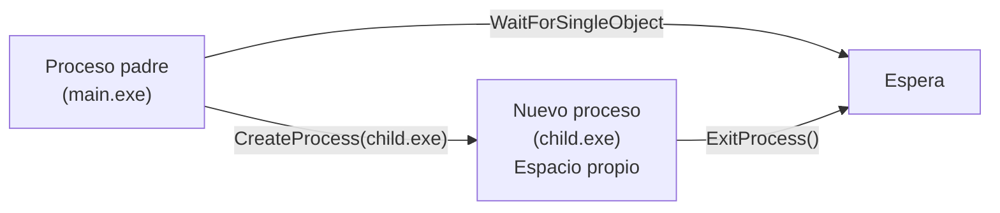
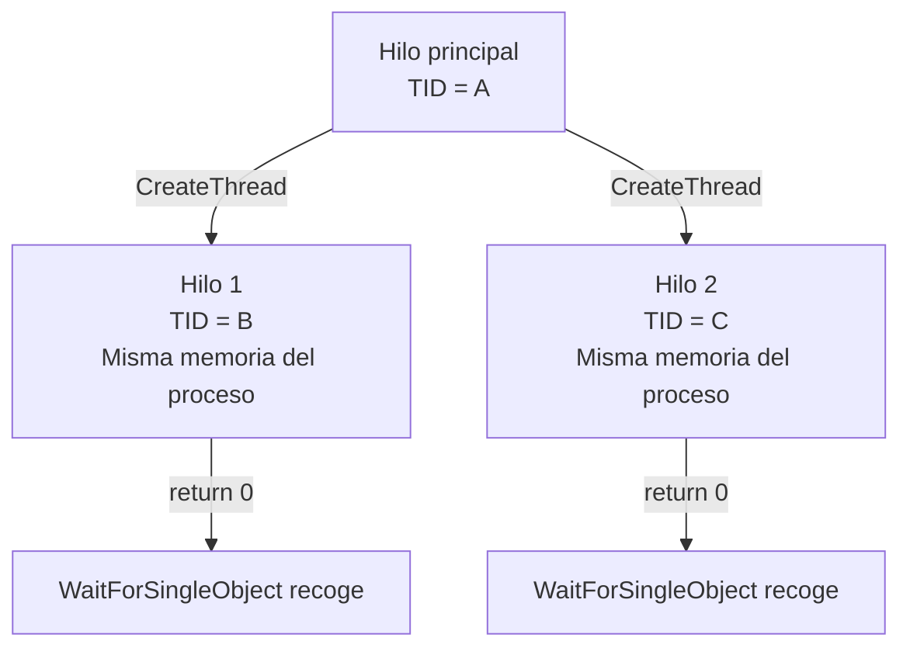
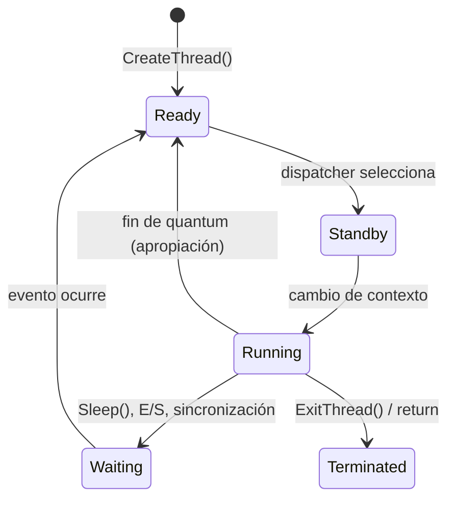
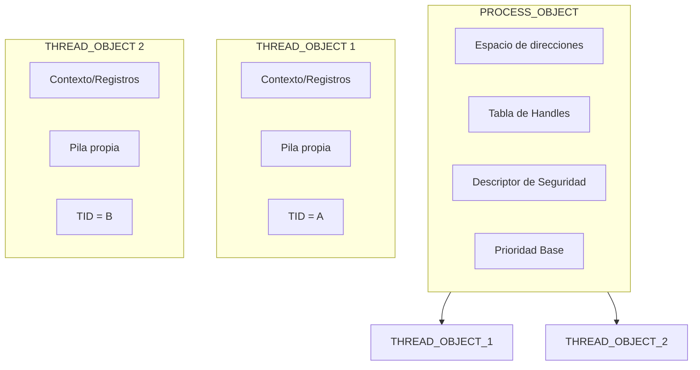

# Laboratorio: Procesos vs Hilos en Windows (Win32 API)

**Plataforma:** Microsoft Windows 10/11  
**Compilador:** MinGW-w64 (gcc) o MSVC (cl.exe)  
**API:** Win32 (Windows API)  
**Referencias:**
- Stallings, *Operating Systems: Internals and Design Principles*, 9.ª Ed., **§ 4.4 — Windows Thread and Process Management**
- Tanenbaum & Bos, *Modern Operating Systems*, 4.ª Ed., **§ 2.2 — Threads**
- Microsoft Docs: [Processes and Threads](https://docs.microsoft.com/en-us/windows/win32/procthread/processes-and-threads)

---

## Contenido

- [Objetivo](#objetivo)
- [Preparación del entorno](#preparación-del-entorno)
- [Ejercicio 1 — Identificación: PID vs TID en Windows](#ejercicio-1--identificación-pid-vs-tid-en-windows)
- [Ejercicio 2 — Creación de procesos con `CreateProcess()`](#ejercicio-2--creación-de-procesos-con-createprocess)
- [Ejercicio 3 — Creación de hilos con `CreateThread()`](#ejercicio-3--creación-de-hilos-con-createthread)
- [Ejercicio 4 — El ejercicio clave: memoria compartida (hilos) vs. separada (procesos)](#ejercicio-4--el-ejercicio-clave-memoria-compartida-hilos-vs-separada-procesos)
- [Ejercicio 5 — Estados de hilo en Windows](#ejercicio-5--estados-de-hilo-en-windows)
- [Ejercicio 6 — Objeto Proceso vs. Objeto Hilo en Windows](#ejercicio-6--objeto-proceso-vs-objeto-hilo-en-windows)
- [Ejercicio 7 — Hilos en el sistema: exploración con herramientas](#ejercicio-7--hilos-en-el-sistema-exploración-con-herramientas)
- [Resumen del laboratorio](#resumen-del-laboratorio)

---

## Objetivo

Observar en Windows la diferencia fundamental entre **procesos** e **hilos** usando la API Win32, apoyado en los conceptos de Stallings § 4.4:

- **Procesos (`CreateProcess`)**: unidad de propiedad de recursos (`PROCESS_OBJECT`), espacio de direcciones separado
- **Hilos (`CreateThread`)**: unidad de planificación/ejecución (`THREAD_OBJECT`), comparten el espacio de direcciones del proceso

| Concepto (Stallings § 4.1, 4.4) | Procesos | Hilos |
|----------|----------|-------|
| Unidad de **propiedad de recursos** (*resource ownership*) | ✓ `PROCESS_OBJECT` | ✗ |
| Unidad de **planificación/ejecución** (*dispatchable unit*) | ✗ (1 hilo por defecto) | ✓ `THREAD_OBJECT` |
| Espacio de direcciones propio | ✓ (tabla de páginas privada) | ✗ (compartido con el proceso) |
| Comunicación entre entidades | Explícita (pipe, mailslot, etc.) | Directa (misma memoria global) |
| Creación en Win32 | `CreateProcess()` | `CreateThread()` |

---

## Preparación del entorno

### Compilador — opciones disponibles

| Opción | Instalación | Compilación |
|--------|-------------|-------------|
| **MinGW-w64** | `winget install --id=MSYS2.MSYS2` luego `pacman -S mingw-w64-ucrt-x86_64-gcc` | `gcc -o programa.exe fuente.c` |
| **MSVC** | Visual Studio Build Tools 2022 | `cl /Fe:programa.exe fuente.c` |

> **Nota:** La API Win32 está disponible desde `<windows.h>`. No requiere enlaces adicionales (`-lpthread` como en Linux).

### Instalar Process Explorer (recomendado)

[Process Explorer](https://docs.microsoft.com/en-us/sysinternals/downloads/process-explorer) de Sysinternals permite ver los hilos dentro de cada proceso y sus estados:

```cmd
procexp.exe
```

### Referencia rápida de comandos

#### Compilación

| Comando | Descripción |
|---------|-------------|
| `gcc -o programa.exe fuente.c` | Compila con MinGW (Win32 API en `windows.h`) |
| `./programa.exe` | Ejecuta en PowerShell o CMD |

#### Inspección de procesos e hilos

| Herramienta | Comando / Uso | Descripción |
|-------------|---------------|-------------|
| **Task Manager** | `taskmgr.exe` → Detalles → columna "Hilos" | Conteo de hilos por proceso |
| **PowerShell** | `Get-Process \| Select Name,Id,Threads.Count \| ft` | Conteo de hilos de todos los procesos |
| **PowerShell** | `Get-Process -Id <PID> \| Select -Expand Threads` | Lista los hilos (TIDs) de un proceso |
| **Process Explorer** | `procexp.exe` | Hilos individuales, estados, pilas |
| **`tasklist`** | `tasklist /FI "PID eq <PID>"` | Información del proceso |

#### Funciones Win32 del laboratorio

| Función | Propósito | Analogía POSIX/Linux |
|---------|-----------|----------------------|
| `CreateProcess()` | Crear un nuevo proceso | `fork()` + `exec()` |
| `CreateThread()` | Crear un nuevo hilo en el mismo proceso | `pthread_create()` |
| `GetCurrentProcessId()` | Obtener el PID del proceso actual | `getpid()` |
| `GetCurrentThreadId()` | Obtener el TID del hilo actual | `gettid()` |
| `WaitForSingleObject()` | Esperar por un objeto (hilo o proceso) | `pthread_join()` / `wait()` |
| `CloseHandle()` | Cerrar un handle | `close()` |
| `Sleep()` | Suspender el hilo actual por N ms | `sleep()` |

---

### Directorio de trabajo

```cmd
mkdir %USERPROFILE%\lab-hilos-windows
cd %USERPROFILE%\lab-hilos-windows
```

---

## Ejercicio 1 — Identificación: PID vs TID en Windows

### Conceptos relacionados (Stallings § 4.4)

En Windows, cada proceso tiene un **PID** y cada hilo tiene un **TID**. A diferencia de Linux, donde el hilo principal tiene `gettid() == getpid()`, en Windows **PID y TID son numéricamente diferentes** porque cada hilo es un `THREAD_OBJECT` independiente del `PROCESS_OBJECT`.

| Función | Devuelve | Ámbito |
|---------|----------|--------|
| `GetCurrentProcessId()` | PID del proceso | Todo el sistema |
| `GetCurrentThreadId()` | TID del hilo actual | Todo el sistema |

### Código — `w1_identidad.c`

```c
#include <stdio.h>
#include <windows.h>

DWORD WINAPI funcion_hilo(LPVOID lpParam) {
    int numero = *(int *)lpParam;
    printf("[hilo %d] TID = %lu  PID = %lu\n",
           numero, GetCurrentThreadId(), GetCurrentProcessId());
    return 0;
}

int main(void) {
    HANDLE hilos[2];
    DWORD id_hilos[2];
    int n1 = 1, n2 = 2;

    printf("[main]   TID = %lu  PID = %lu\n",
           GetCurrentThreadId(), GetCurrentProcessId());

    /* Crear dos hilos */
    hilos[0] = CreateThread(NULL, 0, funcion_hilo, &n1, 0, &id_hilos[0]);
    hilos[1] = CreateThread(NULL, 0, funcion_hilo, &n2, 0, &id_hilos[1]);

    if (hilos[0] == NULL || hilos[1] == NULL) {
        fprintf(stderr, "Error al crear hilos: %lu\n", GetLastError());
        return 1;
    }

    /* Esperar a que ambos hilos terminen */
    WaitForSingleObject(hilos[0], INFINITE);
    WaitForSingleObject(hilos[1], INFINITE);

    printf("[main]   IDs de hilo (TIDs) desde CreateThread: %lu, %lu\n",
           id_hilos[0], id_hilos[1]);

    CloseHandle(hilos[0]);
    CloseHandle(hilos[1]);
    return 0;
}
```

### Compilación y ejecución

```cmd
gcc -o w1_identidad.exe w1_identidad.c
w1_identidad.exe
```

### Salida esperada

```
[main]   TID = 22548  PID = 22548
[hilo 1] TID = 22604  PID = 22548
[hilo 2] TID = 22612  PID = 22548
[main]   IDs de hilo (TIDs) desde CreateThread: 22604, 22612
```

> Observa que el TID del hilo principal y el PID solo coinciden numéricamente por casualidad en algunos sistemas. En Windows, `GetCurrentProcessId()` y `GetCurrentThreadId()` llaman a funciones del sistema que consultan objetos del kernel diferentes (`EPROCESS` vs `ETHREAD`). En Linux, en cambio, el hilo principal es simplemente `task_struct` con `pid == tgid`.

### Preguntas de análisis

1. ¿Por qué `PID` es el mismo en el hilo principal y en los hilos creados? (Relaciona con el concepto de `PROCESS_OBJECT` en Stallings § 4.4).
2. Ejecuta el programa varias veces. ¿El TID del hilo principal coincide numéricamente con el PID del proceso en todas las ejecuciones? ¿Qué conclusión obtienes sobre la relación entre `GetCurrentProcessId()` y `GetCurrentThreadId()` en Windows?
3. Compara con el laboratorio de Linux Ejercicio 1: allá `gettid()` del hilo principal coincide con `getpid()`. ¿Por qué en Windows esto puede ser diferente?

---

## Ejercicio 2 — Creación de procesos con `CreateProcess()`

### Conceptos relacionados (Stallings § 4.4)

A diferencia de UNIX, donde `fork()` crea un clon y `exec()` carga una nueva imagen (dos pasos), en Windows **`CreateProcess()`** hace ambas operaciones en una sola llamada.

En Windows **no existe** jerarquía padre–hijo al estilo UNIX. El creador recibe un **handle** al nuevo proceso, pero la relación es administrativa, no estructural. Todos los procesos son iguales ante el sistema.



> **Referencia:** Stallings § 4.4 — *Process Creation in Windows*. "When a process is created, a process object is created and a thread object is also created."

### Código — `w2_createprocess.c`

**Programa hijo (`w2_child.c`):**

```c
#include <stdio.h>
#include <windows.h>

int main(void) {
    printf("[HIJO]  PID = %lu\n", GetCurrentProcessId());
    printf("[HIJO]  TID del hilo principal = %lu\n", GetCurrentThreadId());
    printf("[HIJO]  Ejecutando con argumentos propios...\n");

    int x = 42;
    int resultado = x * x;
    printf("[HIJO]  Cálculo: %d^2 = %d\n", x, resultado);

    printf("[HIJO]  Terminando con código 42\n");
    return 42;
}
```

**Programa padre (`w2_createprocess.c`):**

```c
#include <stdio.h>
#include <windows.h>

int main(void) {
    STARTUPINFO si;
    PROCESS_INFORMATION pi;
    DWORD codigo_salida;

    ZeroMemory(&si, sizeof(si));
    si.cb = sizeof(si);
    ZeroMemory(&pi, sizeof(pi));

    printf("[PADRE] PID = %lu — Creando proceso hijo...\n",
           GetCurrentProcessId());

    if (!CreateProcess(
            NULL,            /* nombre del programa */
            "w2_child.exe",  /* línea de comandos */
            NULL, NULL,      /* seguridad */
            FALSE,           /* ¿heredar handles? */
            0,               /* flags de creación */
            NULL,            /* entorno (hereda el del padre) */
            NULL,            /* directorio actual (hereda) */
            &si,             /* STARTUPINFO */
            &pi))            /* PROCESS_INFORMATION */
    {
        fprintf(stderr, "CreateProcess falló: %lu\n", GetLastError());
        return 1;
    }

    printf("[PADRE] Hijo creado: PID = %lu, TID principal = %lu\n",
           pi.dwProcessId, pi.dwThreadId);

    printf("[PADRE] Esperando al hijo...\n");
    WaitForSingleObject(pi.hProcess, INFINITE);

    GetExitCodeProcess(pi.hProcess, &codigo_salida);
    printf("[PADRE] Hijo terminó con código: %lu\n", codigo_salida);

    CloseHandle(pi.hProcess);
    CloseHandle(pi.hThread);
    printf("[PADRE] Fin\n");
    return 0;
}
```

### Compilación y ejecución

```cmd
gcc -o w2_child.exe w2_child.c
gcc -o w2_createprocess.exe w2_createprocess.c
w2_createprocess.exe
```

### Verificar independencia de memoria

Abre una segunda terminal mientras el programa se ejecuta:

```powershell
Get-Process -Name w2_createprocess, w2_child
```

### Salida esperada

```
[PADRE] PID = 24560 — Creando proceso hijo...
[PADRE] Hijo creado: PID = 24588, TID principal = 24589
[PADRE] Esperando al hijo...
[HIJO]  PID = 24588
[HIJO]  TID del hilo principal = 24589
[HIJO]  Ejecutando con argumentos propios...
[HIJO]  Cálculo: 42^2 = 1764
[HIJO]  Terminando con código 42
[PADRE] Hijo terminó con código: 42
[PADRE] Fin
```

### Preguntas de análisis

1. ¿Qué diferencia fundamental observas entre `CreateProcess()` de Windows y `fork()` + `exec()` de UNIX? (Stallings § 4.4 vs. § 4.6).
2. El hijo se ejecuta en un **espacio de direcciones separado**. Si el hijo modificara una variable global, ¿el padre la vería cambiada? ¿Por qué?
3. Windows **no tiene jerarquía de procesos** (árbol). El creador recibe un handle. ¿Qué implica esto sobre la relación padre–hijo si el padre termina antes que el hijo?

---

## Ejercicio 3 — Creación de hilos con `CreateThread()`

### Conceptos relacionados (Stallings § 4.4)

`CreateThread()` crea un nuevo `THREAD_OBJECT` dentro del `PROCESS_OBJECT` actual. El hilo comparte el espacio de direcciones, la tabla de handles y los recursos del proceso. Cada hilo tiene su propia pila, contexto de registros y almacenamiento local (TLS).



> **Referencia:** Stallings § 4.4 — *"A thread object contains the thread's context, dynamic priority, alert status, suspend count, and impersonation token."*

### Código — `w3_createthread.c`

```c
#include <stdio.h>
#include <windows.h>

#define N_HILOS 4

static DWORD WINAPI tarea_hilo(LPVOID lpParam) {
    int id = *(int *)lpParam;

    printf("[hilo %d] inicio — TID = %lu (PID = %lu)\n",
           id, GetCurrentThreadId(), GetCurrentProcessId());
    /* Cada hilo duerme distinto para mostrar concurrencia */
    Sleep(id * 500);
    printf("[hilo %d] fin\n", id);

    return id * 10;  /* valor de retorno */
}

int main(void) {
    HANDLE hilos[N_HILOS];
    DWORD ids[N_HILOS];
    int params[N_HILOS];

    printf("[main] TID = %lu, PID = %lu\n",
           GetCurrentThreadId(), GetCurrentProcessId());
    printf("[main] Creando %d hilos...\n\n", N_HILOS);

    for (int i = 0; i < N_HILOS; i++) {
        params[i] = i + 1;
        hilos[i] = CreateThread(NULL, 0, tarea_hilo, &params[i], 0, &ids[i]);

        if (hilos[i] == NULL) {
            fprintf(stderr, "Error creando hilo %d: %lu\n", i, GetLastError());
            return 1;
        }
        printf("[main] Hilo %d creado → TID = %lu\n", i + 1, ids[i]);
    }

    printf("\n[main] Esperando a que todos los hilos terminen...\n");

    /* Esperar a que todos los hilos terminen */
    WaitForMultipleObjects(N_HILOS, hilos, TRUE, INFINITE);

    /* Recoger valores de retorno */
    for (int i = 0; i < N_HILOS; i++) {
        DWORD retorno;
        GetExitCodeThread(hilos[i], &retorno);
        printf("[main] Hilo %d retornó: %lu\n", i + 1, retorno);
        CloseHandle(hilos[i]);
    }

    printf("\n[main] Todos los hilos terminaron\n");
    return 0;
}
```

### Compilación y ejecución

```cmd
gcc -o w3_createthread.exe w3_createthread.c
w3_createthread.exe
```

### Ver los hilos con Process Explorer

1. Abre **Process Explorer** (`procexp.exe`)
2. Busca `w3_createthread.exe`
3. Doble clic → pestaña "Threads"
4. Observa: el hilo principal + 4 hilos, sus TIDs y estados

### Salida esperada

```
[main] TID = 14520, PID = 14520
[main] Creando 4 hilos...

[main] Hilo 1 creado → TID = 15876
[main] Hilo 2 creado → TID = 16132
[main] Hilo 3 creado → TID = 16548
[main] Hilo 4 creado → TID = 16704

[main] Esperando a que todos los hilos terminen...
[hilo 1] inicio — TID = 15876 (PID = 14520)
[hilo 2] inicio — TID = 16132 (PID = 14520)
[hilo 3] inicio — TID = 16548 (PID = 14520)
[hilo 4] inicio — TID = 16704 (PID = 14520)
[hilo 1] fin
[hilo 2] fin
[hilo 3] fin
[hilo 4] fin

[main] Hilo 1 retornó: 10
[main] Hilo 2 retornó: 20
[main] Hilo 3 retornó: 30
[main] Hilo 4 retornó: 40

[main] Todos los hilos terminaron
```

### Preguntas de análisis

1. Compara `CreateThread()` con `pthread_create()` del laboratorio de Linux. ¿Qué parámetros son equivalentes? ¿Cuál es la diferencia en el valor de retorno?
2. ¿Por qué los mensajes `inicio` de los 4 hilos aparecen antes de cualquier `fin`? ¿Qué dice esto sobre la ejecución concurrente?
3. ¿Qué representa el `HANDLE` devuelto por `CreateThread()`? (Stallings § 4.4 — *Windows handles and object management*).

---

## Ejercicio 4 — El ejercicio clave: memoria compartida (hilos) vs. separada (procesos)

### Conceptos relacionados (Stallings § 4.1, § 4.4)

Este es el ejercicio central del laboratorio. Demuestra experimentalmente la diferencia fundamental:

| Característica | Procesos | Hilos |
|----------------|----------|-------|
| Espacio de direcciones | **Separado** — tabla de páginas propia | **Compartido** — misma tabla de páginas |
| Modificación de variables | Copia privada → cambios no se propagan | Único valor → cambios visibles entre hilos |
| Aislamiento | Alto | Bajo (riesgo de corrupción) |
| Comunicación | Explícita (IPC) | Directa (variables globales) |

> **Referencia:** Stallings § 4.1 — *"All of the threads of a process share the state and resources of that process. They reside in the same address space and have access to the same data."*

### Código — `w4_compartida.c`

Este programa se ejecuta a sí mismo como proceso hijo (vía `CreateProcess`), demostrando el contraste:

```c
#include <stdio.h>
#include <string.h>
#include <windows.h>

/* Variable global — el centro de la demostración */
int variable_compartida = 0;

/* ---- Hilo que modifica la variable ---- */
DWORD WINAPI hilo_modificador(LPVOID lpParam) {
    printf("  [HILO]  Antes: variable = %d (dirección: %p)\n",
           variable_compartida, (void *)&variable_compartida);
    variable_compartida = 777;
    printf("  [HILO]  Después: variable = %d\n", variable_compartida);
    return 0;
}

int main(int argc, char *argv[]) {
    /* Si se ejecuta con argumento "hijo", actuar como proceso hijo */
    if (argc > 1 && strcmp(argv[1], "hijo") == 0) {
        printf("  [HIJO PROCESO] Antes: variable = %d (dirección: %p)\n",
               variable_compartida, (void *)&variable_compartida);
        variable_compartida = 999;
        printf("  [HIJO PROCESO] Después: variable = %d\n",
               variable_compartida);
        return 0;
    }

    /* Modo principal */
    printf("=== DIFERENCIA: HILOS vs PROCESOS en Windows ===\n\n");
    printf("Valor inicial de variable_compartida = %d (dirección: %p)\n\n",
           variable_compartida, (void *)&variable_compartida);

    /* --- PARTE A: HILO --- */
    printf("--- A) HILO (CreateThread) ---\n");
    printf("  [MAIN]  Antes = %d\n", variable_compartida);

    HANDLE hilo = CreateThread(NULL, 0, hilo_modificador, NULL, 0, NULL);
    WaitForSingleObject(hilo, INFINITE);
    CloseHandle(hilo);

    printf("  [MAIN]  Después = %d  (el hilo SÍ modificó la variable!)\n\n",
           variable_compartida);

    /* --- PARTE B: PROCESO --- */
    printf("--- B) PROCESO (CreateProcess) ---\n");
    printf("  [MAIN]  Antes del proceso = %d\n", variable_compartida);

    STARTUPINFO si;
    PROCESS_INFORMATION pi;
    char cmdline[512];

    ZeroMemory(&si, sizeof(si));
    si.cb = sizeof(si);
    ZeroMemory(&pi, sizeof(pi));

    /* El mismo binario, pero con argumento "hijo" */
    GetModuleFileName(NULL, cmdline, MAX_PATH);
    strcat(cmdline, " hijo");

    if (!CreateProcess(NULL, cmdline, NULL, NULL, FALSE, 0,
                       NULL, NULL, &si, &pi))
    {
        fprintf(stderr, "  CreateProcess falló: %lu\n", GetLastError());
    } else {
        WaitForSingleObject(pi.hProcess, INFINITE);
        printf("  [MAIN]  Después del proceso = %d  (NO cambió!)\n",
               variable_compartida);
        CloseHandle(pi.hProcess);
        CloseHandle(pi.hThread);
    }

    printf("\nCONCLUSIÓN:\n");
    printf("  CreateThread → el hilo COMPARTE la memoria (variable SÍ cambió)\n");
    printf("  CreateProcess → el proceso tiene su PROPIA COPIA (variable NO cambió)\n");
    return 0;
}
```

### Compilación y ejecución

```cmd
gcc -o w4_compartida.exe w4_compartida.c
w4_compartida.exe
```

### Salida esperada

```
=== DIFERENCIA: HILOS vs PROCESOS en Windows ===

Valor inicial de variable_compartida = 0 (dirección: 0x7FF6D3E45010)

--- A) HILO (CreateThread) ---
  [MAIN]  Antes = 0
  [HILO]  Antes: variable = 0 (dirección: 0x7FF6D3E45010)
  [HILO]  Después: variable = 777
  [MAIN]  Después = 777  (el hilo SÍ modificó la variable!)

--- B) PROCESO (CreateProcess) ---
  [MAIN]  Antes del proceso = 777
  [HIJO PROCESO] Antes: variable = 0 (dirección: 0x7FF...)
  [HIJO PROCESO] Después: variable = 999
  [MAIN]  Después del proceso = 777  (NO cambió!)

CONCLUSIÓN:
  CreateThread → el hilo COMPARTE la memoria (variable SÍ cambió)
  CreateProcess → el proceso tiene su PROPIA COPIA (variable NO cambió)
```

### Preguntas de análisis

1. El hilo modifica `variable_compartida` a 777 y el main **ve** el cambio. El proceso hijo la modifica a 999 y el main **no ve** el cambio. Explica por qué usando el concepto de espacio de direcciones virtuales.
2. El proceso hijo imprime la misma dirección de memoria virtual que el padre. ¿Significa eso que apuntan al mismo marco de página física? (Stallings — memoria virtual vs. física).
3. Según Stallings § 4.1, ¿cuál es la principal **ventaja** y la principal **desventaja** de que los hilos compartan memoria?

---

## Ejercicio 5 — Estados de hilo en Windows (Stallings § 4.4)

### Conceptos relacionados

Windows define **6 estados** para los hilos, según Stallings § 4.4:

| Estado | Descripción |
|--------|-------------|
| **Ready** (Listo) | Puede ser planificado; espera en la cola de listos |
| **Standby** (En Espera) | Seleccionado para ejecutar en un procesador específico |
| **Running** (Ejecutando) | En ejecución actualmente en un procesador |
| **Waiting** (Esperando) | Bloqueado por un evento, E/S, sincronización o `Sleep()` |
| **Transition** (Transición) | Listo para ejecutar pero recursos (pila) no disponibles |
| **Terminated** (Terminado) | Finalizó; puede retenerse para reinicialización |

Con `CreateThread` podemos crear hilos en estado **Suspended** (con `CREATE_SUSPENDED`) y observar cómo cambian de estado: Suspended → Ready → Running → Waiting.



### Código — `w5_estados.c`

```c
#include <stdio.h>
#include <windows.h>

/*
 * Demostración de los estados de hilo en Windows (Stallings § 4.4).
 *
 * Creamos varios hilos que cambian de estado:
 *   Ready → Running → Waiting (Sleep) → Ready → Running → Terminated
 *
 * Observamos los estados con Process Explorer.
 */

#define N_HILOS 3

static DWORD WINAPI hilo_trabajo(LPVOID lpParam) {
    int id = *(int *)lpParam;

    printf("[hilo %d] INICIO (Running) — TID = %lu\n",
           id, GetCurrentThreadId());

    /* El hilo entra en estado Waiting durante Sleep() */
    printf("[hilo %d] Sleeping 3 s (→ Waiting)...\n", id);
    Sleep(3000);
    printf("[hilo %d] Desperté (→ Ready → Running)\n", id);

    /* Simular trabajo en ejecución */
    volatile long suma = 0;
    for (int i = 0; i < 5000000; i++)
        suma += i;

    printf("[hilo %d] FIN (→ Terminated), suma = %ld\n", id, suma);
    return id * 100;
}

int main(void) {
    HANDLE hilos[N_HILOS];
    DWORD ids[N_HILOS];
    int params[N_HILOS];
    int i;

    printf("=== Estados de Hilo en Windows (Stallings § 4.4) ===\n\n");
    printf("Abre Process Explorer y busca este proceso.\n");
    printf("Observa los hilos en la pestaña Threads.\n\n");

    printf("Creando %d hilos en estado SUSPENDIDO...\n", N_HILOS);
    printf("(Se activarán manualmente)\n\n");

    /* Crear hilos en estado SUSPENDIDO para observar Ready → ... */
    for (i = 0; i < N_HILOS; i++) {
        params[i] = i + 1;
        hilos[i] = CreateThread(
            NULL,            /* seguridad */
            0,               /* pila por defecto */
            hilo_trabajo,    /* función */
            &params[i],      /* parámetro */
            CREATE_SUSPENDED, /* ¡crear suspendido! */
            &ids[i]);

        if (hilos[i] == NULL) {
            fprintf(stderr, "Error creando hilo %d: %lu\n", i, GetLastError());
            return 1;
        }

        printf("  Hilo %d creado (TID = %lu) — estado: SUSPENDED\n",
               i + 1, ids[i]);
    }

    printf("\n[main] Observa en Process Explorer: los hilos aparecen.\n");
    printf("[main] Presiona Enter para reanudar los hilos...\n");
    getchar();

    /* Reanudar los hilos: Suspended → Ready → Running */
    printf("[main] Reanudando hilos con ResumeThread()...\n");
    for (i = 0; i < N_HILOS; i++) {
        ResumeThread(hilos[i]);
        printf("  Hilo %d reanudado (TID = %lu)\n", i + 1, ids[i]);
    }

    printf("\n[main] Esperando a que terminen...\n");
    WaitForMultipleObjects(N_HILOS, hilos, TRUE, INFINITE);

    for (i = 0; i < N_HILOS; i++) {
        DWORD retorno;
        GetExitCodeThread(hilos[i], &retorno);
        printf("  Hilo %d → retorno = %lu\n", i + 1, retorno);
        CloseHandle(hilos[i]);
    }

    printf("\n[main] Todos los hilos terminaron.\n");
    printf("\nEstados observados:\n");
    printf("  CreateThread(CREATE_SUSPENDED) → SUSPENDED\n");
    printf("  ResumeThread() → Ready → Running\n");
    printf("  Sleep()       → Waiting → Ready → Running\n");
    printf("  return        → Terminated\n");
    return 0;
}
```

### Compilación y ejecución

```cmd
gcc -o w5_estados.exe w5_estados.c
w5_estados.exe
```

### Observación con Process Explorer

1. Abre **Process Explorer**
2. Cuando el programa muestre "Presiona Enter...", busca el proceso en la lista
3. Doble clic → pestaña "Threads"
4. Verás los 3 hilos en estado **Suspended** (o similares)
5. Presiona Enter en el programa y observa los cambios de estado
6. Durante el `Sleep(3000)`, los hilos aparecerán en estado **Waiting**

### Salida esperada

```
=== Estados de Hilo en Windows (Stallings § 4.4) ===

Abre Process Explorer y busca este proceso.
Observa los hilos en la pestaña Threads.

Creando 3 hilos en estado SUSPENDIDO...
(Se activarán manualmente)

  Hilo 1 creado (TID = 18240) — estado: SUSPENDED
  Hilo 2 creado (TID = 18276) — estado: SUSPENDED
  Hilo 3 creado (TID = 18312) — estado: SUSPENDED

[main] Observa en Process Explorer: los hilos aparecen.
[main] Presiona Enter para reanudar los hilos...

[main] Reanudando hilos con ResumeThread()...
  Hilo 1 reanudado (TID = 18240)
  Hilo 2 reanudado (TID = 18276)
  Hilo 3 reanudado (TID = 18312)

[main] Esperando a que terminen...
[hilo 1] INICIO (Running) — TID = 18240
[hilo 2] INICIO (Running) — TID = 18276
[hilo 3] INICIO (Running) — TID = 18312
[hilo 1] Sleeping 3 s (→ Waiting)...
[hilo 2] Sleeping 3 s (→ Waiting)...
[hilo 3] Sleeping 3 s (→ Waiting)...
[hilo 1] Desperté (→ Ready → Running)
[hilo 2] Desperté (→ Ready → Running)
[hilo 3] Desperté (→ Ready → Running)
[hilo 1] FIN (→ Terminated), suma = ...
[hilo 2] FIN (→ Terminated), suma = ...
[hilo 3] FIN (→ Terminated), suma = ...

  Hilo 1 → retorno = 100
  Hilo 2 → retorno = 200
  Hilo 3 → retorno = 300

[main] Todos los hilos terminaron.

Estados observados:
  CreateThread(CREATE_SUSPENDED) → SUSPENDED
  ResumeThread() → Ready → Running
  Sleep()       → Waiting → Ready → Running
  return        → Terminated
```

### Preguntas de análisis

1. Según Stallings § 4.4, Windows tiene 6 estados de hilo. ¿Cuáles observaste directamente en este ejercicio? ¿Cuáles no?
2. ¿Qué diferencia hay entre **Ready** y **Standby** en Windows? (Pista: Standby es un estado de transición muy breve).
3. Windows tiene un estado llamado **Transition** que no observamos aquí. ¿Cuándo ocurre? (Pista: ¿qué pasa si la pila del kernel del hilo fue paginada a disco?).

---

## Ejercicio 6 — Objeto Proceso vs. Objeto Hilo en Windows (Stallings § 4.4)

### Conceptos relacionados

Stallings § 4.4 explica que Windows distingue explícitamente entre:

- **`PROCESS_OBJECT`**: tiene espacio de direcciones, tabla de handles, descriptores de seguridad, prioridad base, afinidad de procesador, límites de cuota
- **`THREAD_OBJECT`**: tiene contexto de registros, prioridad dinámica, contador de suspensión, estado de alerta, token de suplantación

Un proceso Windows **no puede ejecutar sin un hilo**. `CreateProcess()` siempre crea el proceso **y** su hilo principal automáticamente. `CreateThread()` solo crea hilos adicionales dentro de un proceso existente.



Este ejercicio crea un proceso y explora la relación proceso ↔ hilos centralizada en el **PROCESS_INFORMATION**.

### Código — `w6_objetos.c`

```c
#include <stdio.h>
#include <windows.h>

/*
 * Stallings § 4.4: PROCESS_OBJECT vs THREAD_OBJECT
 *
 * Demostración de que:
 * 1. CreateProcess() crea un proceso + su hilo principal
 * 2. CreateThread() crea hilos adicionales dentro del proceso
 * 3. Cada hilo tiene su propio TID (THREAD_OBJECT)
 * 4. El proceso tiene un PID (PROCESS_OBJECT)
 *
 * El programa se ejecuta a sí mismo como hijo.
 */

int main(int argc, char *argv[]) {
    /* Modo hijo */
    if (argc > 1 && strcmp(argv[1], "child") == 0) {
        printf("[HIJO]  PID (PROCESS_OBJECT) = %lu\n", GetCurrentProcessId());
        printf("[HIJO]  TID (THREAD_OBJECT)  = %lu\n", GetCurrentThreadId());

        /* El hijo crea 2 hilos adicionales */
        printf("[HIJO]  Creando 2 hilos propios...\n");

        HANDLE h_hijo[2];
        DWORD id_h[2];

        for (int i = 0; i < 2; i++) {
            h_hijo[i] = CreateThread(NULL, 0,
                (LPTHREAD_START_ROUTINE)hilo_hijo, NULL, 0, &id_h[i]);
            printf("[HIJO]  Nuevo THREAD_OBJECT %d → TID = %lu\n",
                   i + 1, id_h[i]);
        }

        WaitForMultipleObjects(2, h_hijo, TRUE, INFINITE);
        for (int i = 0; i < 2; i++) CloseHandle(h_hijo[i]);

        printf("[HIJO]  Terminando — el PROCESS_OBJECT y sus 3 THREAD_OBJECT\n");
        return 42;
    }

    /* ---- PADRE ---- */
    DWORD pid_actual = GetCurrentProcessId();
    DWORD tid_actual = GetCurrentThreadId();

    printf("=== Stallings § 4.4: PROCESS_OBJECT vs THREAD_OBJECT ===\n\n");
    printf("[PADRE] Este PROCESO (PROCESS_OBJECT): PID = %lu\n", pid_actual);
    printf("[PADRE]   Hilo principal (THREAD_OBJECT): TID = %lu\n", tid_actual);

    /* Crear 2 hilos en el padre */
    printf("[PADRE] Creando 2 hilos adicionales en el MISMO proceso...\n");

    HANDLE h_padre[2];
    DWORD ids_adicionales[2];

    printf("[PADRE]   THREAD_OBJECT adicionales creados:\n");
    for (int i = 0; i < 2; i++) {
        h_padre[i] = CreateThread(NULL, 0,
            (LPTHREAD_START_ROUTINE)hilo_padre, NULL, 0, &ids_adicionales[i]);
        printf("[PADRE]     Hilo %d → TID = %lu\n", i + 1, ids_adicionales[i]);
    }
    WaitForMultipleObjects(2, h_padre, TRUE, INFINITE);
    for (int i = 0; i < 2; i++) CloseHandle(h_padre[i]);

    printf("\n[PADRE] Ahora: %d THREAD_OBJECT vivos en este proceso\n", 1 + 2);

    /* Crear un PROCESO HIJO con CreateProcess */
    printf("\n[PADRE] Creando un NUEVO PROCESO (CreateProcess)...\n");

    STARTUPINFO si;
    PROCESS_INFORMATION pi;
    char cmdline[512];
    ZeroMemory(&si, sizeof(si));
    si.cb = sizeof(si);
    ZeroMemory(&pi, sizeof(pi));

    GetModuleFileName(NULL, cmdline, MAX_PATH);
    strcat(cmdline, " child");

    if (!CreateProcess(NULL, cmdline, NULL, NULL, FALSE, 0,
                       NULL, NULL, &si, &pi))
    {
        fprintf(stderr, "CreateProcess falló: %lu\n", GetLastError());
        return 1;
    }

    printf("[PADRE] Nuevo PROCESS_OBJECT creado:\n");
    printf("[PADRE]   PID del hijo = %lu\n", pi.dwProcessId);
    printf("[PADRE]   TID del hilo principal del hijo = %lu\n", pi.dwThreadId);

    WaitForSingleObject(pi.hProcess, INFINITE);

    DWORD codigo;
    GetExitCodeProcess(pi.hProcess, &codigo);
    printf("[PADRE] Hijo terminó con código: %lu\n", codigo);

    CloseHandle(pi.hProcess);
    CloseHandle(pi.hThread);

    printf("\nRESUMEN:\n");
    printf("  PROCESS_OBJECT (%lu): contiene THREAD_OBJECTs\n", pid_actual);
    printf("    - Hilo principal: TID = %lu\n", tid_actual);
    printf("    - Hilos adicionales: %lu, %lu\n",
           ids_adicionales[0], ids_adicionales[1]);
    printf("  PROCESS_OBJECT hijo (%lu): creado con CreateProcess()\n",
           pi.dwProcessId);
    printf("    - Trae su primer THREAD_OBJECT automáticamente (TID = %lu)\n",
           pi.dwThreadId);
    printf("  Cada THREAD_OBJECT tiene: pila propia, contexto, prioridad\n");
    printf("  Cada PROCESS_OBJECT tiene: espacio dir., handles, cuotas\n");
    return 0;
}

/* Función para hilos del padre */
static DWORD WINAPI hilo_padre(LPVOID lpParam) {
    Sleep(100);
    return 0;
}

/* Función para hilos del hijo */
static DWORD WINAPI hilo_hijo(LPVOID lpParam) {
    Sleep(100);
    return 0;
}
```

### Compilación y ejecución

```cmd
gcc -o w6_objetos.exe w6_objetos.c
w6_objetos.exe
```

### Salida esperada

```
=== Stallings § 4.4: PROCESS_OBJECT vs THREAD_OBJECT ===

[PADRE] Este PROCESO (PROCESS_OBJECT): PID = 24560
[PADRE]   Hilo principal (THREAD_OBJECT): TID = 24560
[PADRE] Creando 2 hilos adicionales en el MISMO proceso...
[PADRE]   THREAD_OBJECT adicionales creados:
[PADRE]     Hilo 1 → TID = 15876
[PADRE]     Hilo 2 → TID = 16132

[PADRE] Ahora: 3 THREAD_OBJECT vivos en este proceso

[PADRE] Creando un NUEVO PROCESO (CreateProcess)...
[PADRE] Nuevo PROCESS_OBJECT creado:
[PADRE]   PID del hijo = 18240
[PADRE]   TID del hilo principal del hijo = 18241
[HUO]  PID (PROCESS_OBJECT) = 18240
[HUO]  TID (THREAD_OBJECT)  = 18241
[HUO]  Creando 2 hilos propios...
[HUO]  Nuevo THREAD_OBJECT 1 → TID = 18312
[HUO]  Nuevo THREAD_OBJECT 2 → TID = 18376
[HUO]  Terminando — el PROCESS_OBJECT y sus 3 THREAD_OBJECT
[PADRE] Hijo terminó con código: 42

RESUMEN:
  PROCESS_OBJECT (24560): contiene THREAD_OBJECTs
    - Hilo principal: TID = 24560
    - Hilos adicionales: 15876, 16132
  PROCESS_OBJECT hijo (18240): creado con CreateProcess()
    - Trae su primer THREAD_OBJECT automáticamente (TID = 18241)
  Cada THREAD_OBJECT tiene: pila propia, contexto, prioridad
  Cada PROCESS_OBJECT tiene: espacio dir., handles, cuotas
```

### Preguntas de análisis

1. Según Stallings § 4.4, un proceso Windows **no puede ejecutar sin al menos un hilo**. ¿Cómo se asegura esto cuando se crea un proceso con `CreateProcess()`?
2. ¿Cuántos THREAD_OBJECTs puede tener un solo PROCESS_OBJECT? ¿Hay un límite teórico?
3. ¿Qué atributos exclusivos del THREAD_OBJECT menciona Stallings que no existen en el PROCESS_OBJECT? (Pista: prioridad dinámica, contador de suspensión, contexto, token de suplantación).

---

## Ejercicio 7 — Hilos en el sistema: exploración con herramientas

### Conceptos relacionados (Stallings § 4.4)

En Windows, cada proceso tiene al menos un hilo. Algunos procesos del sistema tienen cientos. Explorar los hilos del sistema ayuda a comprender que:

- Un proceso **es** contenedor de recursos
- Un hilo **es** la unidad que realmente ejecuta
- Un proceso "en ejecución" en realidad tiene uno o más hilos ejecutándose

### Exploración con PowerShell

```powershell
# ¿Cuántos hilos hay en total en el sistema?
(Get-Process | ForEach-Object { $_.Threads.Count } | Measure-Object -Sum).Sum

# Los 10 procesos con más hilos
Get-Process | Sort-Object -Property Threads.Count -Descending |
    Select-Object -First 10 Name, Id, @{N="Hilos";E={$_.Threads.Count}} | Format-Table

# Hilos de un proceso específico (explorer)
Get-Process -Name explorer | Select-Object -ExpandProperty Threads |
    Select-Object Id, PriorityLevel, StartTime | Format-Table
```

### Exploración con Process Explorer

1. Abre **Process Explorer** (`procexp.exe`)
2. Activa la vista de hilos: `View → Show Processes From All Users`
3. Selecciona un proceso de sistema (ej. `svchost.exe`)
4. Doble clic → pestaña "Threads"
5. Observa:
   - **TID** de cada hilo
   - **Start Address** (qué módulo/código ejecuta)
   - **State** (Ready, Waiting, Running...)
   - **CPU** (tiempo de CPU consumido por cada hilo)
   - **Context Switches** (conmutaciones voluntarias e involuntarias)

### Código — `w7_explorar.c`

```c
#include <stdio.h>
#include <windows.h>
#include <tlhelp32.h>  /* Para recorrer procesos/hilos del sistema */

/*
 * Explorar los hilos del sistema usando la API de Windows.
 * Equivalente a: ps -eLf en Linux, pero desde Win32.
 *
 * Stallings § 4.4: observamos que cada proceso tiene al menos
 * un hilo, y que los hilos son las unidades de ejecución reales.
 */

int main(void) {
    HANDLE hSnapshot;
    THREADENTRY32 te;
    DWORD total_hilos = 0;

    printf("=== Exploración de Hilos en el Sistema (Stallings § 4.4) ===\n\n");

    /* Tomar una instantánea de todos los hilos del sistema */
    hSnapshot = CreateToolhelp32Snapshot(TH32CS_SNAPTHREAD, 0);

    if (hSnapshot == INVALID_HANDLE_VALUE) {
        fprintf(stderr, "Error al tomar instantánea: %lu\n", GetLastError());
        return 1;
    }

    te.dwSize = sizeof(THREADENTRY32);

    if (Thread32First(hSnapshot, &te)) {
        /* Contar hilos totales y agrupar por proceso */
        printf("PID del proceso actual: %lu\n", GetCurrentProcessId());
        printf("TID del hilo actual:    %lu\n\n", GetCurrentThreadId());

        printf("Los primeros 20 hilos del sistema:\n");
        printf("%-10s %-10s %-10s\n", "PID", "TID", "Prioridad Base");
        printf("%-10s %-10s %-10s\n", "---", "---", "--------------");

        int count = 0;
        do {
            if (count < 20) {
                printf("%-10lu %-10lu %-10d\n",
                       te.th32OwnerProcessID,
                       te.th32ThreadID,
                       te.tpBasePri);
            }
            total_hilos++;
            count++;
        } while (Thread32Next(hSnapshot, &te));
    }

    CloseHandle(hSnapshot);

    /* Obtener número de procesos */
    HANDLE hProcSnap = CreateToolhelp32Snapshot(TH32CS_SNAPPROCESS, 0);
    DWORD total_procesos = 0;
    PROCESSENTRY32 pe;
    pe.dwSize = sizeof(PROCESSENTRY32);

    if (Process32First(hProcSnap, &pe)) {
        do { total_procesos++; } while (Process32Next(hProcSnap, &pe));
    }
    CloseHandle(hProcSnap);

    printf("\n--- Resumen ---\n");
    printf("Total procesos en el sistema: %lu\n", total_procesos);
    printf("Total hilos en el sistema:    %lu\n", total_hilos);
    printf("Promedio hilos por proceso:   %.1f\n",
           (double)total_hilos / total_procesos);

    printf("\nConclusión (Stallings § 4.4):\n");
    printf("  Cada proceso (PROCESS_OBJECT) tiene 1+ hilos (THREAD_OBJECT).\n");
    printf("  Los hilos son las unidades reales de planificación.\n");
    printf("  Un proceso 'sin hilos' no puede ejecutar instrucciones.\n");
    return 0;
}
```

### Compilación y ejecución

```cmd
gcc -o w7_explorar.exe w7_explorar.c
w7_explorar.exe
```

### Salida esperada

```
=== Exploración de Hilos en el Sistema (Stallings § 4.4) ===

PID del proceso actual: 24560
TID del hilo actual:    24561

Los primeros 20 hilos del sistema:
PID        TID        Prioridad Base
---        ---        --------------
4          4          8
4          8          8
4          12         8
4          16         8
312        320        8
312        388        8
...

--- Resumen ---
Total procesos en el sistema: 185
Total hilos en el sistema:    2340
Promedio hilos por proceso:   12.6

Conclusión (Stallings § 4.4):
  Cada proceso (PROCESS_OBJECT) tiene 1+ hilos (THREAD_OBJECT).
  Los hilos son las unidades reales de planificación.
  Un proceso 'sin hilos' no puede ejecutar instrucciones.
```

### Preguntas de análisis

1. ¿Cuántos hilos tiene el proceso `System Idle Process` (PID 0)? ¿Por qué siempre hay al menos un hilo en cada proceso?
2. Según Stallings § 4.4, un proceso es "unidad de propiedad de recursos" y un hilo es "unidad de planificación". ¿Cómo se refleja esto en los conteos que obtuviste (promedio ~12 hilos por proceso)?
3. ¿Qué proceso tiene más hilos en tu sistema? ¿Por qué crees que ese proceso necesita tantos hilos?

---

## Resumen del laboratorio

### Funciones Win32 utilizadas

| Función | Propósito | Analogía POSIX/Linux |
|---------|-----------|----------------------|
| `CreateProcess()` | Crear un nuevo proceso con su propio espacio de direcciones | `fork()` + `exec()` |
| `CreateThread()` | Crear un nuevo hilo dentro del proceso actual | `pthread_create()` |
| `GetCurrentProcessId()` | Obtener el PID del proceso actual | `getpid()` |
| `GetCurrentThreadId()` | Obtener el TID del hilo actual | `gettid()` |
| `WaitForSingleObject()` | Esperar por un handle (hilo o proceso) | `pthread_join()` / `wait()` |
| `ResumeThread()` | Reanudar un hilo suspendido | — |
| `GetExitCodeThread()` | Obtener el valor de retorno de un hilo | Valor de `pthread_join()` |
| `GetExitCodeProcess()` | Obtener el código de salida de un proceso | Macros `WIFEXITED`/`WEXITSTATUS` |
| `CloseHandle()` | Cerrar un handle del kernel | `close()` |

### Correspondencia con el laboratorio de hilos en Linux

| Concepto en Linux (pthreads) | Equivalente en Windows (Win32) |
|------------------------------|--------------------------------|
| `pthread_create()` | `CreateThread()` |
| `pthread_join()` | `WaitForSingleObject()` + `GetExitCodeThread()` |
| `fork()` + `exec()` | `CreateProcess()` |
| `wait()` / `waitpid()` | `WaitForSingleObject(proceso)` |
| `gettid()` | `GetCurrentThreadId()` |
| Espacio de direcciones compartido | Hilos comparten el espacio del proceso |
| Espacio separado (fork) | Procesos con espacios separados |

### Diferencia fundamental (Stallings § 4.1, 4.4)

| | Proceso (PROCESS_OBJECT) | Hilo (THREAD_OBJECT) |
|---|---|---|
| **Rol** | Unidad de propiedad de recursos | Unidad de planificación/ejecución |
| **Espacio de direcciones** | Propio (tabla de páginas) | Compartido con el proceso |
| **Creación** | `CreateProcess()` | `CreateThread()` |
| **Aislamiento** | Alto (espacio separado) | Bajo (misma memoria) |
| **Comunicación** | Explícita (IPC) | Directa (variables globales) |
| **¿Puede ejecutar solo?** | No (necesita ≥1 hilo) | Sí (es la unidad de ejecución) |

> **Stallings § 4.4:** *"In Windows, the separation between process (resource ownership) and thread (execution unit) is more explicit than in Linux. A process cannot execute without at least one thread. The process object owns resources; the thread object executes code."*

---

*Basado en:*
*Stallings, Operating Systems: Internals and Design Principles, 9.ª Ed. (§ 4.4 — Windows Thread and Process Management; § 4.1 — Thread Concepts)*
*Tanenbaum & Bos, Modern Operating Systems, 4.ª Ed. (§ 2.2 — Threads)*
*Microsoft Docs: Processes and Threads (Win32 API)*
*Plataforma: Microsoft Windows 10/11 — Compilador: MinGW-w64 / MSVC — API: Win32*
