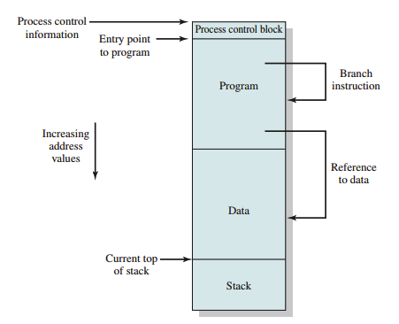
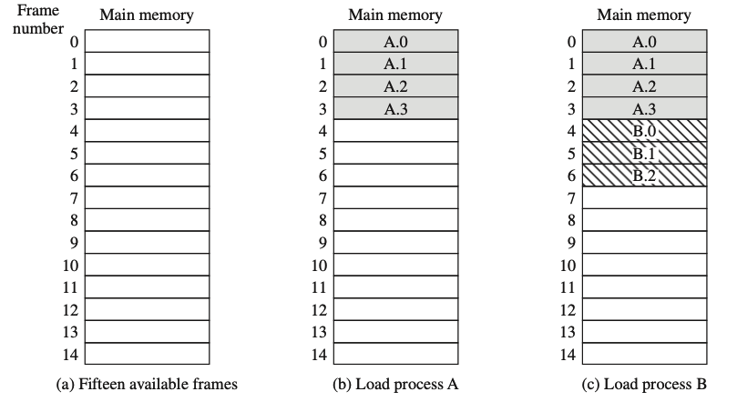
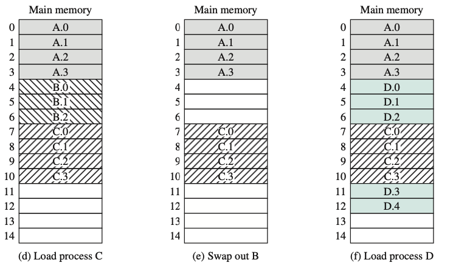
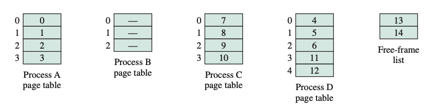
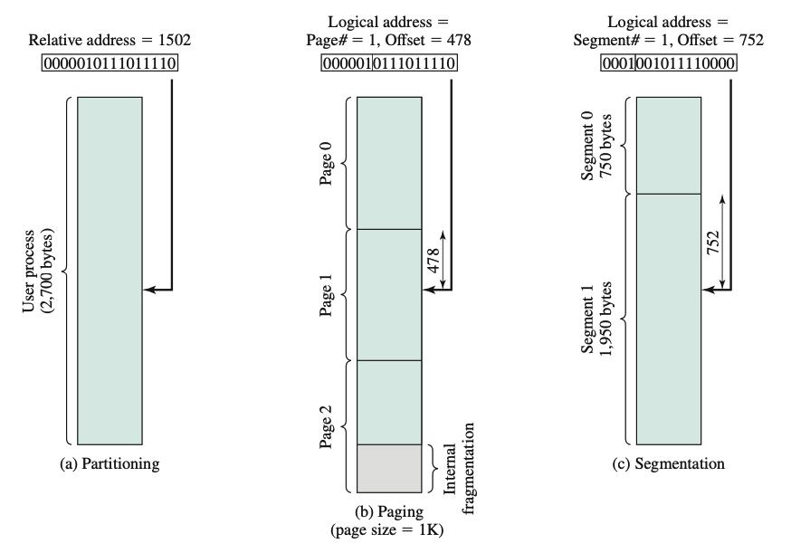
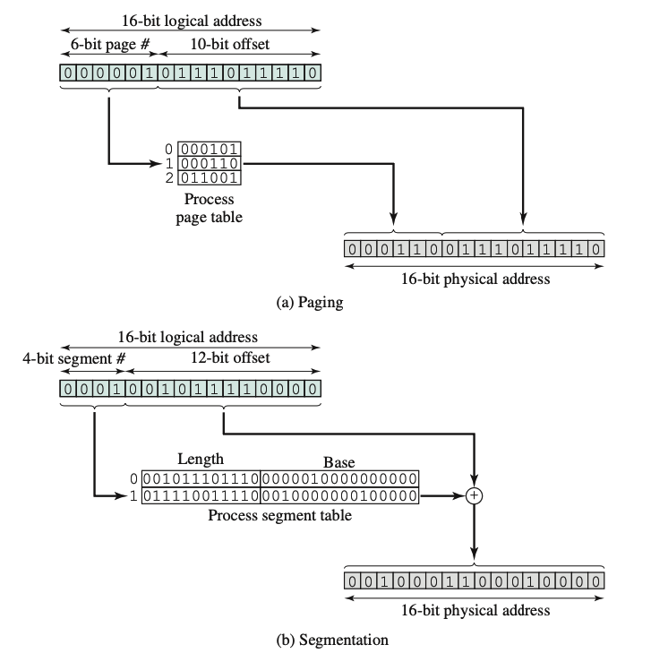
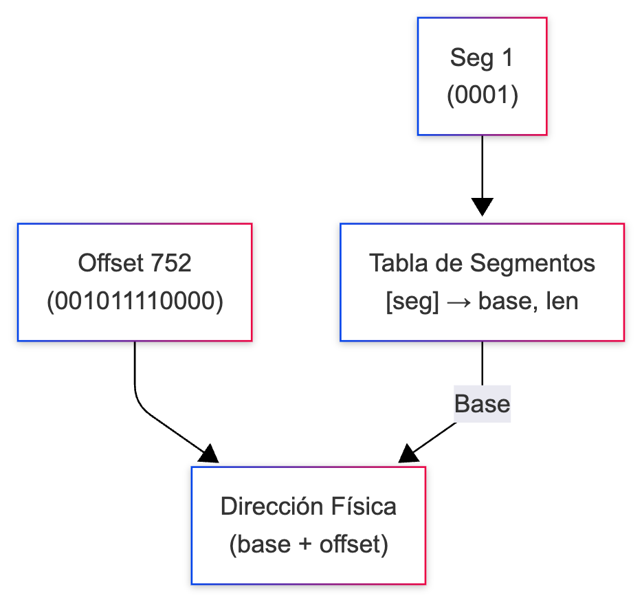

<!-- _class: titulo -->

# Capítulo 7: Administración de Memoria
## *Memory Management*
### Sistemas Operativos: Fundamentos y Diseño
#### William Stallings, 9.ª Edición — Parte 3

---

# Contenido del Capítulo 7

| Sección | Tema |
|---------|------|
| **7.1** | Requisitos de la Administración de Memoria |
| **7.2** | Particionamiento de Memoria |
| **7.3** | Paginación (*Paging*) |
| **7.4** | Segmentación (*Segmentation*) |
| **7.5** | Resumen |
| **7.6** | Términos Clave, Preguntas y Problemas |
| **Ap. 7A** | Carga y Enlace (*Loading and Linking*) |

> La administración de memoria es la tarea dinámica de subdividir la memoria de usuario para acomodar múltiples procesos en un sistema multiprogramado.

<!-- Nota para el relator (Stallings, §7.1): Esta cita captura la esencia del capítulo. La cita subraya que la memoria es el recurso más disputado en multiprogramación: todos los procesos quieren espacio, y el SO debe arbitrar quién lo obtiene, dónde y por cuánto tiempo. Este capítulo trata específicamente de esquemas donde el proceso completo debe estar en RAM; la memoria virtual (Cap. 8 de Stallings) elimina esa restricción. -->

---

<!-- _class: titulo -->

# 7.1
## Requisitos de la Administración de Memoria

---

# Conceptos fundamentales

| Término | Definición |
|---------|-----------|
| **Frame** (Marco) | Bloque de longitud fija de **memoria principal**. |
| **Page** (Página) | Bloque de datos de longitud fija que reside en **memoria secundaria** (como un disco). Una página de datos puede copiarse temporalmente a un frame de memoria principal. |
| **Segment** (Segmento) | Bloque de datos de **longitud variable** que reside en memoria secundaria. Un segmento completo puede copiarse a una región disponible de memoria principal (segmentación), o dividirse en páginas que pueden copiarse individualmente (segmentación y paginación combinadas). |

<!-- Nota para el relator (Stallings, §7.1): Stallings aclara desde el principio los tres términos fundamentales. Frame y page son el mismo tamaño (bloques fijos), pero el frame está en RAM y la page en disco. El segmento es un concepto distinto: su tamaño varía porque agrupa código o datos con significado lógico para el programador. Esta distinción reaparece en §7.3 y §7.4. -->

---

```

Memoria Secundaria (Disco)          Memoria Principal (RAM)
┌─────────────────────────┐         ┌───────┬───────┐
│  Segmento (long. variable)        │ Frame │ Frame │
│  ┌──────┬──────┬──────┐ │  copia  │   0   │   1   │
│  │Page 0│Page 1│Page 2│ │ ──────→ ├───────┼───────┤
│  └──────┴──────┴──────┘ │         │ Frame │ Frame │
└─────────────────────────┘         │   2   │   3   │
                                    └───────┴───────┘

Segment → puede copiarse completo, o dividirse en Pages
Page    → bloque fijo que se copia a un Frame
Frame   → bloque fijo de memoria principal
```

---

# Cinco requisitos fundamentales

| # | Requisito | Descripción |
|---|-----------|-------------|
| 1 | **Relocación** (Reubicación) | Poder mover procesos a diferentes áreas de memoria |
| 2 | **Protección** | Aislar procesos entre sí y del SO |
| 3 | **Compartición** (*Sharing*) | Permitir acceso controlado a regiones comunes |
| 4 | **Organización Lógica** | Soporte para programas modulares (segmentos) |
| 5 | **Organización Física** | Gestión del flujo entre memoria principal y secundaria |

<!-- Nota para el relator (Stallings, §7.1): Estos cinco requisitos son las restricciones que cualquier esquema de administración de memoria debe resolver. Sin relocación, no hay multiprogramación real. Sin protección, un proceso malicioso podría leer los datos de otro. La compartición permite eficiencia (una sola copia de una biblioteca). La organización lógica refleja que los programas no son un solo bloque monolítico sino módulos con distintos permisos. La organización física es jerárquica porque la RAM es cara y volátil, mientras que el disco es barato y persistente. -->

---

## 7.1a — Relocación

**Problema:** No sabemos de antemano dónde se cargará un proceso en memoria.

- Los procesos se intercambian (*swapping*) entre disco y RAM
- Al recargar, pueden quedar en **diferentes direcciones físicas**

**Solución:** Direcciones **relativas** (lógicas) traducidas a **absolutas** (físicas) por hardware en tiempo de ejecución.

<!--
En un sistema multiprogramado, la memoria principal se comparte entre varios procesos y el programador no puede saber de antemano qué otros programas estarán residentes al momento de ejecutar el suyo. Además, se necesita poder intercambiar (swap) procesos activos entre disco y RAM para maximizar el uso del procesador, lo que implica que un proceso puede volver a cargarse en una región de memoria distinta a la original. El SO conoce fácilmente las direcciones de control, pila y punto de entrada del proceso porque es quien lo carga en memoria; el verdadero desafío es que el procesador debe resolver las referencias a memoria dentro del propio código del programa sin conocer su ubicación final de antemano.
-->

---



<!--
La figura muestra la imagen de un proceso en memoria. El SO ubica fácilmente el control, la pila y el punto de entrada, porque es quien carga el proceso. Lo difícil es otra cosa: las instrucciones de salto y de datos dentro del propio código traen direcciones, y el hardware (procesador) junto con el SO deben traducirlas a direcciones físicas reales según dónde quedó cargado el programa.
-->

---

### 7.1a — Soporte Hardware para Relocación


<!--
Nota para el relator: Este es el soporte de hardware mínimo para la relocación dinámica. Cada dirección que genera el proceso es relativa (relativa al inicio de su propio programa, empieza en 0). El Base Register guarda la dirección física donde realmente inicia el proceso en RAM; el hardware (el sumador) suma automáticamente esa base a cada dirección relativa para obtener la dirección absoluta real, en el momento mismo de la ejecución (no antes). Esto es lo que permite mover un proceso de lugar en memoria (por swapping) sin tener que reescribir ni una sola dirección dentro de su código: basta con actualizar el valor del Base Register cuando el proceso se recarga en una posición distinta.
-->

---

- **Base Register:** contiene la dirección de inicio del proceso en memoria
- **Bounds Register:** contiene la dirección final (límite)
- Cada dirección relativa → se suma la base → se compara con el límite
- Si excede el límite → **interrupción** (violación de memoria)

---

### 7.1a — Esquema de Base y Límite
```
Proceso A en memoria (ejemplo):
┌─────────────────────────────────┐
│      SO (sistema operativo)     │ ← 0x00000000
├─────────────────────────────────┤
│  Bloque de Control (PCB)        │
│  Programa                       │
│  Datos                          │
│  Pila                           │ ← Proceso A
├─────────────────────────────────┤
│  ... otros procesos ...         │
└─────────────────────────────────┘
```

<!--
Nota para el relator: Este esquema muestra cómo luce la memoria física en un momento dado: el SO ocupa la parte baja, y el Proceso A ocupa un bloque contiguo que incluye su bloque de control (PCB), su código, sus datos y su pila. El Base Register apuntará al inicio de este bloque (donde comienza A) y el Bounds Register al final del mismo. Cualquier dirección relativa que genere el proceso A se traduce sumándole la base, y se valida contra el límite antes de permitir el acceso.
-->

---

```
  Base Register → 0x00100000 (inicio de A)
  Bounds Register → 0x00104000 (fin de A)

  Dirección relativa 0x00000200
  → Dirección absoluta = 0x00100000 + 0x00000200 = 0x00100200
  → ¿Está dentro de [0x00100000, 0x00104000]? Sí → OK
```

---

## 7.1b — Protección

**Cada proceso debe estar aislado de los demás.**

- No puede leer/escribir memoria de otro proceso sin permiso
- No puede acceder al código/datos del SO
- No puede bifurcar (*branch*) a otro proceso

**¿Quién implementa la protección?**

| Componente | Rol |
|------------|-----|
| **Hardware** (CPU/MMU) | Verifica cada referencia en tiempo de ejecución |
| **SO** | Establece los límites al cambiar de contexto |

> La protección debe ser implementada por el **procesador**, no por el SO, porque el SO no puede anticipar todas las referencias que hará un programa.

<!-- Nota para el relator (Stallings, §7.1): La cita es clave: el SO solo puede establecer límites al cambiar contexto, pero no puede meterse en cada instrucción que ejecuta el proceso. Por eso el hardware (MMU) verifica cada acceso a memoria en tiempo real. En la práctica, los bits de modo (kernel/user) del procesador son los que determinan si una instrucción como acceso a E/S o cambio de registros de memoria es legal. Si un proceso en modo usuario intenta acceder a una dirección fuera de su rango, el hardware lanza una excepción (page fault / segmentation fault) y el SO toma el control. -->

---


## 7.1c — Compartición (*Sharing*)

**Varios procesos accediendo a la misma región de memoria.**

```
  ┌──────────────┐
  │  Editor de   │◄────── Proceso A
  │  Texto       │
  │  (única      │◄────── Proceso B
  │   copia)     │
  │              │◄────── Proceso C
  └──────────────┘
```

**Ejemplos:**
- Múltiples usuarios ejecutando el **mismo editor/programa**
- Procesos cooperativos compartiendo una **estructura de datos común**
- Bibliotecas compartidas (DLLs en Windows, .so en Linux)

**Requisito:** Mecanismos de protección **flexibles** que permitan acceso compartido controlado.

<!-- Nota para el relator (Stallings, §7.1): La compartición parece contradictoria con la protección, pero en realidad son complementarias. Stallings destaca que el desafío es permitir acceso controlado a regiones comunes sin violar el aislamiento. Ejemplo clásico: varios procesos usan la misma biblioteca de matemáticas en RAM (una copia), pero no pueden escribir sobre ella. Esto se logra con permisos por segmento/página (lectura vs. lectura/escritura). -->

---


## 7.1d — Organización Lógica

La memoria física es un espacio **lineal/unidimensional**, pero los programas son **modulares**:

```
Programa típico:
┌─────────────────────┐
│ Módulo: main()      │ ← código ejecutable
├─────────────────────┤
│ Módulo: funciones   │ ← código reutilizable
├─────────────────────┤
│ Datos globales      │ ← modificable
├─────────────────────┤
│ Pila (stack)        │ ← crece/decrece
├─────────────────────┤
│ Heap (montículo)    │ ← asignación dinámica
└─────────────────────┘
```

---

**Ventajas de la organización modular:**
- Módulos compilados **independientemente**
- Diferentes niveles de protección (solo lectura, solo ejecución)
- Compartición a nivel de **módulo** (más natural para el usuario)

<!-- Nota para el relator (Stallings, §7.1): La organización lógica anticipa la segmentación (§7.4). Stallings señala que los programas no se escriben como un solo bloque; se escriben en módulos (main, funciones, datos) que el compilador produce por separado. Idealmente, cada módulo debería poder tener su propia protección y ser compartible de forma independiente. -->

---

## 7.1e — Organización Física


**Dos niveles de memoria:**

| Nivel | Velocidad | Costo | Volatilidad | Capacidad |
|-------|-----------|-------|-------------|-----------|
| **Principal** (RAM) | Rápida | Alto | Volátil | Pequeña (GB) |
| **Secundaria** (Disco) | Lenta | Bajo | Persistente | Grande (TB) |

---

**El flujo entre niveles debe ser organizado por el SO:**

```
              ┌──────────────┐
              │   Memoria    │
              │   Principal  │
              │   (RAM)      │
              └──────┬───────┘
                     │ swap in / swap out
                     │ page in / page out
              ┌──────▼───────┐
              │   Memoria    │
              │  Secundaria  │
              │   (Disco)    │
              └──────────────┘
```

---

<!-- _class: titulo -->

# 7.2
## Particionamiento de Memoria
### *Memory Partitioning*

---

# 7.2 — Técnicas de Particionamiento

Tres esquemas históricos:

| Esquema | Descripción | Fragmentación |
|---------|-------------|---------------|
| **Partición Fija** | Tamaños predeterminados en boot | **Interna** (espacio desperdiciado dentro de la partición) |
| **Partición Dinámica** | Tamaños según necesidad | **Externa** (huecos entre particiones) |
| **Buddy System** | Bloques de tamaño $2^K$ | Híbrido (compromiso) |

<!--
Nota para el relator (Stallings, Cap. 7): Tanto la partición fija como la dinámica tienen desventajas: la fija limita el número de procesos activos y desperdicia espacio si no hay buen ajuste entre el tamaño de las particiones y el de los procesos (fragmentación interna); la dinámica es más compleja de mantener y añade el costo de la compactación (fragmentación externa). El Buddy System es un compromiso interesante entre ambas: mantiene bloques de tamaño 2^K, con 2^L como el bloque más pequeño asignable y 2^U como el bloque más grande (normalmente toda la memoria disponible). Al pedir memoria, se divide recursivamente el bloque más pequeño disponible en dos "compañeros" (buddies) iguales hasta llegar al tamaño necesario; al liberar, dos buddies libres se funden (coalescen) de nuevo en un bloque mayor. Es un compromiso razonable, aunque en sistemas modernos la memoria virtual (paginación/segmentación) lo supera; aun así se sigue usando, por ejemplo, en la asignación de memoria del kernel de UNIX.
-->

---

# 7.2a — Partición Fija

**Memoria dividida en particiones de tamaño fijo en tiempo de boot.**

```
┌─────────────────────────────────┐                             PROBLEMA
│          SO (OS)                │ ← 0 MB              - Un proceso de 3 MB en una partición de
├─────────────────────────────────┤                       8 MB → desperdicia 5 MB.
│  Partición 1:  8 MB             │ ← Proceso A.        
├─────────────────────────────────┤                     - Se define la partición para el proceso más 
│  Partición 2:  16 MB            │ ← Proceso B           grande esperado.
├─────────────────────────────────┤
│  Partición 3:  32 MB            │ ← Proceso C
├─────────────────────────────────┤
│  Partición 4:  64 MB            │ ← Proceso D
├─────────────────────────────────┤
│  ...                            │
└─────────────────────────────────┘ ← 256 MB
```

---

# 7.2a — Cola de Particiones Fijas

Dos estrategias de organización:

**a) Cola única por partición:**

```
         ┌─────────┐
  Procs  │ 8 MB    │ ─── Proceso A
         ├─────────┤
         │ 16 MB   │ ─── Proceso B
         ├─────────┤
         │ 32 MB   │ ─── Proceso C
         ├─────────┤
         │ 64 MB   │ ─── Proceso D
         └─────────┘
```

---

**b) Cola única global:**
- Todos los procesos esperan en una cola
- Se asigna a la partición más pequeña que pueda contenerlos
- Maximiza el uso de memoria pero aumenta la planificación

---

# 7.2b — Partición Dinámica

**Las particiones se crean según la demanda de los procesos.**

```
Ejemplo (Figura 7.4):
(a) SO ──── [8M] ────
(b) SO | A(8M) | ──[8M]──
(c) SO | A(8M) | B(14M) | ──[22M]──
(d) SO | A(8M) | B(14M) | C(18M) | ─[4M]─
(e) SO | ─[8M]─ | B(14M) | C(18M) | ─[4M]─
(f) SO | D(8M) | B(14M) | C(18M) | ─[4M]─
(g) SO | D(8M) | ─[14M]─ | C(18M) | ─[4M]─
(h) SO | D(8M) | ─[8M]─ | C(18M) | E(6M) | ─[4M]─
```

**Problema: Fragmentación Externa**
- Aparecen **huecos** (agujeros) entre particiones activas
- El espacio total libre es suficiente pero no contiguo

---

# 7.2b — Fragmentación Externa

```
Fragmentación Externa:
┌──────────┬──────────┬──────────┬──────────┐
│  A(8M)   │          │  B(14M)  │          │
│          │  hueco   │          │  hueco   │
│          │   6M     │          │   4M     │
└──────────┴──────────┴──────────┴──────────┘

Total libre = 10 MB, pero ningún bloque ≥ 8 MB contiguo.
→ No se puede cargar un proceso de 8 MB aunque haya espacio libre.
```

**Solución: Compactación**
- Reorganizar procesos para juntar todo el espacio libre
- Costosa en tiempo de CPU
- Requiere capacidad de **relocación dinámica**

---

# 7.2b — Algoritmos de Colocación (Placement)

Tres algoritmos para elegir dónde colocar un proceso:

| Algoritmo | Descripción | Fragmento resultante |
|-----------|-------------|---------------------|
| **First-Fit** | Primer bloque suficientemente grande | Fragmento variable |
| **Best-Fit** | Bloque más ajustado al tamaño solicitado | Fragmento **más pequeño** posible |
| **Next-Fit** | Siguiente bloque desde la última asignación | Fragmento al final |

```
Memoria: [8M libre][12M usado][22M libre][6M usado][18M libre]

Solicitud de 16M:
  First-Fit: usa 22M → deja 6M
  Best-Fit:  usa 18M → deja 2M (peor fragmentación a largo plazo)
  Next-Fit:  usa 22M → deja 6M (como first-fit pero desde última posición)
```

---

# 7.2b — Comparación de Algoritmos de Colocación

**Conclusión general ([Bren89], [Shor75], [Bays77]):**

| Algoritmo | Rendimiento |
|-----------|-------------|
| **First-Fit** | ✅ **Generalmente el mejor y más rápido** |
| **Next-Fit** | ⚠️ Peor que first-fit; fragmenta el final de memoria |
| **Best-Fit** | ❌ El peor a largo plazo (deja fragmentos inutilizables) |

**¿Por qué Best-Fit es el peor?**
- Aunque desperdicia menos en cada asignación...
- ...crea muchos **fragmentos pequeños** que no sirven para nada
- Obliga a compactar **más frecuentemente**

<!-- Nota para el relator (Stallings, §7.2): La conclusión de que Best-Fit es el peor es contraintuitiva. Stallings cita estudios que muestran que, aunque Best-Fit minimiza el desperdicio en cada asignación, a largo plazo genera demasiados fragmentos pequeños inutilizables. First-Fit gana porque encuentra el primer bloque disponible sin buscar el "mejor ajuste", lo que lo hace más rápido y produce menos fragmentación total. Next-Fit, que reanuda desde la última posición asignada, tiende a concentrar la fragmentación al final de la memoria. -->

---

# 7.2c — Buddy System (Sistema de Compañeros)


**Compromiso entre partición fija y dinámica.**

**Reglas:**
- Bloques disponibles de tamaño $2^K$ (potencias de 2)
- Rango: $2^L$ (mínimo) a $2^U$ (máximo = memoria total)
- Al solicitar: dividir el bloque más pequeño que quepa
- Al liberar: **coalescer** (fusionar) si ambos "compañeros" (*buddies*) están libres

---

```
Ejemplo con 1 MB inicial:
           ┌───────────────────────────────┐
           │          1 MB                 │
           └──────────────┬────────────────┘
                          │ split
              ┌───────────┴───────────┐
              │ 512K                  │ 512K
              └────────┬──────────────┘
                       │ split
                  ┌────┴────┐
                  │ 256K    │ 256K
                  └────┬────┘
                       │ split
                    ┌──┴──┐
                    │128K │128K  ← Un buddy se asigna
                    └─────┘
```

---

# 7.2c — Buddy System

```
Secuencia de asignaciones/liberaciones en 1 MB:

1. Solicitud A=100K → asigna 128K
   ┌──128K──┬──128K──┬──────256K──────┬──────────512K──────────┐
    A=128K    libre         libre                libre

2. Solicitud B=240K → asigna 256K (ya había un bloque libre de 256K exacto)
   ┌──128K──┬──128K──┬──────256K──────┬──────────512K──────────┐
    A=128K    libre        B=256K                libre

3. Solicitud C=64K → asigna 64K (se divide el 128K libre, buddy de A)
   ┌──128K──┬─64K─┬─64K─┬──────256K──────┬──────────512K──────────┐
    A=128K   C=64K libre       B=256K                libre

4. Solicitud D=256K → asigna 256K (se divide el 512K libre)
   ┌──128K──┬─64K─┬─64K─┬──────256K──────┬──256K──┬──────256K──────┐
    A=128K   C=64K libre       B=256K       D=256K       libre

5. Libera B → NO fusiona: su buddy (el bloque de 256K donde están A y C)
   no está completamente libre, así que B queda libre y aislado
   ┌──128K──┬─64K─┬─64K─┬──────256K──────┬──256K──┬──────256K──────┐
    A=128K   C=64K libre       libre        D=256K       libre

6. Solicitud E=75K → asigna 128K (se divide uno de los bloques libres de 256K)
   ┌──128K──┬─64K─┬─64K─┬─128K─┬─128K─┬──256K──┬──────256K──────┐
    A=128K   C=64K libre  E=128K libre    D=256K       libre
```

**Aplicación:** Usado en kernels UNIX para asignación de memoria del kernel.

---

<!-- _class: titulo -->

# 7.3
## Paginación
### *Paging*

---

# 7.3 — Paginación: Concepto

**Idea central:** Dividir la memoria en fragmentos pequeños de **tamaño fijo**.

---



---



---

**Ventaja:** No hay fragmentación externa. Solo fragmentación interna en la última página.

<!-- Nota para el relator (Stallings, §7.3): La paginación es un salto conceptual: el proceso ya no necesita estar contiguo en RAM. Sus páginas se esparcen por frames libres. Esto elimina la fragmentación externa que atormentaba a la partición dinámica. La fragmentación interna persiste porque la última página rara vez se llena por completo. El tamaño de página típico (4 KB en x86) es un compromiso: páginas pequeñas desperdician menos pero agrandan las tablas; páginas grandes ahorran tablas pero aumentan la fragmentación interna. -->

---

# 7.3 — Tabla de Páginas (Figura 7.10)

**Cada proceso tiene su propia tabla de páginas.**



**Tabla de páginas:** una entrada por cada página del proceso, indexada por número de página. Cada entrada indica el marco (frame) de memoria principal que contiene esa página, si la tiene asignada. El SO mantiene además una única lista de marcos libres, con todos los marcos disponibles para asignar.

---

# 7.3 — Dirección Lógica en Paginación



<!-- Nota para el relator: La Figura 7.11 muestra tres vistas de un mismo proceso de 2700 bytes. (a) Partitioning: la dirección relativa 1502 dentro del proceso contiguo, sin dividir en campos — es la referencia "antes" de aplicar paginación o segmentación. (b) Paging: la misma dirección 1502 partida en número de página (6 bits, izquierda) + offset (10 bits, derecha) con páginas de 1K; se ve la fragmentación interna en la última página (Page 2). (c) Segmentation: la misma dirección lógica pero como segmento# + offset (4 bits de segmento + 12 bits de offset): segmento 1, offset 752, dentro de un segmento de 1950 bytes. Conviene señalar que en (b) la partición es puramente posicional (no hay cálculo, solo "cortar" la dirección en dos campos) porque el tamaño de página es potencia de 2, y que es la tabla de páginas la que traduce el número de página a un número de marco; el offset pasa intacto a la dirección física. En (c), en cambio, los segmentos son de tamaño variable, así que la tabla de segmentos no solo traduce sino que también valida el offset contra el largo (length) del segmento — el detalle completo se retoma en la sección 7.4 (Figura 7.11c). -->

<!-- Nota para el relator: falta acá el enunciado (c) de la figura 7.11 — se desarrolla más abajo en la sección "7.4 — Dirección Lógica en Segmentación (Figura 7.11c)", pero conviene mencionar en esta diapositiva que la misma figura ya incluye el panel de segmentación, para que el alumno lo relacione desde el principio con (a) y (b). -->

---

**Ejemplo:** Se usan direcciones de 16 bits y un tamaño de página de 1K = 1024 bytes. La dirección relativa 1502 en forma binaria es `0000010111011110`. Con un tamaño de página de 1K, se necesita un campo de offset de 10 bits, dejando 6 bits para el número de página. Así, un programa puede consistir en un máximo de $2^6 = 64$ páginas de 1 Kbyte cada una. Como muestra la Figura 7.11b, la dirección relativa 1502 corresponde a un offset de 478 (`0111011110`) en la página 1 (`000001`), lo que produce el mismo número de 16 bits: `0000010111011110`.

<!-- Nota para el relator: El offset es simplemente el resto de dividir la dirección relativa por el tamaño de página (1502 / 1024 = 1 página, resto 478), y el número de página es el cociente entero de esa división. Por eso, con tamaños de página potencia de 2, esa división se resuelve solo "partiendo" la dirección en bits: los m bits bajos son el offset y los n bits altos son el número de página, sin necesidad de calcular nada en hardware. Punto clave para despejar confusiones: el offset NUNCA cambia entre la dirección lógica y la física — es la posición dentro de la página/marco, que mide lo mismo en ambos casos. Lo único que la MMU traduce es el número de página al número de marco; el offset se copia tal cual al resultado final. -->

---

**Consecuencias de usar un tamaño de página potencia de 2:**

1. **Transparencia.** El esquema de direccionamiento lógico es transparente para el programador, el ensamblador y el enlazador. Cada dirección lógica (número de página, offset) de un programa es idéntica a su dirección relativa.

2. **Traducción eficiente en hardware.** Es relativamente fácil implementar una función en hardware para realizar la traducción dinámica de direcciones en tiempo de ejecución. Considere una dirección de $n + m$ bits, donde los $n$ bits más a la izquierda son el número de página y los $m$ bits más a la derecha son el offset. 

---

En nuestro ejemplo (Figura 7.11b), $n = 6$ y $m = 10$. Se necesitan los siguientes pasos para la traducción de direcciones:

   **Paso 1:** Extraer el número de página como los $n$ bits más a la izquierda de la dirección lógica.

   **Paso 2:** Usar el número de página como índice en la tabla de páginas del proceso para encontrar el número de marco (*frame*), $k$.

   **Paso 3:** La dirección física de inicio del marco es $k \times 2^m$, y la dirección física del byte referenciado es ese número más el offset. Esta dirección física no necesita calcularse; se construye fácilmente **concatenando** el número de marco al offset (es decir, $k$ seguido del offset en binario).

---



<!-- Nota para el relator (Stallings, Figura 7.12): Esta figura junta en un solo lugar los dos mecanismos de traducción que se están viendo por separado: (a) Paginación y (b) Segmentación, ambos partiendo de la misma idea general (dirección lógica → tabla → dirección física) pero resolviéndola distinto. En (a) Paginación: la dirección lógica se corta en número de página + offset por simple posición de bits (no hay cálculo); el número de página indexa la tabla de páginas y devuelve un número de marco; la dirección física se arma concatenando marco + offset. Como todas las páginas miden lo mismo, no hace falta comparar contra ningún límite. En (b) Segmentación: la dirección lógica se corta en número de segmento + offset; el segmento indexa la tabla de segmentos, que devuelve una base Y una longitud; la dirección física es base + offset, pero antes hay que VALIDAR que offset < longitud (porque los segmentos son de tamaño variable, sí puede haber un offset inválido que se salga del segmento). Esa comparación extra es la diferencia clave frente a paginación, y es la que se detalla más adelante en la Figura 7.11c/7.12b de la sección 7.4. Conviene remarcar que en ambos esquemas el offset final nunca se transforma: solo cambia qué número (marco o base) se le concatena/suma. -->

---

# 7.3 — Resumen de Paginación Simple

**Ventajas:**
- Sin fragmentación externa
- No requiere compactación
- Los frames no necesitan ser contiguos
- Transparente al programador/compilador

**Desventajas:**
- Fragmentación interna (última página parcialmente usada)
- Overhead de la tabla de páginas (memoria)
- Dos accesos a memoria por cada referencia (uno a la tabla, otro al dato)

> La paginación simple requiere que **todas** las páginas de un proceso estén en memoria para ejecutarse. La **memoria virtual** (Cap. 8) elimina esta limitación.

<!-- Nota para el relator (Stallings, §7.3): La paginación simple es el paso previo a la memoria virtual. Aquí todas las páginas deben estar en RAM para ejecutar. El problema del "doble acceso" se resuelve con el TLB (Translation Lookaside Buffer, Cap. 8 de Stallings), una caché dentro de la CPU que almacena las traducciones más recientes. Sin TLB, cada referencia a memoria costaría el doble de tiempo. -->

---


<!-- _class: titulo -->

# 7.4
## Segmentación
### *Segmentation*

---

# 7.4 — Segmentación: Concepto

**División del programa en segmentos de tamaño variable según su función lógica.**

```
Programa:
┌──────────────────────┐
│ Segmento: main()     │ ← código principal
├──────────────────────┤
│ Segmento: funciones  │ ← bibliotecas/módulos
├──────────────────────┤
│ Segmento: datos      │ ← variables globales
├──────────────────────┤
│ Segmento: pila       │ ← stack
├──────────────────────┤
│ Segmento: heap       │ ← memoria dinámica
└──────────────────────┘
```

**Dirección lógica:** (segmento #, offset)

<!-- Nota para el relator (Stallings, §7.4): Stallings contrasta la segmentación con la paginación: mientras la paginación es invisible para el programador, la segmentación es explícita. El programador ve y maneja segmentos (main, datos, pila) como unidades lógicas. Cada segmento tiene su propia protección y puede compartirse independientemente. La desventaja es que los segmentos son de tamaño variable y sufren fragmentación externa, igual que la partición dinámica. -->

---

# 7.4 — Segmentación vs. Partición Dinámica vs. Paginación


| Característica | Paginación | Segmentación | Partición Dinámica |
|---------------|------------|-------------|-------------------|
| Tamaño de bloque | Fijo (page/frame) | Variable (segmento) | Variable (proceso completo) |
| Visibilidad al programador | Transparente | **Visible** (explícita) | Transparente |
| Fragmentación | Interna (mínima) | **Externa** | Externa |
| Organización | Lineal | **Lógica** (modular) | Lineal |
| Tabla | Tabla de páginas | Tabla de segmentos | — |

---

# 7.4 — Dirección Lógica en Segmentación (Figura 7.11c)

Dirección lógica 16 bits: 4 bits segmento + 12 bits offset

Ejemplo: (segmento 1, offset 752) → `0001 001011110000`

---



---

# 7.4 — Traducción en Segmentación

```
Dirección lógica: segmento 1, offset 752
Tabla de segmentos del proceso:
┌──────┬──────────────┬──────────────────┐
│ Seg  │ Longitud     │ Base (dirección) │
├──────┼──────────────┼──────────────────┤
│  0   │  750 bytes   │  0x00010000      │
│  1   │  1950 bytes  │  0x00020000      │
│  2   │  1024 bytes  │  0x00080000      │
│  3   │  512 bytes   │  0x000A0000      │
└──────┴──────────────┴──────────────────┘
¿Offset 752 < Longitud 1950? → Sí ✓
Dirección física = 0x00020000 + 752 = 0x000202F0
```

**Protección por segmento:**
- Segmento 0: solo lectura (código)
- Segmento 1: lectura/escritura (datos)
- Segmento 2: solo ejecución

<!-- Nota para el relator (Stallings, §7.4): Esta diapositiva muestra el algoritmo de traducción paso a paso. La dirección lógica (segmento 1, offset 752) se descompone: el número de segmento (1) indexa la tabla de segmentos del proceso, que entrega la longitud y la base de ese segmento. Primero se valida el límite: el offset (752) debe ser menor que la longitud del segmento (1950); si no lo fuera, el hardware generaría una falla de protección (segmentation fault), porque el proceso estaría intentando acceder fuera de su segmento. Al pasar la validación, la dirección física se calcula sumando la base (0x00020000) más el offset (752 = 0x2F0), dando 0x000202F0. Nótese que cada segmento tiene su propio bit de protección (lectura, escritura, ejecución) independiente de los demás — esto es lo que permite, por ejemplo, que el segmento de código sea de solo lectura (evitando que el programa se sobrescriba a sí mismo) mientras el segmento de datos es de lectura/escritura. Esta protección por segmento es una ventaja clave frente a la paginación, donde los permisos se aplican por página y no reflejan necesariamente unidades lógicas del programa. -->

---

# 7.4 — Ventajas de la Segmentación

```
Organización modular del programa:
┌──────────────────────┐
│  main()              │ ← solo ejecución (RX)
├──────────────────────┤
│  lib-matemáticas     │ ← compartible entre procesos
├──────────────────────┤
│  datos-personales    │ ← privado (RW)
├──────────────────────┤
│  datos-compartidos   │ ← compartido (RW)
├──────────────────────┤
│  pila                │ ← privado (RW)
└──────────────────────┘
```

**Ventajas:**
- ✅ Compilación **independiente** de módulos
- ✅ Diferentes niveles de **protección** por segmento
- ✅ **Compartición** a nivel de módulo (segmento)
- ✅ Adecuado para la **organización lógica** del programa

---

# 7.4 — Segmentación vs. Paginación: Comparación

| Aspecto | Paginación | Segmentación |
|---------|-----------|-------------|
| **Tamaño** | Fijo (determinado por HW) | Variable (definido por programador) |
| **Visible al programador?** | No | Sí |
| **Fragmentación** | Interna (mínima) | Externa |
| **Protección granular** | Por página (mismo nivel) | **Por segmento** (distintos niveles) |
| **Compartición** | Difícil (páginas no lógicas) | **Natural** (segmento = módulo) |
| **Uso principal** | Memoria virtual (Cap. 8) | Organización de programas |

> **Observación:** Los sistemas modernos (x86, ARM) usan **segmentación + paginación combinadas**. La segmentación organiza lógicamente; la paginación maneja la memoria física.

---

<!-- _class: titulo -->

# Fin del Capítulo 7
## Administración de Memoria
### *"Memory Management"*
#### Stallings — Operating Systems: Internals and Design Principles, 9.ª Ed.
