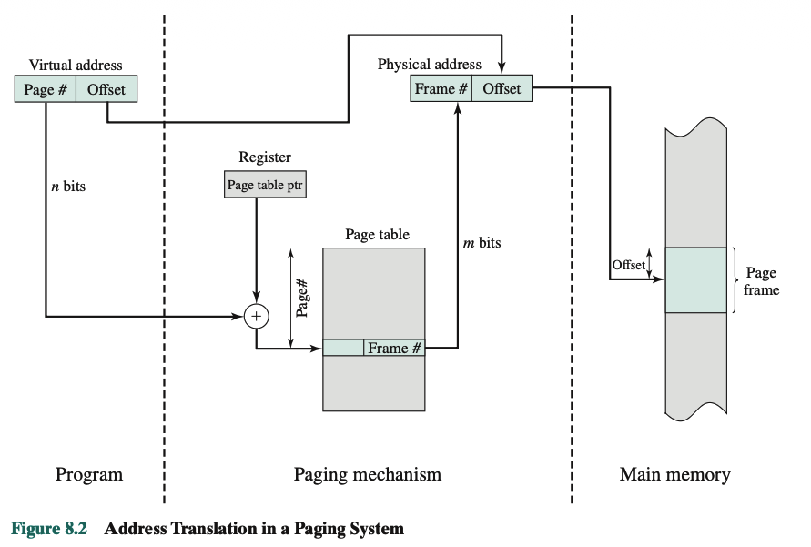
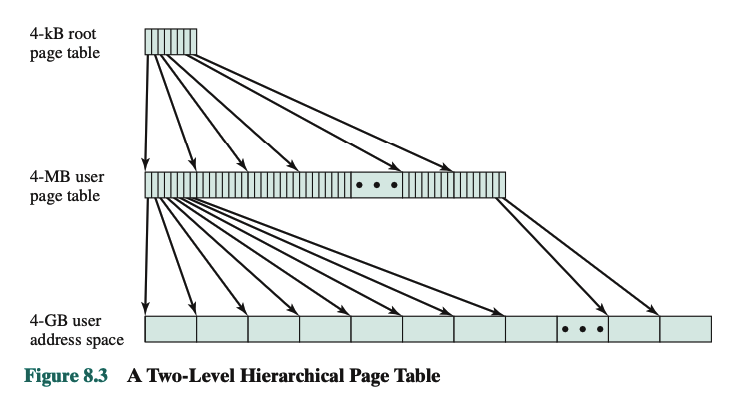
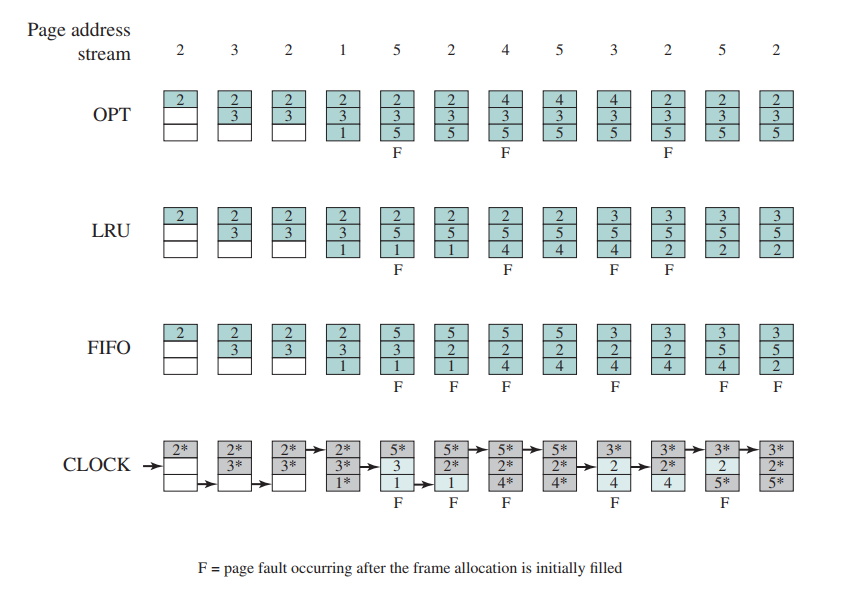

<!-- _class: titulo -->

# Capítulo 8: Memoria Virtual
## *Virtual Memory*
### Sistemas Operativos: Fundamentos y Diseño
#### William Stallings, 9.ª Edición — Parte 3

---

<!-- _class: titulo -->

# 8.1
## Hardware y Estructuras de Control
### *Hardware and Control Structures*

---

# Términos Clave

| Término | Definición |
|---------|-----------|
| **Memoria Virtual** *(Virtual memory)* | Esquema que permite direccionar la memoria secundaria como si fuera parte de la memoria principal, traduciendo automáticamente direcciones virtuales a físicas. Su tamaño lo limita el direccionamiento del sistema y la memoria secundaria disponible, no la RAM real. |
| **Dirección Virtual** *(Virtual address)* | La dirección asignada a una ubicación en memoria virtual para permitir que se acceda a ella como si formara parte de la memoria física. |
| **Espacio de Direcciones Virtual** *(Virtual address space)* | El almacenamiento virtual asignado a un proceso. |
| **Espacio de Direcciones** *(Address space)* | El rango de direcciones de memoria disponibles para un proceso. |
| **Dirección Real** *(Real address)* | La dirección de una ubicación de almacenamiento en la memoria principal. |

---

# El Gran Avance (*Breakthrough*)

Comparar la **paginación y segmentación simples** con la **partición fija y dinámica** revela dos características que son la base de un avance fundamental en la gestión de memoria:

1. **Direcciones lógicas traducidas en tiempo de ejecución**
   Toda referencia a memoria dentro de un proceso es una dirección lógica, traducida dinámicamente a dirección física. Esto permite que un proceso sea intercambiado (*swapped*) dentro y fuera de la memoria principal, ocupando regiones distintas en cada momento de su ejecución.

2. **El proceso no necesita ser contiguo**
   Un proceso puede dividirse en piezas (páginas o segmentos) que no necesitan ubicarse de forma contigua en memoria principal. La combinación de traducción de direcciones en tiempo de ejecución y una tabla de páginas o segmentos hace esto posible.

<!-- Nota para el relator (Stallings, §8.1): Este es el puente conceptual entre lo visto en el Cap. 7 (paginación/segmentación simple, partición fija/dinámica) y la memoria virtual. Las dos características listadas son *prerrequisitos* que ya existían en paginación/segmentación simple; lo que falta para memoria virtual es un tercer ingrediente: no requerir que todas las páginas/segmentos de un proceso estén en RAM simultáneamente (ver siguiente diapositiva, principio de localidad). -->

---

# Implicaciones de la Memoria Virtual

Interrumpir un proceso solo porque falta cargar una pieza puede parecer ineficiente, pero ese costo se compensa con dos beneficios que mejoran la utilización del sistema:

1. **Más procesos caben en memoria principal**
   Al cargar solo algunas piezas de cada proceso, hay espacio para más procesos en RAM. Esto mejora la utilización del procesador: es más probable que, en un momento dado, al menos uno de los (más numerosos) procesos esté en estado *Listo*.

2. **Un proceso puede ser más grande que toda la memoria principal**
   Se elimina una restricción fundamental de la programación. Sin esta técnica, el programador debe conocer la memoria disponible y dividir manualmente el programa en piezas cargables (*overlay*). Con memoria virtual, esa tarea recae en el SO y el hardware: el programador percibe una memoria enorme, del tamaño del almacenamiento en disco.

<!-- Nota para el relator (Stallings, §8.1): La memoria en la que el proceso realmente se ejecuta se llama memoria real; la memoria (mayor) que percibe el programador es la memoria virtual. -->

---

# Tabla 8.2 — Paginación y Segmentación (con y sin Memoria Virtual)

| | Paginación Simple | Memoria Virtual (Paginación) | Segmentación Simple | Memoria Virtual (Segmentación) |
|---|---|---|---|---|
| **Partición de RAM** | Memoria principal dividida en fragmentos fijos llamados *frames*. | Memoria principal dividida en *frames*. | Memoria principal no particionada. | Memoria principal no particionada. |
| **Origen de las piezas** | El programa se divide en páginas por el compilador o el sistema de gestión de memoria. | Igual que en paginación simple. | Los segmentos son definidos por el programador al compilar. | Igual que en segmentación simple. |

---
| | Paginación Simple | Memoria Virtual (Paginación) | Segmentación Simple | Memoria Virtual (Segmentación) |
|---|---|---|---|---|
| **Fragmentación interna** | Sí, dentro de los *frames*. | Sí, dentro de los *frames*. | No. | No. |
| **Fragmentación externa** | No. | No. | Sí. | Sí. |
| **Tabla que mantiene el SO** | Tabla de páginas por proceso: indica qué *frame* ocupa cada página. | Igual que en paginación simple. | Tabla de segmentos por proceso: indica dirección de carga y longitud de cada segmento. | Igual que en segmentación simple. |
| **Lista que mantiene el SO** | Lista de *frames* libres. | Igual que en paginación simple. | Lista de huecos libres en memoria principal. | Igual que en segmentación simple. |
| **Cálculo de dirección** | El procesador usa número de página + *offset*. | Igual que en paginación simple. | El procesador usa número de segmento + *offset*. | Igual que en segmentación simple. |
| **¿Todo el proceso debe estar en RAM?** | Sí, todas las páginas (salvo *overlays*). | No; las páginas se leen según se necesiten. | Sí, todos los segmentos (salvo *overlays*). | No; los segmentos se leen según se necesiten. |
| **Costo de traer una pieza a RAM** | — | Puede requerir escribir otra página a disco. | — | Puede requerir escribir uno o más segmentos a disco. |

<!-- Nota para el relator (Stallings, Tabla 8.2): Resume el salto de paginación/segmentación simples a sus versiones con memoria virtual. La fila clave es la penúltima: en las versiones simples TODO el proceso debe estar en RAM (o usar overlays manuales); con memoria virtual el SO carga piezas bajo demanda. La última fila anticipa el reemplazo de páginas (§8.2): traer una pieza nueva puede exigir sacar otra. -->

---

# Principio de Localidad (*Locality*)

**La clave que hace viable la memoria virtual:**

| Tipo | Descripción | Ejemplo |
|------|-------------|---------|
| **Localidad Temporal** | Si se accede a una dirección, es probable que se vuelva a acceder **pronto** | Bucles, variables de pila, contadores |
| **Localidad Espacial** | Si se accede a una dirección, es probable que se acceda a **direcciones cercanas** | Arrays, instrucciones secuenciales, estructuras de datos |

```
Ejemplo de localidad:
for (i = 0; i < 1000; i++) {
    suma += arreglo[i];      ← Accede a arreglo[i], arreglo[i+1], ... (espacial)
}                            ← Vuelve a la misma instrucción 1000 veces (temporal)
```

<!-- Nota para el relator (Stallings, §8.1): El principio de localidad fue formalizado por Peter Denning en los años 60 y es la justificación teórica de la memoria virtual. Sin localidad, la memoria virtual fallaría: si un proceso accediera aleatoriamente a todo su espacio, cada acceso requeriría ir a disco. Afortunadamente, los programas exhiben localidad casi siempre. Stallings señala que la localidad temporal explica por qué la caché L1/L2 funciona, y la espacial justifica el *prefetching* de páginas/caché. -->

---

# Memoria Virtual con Paginación

**Extensión directa de la paginación simple (Cap. 7):**

| Paginación Simple | Paginación con Memoria Virtual |
|-------------------|-------------------------------|
| Todas las páginas en RAM | Solo algunas páginas en RAM |
| Espacio ≤ RAM física | Espacio puede ser > RAM |
| Tabla: página → marco | Tabla: página → marco **o** disco |
| Sin fallos de página | Con **page faults** (carga desde disco) |

**Bit de presencia (*Present Bit*):**
- `1` → La página está en RAM (marco válido)
- `0` → La página está en disco o no se ha cargado aún → **page fault**

<!-- Nota para el relator (Stallings, §8.1): La diferencia clave es el bit de presencia. En paginación simple, ese bit es siempre 1 porque todo está en RAM. En memoria virtual, el bit puede ser 0, y al intentar acceder, el hardware genera una excepción de page fault. El SO maneja la excepción: localiza la página en el área de swap, carga un frame libre (quizás reemplazando otro), actualiza la tabla y reanuda la instrucción. -->

---



<!-- (1) "Program": la dirección virtual llega dividida en Page# (n bits) y Offset. (2) "Paging mechanism": el registro "Page table ptr" apunta al inicio de la tabla de páginas del proceso; se suma (+) el Page# a esa base para indexar la entrada correspondiente, de la cual se extrae el Frame# (m bits) — esto es exactamente la traducción página→marco que ya vimos con el bit de presencia. (3) "Main memory": el Frame# obtenido se concatena con el Offset original (sin modificar) para formar la dirección física; el Offset ubica el byte exacto dentro del "page frame" señalado. Puntos clave para remarcar: el Offset nunca cambia (misma posición relativa dentro de la página/frame); solo el Page# se traduce a Frame# vía la tabla de páginas; n y m pueden ser de distinto tamaño porque el número de frames en RAM no tiene por qué igualar el número de páginas del proceso. -->

---



<!-- **Por qué dos niveles?** Con un espacio de 4 GB y páginas de 4 KB, una tabla plana necesitaría ~1 millón de entradas, todas en RAM incluso si el programa solo usa 10 MB.

**Solución jerárquica:**
1. "Tabla raíz" (4 KB): pequeña, siempre en RAM. Una entrada por cada región de direcciones del programa.
2. "Tablas de nivel 2" (solo las usadas): se crean solo donde el programa realmente accede a memoria. Las regiones sin usar = sin tabla en RAM.
3. "Espacio de direcciones" (4 GB): cada entrada de nivel 2 apunta a una página de 4 KB.

**Ventaja:** en lugar de 1 millón de entradas en RAM, solo mantienes la tabla raíz + las tablas secundarias de zonas realmente usadas. Es como un árbol de carpetas: solo abre las que necesitas. -->

---

# La Tabla de Páginas en Memoria Virtual

**Cada entrada (PTE — *Page Table Entry*) contiene:**

| Campo | Función |
|-------|---------|
| **Número de Frame** | Marco físico en RAM (si presente) |
| **Bit de Presencia (P)** | 1 = en RAM, 0 = en disco |
| **Bit de Modificado (M / Dirty)** | 1 = página modificada (hay que escribirla al swap al reemplazar) |
| **Bit de Referenciado (R)** | 1 = página accedida recientemente |
| **Bit de Protección** | RWX (lectura, escritura, ejecución) |
| **Bit de Caching Deshabilitado** | Para regiones de E/S mapeadas |
| **Ubicación en disco** | Dirección en el área de swap (si no presente) |

<!-- Nota para el relator (Stallings, §8.1, Fig 8.2): La PTE es más rica que en paginación simple. Los bits R y M son esenciales para los algoritmos de reemplazo (LRU usa R; la política de *cleaning* usa M). El bit M indica que la página fue modificada desde que se cargó; al reemplazarla, si M=1 se escribe a disco, si M=0 se descarta (la copia en disco está vigente). -->

---

# Page Fault (Fallo de Página)

**Secuencia de eventos:**

```
1. PROCESO accede a dirección virtual → página X
2. MMU busca en TLB → MISS
3. MMU consulta tabla de páginas → P=0 (NO PRESENTE)
4. MMU genera excepción: PAGE FAULT
5. SO toma el control (modo kernel):
   a. Busca un frame libre en RAM
   b. Si no hay → algoritmo de reemplazo (elige víctima)
   c. Si la víctima está sucia (M=1) → escribe a disco
   d. Carga la página X del disco al frame
   e. Actualiza la tabla de páginas (P=1, nuevo frame#)
   f. Reanuda el proceso en la instrucción original
```

> **Costo:** Un page fault tarda **millones de ciclos** (~10 ms leer disco) vs. ~100 ns un acceso a RAM. ¡~100.000x más lento! (HDD)
>
> *Con SSD/NVMe, el swap tarda ~50–150 µs: la brecha baja a ~1.000x)*

<!-- Nota para el relator (Stallings, §8.1): El costo de un page fault es brutal. Por eso la memoria virtual depende tanto de la localidad: si los fallos son pocos, el rendimiento es aceptable. Si el working set no cabe en RAM, ocurren fallos continuos → **thrashing** (hiperpaginación). Stallings dedica §8.2 al control de thrashing. Nota histórica: el libro asume disco mecánico (~10 ms). Con SSD/NVMe (~100 µs) la brecha se reduce ~100x, aunque el punto pedagógico (RAM >> disco) sigue vigente. -->

---

# TLB (*Translation Lookaside Buffer*)

**Problema:** Cada referencia virtual requiere 2 accesos a memoria (uno a la tabla de páginas, otro al dato).

**Solución:** El TLB es una **caché de traducciones** dentro de la MMU.

```
Dirección Virtual
     │
     ▼
  ┌──────┐
  │ TLB  │ ── Hit? ──► Dirección Física (rápido: 1 ciclo)
  └──┬───┘
     │ Miss
     ▼
  Tabla de Páginas (en RAM) → carga en TLB → Dirección Física
        (lento: cientos de ciclos)
```
---

**Características del TLB:**
- Pequeño: 32–1024 entradas (cada una cubre 4 KB → ~4 MB cubiertos con 1024 entradas)
- Asociativo (compara todas las entradas en paralelo)
- Las entradas pueden ser fijas (pinned) para páginas críticas del SO

<!-- Nota para el relator (Stallings, §8.1, TLB): Sin TLB, cada acceso a memoria virtual costaría el doble (uno a la tabla y otro al dato). Con TLB, si la traducción está en caché, el acceso toma un solo ciclo. La tasa de aciertos (*hit ratio*) del TLB suele ser >99% en programas con buena localidad. El TLB se vacía al cambiar de contexto (o se etiqueta con ASID — Address Space ID — para evitar el vaciado). -->

---

# TLB: Ejemplo

**TLB típico (64 entradas, totalmente asociativo):**

```
TLB Hit Ratio = 99%
Tiempo sin TLB: 2 accesos × 100 ns = 200 ns por referencia

Tiempo con TLB: 0.99 × (1 × 100 ns) + 0.01 × (2 × 100 ns)
               = 99 ns + 2 ns = 101 ns

¡Casi la mitad del tiempo!
```

| Tasa de Aciertos | Tiempo promedio |
|:----------------:|:---------------:|
| 99.9% | ~100.1 ns |
| 99% | ~101 ns |
| 90% | ~110 ns |
| 80% | ~120 ns |

<!-- Nota para el relator (Stallings, §8.1): La cuenta es simple pero ilustrativa. Con hit ratio del 99%, el TLB reduce el costo de traducción de 200 ns a ~101 ns. Si el hit ratio cae al 80%, sube a 120 ns. En sistemas reales, el hit ratio del TLB suele estar entre 99% y 99.9% para aplicaciones con buena localidad. -->

---

# Tamaño de Página

**Compromiso fundamental (*trade-off*):**

| Páginas Pequeñas | Páginas Grandes |
|:----------------:|:---------------:|
| ✅ Menos fragmentación interna | ❌ Más fragmentación interna |
| ❌ Tablas de páginas enormes | ✅ Tablas más pequeñas |
| ✅ Mejor localidad (menos desperdicio) | ❌ Peor localidad (páginas parcialmente usadas) |
| ❌ Más entradas TLB para cubrir misma RAM | ✅ Menos entradas TLB para cubrir misma RAM |

---

**Tamaños típicos:**
| Arquitectura | Tamaños de página |
|-------------|-------------------|
| x86 (32-bit) | 4 KB (estándar), 4 MB (large page) |
| x86-64 | 4 KB, 2 MB, 1 GB |
| ARMv8 | 4 KB, 16 KB, 64 KB |
| RISC-V | 4 KB (base), soporta 2 MB, 1 GB |

<!-- Nota para el relator (Stallings, §8.1, Page Size): Stallings dedica un análisis al tamaño de página. En x86 tradicional, 4 KB era el estándar. Hoy, los sistemas con mucha RAM (servidores, big data) usan *huge pages* (2 MB o 1 GB) para reducir la presión sobre el TLB. Una base de datos que accede a 100 GB con páginas de 4 KB necesitaría 25 millones de entradas TLB — imposible. Con páginas de 2 MB, solo 50,000. Linux soporta huge pages desde hace años; Windows ofrece "large pages"; macOS tiene su propio mecanismo. Esto no es opcional para data centers de escala. -->

---

# Tablas de Páginas Jerárquicas

**Problema:** Espacio de direcciones de 32 bits (4 GB), páginas de 4 KB → $2^{20} = 1,000,000$ entradas por proceso. ¡4 MB por proceso solo para la tabla!

<!-- Nota para el relator: 4 MB = 2^20 entradas × 4 bytes/entrada = 2^22 bytes. Cada entrada de tabla de páginas ocupa 4 bytes en arquitecturas de 32 bits (contiene dirección física + flags de control). Este es el tamaño mínimo necesario independientemente de cuánta memoria física tenga la máquina. -->

**Solución:** Tabla de páginas de **dos niveles** (x86):

```
Dirección Virtual (32 bits):
┌──────────┬──────────┬─────────────┐
│ Dir 1    │ Dir 2    │ Offset      │
│ (10 bits)│ (10 bits)│ (12 bits)   │
└─────┬────┴─────┬────┴─────┬───────┘
      │          │          │
      ▼          ▼          │
  ┌──────┐   ┌──────┐       │
  │ Page │──►│ Page │       │
  │ Dir  │   │Table │───────┤
  └──────┘   └──────┘       ▼
                        Dirección Física
```
---

**Beneficio:** La tabla de nivel superior (Page Directory) ocupa solo 4 KB. Las tablas de segundo nivel se crean solo si se usan.

<!-- Nota para el relator (Stallings, §8.1 / Apéndice 8A): El Apéndice 8A detalla las tablas jerárquicas. Este diseño de dos niveles es el que usan x86 de 32 bits (con 10 bits para Page Directory, 10 bits para Page Table, 12 bits de offset = 4 KB). Con 64 bits se necesitan más niveles: x86-64 usa 4 niveles (9+9+9+9+12), y se agrega un 5º nivel con 57 bits de direcciones. Cada nivel reduce la cobertura: el Page Directory tiene solo 1024 entradas (4 KB), y las tablas de segundo nivel se van creando bajo demanda. -->

---

# Tabla de Páginas Invertida

**Alternativa radical: una sola tabla para toda la RAM, indexada por frame, no por página.**

```
Tabla Invertida (una entrada por frame de RAM):
┌──────┬──────────┐
│Frame │ (PID,    │
│  0   │ Page#)   │
├──────┼──────────┤
│  1   │ (3, 45)  │ ← Frame 1 → Proceso 3, Página 45
├──────┼──────────┤
│  2   │ (1, 12)  │ ← Frame 2 → Proceso 1, Página 12
├──────┼──────────┤
│ ...  │  ...     │
└──────┴──────────┘
```

**Ventaja:** Ocupa espacio proporcional a la RAM, no al espacio virtual.

**Desventaja:** Búsqueda lenta (hay que recorrer toda la tabla o usar hash).

**Implementación real:** IBM System/38, PowerPC, HP PA-RISC, IA-64 (Itanium).

<!-- Nota para el relator (Stallings, §8.1, Inverted Page Table): Se llama "invertida" porque invierte la dirección de búsqueda: tabla normal (PID+VirtualPage → PhysicalFrame), tabla invertida (PhysicalFrame → PID+VirtualPage). Es elegante porque su tamaño depende de la RAM física, no del espacio virtual de los procesos. Si la RAM es 4 GB y cada frame es 4 KB, caben ~1M entradas. En contraste, una tabla jerárquica para 100 procesos de 4 GB virtuales ocuparía mucho más. El problema es que la búsqueda inversa (dado PID+Page#, encontrar frame) requiere un hash. PowerPC y el Itanium implementaron tablas invertidas con hashing en hardware. x86-64 no la usa: prefiere tablas jerárquicas de 4 niveles. -->

---

# Segmentación con Memoria Virtual

**Extensión de la segmentación: cada segmento se divide en páginas.**

```
Dirección Virtual:
┌──────────────┬──────────────┬─────────────┐
│ Segmento #   │ Página #     │ Offset      │
│   (s bits)   │   (p bits)   │  (w bits)   │
└──────┬───────┴──────┬───────┴─────┬───────┘
       │              │             │
       ▼              ▼             │
  ┌─────────┐   ┌──────────┐        │
  │ Tabla de│   │  Tabla   │        │
  │Segmentos│──►│   de     │────────┤
  │  (por   │   │ Páginas  │        │
  │ proceso)│   │ (por seg)│        ▼
  └─────────┘   └──────────┘   Dirección Física
```

**Ejemplo típico: Intel x86 — segmentación (obligatoria) + paginación (opcional).**

<!-- Nota para el relator (Stallings, §8.1, Combined Segmentation and Paging): Aunque la segmentación pura ya no se usa en SO modernos (Linux, Windows usan paginación plana), la combinación segmentación+paginación aparece en x86. En modo protegido, x86 requiere segmentación: cada dirección lógica pasa por un *selector de segmento* (CS, DS, ES, etc.) que apunta a un descriptor en la GDT/LDT, produciendo una dirección lineal (32 bits). Luego, opcionalmente, la MMU aplica paginación sobre esa dirección lineal para producir la dirección física. Linux y Windows "neutralizan" la segmentación usando una tabla plana con base=0 y límite=4 GB, delegando todo a la paginación. -->

---

# Protección y Compartición

**Cada entrada de tabla (página o segmento) incluye bits de protección:**

| Bit | Significado |
|-----|-------------|
| **Supervisor/User** | Solo accesible desde modo kernel (S) o también desde usuario (U) |
| **Read** | Lectura permitida |
| **Write** | Escritura permitida |
| **Execute** | Ejecución permitida |
| **XD/NX** (*eXecute Disable*) | Prohíbe la ejecución (protección contra *buffer overflow*) |

<!-- Nota para el relator (XD/NX): XD (en Intel) y NX (en AMD) son el mismo concepto. Permiten marcar zonas de memoria como "no ejecutable". Un buffer overflow clásico inyecta código malicioso en el heap/stack, luego salta a esa dirección. Con XD/NX activo, la CPU rechaza la ejecución inmediatamente. Introdujeron esta característica en los 2000s (DEP en Windows, ejecutable space protection en Linux). Es un pilar fundamental de seguridad moderna. -->

---

**Compartición de páginas:**
- Dos procesos pueden tener la misma entrada de tabla → mismos frames físicos
- Útil para bibliotecas compartidas (*shared libraries*)

```
Proceso A          Proceso B
   │                  │
   ▼                  ▼
┌──────┐          ┌──────┐
│ PTE  │          │ PTE  │
│#frame│          │#frame│
└──┬───┘          └──┬───┘
   └──────┬──────────┘
          ▼
    ┌──────────┐
    │ Frame 42 │  ← Una copia de libc.so
    │ (libc.so)│
    └──────────┘
```

<!-- Nota para el relator (Stallings, §8.1): El bit NX (No-eXecute) fue introducido por AMD en 2001 (AMD64) y adoptado por Intel como XD bit. Es la base de la protección contra *buffer overflow exploits*: marca las páginas de datos (pila, heap) como no ejecutables. Stallings lo menciona como parte de los mecanismos de protección. La compartición de páginas es fundamental para ahorrar RAM: 50 procesos ejecutando bash comparten las mismas páginas de código (text), pero cada uno tiene su propia página de datos (stack/heap). -->

---

<!-- _class: titulo -->

# 8.2
## Software del Sistema Operativo
### *Operating System Software*

---

# Políticas de Memoria Virtual

**Seis políticas que el SO debe implementar:**

| # | Política | Pregunta |
|---|----------|---------|
| 1 | **Fetch** (*Admisión*) | ¿Cuándo cargar una página en RAM? |
| 2 | **Placement** (*Colocación*) | ¿Dónde colocar la página en RAM? |
| 3 | **Replacement** (*Reemplazo*) | ¿Qué página quitar para hacer espacio? |
| 4 | **Resident Set** (*Conjunto Residente*) | ¿Cuántas páginas debe tener cada proceso en RAM? |
| 5 | **Cleaning** (*Limpieza*) | ¿Cuándo escribir páginas modificadas a disco? |
| 6 | **Load Control** (*Control de Carga*) | ¿Cuántos procesos simultáneos permitir? |

<!-- Nota para el relator (Stallings, §8.2): Esta diapositiva es el mapa conceptual del §8.2. Las seis políticas son interdependientes: por ejemplo, una mala política de reemplazo (3) fuerza más page faults, lo que puede disparar el thrashing si el control de carga (6) no limita la multiprogramación. El estudiante debe entender que no se pueden elegir de forma aislada. -->

---

# a — Fetch Policy: Demand Paging vs. Prepaging

**¿Cuándo traer una página de disco a RAM?**

| Política | Descripción | Ventaja | Desventaja |
|----------|-------------|---------|------------|
| **Demand Paging** | Cargar solo cuando se produce un **page fault** | No trae páginas innecesarias | Espera a que ocurra el fallo (lento al inicio) |
| **Prepaging** | Cargar varias páginas **anticipadamente** | Reduce fallos iniciales | Puede traer páginas nunca usadas |

> **Práctica común:** Demand paging para la mayoría de casos, prepaging para reanudar procesos suspendidos (se sabe qué páginas tenían antes).

<!-- Nota para el relator (Stallings, §8.2): Demand paging es la opción más simple y más usada. Cuando un proceso arranca, la primera instrucción genera un page fault, luego la siguiente genera otro, y así sucesivamente (*initial thrashing*). Muchos SO hacen prepaging al crear un proceso: cargan las primeras páginas del código ejecutable para evitar la avalancha inicial. El prepaging también se usa al reanudar un proceso que fue suspendido (swapped out), porque se conoce exactamente su working set. -->

---

# a — Fetch Policy: Ubicación de Páginas en Disco

**¿Dónde se guardan las páginas cuando no están en RAM?**

```
             Área de Swap (disco)
┌─────────────────────────────────────────┐
│ Partición de swap (Linux)               │
│ o archivo pagefile.sys (Windows)        │
├─────────────────────────────────────────┤
│ ┌─────────────────────────────────────┐ │
│ │ Páginas de procesos                 │ │
│ │ (imagen completa o páginas sueltas) │ │
│ └─────────────────────────────────────┘ │
├─────────────────────────────────────────┤
│ Archivos mapeados (mmap)                │
│ ┌─────────────────────────────────────┐ │
│ │ binarios, bibliotecas .so/.dll      │ │
│ └─────────────────────────────────────┘ │
└─────────────────────────────────────────┘
```

**Nota:** Las páginas de código (text) de un ejecutable no necesitan swap: se descartan y se recargan del binario original.

<!-- Nota para el relator (Stallings, §8.2): Stallings distingue entre páginas que se guardan en el área de swap (datos, pila) y páginas que se descartan (como el código de un ejecutable, que se puede recargar del archivo original). Una página de datos modificada debe escribirse al swap antes de liberar el frame. En cambio, una página de código sin modificar se descarta directamente. -->

---

# b — Placement Policy (Colocación)

**En paginación con memoria virtual, ¿existe el problema de colocación?**

- **Memoria virtual con paginación:** No hay problema de colocación. Todas las páginas miden lo mismo y los frames son intercambiables. Cualquier frame libre sirve.

- **Memoria virtual con segmentación:** Sí hay problema (igual que en partición dinámica, Cap. 7). Se aplican los mismos algoritmos: First-Fit, Best-Fit, Next-Fit.

- **Sistemas combinados (segmentación + paginación):** El problema se mitiga porque cada segmento se divide en páginas que se colocan en frames libres.

<!-- Nota para el relator (Stallings, §8.2): Esta diapositiva aclara una confusión común. En paginación pura, todos los frames son equivalentes, así que no importa cuál se use. Es solo en segmentación (o en sistemas sin memoria virtual) donde la colocación importa, porque los bloques son de tamaño variable. -->

---



<!-- Nota para el relator (Stallings, Fig. 8.14): Esta figura (de Stallings) compara cuatro algoritmos de reemplazo de páginas sobre la misma secuencia de accesos. OPT es óptimo (conoce el futuro), LRU lo aproxima usando recencia, FIFO es simple pero ingenuo, CLOCK es un compromiso práctico. Las "F" marcan fallos de página. Note que OPT tiene ~6 fallos, LRU ~8, FIFO ~9, CLOCK ~8-9. CLOCK es la opción real en Linux/Unix porque LRU requiere actualizar un timestamp en CADA acceso a memoria (overhead brutal). -->

---

# Comparación de Algoritmos de Reemplazo

| Algoritmo | Estrategia | Ventajas | Desventajas | Implementación |
|-----------|-----------|----------|-------------|-----------------|
| **OPT** | Reemplaza la página que se usará más lejos en el futuro | Mínima tasa de fallos (teórica) | Requiere conocer el futuro → **no implementable** | Cota de referencia (benchmark) |
| **FIFO** | Reemplaza la página más antigua (primera en entrar) | Muy simple, bajo overhead | Pobre rendimiento; sufre anomalía de Belady | Cola circular |
| **LRU** | Reemplaza la página menos usada recientemente | Excelente rendimiento, cercano a OPT | Alto costo: timestamp/lista ordenada en cada acceso | Hardware costoso (raro en la práctica) |
| **CLOCK** | Usa bit de referencia (R); puntero circular busca R=0 | Bajo overhead, buena aproximación a LRU | Rendimiento intermedio, menos preciso que LRU | Bits R, M que ya mantiene el hardware |

---

# c — Replacement Policy (Reemplazo)

**¿Qué página sacar de RAM cuando no hay frames libres?**

Dos familias de algoritmos:

```
          ┌────────────────────────────┐
          │  Replacement Policies      │
          ├────────────────────────────┤
          │  Local: Víctima dentro del │
          │  mismo proceso que falló.  │
          ├────────────────────────────┤
          │  Global: Víctima de        │
          │  cualquier proceso.        │
          └────────────────────────────┘
```

**Métrica:** **Tasa de fallos de página** (*Page Fault Rate*). Cuanto menor, mejor.

**Objetivo del reemplazo:** Minimizar la tasa de fallos cumpliendo el principio de localidad.

<!-- Nota para el relator (Stallings, §8.2): El reemplazo es quizás la política más estudiada de la memoria virtual. La distinción local/global es importante. En reemplazo local, el conjunto de páginas de un proceso no se ve afectado por otros procesos. En global, un proceso puede "robar" frames de otro, lo que puede llevar a situaciones injustas. Stallings cubre varios algoritmos específicos en §8.2. -->

---

# 8.2d — Política de Conjunto Residente

**¿Cuántos frames asignar a cada proceso?**

| Enfoque | Descripción | Ventaja | Desventaja |
|---------|-------------|---------|------------|
| **Fijo** | Cada proceso tiene un límite máximo de frames | Justo, predecible | No se adapta a diferentes working sets |
| **Variable** | Los frames se reasignan dinámicamente | Se adapta a las necesidades | Complejo, puede ser injusto |

**Combinado con el alcance del reemplazo:**

| Alcance | Descripción |
|---------|-------------|
| **Local** | Solo se reemplazan páginas del proceso que falló |
| **Global** | Se puede reemplazar cualquier página de cualquier proceso |

<!-- Nota para el relator (Stallings, §8.2): La combinación más común en SO modernos es **variable + global**. Linux y Windows permiten que un proceso que está fallando mucho "robe" frames de otros procesos menos activos. Esto es eficiente en el corto plazo, pero puede llevar a situaciones donde un proceso acapara la RAM. Para mitigarlo, se usan controles como el *page cache* de Linux (que usa el algoritmo de reemplazo de "últimamente usado" global) combinado con *memory watermarks* y *OOM killer* cuando la presión de memoria es extrema. -->

---

# 8.2e — Cleaning Policy (Limpieza)

**¿Cuándo escribir las páginas modificadas (dirty) al disco?**

| Política | Descripción | Problema |
|----------|-------------|----------|
| **Demand Cleaning** | Escribir solo cuando se va a reemplazar la página | El proceso que causa el page fault espera a que termine la escritura (doble latencia: leer + escribir) |
| **Precleaning** | Escribir páginas dirty periódicamente, antes de que se necesiten | Sobrecarga de escrituras innecesarias si la página se vuelve a modificar |

**Solución en la práctica:** **Página de respaldo (*page daemon*)** - un proceso del kernel que recorre las páginas y, si una está sucia y no se ha usado recientemente, la escribe a disco de forma asíncrona.

> Linux: `kswapd` — se activa cuando la memoria libre baja de un umbral.

<!-- Nota para el relator (Stallings, §8.2, Cleaning): Stallings recomienda una combinación: precleaning con un *page daemon* que escribe páginas sucias en segundo plano combinado con demand cleaning para casos extremos. Linux implementa exactamente esto: `kswapd` mantiene dos umbrales (pages_low y pages_high). Cuando la memoria libre cae por debajo de pages_low, kswapd despierta y libera páginas hasta alcanzar pages_high. Si incluso así no hay páginas libres, se recurre a la liberación síncrona (direct reclaim). -->

---

# 8.2f — Load Control (Control de Carga)

**¿Cuántos procesos pueden estar activos simultáneamente?**

```
Multiprogramación baja:          Multiprogramación alta:
┌────────────────────┐           ┌────────────────────┐
│ Proceso A (idle)   │           │ A │ B │ C │ D │ E │
│                    │           ├────┴────┴────┴────┤
│                    │           │   ⋮   ⋮   ⋮   ⋮   │
└────────────────────┘           │ ¡Thrashing!       │
   ↑ CPU desaprovechada          └────────────────────┘
```

**Thrashing (Hiperpaginación):** El sistema pasa más tiempo paginando que ejecutando procesos. Ocurre cuando la suma de los working sets de todos los procesos **excede** la RAM disponible.

**Solución:** Regular el grado de multiprogramación.
- Si hay thrashing → **suspender** (swap out) uno o más procesos
- Si hay poca actividad → **admitir** más procesos

<!-- Nota para el relator (Stallings, §8.2, Thrashing): Stallings dedica un análisis detallado al thrashing, siguiendo el trabajo de Denning (1968). La Figura 8.21 de Stallings muestra la relación clásica: al aumentar la multiprogramación, la utilización de CPU sube hasta un punto, y luego cae abruptamente cuando el thrashing comienza. El control de carga se implementa midiendo la tasa de fallos de página global. Cuando supera un umbral, el SO sospecha thrashing y comienza a suspender procesos gradualmente. Windows usa un enfoque similar con el *System Working Set Manager*, que ajusta dinámicamente los working sets de todos los procesos. -->

---

# 8.2f — Thrashing: Diagnóstico

```
  Utilización de CPU
      100% │
           │      /\
           │     /  \      ← Thrashing: CPU cae porque
           │    /    \       pasa todo el tiempo paginando
           │   /      \
           │  /        \
           │ /          \
           │/            \
           └────────────────► Multiprogramación
                Óptimo
```

**Síntomas de thrashing:**
- Alta tasa de fallos de página
- Baja utilización de CPU
- Mucha actividad de disco (hacia el área de swap)
- Los procesos parecen "congelados"

<!-- Nota para el relator (Stallings, §8.2, Thrashing Detection): Stallings presenta esta curva como una ley de la memoria virtual. El punto óptimo está justo antes de la "rodilla" de la curva. Un SO bien diseñado debe mantener el sistema operando en ese punto, ajustando dinámicamente la multiprogramación. Linux implementa esto con el *OOM killer* (Out-Of-Memory Killer) como último recurso: cuando la presión de memoria es extrema y kswapd no puede mantener el ritmo, mata procesos selectivamente. -->

---

# 8.2 — Resumen de Políticas de Memoria Virtual

| Política | Práctica Común en SO Modernos |
|----------|------------------------------|
| **Fetch** | Demand paging + prepaging en creación/suspensión |
| **Placement** | Irrelevante en paginación pura (cualquier frame sirve) |
| **Replacement** | Clock (aproximación LRU) o ARC (Adaptive Replacement Cache) |
| **Resident Set** | Variable + Global |
| **Cleaning** | Page daemon asíncrono (e.g., `kswapd`) |
| **Load Control** | Regulación dinámica de la multiprogramación |

<!-- Nota para el relator (Stallings, §8.2): Este resumen conecta la teoría con la práctica. Por ejemplo, Linux implementa prácticamente todas estas políticas: su *page reclaim* usa el algoritmo del reloj (aproximación LRU) con dos listas (active/inactive), el *kswapd* para precleaning, y el *OOM killer* para control de carga en situaciones extremas. Windows usa *working set management* con *modified page writer* y *process working set trimming*. -->

---

<!-- _class: titulo -->

# 8.3
## Memoria Virtual en UNIX, Linux y Windows
### *Virtual Memory in UNIX, Linux and Windows*

---

# 8.3 — Memoria Virtual en UNIX System V

**Esquema clásico de UNIX System V Release 4 (SVR4):**

```
Proceso UNIX:
┌──────────────────────┐
│  text (código)        │ ← compartible, solo-lectura, descartable
├──────────────────────┤
│  data (datos)         │ ← privado, lectura-escritura, necesita swap
├──────────────────────┤
│  bss (datos sin inic) │ ← se inicializa a cero en RAM
├──────────────────────┤
│  stack (pila)         │ ← privado, lectura-escritura, crece bajo demanda
├──────────────────────┤
│  heap (montículo)     │ ← memoria dinámica (malloc)
└──────────────────────┘
```

**Características SVR4:**
- Paginación con tablas jerárquicas de 2 niveles
- Algoritmo de reemplazo: Clock (Second Chance) con bits R y M
- Prepaging al crear proceso (carga las primeras páginas)
- Page daemon para cleaning asíncrono
- Control de carga basado en tasa de fallos

<!-- Nota para el relator (Stallings, §8.3, UNIX): SVR4 representa el UNIX clásico de los 90s. Muchas de sus ideas sobreviven en Linux. La separación text/data/bss/stack/heap es fundamental: las páginas de *text* se pueden descartar porque el binario en disco es la copia maestra; las de *data* (modificables) necesitan swap. El *bss* (Block Started by Symbol) es una optimización de memoria: el ejecutable solo almacena el tamaño del bss, no sus ceros. -->

---

# 8.3 — Memoria Virtual en Linux

**Linux usa paginación pura (segmentación neutralizada):**

```
Espacio de direcciones virtual de un proceso Linux (x86-64):
┌─────────────────────────────────┐ 0xFFFFFFFFFFFFFFFF
│        Kernel Space             │   (accesible solo desde modo kernel)
│   (código, datos, page tables)  │
├─────────────────────────────────┤ 0xFFFF800000000000 (TASK_SIZE_MAX)
│         Stack                   │  ← crece hacia abajo
│         ↓                       │
│                                 │
│         ↑                       │  ← crece hacia arriba
│         Heap                    │
│         BSS                     │
│         Data                    │
│         Text (código)           │
├─────────────────────────────────┤ 0x0000000000400000 (típico)
│         ...                     │
└─────────────────────────────────┘ 0x0000000000000000
```

**División 50/50** en x86-64: mitad del espacio virtual para kernel, mitad para usuario.

<!-- Nota para el relator (Stallings, §8.3, Linux): La diapositiva muestra el layout de memoria de un proceso Linux en x86-64 (64 bits). La división típica es 50/50: 128 TB para usuario, 128 TB para kernel (aunque la RAM física real es mucho menor). Linux neutraliza la segmentación x86 configurando todos los segmentos con base=0 y límite=4G en 32 bits (o 2⁴⁷ en 64 bits), así todas las direcciones lógicas = direcciones lineales. Toda la protección y memoria virtual se maneja mediante paginación. -->

---

# 8.3 — Componentes Clave de la Memoria Virtual en Linux

| Componente | Función |
|------------|---------|
| **Page Cache** | Caché de páginas de archivos en RAM (mmap, buffers) |
| **Swap Cache** | Área de intercambio en disco (archivo o partición) |
| **kswapd** | Page daemon del kernel: libera páginas cuando hay presión |
| **OOM Killer** | Último recurso: mata procesos para liberar memoria |
| **LRU Lists** | Dos listas: *active* e *inactive* (aproximación al working set) |
| **Huge Pages** | Páginas de 2 MB o 1 GB para reducir TLB misses |
| **Memory Cgroups** | Control de cuotas de memoria por proceso/grupo |

**Algoritmo de reemplazo en Linux:**
- Lista activa (recientemente usadas) y lista inactiva (candidatas a reemplazo)
- Las páginas se mueven entre listas al ser referenciadas
- `kswapd` reclama páginas de la lista inactiva

<!-- Nota para el relator (Stallings, §8.3, Linux Details): Linux diverge del UNIX clásico en algunos aspectos. Por ejemplo, el algoritmo de reemplazo no es un Clock puro, sino un sistema de dos listas (Active/Inactive) con una "página de referencia" que simula la manecilla del reloj. Huge Pages son una adición reciente (desde kernel 2.6) para manejar grandes cargas de trabajo. Los memory cgroups permiten virtualización a nivel de SO (contenedores Docker/LXC) con límites de memoria duros. -->

---

# 8.3 — Memoria Virtual en Windows

**Windows usa paginación con *working set management*.**

```
Estructura del espacio virtual (x86-64):
┌────────────────────────────────────┐ 0xFFFFFFFFFFFFFFFF
│         System Space               │
│   (Hal, kernel, drivers, tables)   │
├────────────────────────────────────┤ 0xFFFF800000000000
│                                      (TASK_SIZE_MAX)
├────────────────────────────────────┤ 0x00007FFFFFFFDEFF
│         Page Table (self-map)      │
├────────────────────────────────────┤
│         Stack                      │
├────────────────────────────────────┤
│         Heap / Data / Text         │
├────────────────────────────────────┤ 0x0000000000000000
└────────────────────────────────────┘
```

**Características:**
- Paginación por demanda con clustering (carga N páginas en cada fallo)
- Working set management: el *working set manager* ajusta tamaños dinámicamente
- *Modified Page Writer*: page daemon que escribe páginas sucias
- *Balance Set Manager*: revisa cada segundo los working sets de todos los procesos

<!-- Nota para el relator (Stallings, §8.3, Windows): Stallings presenta a Windows NT como caso de estudio en §8.3. El Working Set Manager es un hilo del kernel que corre cada segundo (o cuando la memoria libre es baja) y decide si recortar o expandir los working sets. Windows hace *automatic working set trimming*: cuando hay presión de memoria, reduce los working sets de todos los procesos. El *clustering* (cargar varias páginas consecutivas en un page fault) mejora la eficiencia al explotar la localidad espacial. -->

---

# 8.3 — Arquitectura de Memoria Virtual en Windows

```
                    ┌──────────────────┐
                    │   Application    │
                    │   (modo usuario) │
                    └────────┬─────────┘
                             │ system call
                             ▼
┌────────────────────────────────────────────┐
│            Executive (kernel)              │
│  ┌──────────────┐  ┌──────────────────┐   │
│  │Virtual Memory │  │  Working Set     │   │
│  │   Manager     │  │    Manager       │   │
│  └──────┬───────┘  └────────┬─────────┘   │
│         │                   │              │
│         ▼                   ▼              │
│  ┌────────────────────────────────────┐   │
│  │       Page Frame Number (PFN)      │   │
│  │          Database                  │   │
│  │  (physical page tracking)          │   │
│  └────────────────────────────────────┘   │
│         │                   │              │
│         ▼                   ▼              │
│  ┌──────────────┐  ┌──────────────────┐   │
│  │   Page File  │  │  Modified Page   │   │
│  │   (swap)     │  │     Writer       │   │
│  └──────────────┘  └──────────────────┘   │
└────────────────────────────────────────────┘
```

<!-- Nota para el relator (Stallings, §8.3, Windows NT VM Architecture): La figura ilustra los componentes clave del administrador de memoria virtual de Windows NT (y sus sucesores, hasta Windows 11). El VM Manager maneja la traducción de direcciones y las tablas de páginas. El Working Set Manager controla los límites por proceso. La PFN Database es el equivalente a la lista de frames libres y ocupados, con metadatos para cada frame. El Modified Page Writer es el page daemon que escribe páginas dirty en segundo plano. -->

---

# 8.3 — Comparación: Linux vs. Windows

| Aspecto | Linux | Windows |
|---------|-------|---------|
| **Esquema** | Paginación plana (neutraliza segmentación) | Paginación plana |
| **Reemplazo** | LRU aproximado (active/inactive lists) | Working Set Manager + Clock aproximado |
| **Page Daemon** | `kswapd` | Modified Page Writer + Balance Set Manager |
| **Prepaging** | Sí (al cargar binarios) | Sí (clustering) |
| **Huge Pages** | Transparent Huge Pages (THP) | Large Pages (explícito) |
| **Control de Carga** | OOM Killer (extremo) | Working set trimming + procesos suspendidos |
| **Swap** | Partición o archivo | Archivo `pagefile.sys` |
| **Memoria Compartida** | `mmap` + IPC | `CreateFileMapping` + secciones |

<!-- Nota para el relator (Stallings, §8.3): Ambos SO convergen en la misma arquitectura básica: paginación con memoria virtual, TLB, page faults, clustering y page daemon. Las diferencias son de implementación y de interfaz (API). El concepto de working set es explícito en Windows (cada proceso tiene un límite mínimo y máximo) mientras que Linux prefiere un sistema global más flexible. -->

---

<!-- _class: titulo -->

# 8.4
## Resumen del Capítulo 8

---

# 8.4 — Mapa Conceptual

```
                          ┌───────────────────────────┐
                          │     Memoria Virtual        │
                          └───────────────────────────┘
                                      │
            ┌─────────────────────────┼─────────────────────────┐
            │                         │                         │
            ▼                         ▼                         ▼
   ┌─────────────────┐    ┌───────────────────────┐   ┌──────────────────┐
   │ 8.1 Hardware     │    │ 8.2 Software del SO   │   │ 8.3 Casos       │
   │ y Estructuras    │    │                       │   │ de Estudio      │
   └─────────────────┘    └───────────────────────┘   └──────────────────┘
            │                         │                         │
   ┌────────┴────────┐      ┌─────────┴──────────┐      ┌──────┴──────┐
   │ Paginación      │      │ Fetch / Placement  │      │ Linux       │
   │ Segmentación    │      │ Replacement (LRU)  │      │ Windows     │
   │ TLB             │      │ Resident Set       │      │ UNIX        │
   │ Tablas Jerárq.  │      │ Cleaning / Load    │      │             │
   │ Protección      │      │ Thrashing          │      │             │
   └─────────────────┘      └────────────────────┘      └─────────────┘
```

---

# 8.4 — Conceptos Clave

| Concepto | Definición |
|----------|-----------|
| **Fallo de Página** (*Page Fault*) | Excepción cuando se accede a una página no presente en RAM. El SO la carga desde disco. |
| **Working Set** | Conjunto de páginas que un proceso usa activamente. Debe caber en RAM para evitar thrashing. |
| **Thrashing** | Estado donde el sistema pasa más tiempo paginando que ejecutando procesos. |
| **TLB** | Caché de traducciones virtual→física dentro de la CPU. Permite acceso rápido a las páginas recientes. |
| **Localidad** | Principio de que los accesos a memoria tienden a concentrarse en zonas cercanas (temporal y espacialmente). |

**Ventajas de la memoria virtual:**
- ✅ Los procesos pueden ser **más grandes que la RAM física**
- ✅ Mayor **multiprogramación** (cada proceso ocupa menos RAM)
- ✅ **Aislamiento** entre procesos (cada uno tiene su espacio virtual)
- ✅ **Protección y compartición** flexibles por página/segmento

---

# 8.4 — Políticas y Algoritmos

| Política | Algoritmo más común | Notas |
|----------|-------------------|-------|
| **Fetch** | Demand paging | Prepaging para reanudar procesos suspendidos |
| **Replacement** | Clock (Second Chance) | Aproximación barata a LRU; variante mejorada usa bits R+M |
| **Resident Set** | Variable + Global | Práctica estándar en Linux, Windows |
| **Cleaning** | Page Daemon asíncrono | `kswapd` en Linux, Modified Page Writer en Windows |
| **Load Control** | Regulación de multiprogramación | Thrashing evita agregar más procesos |

---

# 8.4 — Relación con el Capítulo 7

```
Capítulo 7: Administración de Memoria (sin VM)
  ┌─────────────────────┐
  │ Paginación Simple   │ ← Todas las páginas en RAM
  │ Segmentación Simple │ ← Todo el segmento en RAM
  │ Particionamiento    │ ← Proceso completo en RAM
  └─────────┬───────────┘
            │
            ▼
Capítulo 8: Memoria Virtual
  ┌─────────────────────┐
  │ Paginación + VM     │ ← Solo páginas activas en RAM
  │ Segmentación + VM   │ ← Solo segmentos activos
  │ TLB, Page Faults    │ ← Hardware + SO cooperan
  │ Working Set         │ ← Lo mínimo necesario para ejecutar
  └─────────────────────┘
```

> **La memoria virtual hace que la RAM parezca más grande de lo que es, aprovechando que los programas solo usan una fracción de su espacio en cada momento.**

---

<!-- _class: titulo -->

# Fin del Capítulo 8
## Memoria Virtual
### *"Virtual Memory"*
#### Stallings — Operating Systems: Internals and Design Principles, 9.ª Ed.

---

<!-- _class: resumen -->

# Apéndice 8A: Tablas de Paginación Jerárquicas y de Dos Niveles

## *Hierarchical and Two-Level Page Tables*

---

# Ap. 8A — Motivación

**El problema de la tabla de páginas plana:**

```
32 bits, páginas de 4 KB:
  Espacio virtual = 2^32 = 4 GB
  Tamaño de página = 2^12 = 4 KB
  Número de páginas = 2^20 = 1,048,576
  Entradas PTE = 1M
  Tamaño por PTE = 4 bytes
  Tamaño total de tabla = 4 MB por proceso
```

- 100 procesos → 400 MB solo en tablas de páginas
- Muchas entradas nunca se usan (espacio virtual enorme, pero proceso pequeño)
- **Solución:** Jerarquía de tablas. Solo se crean los niveles inferiores que se necesitan.

<!-- Nota para el relator (Ap. 8A): Este cálculo es impactante: ¡4 MB por proceso para la tabla de páginas! Con 100 procesos, son 400 MB. Y eso es solo en 32 bits. En 64 bits, la tabla plana sería imposible (2^52 entradas × 8 bytes = 32 petabytes). La jerarquía resuelve el problema porque los niveles superiores son pequeños (~4 KB) y los inferiores se crean solo para las regiones realmente usadas. -->

---

# Ap. 8A — Paginación de Dos Niveles (x86 32-bit)

```
Dirección Virtual de 32 bits:
┌──────────┬──────────┬──────────────┐
│ Page     │ Page     │ Offset       │
│ Directory│ Table    │              │
│ 10 bits  │ 10 bits  │ 12 bits      │
└─────┬────┴─────┬────┴──────┬───────┘
      │          │           │
      ▼          ▼           │
  ┌────────┐ ┌────────┐     │
  │  Page  │ │  Page  │     │
  │  Dir   │►│ Table  │─────┤
  │ (1 por │ │ (1 por │     │
  │ proc)  │ │ 1024   │     │
  │        │ │ págs)  │     ▼
  │  1024  │ │        │  Dirección
  │  entr. │ │ 1024   │  Física
  │  × 4 B │ │ entr.  │
  └────────┘ └────────┘
```

**Cobertura:** Una tabla de segundo nivel cubre $2^{10} \times 4\text{ KB} = 4\text{ MB}$.

<!-- Nota para el relator (Ap. 8A): En x86 de 32 bits, el Page Directory (PD) tiene 1024 entradas de 4 bytes = 4 KB. Cada entrada puede apuntar a una Page Table (PT) de 1024 entradas de 4 bytes = 4 KB. Cada PT cubre 4 MB de espacio virtual. Si un proceso solo usa 8 MB → solo necesita el PD (4 KB) + dos PTs (8 KB) = 12 KB, en vez de la tabla plana de 4 MB. -->

---

# Ap. 8A — Paginación de Cuatro Niveles (x86-64)

**Con 48 bits de direcciones (actual) y 4 KB por página:**

```
Nivel 1: PML4  (9 bits) → 512 entradas, cubre 512 GB c/u
Nivel 2: PDPT  (9 bits) → 512 entradas, cubre 1 GB c/u
Nivel 3: PD    (9 bits) → 512 entradas, cubre 2 MB c/u
Nivel 4: PT    (9 bits) → 512 entradas, cubre 4 KB c/u
Offset   (12 bits)

Dirección virtual de 48 bits:
┌─────┬─────┬─────┬─────┬──────┐
│PML4 │ PDP │ PD  │ PT  │Ofst  │
│ 9   │ 9   │ 9   │ 9   │ 12   │
└──┬──┴──┬──┴──┬──┴──┬──┴──┬───┘
   │     │     │     │     │
   ▼     ▼     ▼     ▼     ▼
  PML4→PDPT→ PD → PT → Físico
```

**Cobertura total:** $512^4 \times 4\text{ KB} = 256\text{ TB}$ de espacio virtual.

**Nuevo 5º nivel (Intel 5-level paging, 2019):** 57 bits → 128 PB.

<!-- Nota para el relator (Ap. 8A): La paginación de 4 niveles es la que usa x86-64 desde sus inicios. Cada nivel tiene 512 entradas de 8 bytes (total 4 KB por tabla). La traducción requiere 4 accesos a memoria (más el dato), pero el TLB acelera significativamente. Intel agregó un 5º nivel en 2019 (Ice Lake) para servidores con enormes cantidades de RAM, expandiendo las direcciones virtuales a 57 bits (128 PB). En cada nivel se verifica el bit de presencia: si es 0, el procesador lanza un page fault y deja de recorrer niveles. -->

---

# Ap. 8A — Ejemplo de Traducción (4 Niveles)

**Dirección virtual:** `0x7F3B4C2A`

```
Paso 1: Descomponer la dirección
  0x7F3B4C2A = 0000 0000 0111 1111 0011 1011 0100 1100 0010 1010
  PML4 (9) │ PDP (9) │ PD (9) │ PT (9) │ Offset (12)
  000000000 │ 111111100 │ 111011 │ 01001100 │ 00101010
  0x000     │ 0x1FC     │ 0x1B4  │ 0x098    │ 0x02A

Paso 2: Recorrer la jerarquía
  PML4[0x000] → apunta a la PDPT (en memoria física)
  PDPT[0x1FC] → apunta al PD
  PD [0x1B4]  → apunta a la PT
  PT [0x098]  → contiene el número de frame: 0x00A3F

Paso 3: Dirección física final
  Frame 0x00A3F + Offset 0x02A = 0x00A3F02A
```

<!-- Nota para el relator (Ap. 8A): Este ejemplo muestra paso a paso cómo se traduce una dirección virtual en x86-64. En la práctica, el TLB almacena la traducción completa, así que este proceso solo ocurre en el primer acceso a esa página o cuando se invalida la entrada TLB. -->

---

<!-- _class: titulo -->

# Fin del Apéndice 8A
## Tablas Jerárquicas y de Dos Niveles
### Próximo: Problemas y Preguntas del Capítulo 8

---

# Términos Clave del Capítulo 8

| Término | Descripción |
|---------|-------------|
| **Demand Paging** | Cargar páginas solo cuando ocurre un page fault |
| **Frame** | Bloque de memoria física del tamaño de una página |
| **Page Fault** | Excepción por acceso a página no residente en RAM |
| **Page Table** | Estructura que traduce páginas virtuales a frames físicos |
| **Prepaging** | Cargar páginas anticipadamente (ej. al reanudar un proceso) |
| **Resident Set** | Conjunto de páginas de un proceso que están en RAM |
| **Thrashing** | Estado de hiperpaginación que colapsa el rendimiento |
| **TLB** | Translation Lookaside Buffer, caché de la MMU |
| **Working Set** | Conjunto de páginas activas de un proceso en un intervalo |
| **Page Daemon** | Proceso del kernel que libera páginas en segundo plano |
| **Coalescing** | Fusión de páginas contiguas (en buddy system) |
| **PFF** | Page Fault Frequency, control adaptativo del working set |
| **Inverted Page Table** | Tabla de páginas indexada por frame, no por página virtual |
| **Huge Pages** | Páginas de tamaño grande (2 MB, 1 GB) para reducir TLB misses |

---

# Preguntas de Repaso

1. **Explique la diferencia entre paginación simple y memoria virtual con paginación.**

2. **¿Qué es el principio de localidad y por qué es fundamental para la memoria virtual?**

3. **Describa el funcionamiento del TLB. ¿Qué sucede en un TLB miss?**

4. **Compare los algoritmos de reemplazo FIFO, LRU y Clock. ¿Cuáles son sus ventajas y desventajas?**

5. **¿Qué es el thrashing y cómo se puede prevenir?**

6. **Explique el concepto de working set. ¿Cómo se relaciona con la ventana Δ?**

7. **Describa la estructura de una tabla de páginas en x86-64 (4 niveles).**

8. **¿Qué ventajas ofrecen las *huge pages* en sistemas modernos?**

<!-- Nota para el relator: Estas preguntas cubren los temas principales del capítulo. Se pueden usar como discusión en clase o como tarea. Cada pregunta apunta a un concepto distinto: 1→concepto base, 2→fundamento teórico, 3→hardware, 4→algoritmos, 5→thrashing, 6→working set, 7→estructura, 8→optimizaciones modernas. -->

---

# Problemas Sugeridos

**Problema 8.1:** Dada la siguiente secuencia de referencias de páginas: `7 0 1 2 0 3 0 4 2 3 0 3 2 1 2 0 1 7 0 1`
- Calcule el número de page faults con 3 y 4 frames usando: (a) FIFO, (b) LRU, (c) Clock
- ¿Se cumple la anomalía de Belady en FIFO?

**Problema 8.2:** Un sistema tiene 32 bits de dirección virtual, páginas de 4 KB y tabla de páginas de 2 niveles (10+10 bits). ¿Cuánta memoria ocupa la tabla de páginas de un proceso que usa:
- (a) 1 MB de código + 256 KB de datos
- (b) 2 GB de código + 1 GB de datos

**Problema 8.3:** Si el tiempo de un page fault es 10 ms y el tiempo de acceso a RAM es 100 ns, ¿cuál debe ser la tasa máxima de fallos de página para que la memoria virtual no degrade el rendimiento más de un 10%?

**Problema 8.4:** Investigue cómo configurar *huge pages* en Linux. Escriba los comandos para habilitar páginas de 2 MB y asignar 100 páginas.

<!-- Nota para el relator: Los problemas 8.1 y 8.2 son ejercicios clásicos de examen. El 8.3 es un ejercicio de estimación de rendimiento. El 8.4 conecta la teoría con la práctica en Linux. -->
